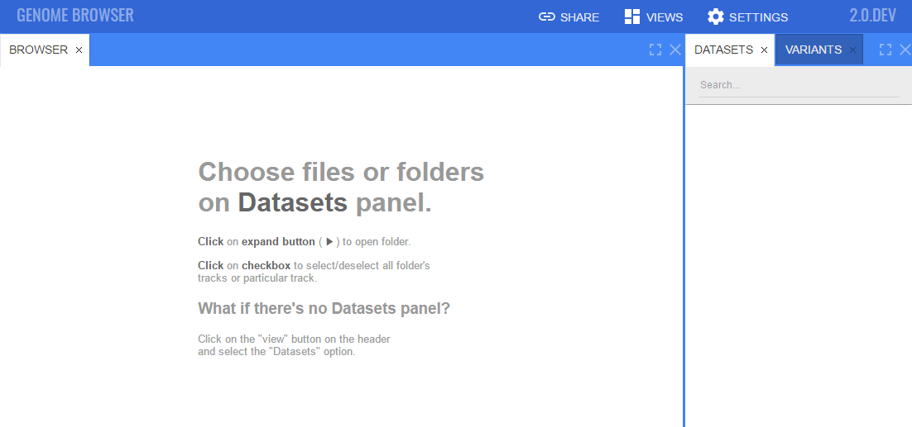

[](https://travis-ci.org/epam/NGB)
[](https://codecov.io/gh/epam/NGB)

# NGB
New Genome Browser (NGB) is a Web client-server tool that has been developed with the several key distinctive features in mind:  
* Visualization of Structural Variations (SVs) and their supporting reads
* Performance and scalability while working with big/cloud genome data
* CRAM format support
* Integration with various data sources, including ENSEMBL, UniPROT and other internal/external databases
* User experience that is based on a set of useful features like hotkeys, variation tables, docking widgets, etc.
* Web 3D molecular viewer integrated

We have done our best to make those features at the highest possible level and thus make NGB one the best web-based genome browser.
The community lead by EPAM intends to develop NGB extending it functionality and improving user experience. Your suggestions and comments are welcome.

We believe that NGB (being a namesake of a [Neuroglobin (NGB) gene](http://www.uniprot.org/uniprot/Q9NPG2), coding a protein that is involved in oxygen transport in the brain) will help researchers and clinicians to discover the valuable insights in the huge volumes of genomic data.


# Documentation

Detailed documentation on building, installation, usage is available at
* [Markdown sources](docs/README.md)
* [Latest HTML documentation](http://ngb.opensource.epam.com/distr/latest/docs)

# Publications 
Links to publications that contain NGB references
* [Dataset visualization for article **Prioritisation of Structural Variant Calls in Cancer Genomes**](docs/md/publications/dataset-prioritisation-of-sv.md)

# Quickstart

Docker image is used to build and run NGB for a quickstart. Other build and run options are described at [installation section](docs/md/installation/overview.md) of NGB documentation

Make sure `docker` is installed

```
$ docker --version
Docker version 1.12.5
```

If docker is not installed, please follow [docker engine installation guide](https://docs.docker.com/engine/installation/) for your operating system

Get NGB sources

```
$ git clone https://github.com/epam/NGB.git
$ cd NGB
```

Build sources and package binaries into docker container

```
$ ./gradlew buildDocker
```

Image with name **ngb:latest** will be created. Verify that it was created correctly

```
$ docker images
REPOSITORY      TAG     IMAGE ID        CREATED         SIZE
ngb             latest  356774a063ad    2 minutes ago    564.4 MB
```

Run NGB from a created image

*Replace <YOUR_NGS_DATA_FOLDER> placeholder with a real path to a folder with NGS data*

```
$ docker run -p 8080:8080 -d --name ngbcore -v <YOUR_NGS_DATA_FOLDER>:/ngs ngb:latest
```

Verify that NGB is up and running: navigate with your web-browser to [http://localhost:8080/catgenome](http://localhost:8080/catgenome)

Please note that the following web-browsers are supported at the moment
* Chrome (>= 56)
* Firefox (>= 51)
* Safari (>= 9)
* EDGE (>= 25)

Default NGB page should be shown



That's it. Now NGS files could be added and viewed. Please refer to [NGB Command Line Interface - Typical tasks](docs/md/cli/typical-tasks.md) to register genome and NGS files

# How to build NGB

## Requirements

* **[Oracle JDK 8](https://docs.oracle.com/javase/8/docs/technotes/guides/install/install_overview.html)** or **[Open JDK 8](http://openjdk.java.net/install/)**
* **[Node.js = 6.9.5](https://nodejs.org/en/download/package-manager/)** 
* **[Docker engine](https://docs.docker.com/engine/installation/)** *used to build docker images, if it is not a case - then could not be installed*
* **[MkDocs >= 0.16.0](http://www.mkdocs.org/#installation)** and **[mkdocs-material](http://squidfunk.github.io/mkdocs-material/getting-started/#installing-mkdocs)** *used to build documentation, if it is not a case - then could not be installed*

## General build process

Gradle build script is provided for building NGB components

```
$ ./gradlew [tasks]

Available tasks:
buildWar        builds java web application archive, containing client and server binaries
buildCli        builds ngb command line interface, used to manipulate data within ngb
buildDocker     builds jar-file and packages it into a docker image, using docker/core/Dockerfile
buildDockerDemo builds "core" docker image and initilizes it with demo data, using docker/demo/Dockerfile
buildDoc        builds markdown documents into html web-site
buildJar        builds standalone jar-file with embedded Tomcat
buildDesktop    builds standalone desktop NGB application
buildAll        builds all components, listed above
```

All tasks could be combined.

Build artifacts are placed into `dist/` folder in a root level of a cloned repository

If this script does not fit - each component could be built on it's own. Build process for each component is described in a appropriate **README** file, located in the component's folder

## Examples for typical tasks
```
# Build NGB as a standalone JAR file with Command Line Interface tools
$ ./gradlew buildJar buildCli

# Build docker with documentation
$ ./gradlew buildDocker buildDoc
```
