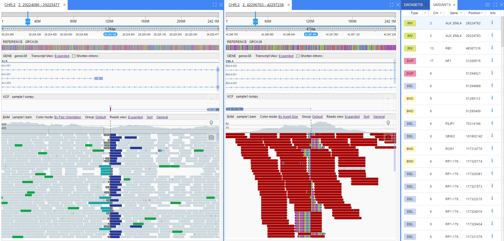
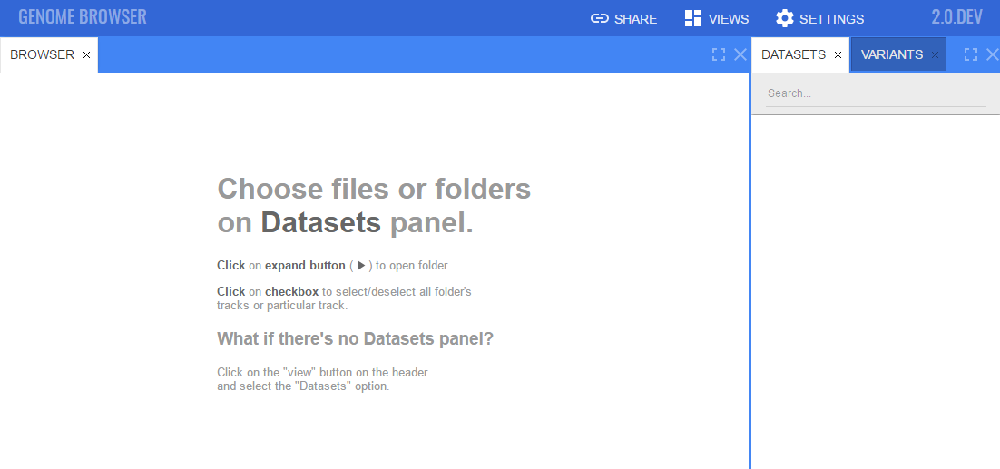

[](https://github.com/epam/NGB/actions/workflows/build.yml)
[](https://codecov.io/gh/epam/NGB)

# NGB
New Genome Browser (NGB) is a Web client-server tool that has been developed with the several key distinctive features in mind:  
* Visualization of Structural Variations (SVs) and their supporting reads
* Performance and scalability while working with big/cloud genome data
* CRAM format support
* Integration with various data sources, including ENSEMBL, UniPROT and other internal/external databases
* User experience that is based on a set of useful features like hotkeys, variation tables, docking widgets, etc.
* Web 3D molecular viewer integrated

We have done our best to make those features at the highest possible level and thus make NGB one the best web-based genome browser.
The community lead by EPAM intends to develop NGB extending it functionality and improving user experience. Your suggestions and comments are welcome.

We believe that NGB (being a namesake of a [Neuroglobin (NGB) gene](http://www.uniprot.org/uniprot/Q9NPG2), coding a protein that is involved in oxygen transport in the brain) will help researchers and clinicians to discover the valuable insights in the huge volumes of genomic data.



# Documentation

Detailed documentation on building, installation, usage is available at
* [Markdown sources](docs/README.md)
* [HTML documentation](https://epam.github.io/NGB/) *(rendered from the `master` branch, i.e. the
  latest released version)*
* `ngb-docs.tar.gz`, an mkdocs build of the documentation, is published with every release — see
  [Prebuilt binaries](#prebuilt-binaries)

# Publications 
Links to publications that contain NGB references
* [Prioritisation of structural variant calls in cancer genomes](https://www.ncbi.nlm.nih.gov/pubmed/28392986)
* [Dataset visualization for article **Prioritisation of Structural Variant Calls in Cancer Genomes**](docs/md/publications/dataset-prioritisation-of-sv.md)

# Quickstart

Docker image is used to build and run NGB for a quickstart. Other build and run options are described at [installation section](docs/md/installation/overview.md) of NGB documentation

Make sure `docker` is installed

```
$ docker --version
```

If docker is not installed, please follow [docker engine installation guide](https://docs.docker.com/engine/installation/) for your operating system

Get NGB sources

```
$ git clone https://github.com/epam/NGB.git
$ cd NGB
```

Build sources and package binaries into docker container

```
$ ./gradlew buildDocker
```

Image with name **ngb:latest** will be created. Verify that it was created correctly

```
$ docker images
REPOSITORY      TAG     IMAGE ID        CREATED         SIZE
ngb             latest  356774a063ad    2 minutes ago    791MB
```

Run NGB from a created image

*Replace <YOUR_NGS_DATA_FOLDER> placeholder with a real path to a folder with NGS data*

```
$ docker run -p 8080:8080 -d --name ngbcore -v <YOUR_NGS_DATA_FOLDER>:/ngs ngb:latest
```

Verify that NGB is up and running: navigate with your web-browser to [http://localhost:8080/catgenome](http://localhost:8080/catgenome)

Please note that the following web-browsers are supported at the moment
* Chrome (>= 56)
* Firefox (>= 51)
* Safari (>= 9)
* EDGE (>= 25)

Default NGB page should be shown



That's it. Now NGS files could be added and viewed. Please refer to [NGB Command Line Interface - Typical tasks](docs/md/cli/typical-tasks.md) to register genome and NGS files

# Prebuilt binaries

NGB binaries can be retrieved from the following locations:
* Releases:
    * GitHub Releases: [https://github.com/epam/NGB/releases](https://github.com/epam/NGB/releases)
    * Direct HTTP links: [Release versions](https://ngb-oss-builds.s3.amazonaws.com/web/index.html?prefix=public/builds/release/)
* Development builds (created from `develop` branch - each commit): [Development versions](https://ngb-oss-builds.s3.amazonaws.com/web/index.html?prefix=public/builds/develop/)

# How to build NGB

## Requirements

* **[JDK 21](https://adoptium.net/temurin/releases/?version=21)** — Eclipse Temurin or any other
  build — to run Gradle and to build the server, and **JDK 17** as well to build `ngb-cli`, which
  declares a Java 17 toolchain. Gradle will not download a missing JDK
  (`org.gradle.java.installations.auto-download=false`, deliberately): install both, or build only
  the parts you need.
* **[Node.js = 14.17.5](https://nodejs.org/en/download/package-manager/)** *used to build the web
  client. The version is pinned: the client is AngularJS 1.5 with a webpack 4 build that does not
  run on a newer Node.*
* **[Docker engine](https://docs.docker.com/engine/installation/)** *used to build docker images, if it is not a case - then could not be installed*
* **[MkDocs](http://www.mkdocs.org/#installation)** and **[mkdocs-material](http://squidfunk.github.io/mkdocs-material/getting-started/#installing-mkdocs)** *used to build documentation, if it is not a case - then could not be installed*

`./gradlew buildJar` builds the client and the documentation as well as the server, so it needs all
of the above. `./gradlew -p server/catgenome bootJar -Pprofile=jar` builds the server jar alone,
reusing the client and documentation of the previous full build, and needs only the JDK.

`.devenv/` holds a containerised version of this toolchain, which is how the project is built and
tested in practice — see [.devenv/README.md](.devenv/README.md).

## General build process

Gradle build script is provided for building NGB components

```
$ ./gradlew [tasks]

Available tasks:
buildCli        builds ngb command line interface, used to manipulate data within ngb
buildDocker     builds jar-file and packages it into a docker image, using docker/core/Dockerfile
buildDockerDemo builds "core" docker image and initilizes it with demo data, using docker/demo/Dockerfile
buildDoc        builds markdown documents into html web-site
buildJar        builds standalone jar-file with embedded Tomcat
buildAll        builds all components, listed above
```

All tasks could be combined.

Build artifacts are placed into `dist/` folder in a root level of a cloned repository

If this script does not fit - each component could be built on it's own. Build process for each component is described in a appropriate **README** file, located in the component's folder

## Examples for typical tasks
```
# Build NGB as a standalone JAR file with Command Line Interface tools
$ ./gradlew buildJar buildCli

# Build docker with documentation
$ ./gradlew buildDocker buildDoc
```
