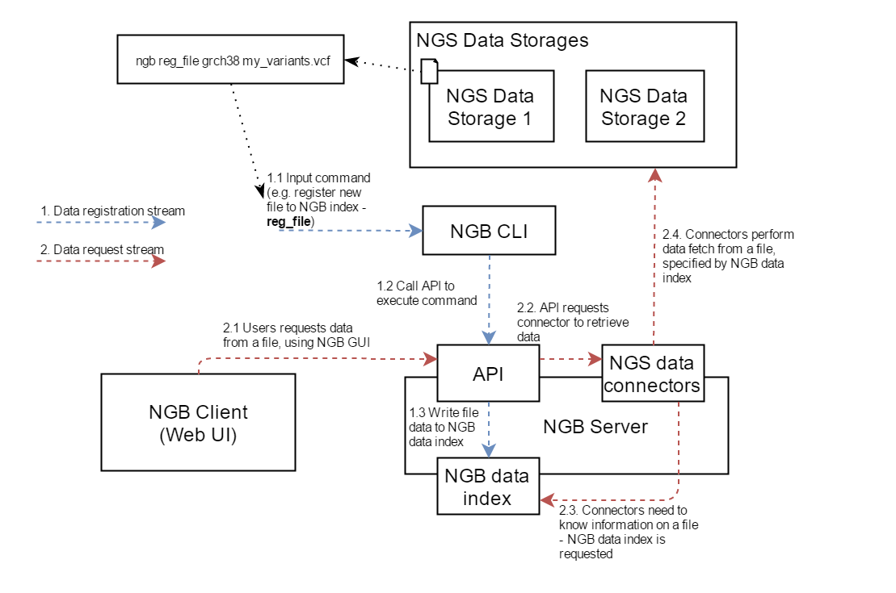
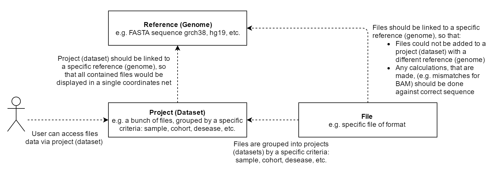
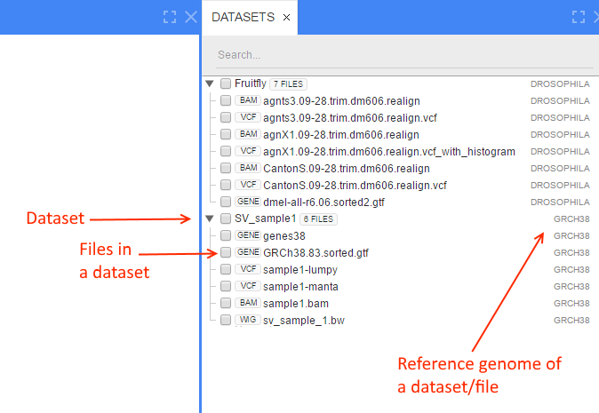
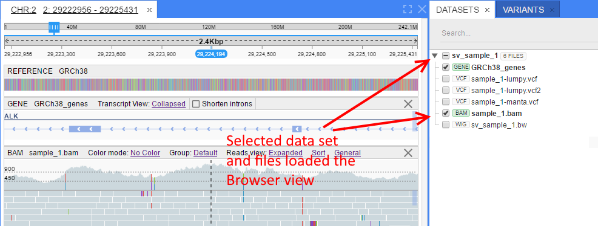

# Introduction

- [Why NGB needs Command Line Interface?](#why-ngb-needs-command-line-interface)
    - [REST API](#rest-api)
    - [NGB CLI](#ngb-cli)
- [Dataflow of files registration using CLI](#dataflow-of-files-registration-using-cli)
- [NGB object model](#ngb-object-model)
    - [Datasets list](#datasets-list)
    - [Tracks view](#tracks-view)
- [Supported file types](#supported-file-types)

## Why NGB needs Command Line Interface?

New Genome Browser (NGB) is a client-server application, which provides a high performance NGS data access using a web-browser as a client.

"Client-server" means that client PC may not have (and usually doesn't have) an access to the NGS data files' those files are processed by a server.

To do this work, a server has to maintain an "index" of all the NGS files. This index is called NGB data index.

NGB data index is just a collection of metadata (files names, locations, some other properties). Files themselves (as well as their corresponding indicies) are located on external storages, that could be accessed by NFS/HTTP/FTP.

Adding an object to the NGB data index is called "registration".

NGB data index can be stored in two ways:

- for small installations - file storage is used
- for large-scale installations (requiring Network Load Balancing) - PostgreSQL database is used

There are two mechanisms to manage NGB data index

### REST API

NGB provides JSON REST API, that could be used by external systems (like a pipeline) to register files.

- **Pros:**
    - Lowest level access - all APIs are available
    - Any kind of automation
- **Cons:**
    - Hard to use by a human or in a script
    - Needs deep knowledge of NGB architecture and dataflows

### NGB CLI

NGB provides Command Line Interface (CLI) that exposes all NGB data index manipulation operations.

- **Pros:**
    - Easy to use by a human and script for registration of any amount of files
- **Cons:**
    - No cons - looks ideal for index maintaining

## Dataflow of files registration using CLI

Typical dataflow of registration using CLI and data access using GUI is shown on the diagram below.

1. Registration via CLI
    - (1.1) A command to register an object is issued (a file in this case - see reg_file command)
    - (1.2) NGB CLI performs specific calls to NGB REST API (one or several calls could be made according to a command)
    - (1.3) NGB REST API writes necessary data to NGB data index. Typically this data contains - file friendly name, used to display on GUI and file physical location. Depending on the file type - additional operation could be performed, e.g. for feature files (like GFF/GTF) - features are indexed to provide gene search function on the GUI.
    - Now the registered file is available to NGB Web Client
2. Accessing data registered via CLI
    - (2.1) NGB Web Client issues request to retrieve data from a previously registered file
    - (2.2) This request is handled by NGB REST API, which asks NGS Data Connectors to load the requested data
    - (2.3) NGS Data Connectors search corresponding information in NGB data index (e.g. file path) which was added by NGB CLI
    - (2.4) Using the information obtained, NGS Data Connectors read data from external storage and return it to NGB Web Client

## NGB object model

NGB maintains an object model that is used and manipulated via CLI.
As shown on a diagram below, there are three main objects - *Reference*, *Dataset* and *File*.

The relationships between Reference, Dataset, and File are also shown on the NGB Web Client GUI

### Datasets list

- User opens a homepage
- User select specific dataset, which contains data of interest

### Tracks view

- User views NGS files, that are added to a dataset

To make NGS files visible to a user, the following steps should be performed:

1. NGS file should be registered to NGB Data Index (as explained in the previous section) and linked to a Reference (Genome)
2. Dataset should be created (an empty container for files)
3. NGS file should be linked to a dataset. *One file could be linked to different datasets*

All these steps can be easily automated with NGB CLI as shown in the sections below.

## Supported file types

NGB, and therefore CLI, supports registration of the following file types:

- [Reference](../user-guide/tracks-reference.md) files (`.fasta`, `.fasta.gz`, `.fa`, `.fa.gz`, `.fna`, `.fna.gz`, `.txt`, `.txt.gz`, `.genbank`, `.gbk`, `.gb`). Registration details see [here](command-reference.md#reference-commands).
- [Gene](../user-guide/tracks-genes.md) files (`.gff.gz`, `.gtf.gz`, `.gff3.gz`, `.gff3`, `.gtf`, `.gff`) and corresponding index files (`.gff.gz.tbi`, `.gtf.gz.tbi`, `.gff3.gz.tbi`, `.gff3.tbi`, `.gtf.tbi`, `.gff.tbi`). Registration details see [here](command-reference.md#add-gene-file-to-the-reference).
- [Variant Call](../user-guide/tracks-vcf.md) format's files (`.vcf`, `.vcf.gz`) and corresponding index files (`.vcf.idx`, `.vcf.gz.tbi`). Registration details see [here](command-reference.md#register-file).
- [Browser Extensible Data](../user-guide/tracks-bed.md) files (`.bed`, `.bed.gz`) and corresponding index files (`.bed.tbi`, `.bed.gz.tbi`). Registration details see [here](command-reference.md#register-file).
- [Binary Alignment Map](../user-guide/tracks-bam.md) files (`.bam`) and corresponding index files (`.bai`). Registration details see [here](command-reference.md#register-file).
- [Wiggle and BedGraph](../user-guide/tracks-wig.md) files (`.bw`, `.bdg`, `.bg`, `.bedGraph`) and corresponding index files (`.bdg.idx`, `.bg.idx`, `.bedGraph.idx`, `.bdg.gz.tbi`, `.bg.gz.tbi`, `.bedGraph.gz.tbi`, `.bdg.tbi`, `.bg.tbi`, `.bedGraph.tbi`). Registration details see [here](command-reference.md#register-file).
- [Protein Data Bank](../user-guide/overview.md#molecular-viewer-panel) format's files (`pdb`, `.cif`). Registration details see [here](command-reference.md#pdb-file-commands).
- [Feature Counts](../user-guide/tracks-featurecounts.md) format's files (`.featureCounts`). Registration details see [here](command-reference.md#register-file).
- [Heatmaps](../user-guide/tracks-heatmap.md) and their annotations (`.csv`, `.tsv`), dendrogram files for heatmap (`.txt`). Registration details see [here](command-reference.md#heatmap-commands).
- [Strain Lineage](../user-guide/strain-lineage.md) files (`.tsv`, `.txt`). Registration details see [here](command-reference.md#lineage-tree-commands).
- [Pathway and BioPAX](../user-guide/metabolic-pathways.md) files (`.sbgn`, `.owl`). Registration details see [here](command-reference.md#metabolic-pathway-commands).
- [Gene Predictions](../release-notes/2.7.1/2.7.1.md#genepred-format-support) format's files (`.genepred`, `.genePred`, `.gp`). Registration details see [here](command-reference.md#add-gene-file-to-the-reference).
- [ENCODE-specific](../user-guide/tracks-encode.md) files:
    - Broad Peaks Format (`.broadPeak`, `.bPk`, `.broadPeak.gz`, `.bPk.gz`)
    - Gapped Peaks Format (`.gappedPeak`, `.gPk`, `.gappedPeak.gz`, `.gPk.gz`)
    - Narrow Peaks Format (`.narrowPeak`, `.nPk`, `.narrowPeak.gz`, `.nPk.gz`)
    - Tag Alignment Format (`.tagAlign`, `.ta`, `.tagAlign.gz`, `.ta.gz`)
    - Tag Alignment Format for Paired Reads (`.pairedTagAlign`, `.pta`, `.pairedTagAlign.gz`, `.pta.gz`)
    - Peptide Mapping Format (`.peptideMapping`, `.pMap`, `.peptideMapping.gz`, `.pMap.gz`)
    - RNA elements format (`.RNAelements`, `.RNAe`, `.RNAelements.gz`, `.RNAe.gz`)
    - Registration details see [here](command-reference.md#register-file)

Note that all files being registered via NGB CLI should be sorted by chromosome and position.
