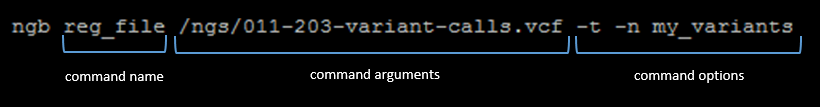

# Running a command

Having installed CLI one can call **ngb** command.

If you do NOT have CLI_HOME path at $PATH variable, then you should navigate to **ngb-cli/bin** folder and call **./ngb**

NGB CLI command structure is shown on the image below:  
    

### Command name (mandatory)

Text string. For a list of available commands see [Command reference](command-reference.md).

### Command arguments (mandatory)

Depending on a command could be:

- Empty string (no arguments required)
- Single string (one argument)
- Space-delimited string (several arguments, e.g. to specify several fiels at once for [**reg_file**](command-reference.md#register-file) command)

### Options (optional)

Option is a string in a format:

- Short: **`-{option_name_short} {option_value}`** , e.g. `-n my_name`
- Full: **`--{option_name_full} {option_value}`** , e.g. `--name my_name`

Depending on an option type - **`{option_value}`** could be an empty string (e.g. for **`--name`** it is required, for **`--table`** could be ommited).

To specify several options - they could be provided as space-delimited string.

Options could be placed anywhere in a command line after a command name.
