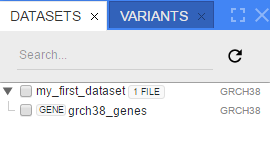
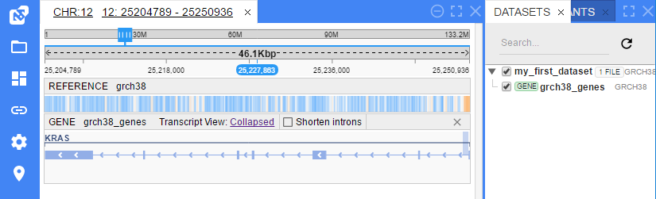
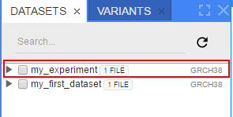
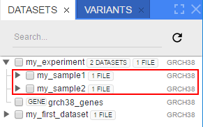
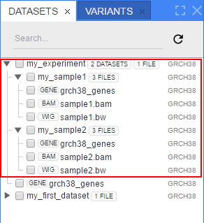
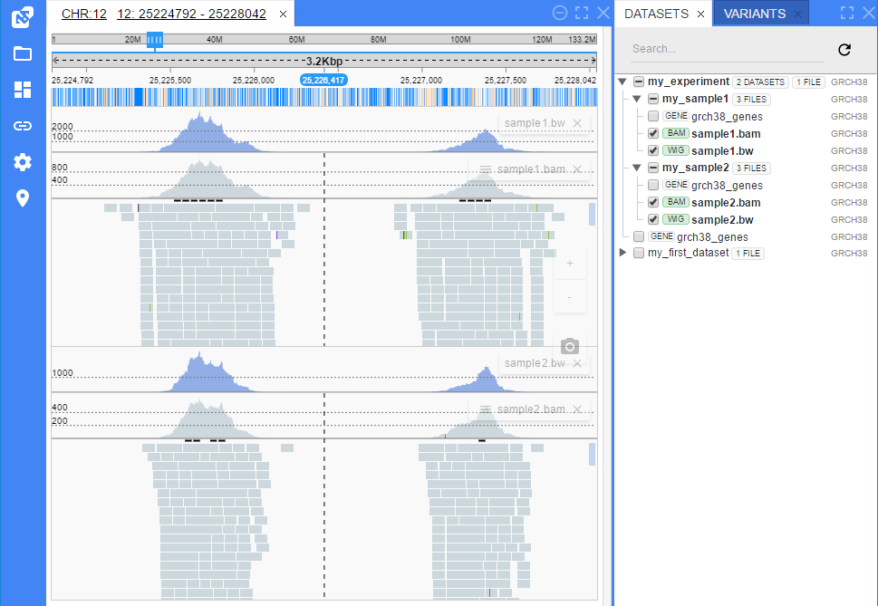
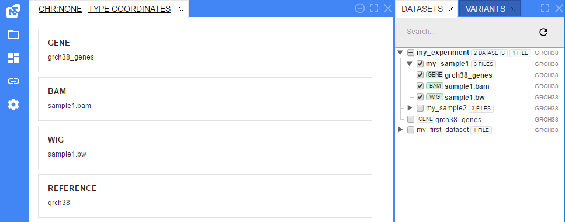
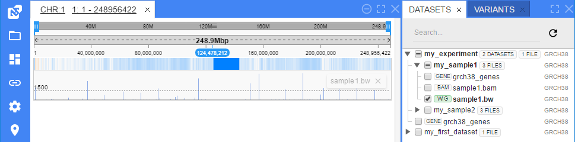

# Filling in the installed NGB with data

## Sample data

Scenarios provided below rely on the following data structure:

```
/ngs_data/
    genomes/
        grch38.fa           # Reference genome sequence
        grch38_genes.gtf    # Reference genome genes annotation
    sample1.bam             # Alignments for sample1
    sample1.bam.bai         # Index file for sample1 alignments
    sample1.bw              # Coverage file for sample1 alignments
    sample1.vcf             # Variations called from sample1 alignments
    sample2.bam             # Alignments for sample2
    sample2.bam.bai         # Index file for sample2 alignments
    sample2.bw              # Coverage file for sample2 alignments
    sample2.vcf             # Variations called from sample2 alignments
```

## Configure NGB CLI to use appropriate NGB instance

If NGB instance is installed on a remote machine (i.e. can not be addressed via loopback interface `localhost`), then `set_srv` command should be used to perform configuration

Assuming that NGB instance is installed to a server named `ngb.my-domain.com` the following command should be used:

```
$ ngb set_srv http://ngb.my-domain.com/catgenome
```

Configuration will be stored in `ngb-cli/config/server.properties` file and used in subsequent requests

## Add reference genome to a new NGB server instance 
As said at [NGB object model section](introduction.md), to make any data visible one should initialize **Reference -> File -> Dataset** objects and link them together.

*Do not forget to replace values of GRCH38_SEQ_PATH and GRCH38_GENES_PATH variables with your own paths.*

Declare paths for genome data
```
GRCH38_SEQ_PATH=/ngs_data/genomes/grch38.fa
GRCH38_GENES_PATH=/ngs_data/genomes/grch38_genes.gtf
```

Register GRCh38 reference sequence
```
$ ngb reg_ref $GRCH38_SEQ_PATH -n grch38 -t
ID   NAME TYPE                        PATH    FORMAT     CREATED_DATE
1  grch38 FILE /ngs_data/genomes/grch38.fa    REFERENCE    28-02-2017
```

Register GRCh38 genes annotation GTF file
```
$ ngb reg_file grch38 $GRCH38_GENES_PATH -n grch38_genes -t
ID         NAME TYPE                               PATH FORMAT CREATED_DATE
1  grch38_genes FILE /ngs_data/genomes/grch38_genes.gtf   GENE   28-02-2017
```

Associate genes annotation with a reference sequence
```
$ ngb add_genes grch38 grch38_genes
```

Create a dataset mapped to a newly created genome
```
$ ngb reg_dataset grch38 my_first_dataset grch38_genes -t
ID PARENT_ID             NAME   CREATED_DATE ITEMS_COUNT    LAST_OPENED_DATE
 1           my_first_dataset      8-02-2017           2          28-02-2017
```
As a result you will see new dataset `my_first_dataset` at **NGB Web-client GUI** datasets panel



Selecting `my_first_dataset` checkbox and navigating to `chr12:25204789-25250936` position will load KRAS gene view and a reference sequence



## Subsequent files registration

Assuming the reference genome(s) registration has been completed, the dataset registration looks as follows:

* Create a dataset for an experiment
* Create a dataset for each sample in experiment
* Add files to a sample dataset

This requires the following NGB CLI commands:

```
# Create a root - level dataset named my_experiment, that will contain samples
# Assuming that a reference genome named grch38 is already registered
$ ngb reg_dataset grch38 my_experiment
```

At this point an empty `my_experiment` dataset shows in NGB GUI:



Fill it with a bunch of samples:

```
# Create a set of child datasets, that will contain samples data for my_experiment
# -p (--parent) option is used to specify a parent dataset to build a hierarchy
$ ngb reg_dataset grch38 my_sample1 -p my_experiment
$ ngb reg_dataset grch38 my_sample2 -p my_experiment
```

Now an expandable/collapsable hierarchy shows in the datasets view of NGB GUI:



And a final step is to load NGS files into samples

```
# Assuming that all files are located in /ngs_data folder 
# and that all files are named using the same template "sampleN.ext"
NGB_FILES_TEMPLATE=/ngs_data/sample

# Add BAM/BIGWIG files to samples datasets
$ ngb add_dataset my_sample1 ${NGB_FILES_TEMPLATE}1.bam?${NGB_FILES_TEMPLATE}1.bam.bai ${NGB_FILES_TEMPLATE}1.bw
$ ngb add_dataset my_sample2 ${NGB_FILES_TEMPLATE}2.bam?${NGB_FILES_TEMPLATE}2.bam.bai ${NGB_FILES_TEMPLATE}2.bw
```

As a result both samples are filled with files and ready to be explored:



Clicking a checkbox next to `my_experiment` dataset shows a set of tracks for both samples:



## Check whether a file is already registered 

All the operations shown above can be easily automated, e.g. run a registration script when a `pipeline` has finished data processing

But in this case it is quite useful to check whether a file is already registered to avoid creating duplicates:

`search` command performs this check

```
# Check whether sample1.bam is already registered using a strict search pattern
$ ngb search sample1.bam -t
ID              NAME TYPE                   PATH FORMAT CREATED_DATE
5        sample1.bam FILE  /ngs_data/sample1.bam    BAM 10-01-2017

```

If `-t (--table)` option is omitted, the output is generated in a JSON format that can be easily parsed (e.g. by python script)

```
# Check whether any file matching *sample2* is registered
$ ngb search sample2 -l
{"id":5,"name":"sample2.bam","type":"FILE","path":"/ngs_data/sample2.bam","format":"BAM","createdDate":"2017-01-10"}
{"id":6,"name":"sample2.bw","type":"FILE","path":"/ngs_data/sample2.bw","format":"BIGWIG","createdDate":"2017-01-10"}
```

## Generating NGB URLs

After completing the files registration there might be a need to get an URL that would invoke NGB with the file (or set of files) opened

This is accomplished using the `url` command

```
# Generate url that opens all tracks for my_sample1 dataset 
# without selecting a particular chromosome/position
$ ngb url my_sample1
http://ngb.my-domain.com/catgenome/#/grch38?tracks=[{"p":"my_sample1"}]
```



---

```
# Generate url that opens all tracks for my_sample1 dataset
# with 25223614-25229364 range of the chromsome 12 to be shown
$ ngb url my_sample1 --location chr12:25223614-25229364
http://ngb.my-domain.com/catgenome/#/grch38/12/25223614/25229364?tracks=[{"p":"my_sample1"}]
```


---

```
# Generate url that only opens sample1.bw track from my_sample1 dataset
# with the whole first chromsome to be shown
$ ngb url my_sample1 sample1.bw --location chr1
http://ngb.my-domain.com/catgenome/#/grch38/chr1?tracks=[{"p":"my_sample1", "b":"sample1.bw"}]
```


