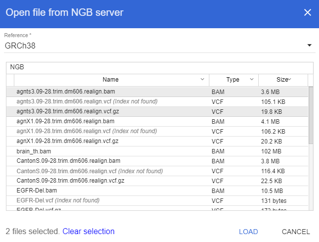

# Docker installation
## Image location
Docker image is available at [DockerHub Lifesciences repository](https://hub.docker.com/r/lifescience/ngb/)

## Versions
There are two version of NGB in the repository:

* **ngb:latest** - a "core" version - contains image of NGB without any data in it, only binaries
* **ngb:latest-demo** - a "demo" version - contains demo data set, which does not require any data registration, you need only to run an image

## Running demo version
Warning: a **demo** version could take up to 2Gb of the disk space (FASTA sequence, genes annotations, BAM, VCFs)
For a **demo** version run the following command
```
$ docker run -p 8080:8080 -d --name ngbcore lifescience/ngb:latest-demo
```  
You can go to [http://localhost:8080/catgenome](http://localhost:8080/catgenome) or [http://ip-of-the-host:8080/catgenome](http://ip-of-the-host:8080/catgenome) in a browser and view demo datasets (Sample 1 and Sample 2), which contain Structural Variations

### Using a demo version as a standalone viewer

NGB docker images is preconfigured to provide access to `/ngs` folder via `Open from NGB server` menu. 

This means that if a demo docker is run with `-v` option (mount volume into docker) - it is possible to view own NGS datasets immediately without registration process.

Command to run 
```
# This assumes that /ngs directory is available on 
# a host machine, of course any other host's
# folder can be used instead of /ngs

$ docker run -v /ngs:/ngs -p 8080:8080 -d --name ngbcore lifescience/ngb:latest-demo
```

If this is done - navigate to [http://localhost:8080/catgenome](http://localhost:8080/catgenome) in a web-browser and activate `Open from NGB server` menu

Contents of the host's `/ngs` folder will be shown and available to select and visualize



*Note: the following reference sequences and genes are available in a demo docker:*
* *GRCh38*
* *GRCh37/hg19*
* *GRCm38/mm10*
* *dm6*

## Running core image
For a **core** version replace <YOUR_NGS_DATA_FOLDER> placeholder with a real path to a folder with NGS data, and then run command
```
$ docker run -p 8080:8080 -d --name ngbcore -v <YOUR_NGS_DATA_FOLDER>:/ngs lifescience/ngb
```
This will create and start the container in a background mode and map port 8080 of the container to port 8080 of the host, then mount **<YOUR_NGS_DATA_FOLDER>** of the host to **/ngs** folder of the container and at last - make container accessible by name **ngbcore**

You can go to [http://localhost:8080/catgenome](http://localhost:8080/catgenome) or [http://ip-of-the-host:8080/catgenome](http://ip-of-the-host:8080/catgenome) in a browser (Chrome) and verify that server started successfully (you should see empty list of datasets)

## Registering data
To register your own data you should attach to a running container
```
$ docker exec -it ngbcore /bin/bash
```
This will put you inside a container's console and make **ngb** command available
First of all you should register reference (genome data), using a mounted folder **/ngs**. NGB accepts FASTA files for reference sequence
```
# ngb reg_ref /ngs/<PATH_TO_FASTA> -n my_genome -t
```

According to FASTA size you should wait several minutes.

To make NGS data available via NGB, you should create a **DATASET**, that is used to group linked files
You can register files and then add them to a dataset

Register file
```
# ngb reg_file my_genome /ngs/<PATH_TO_FILE> -n my_file1 -t
```

*Note that you should provide reference name (my_genome in this case), also **-n** (name) key is optional, if it is not specified - original file name will be used*

Create dataset and add file(s) to it
```
# ngb reg_dataset my_genome my_sample my_file1
```

Or you can create dataset and register files simultaneously
```
# ngb reg_dataset my_genome my_sample /ngs/<PATH_TO_FILE> /ngs/<PATH_TO_FILE2>
```

*Note that when registering a dataset, you should specify a genome name, to which files correspond*

After all you can leave container's console using
```
# exit
```

NGB container will continue running in a background.
When datasets are created - you can immediately browse NGS data.

## Persisting registered data

When any data was registered in NGB container - it will be lost once a container is removed. To avoid this, cache locations inside a container shall be exposed to the host filesystem.

This can be achieved by mounting of host folders into a container, using paths that contain NGB index database (H2 dir) and files caches (contents dir):
* /opt/catgenome/H2
* /opt/catgenome/contents

*Note: these options shall be specified to a `docker run` command at start time*

Example:

Imagine a host machine that contains two folders
* `/ngs` - stores NGS data that shall be registered in NGB
* `/ngb-cache` - empty folder that will be used to persist NGB caches

The following command can be used to persist all changes made to a container into that folders:

```bash
$ docker run -p 8080:8080 \ 
             -d \
             --name ngbcore \
             -v /ngs:/ngs \ 
             -v /ngb-cache/H2:/opt/catgenome/H2 \
             -v /ngb-cache/contents:/opt/catgenome/contents \
             lifescience/ngb
```

Restarting a container using this command will not cause loss of data or NGB configuration

-v /host/ngs:/ngs -v /host/H2:/opt/catgenome/H2 -v /host/contents:/opt/catgenome/contents

## Demo data description
**ngb:latest-demo** container is built to show some basic features of NGB. It uses mostly shrinked data to minimize a container size

### Points of interest

* SV_Sample1 dataset: [ALK-EML4 fusion](http://localhost:8080/catgenome/#/GRCh38/2/29224570/29224993?rewrite=Off&tracks=%5B%7B%22b%22%3A%22GRCh38%22%2C%22p%22%3A%22SV_Sample1%22%2C%22h%22%3A20%2C%22s%22%3A%7B%7D%7D%2C%7B%22b%22%3A%22GRCh38_Genes%22%2C%22p%22%3A%22SV_Sample1%22%2C%22h%22%3A55%2C%22s%22%3A%7B%22g%22%3A%22collapsed%22%7D%7D%2C%7B%22b%22%3A%22sample_1-lumpy.vcf%22%2C%22p%22%3A%22SV_Sample1%22%2C%22h%22%3A42%2C%22s%22%3A%7B%22v%22%3A%22Collapsed%22%7D%7D%2C%7B%22b%22%3A%22sv_sample_1.bam%22%2C%22p%22%3A%22SV_Sample1%22%2C%22h%22%3A462%2C%22s%22%3A%7B%22a%22%3Atrue%2C%22c%22%3A%22pairOrientation%22%2C%22c1%22%3Atrue%2C%22d%22%3Atrue%2C%22g1%22%3A%22default%22%2C%22i%22%3Atrue%2C%22m%22%3Atrue%2C%22r%22%3A1%2C%22s1%22%3Afalse%2C%22s2%22%3Atrue%2C%22s3%22%3Afalse%2C%22v1%22%3Afalse%7D%7D%5D)
    
* SV_Sample2 dataset: [ROS1-SLC34A2 fusion](http://localhost:8080/catgenome/#/GRCh38/6/117336964/117337328?rewrite=Off&tracks=%5B%7B%22b%22%3A%22GRCh38%22%2C%22p%22%3A%22SV_Sample2%22%2C%22h%22%3A20%2C%22s%22%3A%7B%7D%7D%2C%7B%22b%22%3A%22GRCh38_Genes%22%2C%22p%22%3A%22SV_Sample2%22%2C%22h%22%3A122%2C%22s%22%3A%7B%22g%22%3A%22collapsed%22%7D%7D%2C%7B%22b%22%3A%22sample_2-lumpy.vcf%22%2C%22p%22%3A%22SV_Sample2%22%2C%22h%22%3A63%2C%22s%22%3A%7B%22v%22%3A%22Collapsed%22%7D%7D%2C%7B%22b%22%3A%22sv_sample_2.bam%22%2C%22p%22%3A%22SV_Sample2%22%2C%22h%22%3A410%2C%22s%22%3A%7B%22a%22%3Atrue%2C%22c%22%3A%22insertSize%22%2C%22c1%22%3Atrue%2C%22d%22%3Atrue%2C%22g1%22%3A%22chromosomeOfMate%22%2C%22i%22%3Atrue%2C%22m%22%3Atrue%2C%22r%22%3A0%2C%22s1%22%3Afalse%2C%22s2%22%3Atrue%2C%22s3%22%3Afalse%2C%22v1%22%3Afalse%7D%7D%5D)

* FGFR3-TACC-Fusion-Sample dataset: [FGFR3-TACC3 fusion](http://localhost:8080/catgenome/#/GRCh38/4/1727714/1729323?rewrite=Off&tracks=%5B%7B%22h%22%3A20%2C%22s%22%3A%7B%7D%2C%22b%22%3A%22GRCh38%22%2C%22p%22%3A%22FGFR3-TACC-Fusion-Sample%22%7D%2C%7B%22h%22%3A53%2C%22s%22%3A%7B%22g%22%3A%22collapsed%22%7D%2C%22b%22%3A%22GRCh38_Genes%22%2C%22p%22%3A%22FGFR3-TACC-Fusion-Sample%22%7D%2C%7B%22h%22%3A41%2C%22s%22%3A%7B%22v%22%3A%22Collapsed%22%7D%2C%22b%22%3A%22FGFR3-TACC-Fusion.vcf%22%2C%22p%22%3A%22FGFR3-TACC-Fusion-Sample%22%7D%2C%7B%22h%22%3A475%2C%22s%22%3A%7B%22a%22%3Atrue%2C%22c%22%3A%22pairOrientation%22%2C%22c1%22%3Atrue%2C%22d%22%3Atrue%2C%22g1%22%3A%22default%22%2C%22i%22%3Atrue%2C%22m%22%3Atrue%2C%22r%22%3A1%2C%22s1%22%3Afalse%2C%22s2%22%3Atrue%2C%22s3%22%3Afalse%2C%22v1%22%3Afalse%7D%2C%22b%22%3A%22FGFR3-TACC-Fusion.bam%22%2C%22p%22%3A%22FGFR3-TACC-Fusion-Sample%22%7D%5D)

* PIK3CA-E545K-Sample dataset: [E545K SNV](http://localhost:8080/catgenome/#/GRCh38/3/179218268/179218337?rewrite=Off&tracks=%5B%7B%22h%22%3A20%2C%22s%22%3A%7B%7D%2C%22b%22%3A%22GRCh38%22%2C%22p%22%3A%22PIK3CA-E545K-Sample%22%7D%2C%7B%22h%22%3A70%2C%22s%22%3A%7B%22v%22%3A%22Collapsed%22%7D%2C%22b%22%3A%22PIK3CA-E545K.vcf%22%2C%22p%22%3A%22PIK3CA-E545K-Sample%22%7D%2C%7B%22h%22%3A80%2C%22s%22%3A%7B%22g%22%3A%22expanded%22%7D%2C%22b%22%3A%22GRCh38_Genes%22%2C%22p%22%3A%22PIK3CA-E545K-Sample%22%7D%2C%7B%22h%22%3A365%2C%22s%22%3A%7B%22a%22%3Atrue%2C%22c%22%3A%22noColor%22%2C%22c1%22%3Atrue%2C%22d%22%3Atrue%2C%22g1%22%3A%22default%22%2C%22i%22%3Atrue%2C%22m%22%3Atrue%2C%22r%22%3A%221%22%2C%22s1%22%3Afalse%2C%22s2%22%3Atrue%2C%22s3%22%3Afalse%2C%22v1%22%3Afalse%7D%2C%22b%22%3A%22PIK3CA-E545K.bam%22%2C%22p%22%3A%22PIK3CA-E545K-Sample%22%7D%5D)

* Fruitfly dataset: [LIMK 1 SNV-INDELS](http://localhost:8080/catgenome/#/DM6/X/12588906/12592411?rewrite=Off&tracks=%5B%7B%22h%22%3A20%2C%22s%22%3A%7B%7D%2C%22b%22%3A%22DM6%22%2C%22p%22%3A%22Fruitfly%22%7D%2C%7B%22h%22%3A69%2C%22s%22%3A%7B%22g%22%3A%22collapsed%22%7D%2C%22b%22%3A%22DM6_Genes%22%2C%22p%22%3A%22Fruitfly%22%7D%2C%7B%22h%22%3A189%2C%22s%22%3A%7B%22v%22%3A%22Expanded%22%7D%2C%22b%22%3A%22CantonS.09-28.trim.dm606.realign.vcf%22%2C%22p%22%3A%22Fruitfly%22%7D%2C%7B%22h%22%3A444%2C%22s%22%3A%7B%22a%22%3Atrue%2C%22c%22%3A%22noColor%22%2C%22c1%22%3Atrue%2C%22d%22%3Atrue%2C%22g1%22%3A%22default%22%2C%22i%22%3Atrue%2C%22m%22%3Atrue%2C%22r%22%3A%221%22%2C%22s1%22%3Afalse%2C%22s2%22%3Atrue%2C%22s3%22%3Afalse%2C%22v1%22%3Afalse%7D%2C%22b%22%3A%22CantonS.09-28.trim.dm606.realign.bam%22%2C%22p%22%3A%22Fruitfly%22%7D%5D)

# Develop versions of docker images

Docker images from develop branch are automatically builded by Travis-CI and pushed to DockerHub.
Unfourunately, the demo data could not be included in the image due to the large size of demo data and Travis disk space limitations.
So you have to download data by the demo_data_download.sh script located in the docker/demo/ folder

To launch the docker image put the demo_data_script.sh file to the folder on the host machine you want to be used for the data download.
Just for the example let it be /home/user/ngb_files

Next, download the pull the -dev docker image and launch it (replace 2.6.0.34.1.34.1 with the version number you want)

```
$ docker run -d -p 8080:8080 --name ngbcore -v /home/user/ngb_files/:/ngs epam/lifesciences/ngb:2.6.0.34.1.34.1-dev
```
This command will start docker with the ngbcore name, mount the folder /home/user/ngb_files on the host machine to the /ngs mount point of the container and expose the 8080 port for the ngb graphical interface

Now run the script to download demo data
```
$ docker exec -it ngbcore /ngs/demo_data_download.sh
```
demo_data_download.sh script will download genome references to ~/ngb_data/references and demo data to /home /ngb_data/data_files by default
But you can change the paths for references and data files by passing -r and -f arguments to the demo_data_download.sh script, respectively if you want to

For example:
```
./demo_data_download.sh -r ~/references -f ~/some/other/folder
```

The script will download all the necessary files and will register them by itself. But please be patient, as the reference donwload may take much time.


