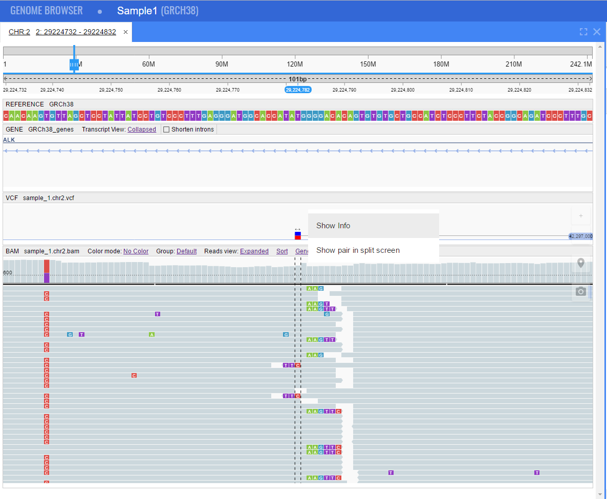
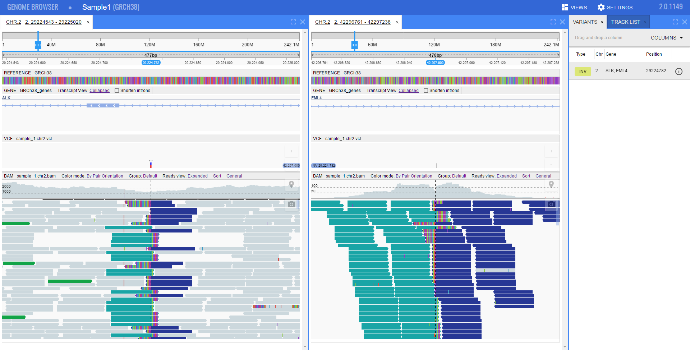
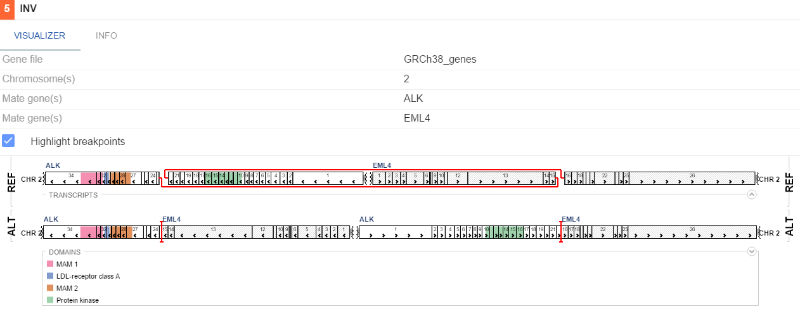
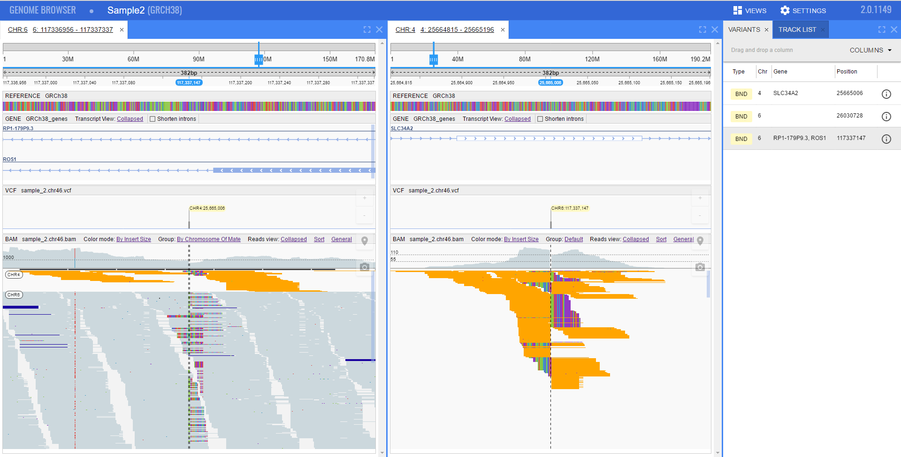
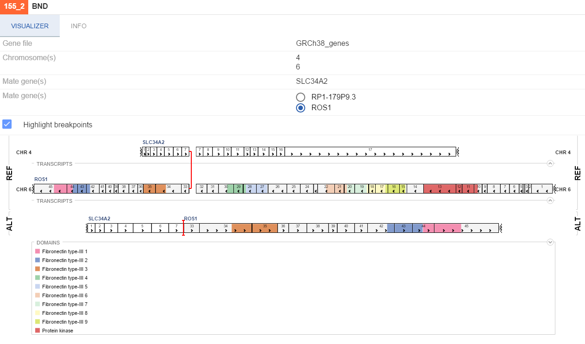

# Docker installation
## Image location
Docker image is available at [DockerHub Lifesciences repository](https://hub.docker.com/r/lifescience/ngb/)

## Versions
There are two version of NGB in the repository:

* **ngb:latest** - a "core" version - contains image of NGB without any data in it, only binaries
* **ngb:latest-demo** - a "demo" version - contains demo data set, which does not require any data registration, you need only to run an image

## Running demo version
Warning: a **demo** version could take up to 2Gb of the disk space (FASTA sequence, genes annotations, BAM, VCFs)
For a **demo** version run the following command
```
$ docker run -p 8080:8080 -d --name ngbcore lifescience/ngb:latest-demo
```  
You can go to [http://localhost:8080/catgenome](http://localhost:8080/catgenome) or [http://ip-of-the-host:8080/catgenome](http://ip-of-the-host:8080/catgenome) in a browser and view demo datasets (Sample 1 and Sample 2), which contain Structural Variations

## Running core image
For a **core** version replace <YOUR_NGS_DATA_FOLDER> placeholder with a real path to a folder with NGS data, and then run command
```
$ docker run -p 8080:8080 -d --name ngbcore -v <YOUR_NGS_DATA_FOLDER>:/ngs lifescience/ngb
```
This will create and start the container in a background mode and map port 8080 of the container to port 8080 of the host, then mount **<YOUR_NGS_DATA_FOLDER>** of the host to **/ngs** folder of the container and at last - make container accessible by name **ngbcore**

You can go to [http://localhost:8080/catgenome](http://localhost:8080/catgenome) or [http://ip-of-the-host:8080/catgenome](http://ip-of-the-host:8080/catgenome) in a browser (Chrome) and verify that server started successfully (you should see empty list of datasets)

## Registering data
To register your own data you should attach to a running container
```
$ docker exec -it ngbcore /bin/bash
```
This will put you inside a container's console and make **ngb** command available
First of all you should register reference (genome data), using a mounted folder **/ngs**. NGB accepts FASTA files for reference sequence
```
# ngb reg_ref /ngs/<PATH_TO_FASTA> -n my_genome -t
```

According to FASTA size you should wait several minutes.

To make NGS data available via NGB, you should create a **DATASET**, that is used to group linked files
You can register files and then add them to a dataset

Register file
```
# ngb reg_file my_genome /ngs/<PATH_TO_FILE> -n my_file1 -t
```

*Note that you should provide reference name (my_genome in this case), also **-n** (name) key is optional, if it is not specified - original file name will be used*

Create dataset and add file(s) to it
```
# ngb reg_dataset my_genome my_sample my_file1
```

Or you can create dataset and register files simultaneously
```
# ngb reg_dataset my_genome my_sample /ngs/<PATH_TO_FILE> /ngs/<PATH_TO_FILE2>
```

*Note that when registering a dataset, you should specify a genome name, to which files correspond*

After all you can leave container's console using
```
# exit
```

NGB container will continue running in a background.
When datasets are created - you can immediately browse NGS data.

## Demo data description
**ngb:latest-demo** container is built to show some basic features of NGB. It uses mostly shrinked data (e.g. reference seq limited to three chromosomes) to minimize a container size

* Genome:
    * 2, 4, 6 chromosomes of GRCh38 sequence (FASTA)
    * 2, 4, 6 chromosomes of GRCh38 genes annotations file (GTF)
* Sample1 dataset:
    * VCF - one INV variation on chr2
    * BAM - alignments, that support inversion
    * Point Of Interest: [ALK-EML4 fustion](http://locahost:8080/catgenome/#/pId/1/chr/2/start/29224543/end/29225020)
* Sample2 dataset:
    * VCF - two BND variations on chr4 and chr6. Both are mate events of chr6<->chr4 translocation
    * BAM - alignments, that support translocation
    * Point Of Interest: [ROS1 fusion](http://localhost:8080/catgenome/#/pId/2/chr/6/start/117337097/end/117337197)

## Demo scenarios
**Scenario 1** : ALK - EML4 Fusion

1. Navigate to [http://locahost:8080/catgenome/#/pId/1/chr/2/start/29224543/end/29225020](http://locahost:8080/catgenome/#/pId/1/chr/2/start/29224543/end/29225020)
2. Iversion variation with alignments will be shown
3. Left-click on a variation on a VCF track - context menu with two options will be shown
 * Show info
 * Show pair in split screen

4. Select **Show pair in split screen** to view second breakpoint of an inversion
*Note: this location looks better when colored by **Pair orientation** and sorted by **Insert size** . To enable these modes a BAM track header menu or hotkeys could be used (default are: SHIFT+1 to set color mode and SHIFT+Y to set sorting)*

5.  Left-click on a variation on a VCF track again and select **Show info**
6. Results of Structural Variation rearrangements will be shown (including protein domains coloring)


**Scenario 2** : ROS1 - SLC34A2 Fusion

1. Navigate to [http://localhost:8080/catgenome/#/pId/2/chr/6/start/117337097/end/117337197](http://localhost:8080/catgenome/#/pId/2/chr/6/start/117337097/end/117337197)
2. BND (breakends) variation with alignments will be shown. Variation tooltip indicates second breakpoint location (interchromosomal translocation chr6<->chr4)
3. Left-click on a variation on a VCF track - context menu with two options will be shown
 * Show info
 * Show pair in split screen

4. Select **Show pair in split screen** to view second breakpoint of a translocation
*Note: this location looks better when colored by **Insert size**, grouped by **Chromosome of mate** and reads view set to **Collapsed** To enable these modes a BAM track header menu or hotkeys could be used (default are: SHIFT+2 to set color mode, SHIFT+F to set grouping and SHIFT+X to set collapsed reads view)*

5.  Left-click on a variation on a VCF track again and select **Show info**
6. Results of Structural Variation rearrangements will be shown (including protein domains coloring)
*Note: there are two genes located at chr6 breakpoint, that's why two options would be shown in details window - which gene two use when renedering a visualization of rearrangement. ROS1 should be selected*

