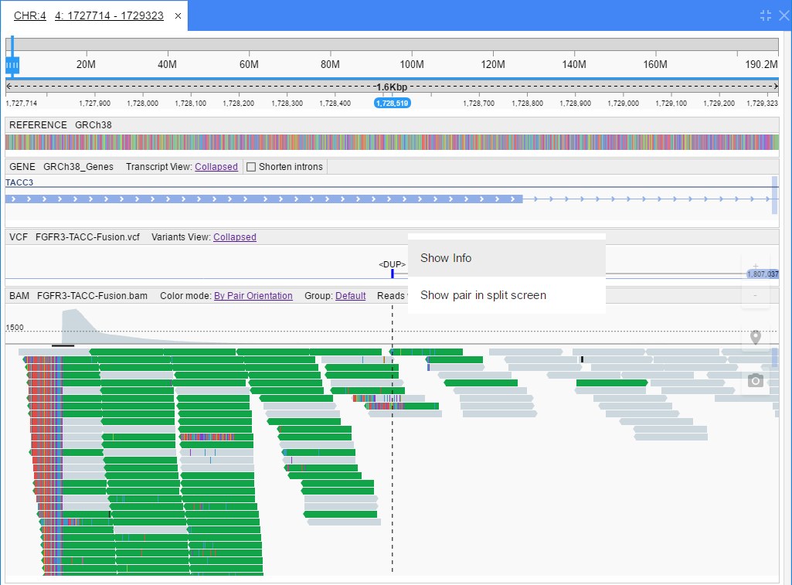
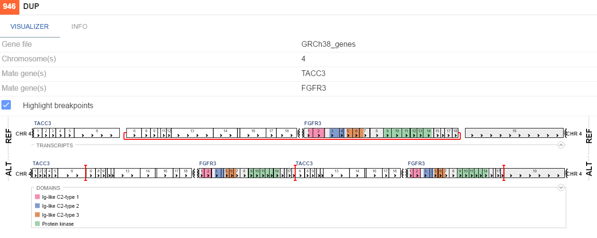

# Dataset visualization for article **Prioritisation of Structural Variant Calls in Cancer Genomes**

**New Genome Browser** was used to generate figures for the **[Prioritisation of Structural Variant Calls in Cancer Genomes article](http://biorxiv.org/content/early/2016/11/04/084640)**

Below are the details on how to reproduce visualization of the datasets, used in the article

Links to variations loci, provided below, will load public NGB instance located at [http://ngb.opensource.epam.com](http://ngb.opensource.epam.com/catgenome)

## Figure 5. FGFR3-TACC3 tandem duplication fusion

1. Navigate to [FGFR3-TACC3 fusion locus](http://ngb.opensource.epam.com/catgenome/#/pId/40/chr/4/start/1728469/end/1728569) *(click a link to navigate to a public NGB instance)*
2. DUP (duplication) variation will be shown
3. Left-click a variation on a VCF track and select **Show info**

4. Results of Structural Variation rearrangements will be shown (including protein domains coloring)

## Figure 6. ROS1-SLC34A2 interchromosomal translocation fusion

1. Navigate to [ROS1-SLC34A2 fusion locus](http://ngb.opensource.epam.com/catgenome/#/pId/3/chr/6/start/117337097/end/117337197) *(click a link to navigate to a public NGB instance)*
2. BND (breakends) variation with alignments will be shown. Variation tooltip indicates second breakpoint location (interchromosomal translocation chr6<->chr4)
3. Left-click a variation on a VCF track (lumpy) - context menu with two options will be shown
 * Show info
 * Show pair in split screen

4. Select **Show pair in split screen** to view second breakpoint of a translocation
*Note: this location looks better when colored by **Insert size**, grouped by **Chromosome of mate** and reads view set to **Collapsed** To enable these modes a BAM track header menu or hotkeys could be used (default are: SHIFT+2 to set color mode, SHIFT+F to set grouping and SHIFT+X to set collapsed reads view)*

5.  Left-click a variation on a VCF track again and select **Show info**
6. Results of Structural Variation rearrangements will be shown (including protein domains coloring)
*Note: there are two genes located at chr6 breakpoint, that's why two options would be shown in details window - which gene two use when renedering a visualization of rearrangement. ROS1 should be selected*

## Figure 7. EML4-ALK inversion fusion

1. Navigate to [EML4-ALK fusion locus](http://ngb.opensource.epam.com/catgenome/#/pId/2/chr/2/start/29224732/end/29224832) *(click a link to navigate to a public NGB instance)*
2. Inversion variation with alignments will be shown
3. Left-click a variation on a VCF track (lumpy) - context menu with two options will be shown
 * Show info
 * Show pair in split screen

4. Select **Show pair in split screen** to view second breakpoint of an inversion
*Note: this location looks better when colored by **Pair orientation** and sorted by **Insert size** . To enable these modes a BAM track header menu or hotkeys could be used (default are: SHIFT+1 to set color mode and SHIFT+Y to set sorting)*

5.  Left-click a variation on a VCF track again and select **Show info**
6. Results of Structural Variation rearrangements will be shown (including protein domains coloring)

