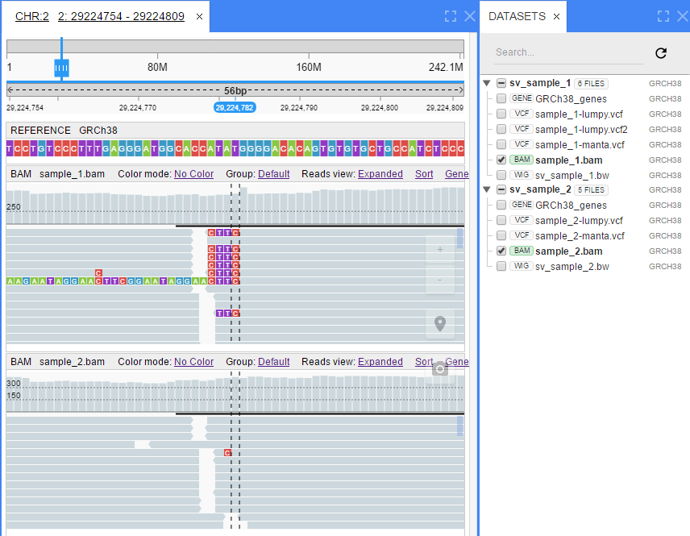
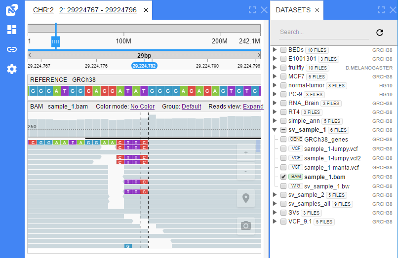

* Now files from different datasets could be loaded simultaneously, if they are mapped to the same reference genome

* Build process is moved to SpringBoot framework. Now to options are avaible for building NGB binaries. See [Standalone installation instructions](../../installation/standalone.md) for details
    * `./build.sh --war #produces war file that should be deployed to a tomcat instance`
    * `./build.sh --jar #produces jar file that could be used standalone`
* Now variations table columns set is stored for a user. When a *custom* column is added to a variations table it would be shown always (if a VCF file contains that column) until a user will explicitly remove it
* INFO tab of a variation details popup now shows annotation fields as a table (sorting and column reordering is allowed)

* Main application toolbar is moved to the left to provide more space for the tracks data

* Context menus items now shows assigned hotkeys, if they are set

* "Loading" indicator is added to VCF/Genes/BED tracks. Previously existed only for BAM tracks
* URL format changed
    * It does not include dataset id. Instead of it - a reference genome name is used
    * Tracks list is now always included into URL, to be able to specify files from different datasets
* VCF and GTF/GFF files registration increase ~2x times 
* Next/Previous variation buttons added to a VCF track header GUI. Previously only hotkeys were available for navigation
* Added **Close** button for each track
* "Show 3D structure" for a gene now opens **Molecular viewer** pane automatically. Previously it should be opened manually before selecting a gene
* Added **unique** constraint for the file names at registration routine

