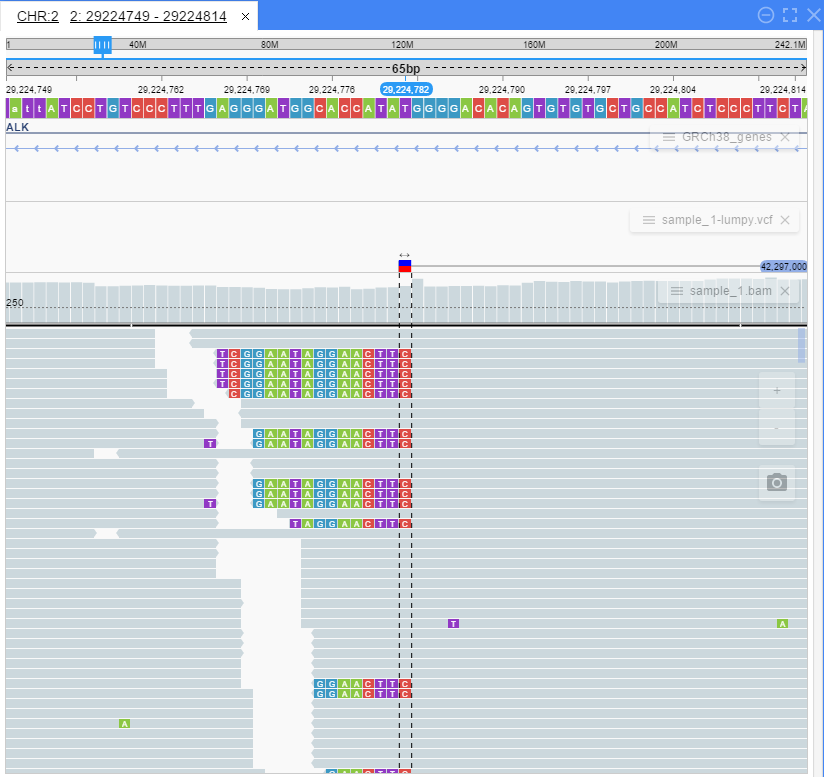
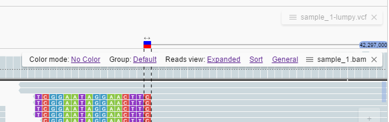
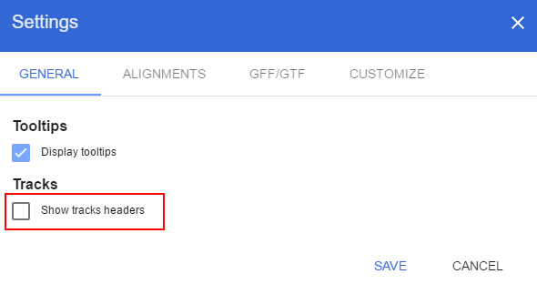
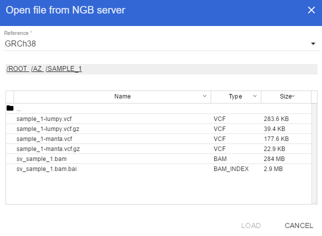
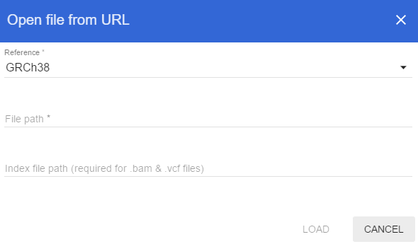
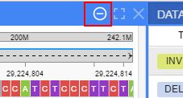
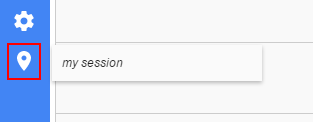

# Release Notes v2.3

## Collapsed mode for track header

Now it's possible to view tracks in a "collapsed" mode. This mode hides a track header to provide more space for data (reduces each track height by 21px)

Collapsed mode:



In collapsed mode track headers are shown as floating semi-transparent bars in the top right corner of the track

Clicking a "hamburger" menu icon opens a track menu (shown on the track header in "non-collapsed" mode):



To enable/disable "collapsed" mode use "Settings -> General -> Tracks" menu:



## More vertical space for data

The following changes provide even more vertical space for data:

* Global ruler height reduced by 36px
* Panels tabs' height reduced by 9px
* Variant table row height reduced by 13px

## Open files without registration

Now it is possible to open files (BAM, VCF, GFF/GTF, BED) without registration.

"Open file" menu item added to the left toolbar providing two options (both of them require tbi index for the file being loaded):

* "From NGB Server":



* "From URL":



## Build process and installation changes

* Build process is moved from `build.sh` to `gradle`, thus eliminating dependency on `bash` environment. See details [here](../../installation/overview.md) for a list of commands

* `install.sh` script removed in favour of a standalone springboot jar

## URL format changes

Several changes to NGB URL format (aimed to simplify embedding NGB):

* Specifying file names instead of IDs for a `&tracks` parameter
* Specifying all dataset tracks by using only `p` option of a `&tracks` parameter
* Filter datasets by genome (`&filterByGenome=hg19`)
* Display track headers in a collapsed mode by default (`&collapsedTrackHeaders`)
* Select first chromosome for a reference genome, in case a name is not known (`{first-chromosome}` should be set as a chromosome name)

Previously track ("b") and parent dataset ("b") had to be integer identifiers:

```
tracks=[{"b":7,"p":1}]
```

Now these options should preferably be specified as names (given at registration):

```
tracks=[{"b":"sv_sample_1.vcf","p":"SV_sample1"}]
```

For more details see [Embedding guide](../../user-guide/embedding-url.md)

## NGB Command Line Interface changes

* Several changes to NGB CLI (see [NGB CLI Command Reference](../../cli/command-reference.md) for details):
    * `url` command added to NGB CLI. It generates an URL that allows launching NGB with a set of opened files and at a specific genome position
    * Reference FASTA files now are registered without converting to internal "nib" format thus significantly decreasing the registration time
    * `-ngc` option added to `reg_ref` command, telling NGB not to calculate GC-content values for a reference track

## NGB standalone desktop version preview

A preview version of a desktop version is added. This version runs locally on

* Windows
* MacOS
* Linux

Desktop version includes both NGB Java server and JS client packaged into a single platform-specific executable, using [Electron framework](http://electron.atom.io/)

4 genomes are available out of the box to start using desktop version immediately:

* GRCh38
* GRCh37
* D.melanogaster
* Mus musculus

Sources are provided in a `/desktop` folder of the repository.

Details on building desktop version are provided in a desktop [README](../../installation/desktop.md).

## Other changes

* NGB supports `Apple Safari` now

* "Close all tracks" button added to the "Browser" panel:



* "Create session" button moved to the left toolbar:


