# Release Notes v2.4

## Alignments (BAM/CRAM) track improvements

BAM track now supports three visualization modes defined by zoom level:

* **Alignments presence** - shows presence/absence of alignments. This mode is available at the lowest zoom levels, e.g. the whole chromosome.  
Dashed ranges contain at least one read:  
    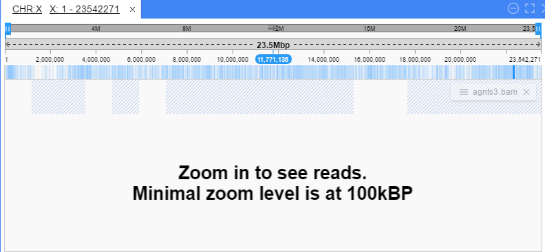

* **Coverage mode** - only shows coverage histogram, mismatches are not calculated. This mode starts being used when zooming in to `maximum coverage range` setting.
Default is **500KBp**, maximum is **10MBp**:  
    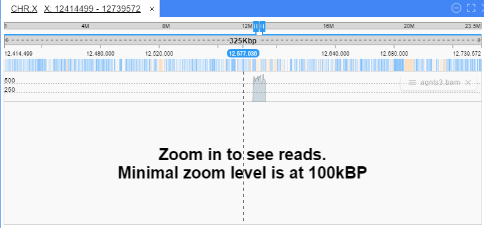

* **Full mode** - shows all information for alignments track, including reads, coverage, splice-junctions and all other features (this was the only mode in previous versions).  
Zoom level for this mode is defined by `maximum alignments range` setting.  
Default is **100KBp**, maximum is **150KBp**:  
    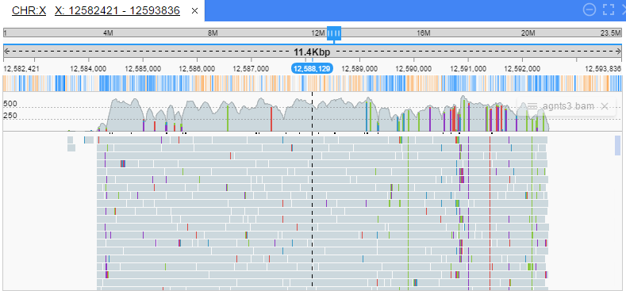  
An option is introduced to hide reads' alignments on a BAM track (coverage-only option)

* Reads can be hidden using a BAM track menu (`General -> Show alignments`)...  
    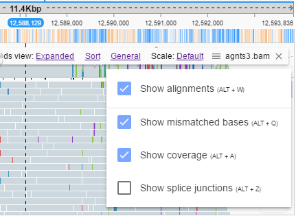

* ...or by a hotkey (default is `ALT+W`). This will apply to ALL the loaded BAM tracks

If there are no reads in a current region - an information message is shown (previously an empty track was shown):  
    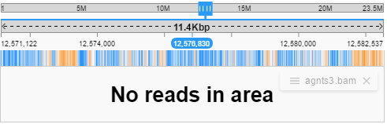

BAM rendering is improved, **antialiasing** effect for features edges is fixed:  
    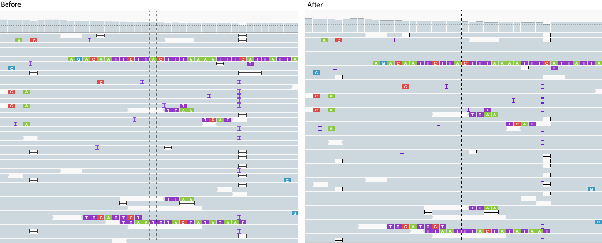

## WIG and Alignments coverage scale configuration

WIG tracks and auto-calculated coverage "subtracks" at the alignments tracks now support scale configuration:

* Set **manual** scale (from-to)
* Set **auto** scale (default)
* Set **log** scale

Configuration is done from a track menu item **Scale**:  
    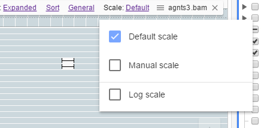

Clicking **Manual** option will show a popup with parameters 
They can be applied to a single track, only WIG tracks, only BAM tracks or all tracks:  
    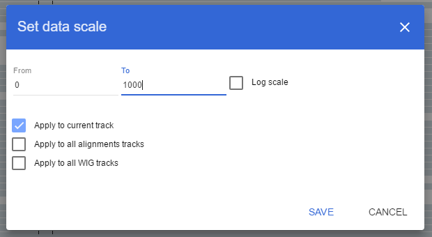

## Variations table changes

Variations filtering now works inside the **VARIANTS** panel (**FILTER** panel is removed)

* To enable variations filtering - use a table menu (**Show filters** option):  
    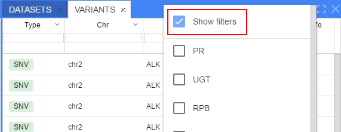

* Select a variation type, chromosome or gene from a dropdown list (multiple selection and autocomplete are supported):  
    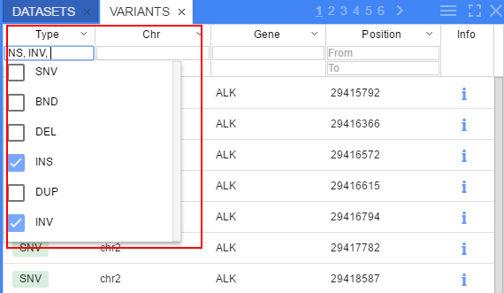

* Input filtering values for integer, float and string variations properties (_From_ and _To_ values are used to set a range of values):  
    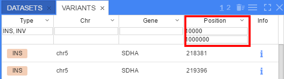

* Tick/Untick a checkbox for flag properties:  
    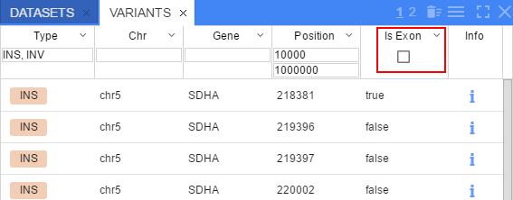

* Clear a filter for a specific column by clicking a **Clear column filter** in a column menu:  
    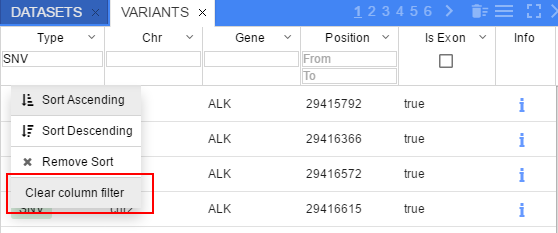

* Clear all the filters by clicking a **Clear all filters** button:  
    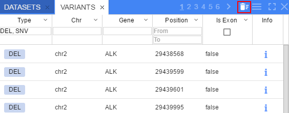

Clicking on **Variants by type** bar filters a variations table by a selected type:  
    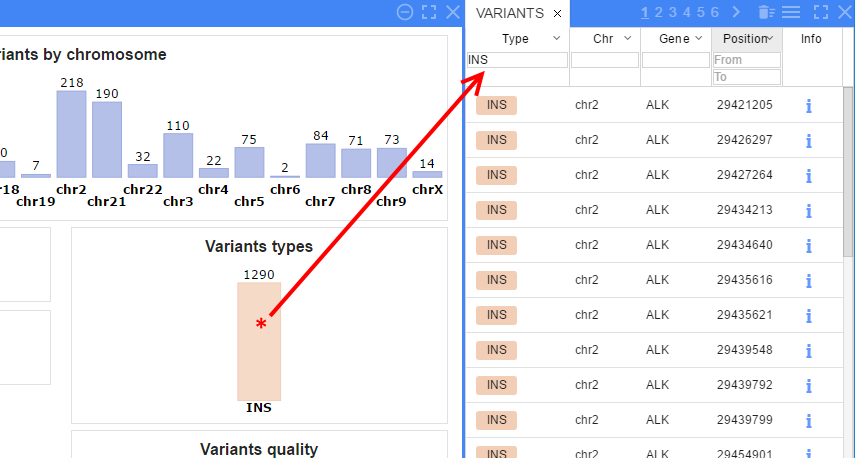

Variations table now supports paging. This allows loading huge VCF files without performance degradation

* Page size is 100 variations
* If a selected VCF file contains more than 100 items, table will show a paging control
* Pages can be switched by clicking a page number or by scrolling a table down (when a limit of 100 items is reached - more variations are be loaded automatically):  
    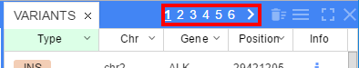

## Improvements for opening files without registration

Path of the last opened folder is stored now. When **Open from NGB server** dialog is opened next time - previously used folder will be shown

**Open from NGB server** dialog now shows a count of selected items and allows clearing the selection:  
    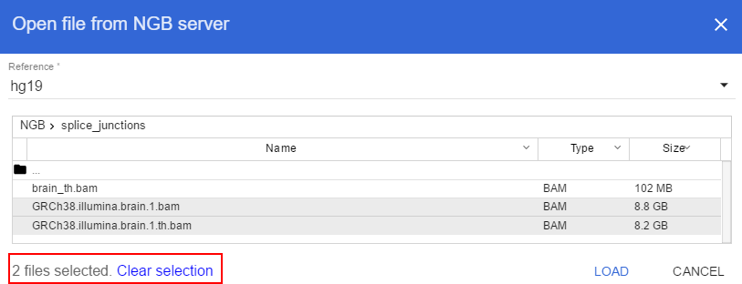

Index files are selected automatically

* Index files (bai, tbi) are not shown in a **Open from NGB server** dialog anymore. If a data file and a corresponding index are found in the same directory - only a data file is shown. When a file is selected, its index is used automatically
* If no index is found for a file - its name is shown in gray color (disabled):  
    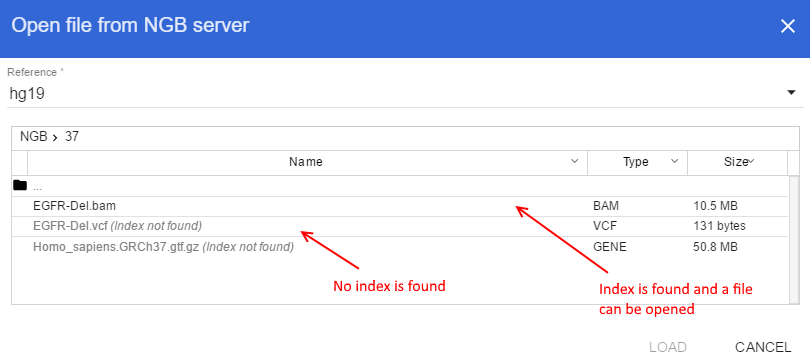

More user-friendly styles are applied to the **breadcrumbs** control:  
    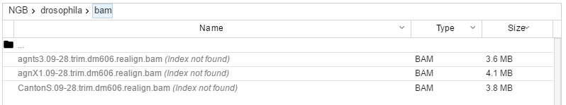

A user mow can click **breadcrumbs** and paste a full path to the data directory:  
    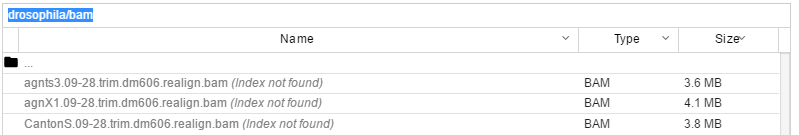

## Dataset tree performance improvements

Datasets tree now uses improved rendering approach that allows visualizing up to a million of nodes:

## NGB Command Line Interface improvements

NGB-CLI now supports sorting of feature-files (VCF, BED, GTF, GFF, GFF3)

* `ngb sort` command can be used prior to registering files, if they are unsorted
* Refer to [NGB CLI Command Reference](../../cli/command-reference.md) for details

NGB CLI now supports recursive deletion of datasets

* `-f (--force)` option for `dd (del_dataset)` should be specified to delete a dataset and all it's children
* If a deletion is not forced - an exception will be thrown, if a dataset contains children

NGB CLI now supports registration of BAM/CRAM files without `coordinate sorted` flag in a header. If a bai index is specified - it is assumed that a file is sorted by coordinate

## Other improvements

Now it is possible to configure default tracks visualiztion option from a server configuration file. Refer to [Installation guide](../../installation/standalone.md) for details

NGB-logo menu now shows a link to GitHub - issues page, to report any problems or feature requests:  
    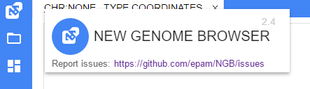

NGB now shows **Loading...** message when tracks are being loaded. This is useful for embedding, as it does not show placeholder page anymore
