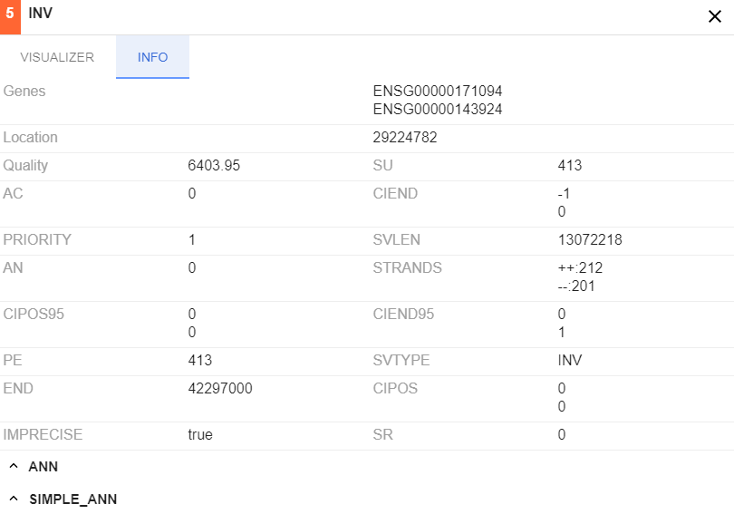

# Variants of translation and strand for reference track

Previously reference track could only show forward strands.


Now "General" hyperlink was added on reference track header. 
Feature allows to view reverse strand and all variants of sequence translations. 


# Short URLs generation and handling

New functionality of generating and handling short URLs instead of long URLs was added.

New methods for UtilController were added:

* `generateShortUrl` - takes the original url and alias(optional) and generate a short postfix for storing the original url (if alias is specified but isn't unique postfix based on a hash-function will be generated`)
* `redirectToOriginalUrlByAlias` - takes a short postfix and searches for the original url, if it exists controller will redirect to the original url, otherwise will redirect to 404 error page

# Bed Graph files support

New classes for work with Bed graph files were added. `WigManager` was split in two classes for a decomposition and also `BedGraphManager` was created as a child of `AbstractWigManager`.
`FacadeWigManager` currently gets calls from `WigController` and delegates it to appropriate implementation of `AbstractWigManager`.

# Limit for lucene index size for /filter and /group API requests

For large (more than 500 Mb) VCF files Lucene index becomes too large and some requests may take too long.
Appropriate changes were done to `FeatureIndexDao` and application property `lucene.index.max.size.grouping` is added to catgenome.properties to control max index size. Default value is 4Gb.

Now when file is larger than 500 Mb:
* `/group` request doesn't return any data and 
* `/filter` request doesn't return a totalPagesCount value.

#Other

##Usability improvements

### Allele frequency thresholds settings

BAM coverage track can show colored bars with mismatches distribution at a specific locus.


These bars used to get colored only if a certain threshold is exceeded.
**Previously** this value was hardcoded. **Now** it can be set by changing `Allele frequency threshold` in "Settings" -> "Alignments" -> "Coverage Options".


### Vertical line through all tracks

`Show central line` option to "General" tab of "Settings" was added. It may be useful in cases when it is necessary to compare some tracks.


### Expand symbol in variation info moved to the left

Indicator was moved to the left, so it would be easier to find.


### Drop down menu sorted

Drop down menu contents sorted in alphabetical order

### Docker changes

1. `NGB core docker` is moved to `springboot jar` instead of `war` with a `tomcat`
2. `/ngs` is set a default folder for `Open from NGB` server feature. So calling `docker` run ```-v ${host_folder}:/ngs``` will allow to load files from a host machine without a registration
3. `NGB demo docker` is added, it uses core image and initializes it with demo data and a set of references
4. `buildDockerDemo` task it added to gradle
5. Documentation is updated

##Bug fixes

### Fix stuck loading indicator for bigWig/bedGraph tracks

Error occured when user is loading `.bw` file and selecting chromosome for which data in `.bw` is not represented.

Now loading indicator disappears as expected.

### Fix "Open from URL" to open more supported file types

Previously "Open from URL" menu only allowed to open VCF and BAM files as seen below.


Now it supports formats listed below:
* BAM
* BED
* GFF/GTF
* VCF