# Variants of translation and strand for reference track

Previously reference track could only show forward strand.

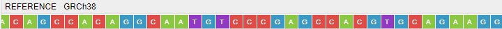

Now several options are added:
* View reverse strand
* View AA translation for forward/reverse strands

These options are available via "General" menu of a reference track

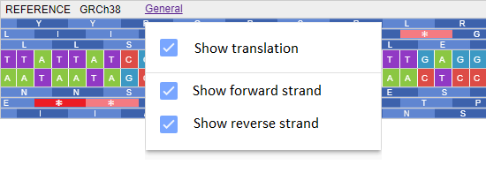
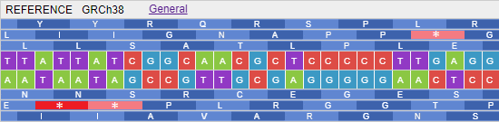
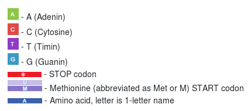

# Vertical line through all tracks

`Show central line` option was added for all formats. It draws a vertical line that illustrates the centre of the visualized region for each track. Previously it was only available for BAM.

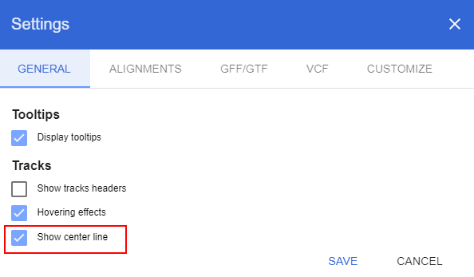
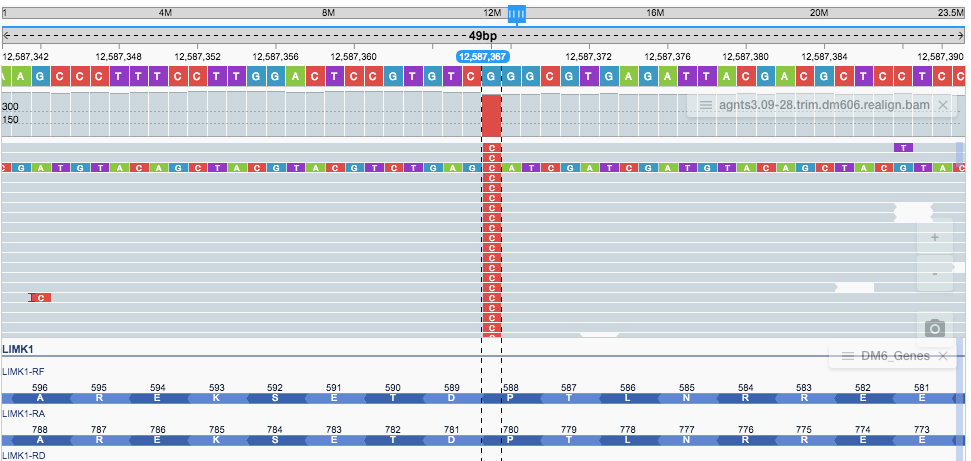

# Short URLs generation and handling

Previously URLs, generated for sharing NGB views, were quite long (e.g. 1000+ letters)
In `2.5.1` URL shortener is embedded into NGB

This feature allows to:
* Generate a named URL (if alias is specified)
* Generate randomly named URL (using hash-function value)

These URLs are much shorter and easier to share

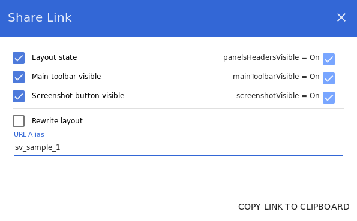

So now it looks like this:

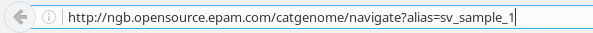

# Bed Graph files support

NGB now supports Bed Graph files (.bdg file extension)
Registration and visualization of these files are the same as for WIG files

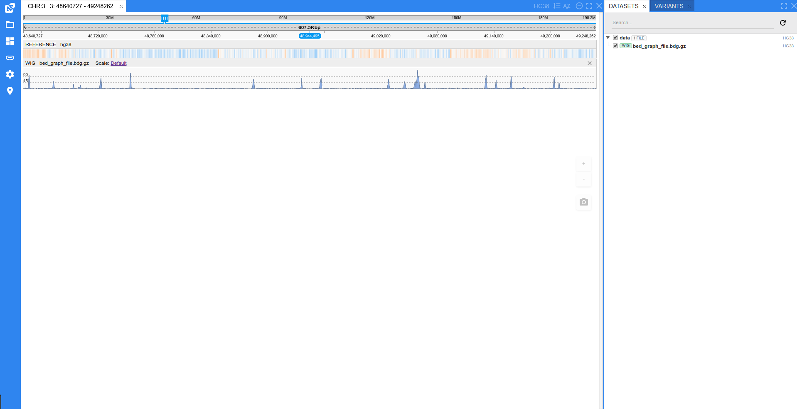

# Allele frequency thresholds settings

BAM coverage track can show colored bars with mismatches distribution at a specific locus
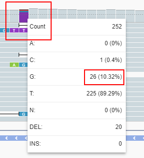

These bars used to get colored only if a certain threshold is exceeded
**Previously** this value was hardcoded. **Now** it can be set by changing `Allele frequency threshold` in "Settings" -> "Alignments" -> "Coverage Options"

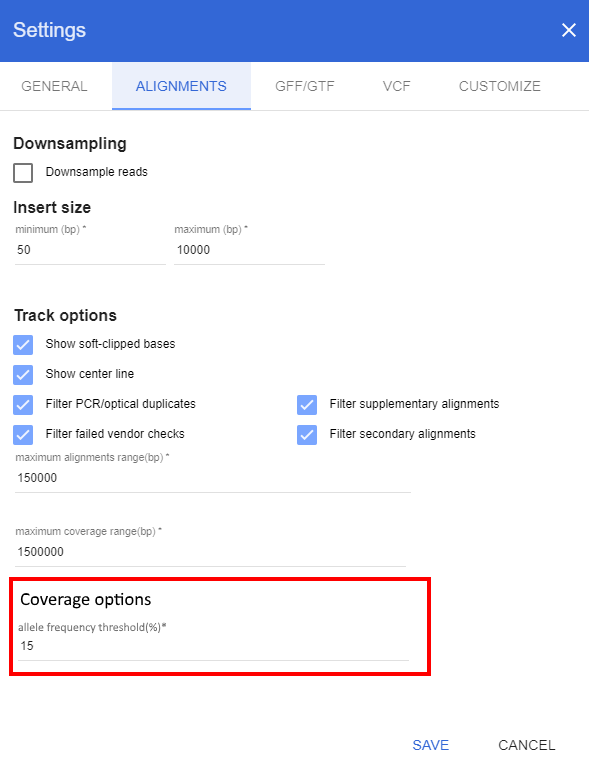

# Other

### Drop down menu sorted

Variations Table fields selector menu is now sorted in alphabetical order

### Docker changes

1. `NGB core docker` is moved to `springboot jar` instead of `war` with a `tomcat`
2. `/ngs` is set a default folder for `Open from NGB server` feature. So calling `docker` run ```-v ${host_folder}:/ngs``` will allow to load files from a host machine without a registration
3. `NGB demo docker` is added, it uses core image and initializes it with demo data and a set of references
4. `buildDockerDemo` task it added to gradle

## Bug fixes

### Fix stuck loading indicator for bigWig/bedGraph tracks

Error occurred when user is loading `.bw` file and selecting chromosome for which data in `.bw` is not represented.

Now loading indicator disappears as expected.

### Fix "Open from URL" to open more supported file types

Previously "Open from URL" menu only allowed to open VCF and BAM files as seen below.

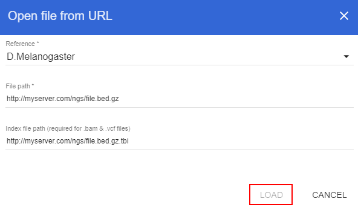

Now it supports formats listed below:
* BAM
* BED
* GFF/GTF
* VCF
