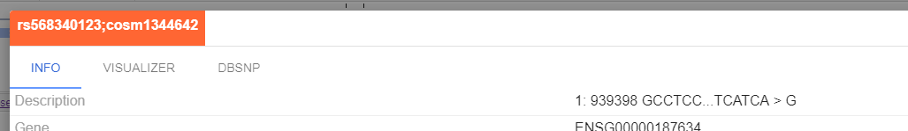

# Variation info panel changes
- Order of 'VISUALIZER' and 'INFO' tabs was changed
- Description field with full variation location info was added to 'INFO' tab

# Automatic downloading of variation info from dbSNP
Additional tab 'DbSNP' appears in Variation info panel if rsId in variation is specified.
This tab contains different information: Organism, Map to Genome Build, Variation class, etc. and a direct link to dbSNP database.

# BLAT search
BLAT is an annotation utility which allow user to efficiently search for a potential location of particular DNA sequence.
Now it is available within NGB.

- Currently, when user selects a read, "Blat Search" menu item appears.

- Once 'BLAT Search' clicked, panel named 'BLAT' with BLAT Search results opens.

- If user clicks a BLAT search's table row - NGB navigates to the specified region. The found region is highlighted within a local ruler space.

- Genome species registration/unregistration on NGB server with the help of cli was added.
- Possibility to add species to reference genome during genome registration was added. And also possibility to add/remove species to/from registered reference.

# Extend allowed location formats
Several possible coordinate formats for chromosome navigation are added:

- chromosome: - navidate to the whole chromosome
- start-end - navigate to region on current chromosome (only if chromosome already selected)
- location - place center of the screen to location on current chromosome (only if chromosome already selected)

# Show full file name on a track header
Previously, file name was not fully displayed on a track header.
Now users see the full file name when they mouse over the track name on a track header.

# Support for VCF files as annotations
Now it is possible to attach VCF files as annotations to reference genomes using ngb-cli "add_ann|an" command.

# Support for AWS S3 URI
Files from S3 buckets may be viewed using S3 URI, e.g. `s3://bucket/test.vcf.gz`. Now this feature works for BAM, BED, VCF, GENE files opened via URL (non registered files). NGB server uses default AWS credentials to access S3 buckets.

# JWT Security
NGB server API authentication is now performed with use of JWT Tokens.
- all requests to API without token will receive 401 status (not authorized)
- all requests to API with valid token will receive 200 status (everything OK)

# Add read group
Grouping of reads by "Read Group" was added.

# Fix exons count for collapsed genes
Exon count isn't shown for `Transcript view: Collapsed` mode anymore.

# Changed file name view
Previously, after the opening of files from the NGB server or via the URL, their names were displayed as the full paths to the files. Now only file name is shown.

E.g.: `file.bam` instead of `http://servername/path/file.bam`.

# Changing allele frequency threshold setting behavior
Changed Allele Frequency threshold units from percentage to floating number (from 0.00 to 1.00).
Highlighting logic was modified:

- **Before**: "% of mismatches" <= "allele frequency threshold",
- **Now**: "% of mismatches" >= "allele frequency threshold".

# Other
### Display reference letters in BAM coverage graph using gray color
Previously, on the BAM coverage window NGB displayed coverage in gray only if ALL letters at this position were the same as in reference. If there were any mismathes, NGB displayed each letter in their own color.

Currently, if there are mismatches and a letter at this position is the same as in reference (not a variation), then it will be displayed in gray color on a BAM coverage graph.

### API method timeouts
When NGB receives too many "huge" requests, it tries to fulfil them all. This results into loss of responsiveness for minutes/hours for all users.
We introduced timeouts for the API methods. If a request can not be fulfilled in a certain amount of time - HTTP 503 will be returned.

This is the list of API methods that have timeouts:
 - `/filter`
 - `/filter/group`
 - `/reference/loadAll`
 - `/project/tree`
 - `/bam/track/get`
 - `/gene/{id}/track/get`
 - `/wig/track/get`
 - `/vcf/track/get`

 Timeout setting is defined in app.properties with default value 10 sec.
### Improve performance when load large vcf files into "Variations table"
In this release we have improved performance of loading large vcf "Variations table".

### Rebuild full feature index directory
Previously, `ngb index_file` rebuilt only lucene index. But in some cases it is useful to regenerate all other index stuff. E.g. histograms, bound for genes files.

In addition - `ngb index_file` command now accepts `--no-tabix` option, when this option is set - .tbi index will not be rebuilt.

## JS API
Currently, the following operations are exposed as JavaScript API:

1. Load dataset (by ID)
2. Load track (by ID or URL/Path - same options as available from GUI)
3. Navigate to coordinate (accepts different coordinate formats)
4. Set track options (according to track type, e.g. Collapsed/Expanded, Coloring mode, etc.)
5. Set global settings (that are available via "Settings" menu in the left toolbar)

Documentation is available at - docs/md/user-guide/embedding-js.md.

Additional API response was added - `{ isSuccessful: true, message: 'ready', }`, so now it's possible to determine the exact moment when NGB is ready to receive messages.

### Automatic Docker image creation via Travis
The publish.sh script was changed to allow automatic creation of the docker image from develop branch upon each commit.

### Optimize URL browsing performance
Previously, browsing files from URLs was rather slow.
Our current approach is to use cache to store indexes in memory, not to fetch them from URL on every request.

Server responses became faster than before when browsing files via URL. Ability to enable/disable caching from the properties file was added.

### Update installation.md
installation.md doc with NGB-CLI installation instructions was updated.

## Bug fixes
### Add adaptive sizing for vcf info window
Previously, in VCF info table fields with too long names overlaps with data.

Added min-width for VCF info dialog.
Added adaptive sizing to VCF info table (for fields captions and for fields data).

### Transcript fetch won't fail if any of entries isn't found in Uniprot DB
In order to build SV visualization we fetch the transcripts data from Ensembl and then for each transcript query Uniprot. Now if Uniprot entry for a transcript isn't found or any exception occurs, we proceed with the next transcript.

### File names overlap
Currently, files names do not overlap even though their length can be more than width of the rectangle on the main panel in case of multi BAM/VCF selection.

### Error loading variant info
Previously, the error "Error loading variant info" was shown in pop-up window when user clicked "Show Info" on a variation in cases when the variation was out of a gene (partly or fully).

Now Variation info is shown without specifying affected genes.
