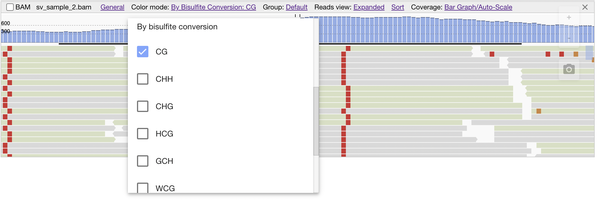
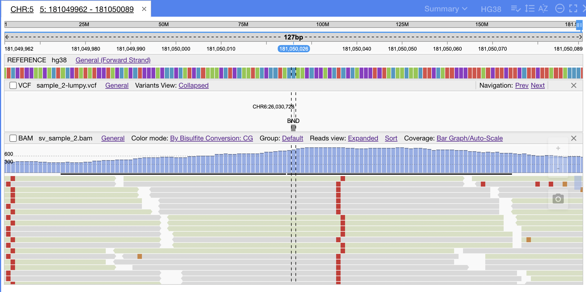

# Release Notes v2.7.1

- [GenePred format support](#genepred-format-support)
- [Bisulfite Color Mode](#bisulfite-color-mode)

## GenePred format support

NGB now supports gene data in [genePred](http://genome.ucsc.edu/FAQ/FAQformat#format9) file format. 
Two variants of the format are supported: `Gene Predictions` (10 columns) and `Gene Predictions (Extended)` (16 columns). 
Files with extensions `.genepred`, `.genePred` and `.gp` are supported. Use CLI to register genePred files:
```
# Add genePred file as a gene file to GRCh38 reference
$ ngb ag GRCh38 /opt/ngb/data/homo_sapience.genePred
# Add genePred file to a test dataset
$ ngb add test /opt/ngb/data/homo_sapience.genePred
```
GenePred files are visualized as a usual Gene track:


## Bisulfite Color Mode

NGB support coloring reads by bisulfite mode. The following modes are supported:
- CG
- CHH
- CHG
- HCG
- GCH
- WCG
- NOMSeq
- None

Select bisulfite coloring in the "Color mode" menu of a BAM track:

