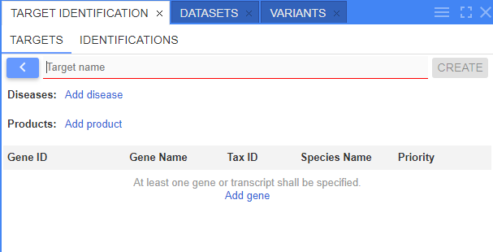
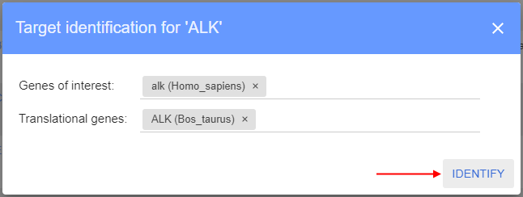

# Release Notes v2.8.0

- [Target identification](#target-identification)

## Target identification

One of purposes of the genomic researches - search and identification of potential therapeutic drug targets and target-disease associations.  
It is a laborious and long process, and at the beginning of it, there is the collection of a large amount of information about the target.  
The collection of information about the target is called target identification.

Now, users have the ability to collect identification about targets of interest (genes), store this information and allow to view/update it from NGB.

To view target identifications - open the corresponding panel:  
    

**Target identification** panel includes sub-tabs:  
    

- **Targets** (_opened by default_) - sub-panel where user can manage targets
- **Identifications** - sub-panel where user can view and manage target identification reports

**Targets** management sub-tab contains the following objects:

- Table of previously created (added) targets
- Button to add a new target

To create a new target, user shall:

- click the "**Add +**" button at the **Targets** sub-panel.
- fill-in the following form that will appear:  
    
- specify the target name and add desired number of genes/transcripts, e.g.:  
    
- specify disease(s)and product(s) associated with the target, e.g.:  
    
- once all desired values are added - user shall click the **Save** button. Just created target will appear in the targets list:  
    

To launch a new identifying process, user shall:

- find the target in the **Targets** table and click the button to launch identification process, e.g.:  
    
- in the appeared pop-up, specify:
    - _species of interest_ - list of species of interest. Corresponds to species for which gene (target) the identification will be performed
    - _translational species_ - list of species to which the gene comparison shall be performed during the identification  
    
- once the identifying process is finished, the **Identifications** sub-tab will be automatically opened with the identification results (report):  
    

Identification report form contains:

- Target name
- List of _species of interest_ and list of _translational species_ used for the identification
- Set of tiles that represents report summary
- For each block from the summary, there is an expandable corresponding section under the tiles section. Such sections contain detailed info of the target identification.

Report sections:

- _Description block_ - contains overview of the main target gene with link(s) to the source(s) from which the description is
- _Known drugs block_ - contains info about associated diseases to the target gene(s) and count of known drugs - drugs with investigational or approved indications targeting the current target gene(s)
- _Sequences block_ - contains sequence(s) corresponding to the target and its _species of interest_
- _Comparative genomics block_ - contains info about about target's homologous genes
- _Structure block_ - contains structure models of the target gene(s)/transcription(s)
- _Bibliography block_ - contains references corresponding to publications, literature, articles that mentioned the target gene(s) in the _species of interest_

For details see [here](../../user-guide/target-identification.md).
