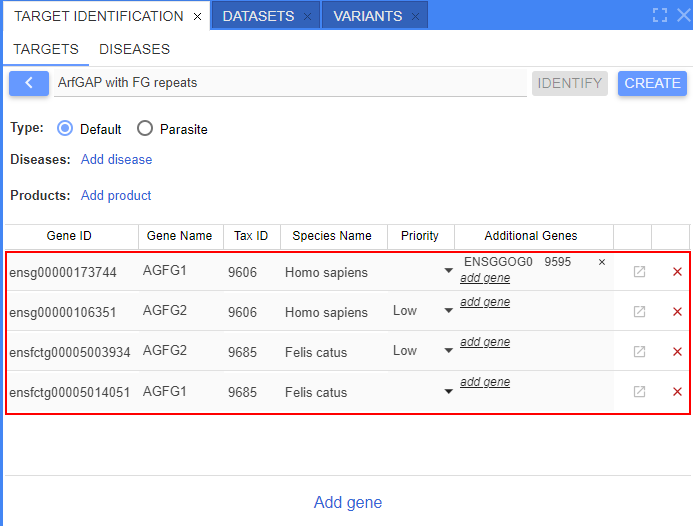
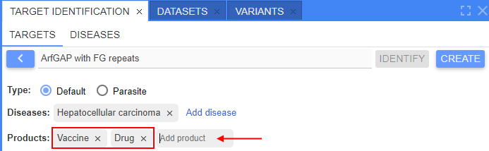
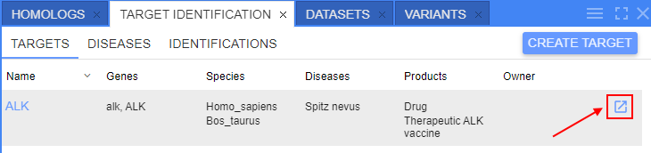

# Release Notes v2.8.0

- [Target identification](#target-identification)
    - [Diseases search](#diseases-search)

## Target identification

One of purposes of the genomic researches - search and identification of potential therapeutic drug targets and target-disease associations.  
It is a laborious and long process, and at the beginning of it, there is the collection of a large amount of information about the target.  
The collection of information about the target is called target identification.

Now, users have the ability to collect identification about targets of interest (genes), store this information and allow to view/update it from NGB.

To view target identifications - open the corresponding panel:  
    

**Target identification** panel includes sub-tabs:  
    

- **Targets** (_opened by default_) - sub-panel where user can manage targets
- **Identifications** - sub-panel where user can view and manage target identification reports
- **Diseases** - sub-panel where user can search for drugs and targets associated with a specific disease

**Targets** management sub-tab contains the following objects:

- Table of previously created (added) targets
- Button to add a new target

To create a new target, user shall:

- click the "**Create target**" button at the **Targets** sub-panel.
- fill-in the following form that will appear:  
    
- specify the target name and add desired number of genes/transcripts, e.g.:  
    
- specify disease(s)and product(s) associated with the target, e.g.:  
    
- once all desired values are added - user shall click the **Create** button. Just created target will appear in the targets list:  
    

To launch a new identifying process, user shall:

- find the target in the **Targets** table and click the button to launch identification process, e.g.:  
    
- in the appeared pop-up, specify:
    - _genes of interest_ - list of genes of interest. Corresponds to species for which gene (target) the identification will be performed
    - _translational genes_ - list of genes to which the gene comparison shall be performed during the identification  
    
- once the identifying process is finished, the **Identifications** sub-tab will be automatically opened with the identification results (report):  
    

Identification report form contains:

- Target name
- List of _genes of interest_ and list of _translational genes_ used for the identification
- Short overview (description) of the main target gene
- Set of expandable sections - these sections contain detailed info of the target identification
- Buttons to save and to export the report

Report sections:

- _Description block_ - overview of the main target gene with link(s) to the source(s) from which the description is
- _Known drugs block_ - info about drugs with investigational or approved indications targeting the current target gene(s)
- _Associated diseases_ - info about associated diseases to the target gene(s)
- _Sequences block_ - sequence(s) corresponding to the target and its _species of interest_
- _Comparative genomics block_ - info about about target's homologous genes
- _Structure block_ - structure models of the target gene(s)/transcription(s)
- _Bibliography block_ - references corresponding to publications, literature, articles that mentioned the target gene(s) in the _species of interest_
- _Patents block_ - section that allows to search and view patented protein sequence(s) and chemicals associated with the target

For details see [here](../../user-guide/target-identification.md).

### Diseases search

Additionally, the ability for users to search for drugs and targets associated with a specific disease is implemented - via the separate sub-tab **Diseases** of the **Target identification** panel:  
    

To start the search, user shall specify disease name or its part to the input field.  
Search results will be suggested in the Google-like manner - with appearing of suitable values during the disease name input, e.g.:  
    

Once the desired disease is found, the following form with results will appear, e.g.:  
    

Report form contains:

- found disease info block:
    - name
    - list of synonyms of the found disease
    - description
- set of expandable sections. There are:
    - _Known drugs_ - section with the information about drugs with investigational or approved indications for the current disease
    - _Associated targets_ - section with the information about targets associated with the current disease

For details see [here](../../user-guide/target-identification.md#diseases-search).
