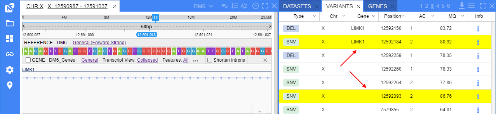

# Release Notes. 2021-09

- [Ability to highlight variants of interest](#ability-to-highlight-variants-of-interest)
- [BLAST search](#blast-search)
- [Genes panel](#genes-panel)
- [Other](#other)
- [Bug fixes](#bug-fixes)

## Ability to highlight variants of interest

VCF files may include a large number of variants and it might be helpful to highlight variants of interest based on specific values of their attributes.

Now, system admin can create/edit the special JSON-file (`interest_profiles.json`) where a list of condition profiles is being described.  
Each profile in that file contains an own set of conditions based on the variant attributes. For a condition, the color is being specified.

At the GUI, any user can enable the highlight feature from the **Settings** (**VCF** tab) and select any profile from the described file:  
  

In the variants table, if the variant is satisfy to the certain condition of the selected profile - variant row will be highlighted in that condition color:  
  

Also at the VCF track, if the variant is satisfy to the certain condition of the selected profile - this variant will be highlighted in that condition color:  
  

For more details see [here](../../user-guide/overview.md#highlight-variants-of-interest).

## BLAST search

Now, users have the ability to perform [BLAST](https://blast.ncbi.nlm.nih.gov/Blast.cgi) Search from the NGB.  
This allows to search nucleotide/amino acid sequences over BLAST databases and view the corresponding results.  
BLAST databases should be previously uploaded into NGB (this could be as downloaded NCBI [databases](https://github.com/ncbi/blast_plus_docs#blast-databases) or custom ones).

Ways to start setup the BLAST search:

- by the context menu at any genomic feature (except variants) in the "**Browser**" panel:  
  
- or manually open the **BLAST** panel from the **Views** menu:  
  

Once the BLAST panel is opened, user should specify desired parameters and click the **Search** button:  
  

All BLAST search tasks are displayed at the **History** sub-tab of the **BLAST** panel.  
This sub-tab is being opened automatically after the search starts:  
  

User can open any finished task by click its row and view the BLAST search results.  
BLAST search results contain **Sequences table** - aggregated results grouped by their sequences.  
This form is being opened in the same sub-tab (**History**), e.g.:  
  

User can click any row in the **Sequence table** and the form with details about all matches (alignments) of the search query to the certain sequence will be opened.  
This form is being opened in the same sub-tab (**History**) as well, e.g.:  
    
  

User can view any found match (alignment) at the separate track in the "**Browser**" panel.  
To open the visualization track, user should click the "_View at track_" link near the match in the "**Alignments info**" form:  
    
  

For more details see [here](../../user-guide/overview.md#blast-panel).

## Genes panel

A new panel was added to NGB - the **Genes** panel.  
This panel displays a list of genes/transcripts/exons and other features of the current dataset (from corresponding GFF/GTF and GenBank files) in a tabular view.  
  

By default in the panel, only the following columns are shown:

- _Chr_ - chromosome/sequence name
- _Name_ - feature name
- _Id_ - feature ID
- _Type_ - feature type
- _Start_ - start position of the feature on the chromosome/sequence
- _End_ - end position of the feature on the chromosome/sequence
- _Strand_ - feature strand
- _Info_ - button to open the certain feature full info

Users can display or hide extra columns - from the list appeared by click the _hamburger_ icon in the panel header:  
    
There are two types of additional columns in this list:

- mandatory feature fields from origin gene files (_Feature_, _Frame_, _Gene_, _Score_, _Source_) are shown as is
- optional feature attributes from the "**Attributes**" column of the origin gene files are shown in format `<Attribute_name> (attr)`  

Table supports sorting, pagination and the feature of the downloading the shown data to the local workstation.

To view the full feature info - user can click the corresponding button and view the info in the separate pop-up:  
  

Additionally, users can modify gene/feature attributes shown in the **Genes** panel via the GUI.  
These changes will be saved in NGB and will be available to all other users, but they don't touch the original GENE files:  
    
    
User can modify (add/edit/remove) the attribute values manually for any gene/feature from the GENES panel and save changes:  
  

Performed changes can be viewed in the **Genes** panel:  
  

Also, the changes history (what was changed, when and by whom) can be viewed at the special tab of the feature **Info** pop-up:  
  

For more details see [here](../../user-guide/overview.md#genes-panel).

***

## Other

***

## Bug fixes

### ...
