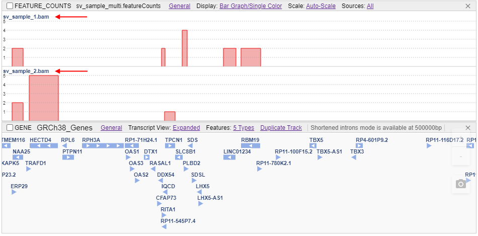
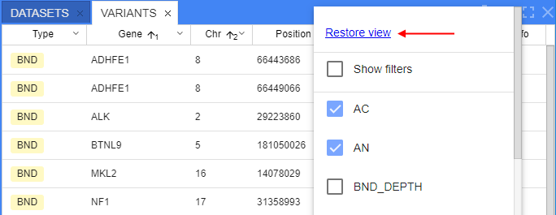

# Release Notes. 2021-09

- [Ability to highlight variants of interest](#ability-to-highlight-variants-of-interest)
- [BLAST search](#blast-search)
- [Genes panel](#genes-panel)
- [Homologs search](#homologs-search)
- [Other](#other)
    - [FeatureCounts support](#featurecounts-support)
    - [GenBank support](#genbank-support)
    - [Customize gene tracks](#customize-gene-tracks)
    - [Notifier about zoom level](#notifier-about-zoom-level)
    - [Restore panel view](#restore-panel-view)
    - [Download table data](#download-table-data)
    - [Sessions sharing](#sessions-sharing)
    - [Molecular viewer enhancements](#molecular-viewer-enhancements)
- [Bug fixes](#bug-fixes)

## Ability to highlight variants of interest

VCF files may include a large number of variants and it might be helpful to highlight variants of interest based on specific values of their attributes.

Now, system admin can create/edit the special JSON-file (`interest_profiles.json`) where a list of condition profiles is being described.  
Each profile in that file contains an own set of conditions based on the variant attributes. For a condition, the color is being specified.

At the GUI, any user can enable the highlight feature from the **Settings** (**VCF** tab) and select any profile from the described file:  
  

In the variants table, if the variant is satisfy to the certain condition of the selected profile - variant row will be highlighted in that condition color:  
  

Also at the VCF track, if the variant is satisfy to the certain condition of the selected profile - this variant will be highlighted in that condition color:  
  

For more details see [here](../../user-guide/overview.md#highlight-variants-of-interest).

## BLAST search

Now, users have the ability to perform [BLAST](https://blast.ncbi.nlm.nih.gov/Blast.cgi) Search from the NGB.  
This allows to search nucleotide/amino acid sequences over BLAST databases and view the corresponding results.  
BLAST databases should be previously uploaded into NGB (this could be as downloaded NCBI [databases](https://github.com/ncbi/blast_plus_docs#blast-databases) or custom ones).

Ways to start setup the BLAST search:

- by the context menu at any genomic feature (except variants) in the "**Browser**" panel:  
  
- or manually open the **BLAST** panel from the **Views** menu:  
  

Once the BLAST panel is opened, user should specify desired parameters and click the **Search** button:  
  

All BLAST search tasks are displayed at the **History** sub-tab of the **BLAST** panel.  
This sub-tab is being opened automatically after the search starts:  
  

User can open any finished task by click its row and view the BLAST search results.  
BLAST search results contain **Sequences table** - aggregated results grouped by their sequences.  
This form is being opened in the same sub-tab (**History**), e.g.:  
  

User can click any row in the **Sequence table** and the form with details about all matches (alignments) of the search query to the certain sequence will be opened.  
This form is being opened in the same sub-tab (**History**) as well, e.g.:  
    
  

User can view any found match (alignment) at the separate track in the "**Browser**" panel.  
To open the visualization track, user should click the "_View at track_" link near the match in the "**Alignments info**" form:  
    
  

For more details see [here](../../user-guide/overview.md#blast-panel).

## Genes panel

A new panel was added to NGB - the **Genes** panel.  
This panel displays a list of genes/transcripts/exons and other features of the current dataset (from corresponding GFF/GTF and GenBank files) in a tabular view.  
  

By default in the panel, only the following columns are shown:

- _Chr_ - chromosome/sequence name
- _Name_ - feature name
- _Id_ - feature ID
- _Type_ - feature type
- _Start_ - start position of the feature on the chromosome/sequence
- _End_ - end position of the feature on the chromosome/sequence
- _Strand_ - feature strand
- _Info_ - button to open the certain feature full info

Users can display or hide extra columns - from the list appeared by click the _hamburger_ icon in the panel header:  
    
There are two types of additional columns in this list:

- mandatory feature fields from origin gene files (_Feature_, _Frame_, _Gene_, _Score_, _Source_) are shown as is
- optional feature attributes from the "**Attributes**" column of the origin gene files are shown in format `<Attribute_name> (attr)`  

Table supports sorting, pagination and the feature of the downloading the shown data to the local workstation.

To view the full feature info - user can click the corresponding button and view the info in the separate pop-up:  
  

Additionally, users can modify gene/feature attributes shown in the **Genes** panel via the GUI.  
These changes will be saved in NGB and will be available to all other users, but they don't touch the original GENE files:  
    
    
User can modify (add/edit/remove) the attribute values manually for any gene/feature from the GENES panel and save changes:  
  

Performed changes can be viewed in the **Genes** panel:  
  

Also, the changes history (what was changed, when and by whom) can be viewed at the special tab of the feature **Info** pop-up:  
  

For more details see [here](../../user-guide/overview.md#genes-panel).

## Homologs search

Now, users can search for the homologous genes (similar genes in other species).  
The search is being performed in the inner copy of [`NCBI Homologene`](https://www.ncbi.nlm.nih.gov/homologene/) database or in uploaded custom databases.

To start the search of homologous genes user should click the gene of interest (at any GENE track or at the **Genes** panel) and select the item "**Show similar genes**" in the context menu, e.g.:  
  

After, the search in the inner copy of NCBI Homologene database will be performed using the gene name and the current species.  
**Homologs** panel with aggregated search results will be opened automatically:  
  

This panel contains two sub-tabs:

- "**Homologene**" (_opened by default_) - for displaying search results of gene homologs from the NCBI Homologene database
- "**Orthologs & paralogs**" - for displaying search results of gene orthologs and paralogs from the corresponding NCBI Database (`NCBI Orthologs`) and/or inner NGB databases

Click any row in the **Homologene** sub-tab to open details of the certain Homologene record:  
    
  

Click any domain in the details table and a tooltip will appear with a full "legend" of the corresponding gene domains:  
  

You can also open the "**Orthologs & paralogs**" sub-tab to view the search results over orthologs and paralogs NGB databases (NCBI Orthologs or custom ones), e.g.:  
  

In this sub-tab, you also can click the row to view details:  
  

For more details see [here](../../user-guide/overview.md#homologs-panel).

***

## Other

### FeatureCounts support

Now, NGB supports [FeatureCounts](http://bioinf.wehi.edu.au/featureCounts/) file format registration and displaying.

FeatureCounts file is being parsed into GFF format during the registration.

FeatureCounts tracks are being displayed in the way similar to GENE tracks, but here only genes and exons are displayed:  
  

Also, these files can be displayed in "_Bar Graph_" mode - as histograms:  
  

For displayed bars, color scheme and scale modes can be configured:  
  

In case of several source inputs (several alignment files) for the FeatureCounts file, at the FeatureCounts track several sub-tracks are shown - a single sub-track for each source SAM/BAM file:  
  

For more details see [here](../../user-guide/tracks-featurecounts.md).

### GenBank support

Now, NGB supports the uploading, registration and displaying of [**GenBank**](https://www.ncbi.nlm.nih.gov/Sitemap/samplerecord.html) files.  
GeneBank file can be loaded to NGB in 2 ways:

- as reference file with annotations. In this case NGB reads GeneBank file, convert it to 2 separate files - FASTA and GTF, and register these files as reference and gene files
- as gene annotation file to an existing reference. In this case NGB converts only features data from the GeneBank file into GTF file and register this file as gene annotation file

Visualization of GenBank gene tracks differs from the general ones - features are shown as separate rectangles (or triangles at insufficient zoom). Each feature has name and strand. Each feature type has its own color:  
  

For more details see [here](../../user-guide/tracks-genes.md#genbank-genes-visualization).

### Customize gene tracks

If the GENE file has more than one feature type - user can customize the view of the GENE track:

- show/hide certain feature types via the **Features** sub-menu in the GENE track header:  
    
    
  For details see [here](../../user-guide/tracks-genes.md#features-selector).
- create a "duplicate" of the GENE track with only certain feature type enabled (other feature types are hidden by default):  
    
    
  For details see [here](../../user-guide/tracks-genes.md#duplicate-track).

### Notifier about zoom level

At a large scale (e.g. whole chromosome view) GENE/BED track is shown as histogram.  
This may be misleading for some users.

Now, when a GENE/BED track at histogram view is opened a tooltip with notification appears:  
  

User can close it by the cross-button or just zoom-in till the medium level appears and this tooltip will disappear.  
To not show such notification again - user should set the corresponding checkbox.

### Restore panel view

In the current version, the ability to restore default view of the tables in VARIANTS and GENES panels was implemented.  
For that, a new item was added into the options context menu of the panels:  
    
  

By click this item, the corresponding table will be restored to its default view:

- all extra-columns will be hidden
- default columns will be shown (with their default order)
- all configured sortings and filters will be reseted

### Download table data

Users can filter and/or sort the table data in **GENES** or **VARIANTS** panel as they wish.  
In some cases, these "customized" data may be helpful in further work.  

Therefore in the current version, to the **GENES** and **VARIANTS** panels the ability to download data was added.  
User can select the format for the file and set whether the header should be included to the downloading file:  
  

Once the setup is finished, user should click the **Download** button. Table will be downloaded automatically:  
  

The downloaded table will contain only the same data that was displayed in the table before the download (considering all filters and sortings).

For details see [here](../../user-guide/overview.md#download-the-variants-table-data).

### Sessions sharing

Previously, saved sessions were stored locally. But in some cases, it would be convenient for the users to have the ability to give access for a session to other users - i.e. to share the session.  
In this version, such ability is implemented.  
Now, if the user save a session - it will be accessible to all other users that have access to the files of this session. Sessions are stored globally.

Additionally, the ability to specify a description for the session appeared (not only session name):  
  

To the sessions table new columns were added - _Description_, _Reference_, _Owner_ (for the user who saved the session):  
  

### Molecular viewer enhancements

In the current version, the Molecular viewer functionality was expanded by the following features:

- ability to change the view (display) mode for the model
- ability to change the color scheme for the model

For that, new items were added in the right-upper corner of the model form:  
  

To change the view (display) mode - you can select one of the accessiblee variants:  
  

To change the color scheme - you can select one of the accessiblee variants:  
  

***

## Bug fixes

### ...
