# BLAST search

- [Search history](#search-history)
- [Search results](#search-results)
- [Alignments info](#alignments-info)
- [View alignment at track](#view-alignment-at-track)
- [Search from track](#search-from-track)

Via **BLAST Search** panel users can perform [BLAST](https://blast.ncbi.nlm.nih.gov/Blast.cgi) search nucleotide/amino acid sequences over BLAST databases and view the corresponding results.  
BLAST databases should be previously uploaded into NGB (this could be as downloaded NCBI [databases](https://github.com/ncbi/blast_plus_docs#blast-databases) or custom ones).

The BLAST panel contains two sub-tabs:

- **Search** (_opened by default_) - to display and specify search settings, and also start a new search
- **History** - to display the history of searches

To start the search, user should specify:

1. The BLAST **Tool** that will be used for the search. Only one tool can be selected:  
  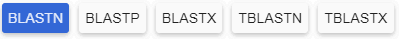
    - `blastn` (_default_) - for the search over nucleotide databases using a nucleotide query
    - `blastp` - for the search over protein databases using an amino acid query
    - `blastx` - for the search over protein databases using a translated nucleotide query
    - `tblastn` - for the search over translated nucleotide databases using an amino acid query
    - `tblastx` - for the search over translated nucleotide databases using a translated nucleotide query
2. **Query sequence**, e.g.:  
  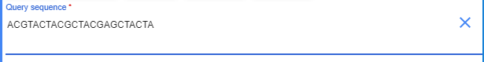
3. The search **Task title** (_optionally_). In this field, user may specify the title for the current search operation - to easier find it later, e.g.:  
  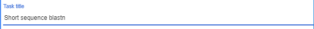
4. Search "set". Here user should specify where the search should be performed:
    - **Database** - dropdown list to select the BLAST database (one from the list of all uploaded databases). The list of databases corresponds one of the types - protein or nucleotide. This type is defined by the selected tool type at the tool selector: for `blastn`, `tblastn`, `tblastx` - nucleotide databases are being displayed, for `blastp`, `blastx` - protein databases are being displayed
    - **Organism** (_optionally_) - dropdown list to select/specify the species for which the search should be performed. Multi-select is supported.
        - Separately, user can set the certain checkbox next to the **Organism** field to exclude specified organism(s) from the list for which the search will be performed
    - **Algorithm** - dropdown list to select algorithms available for the current BLAST tool. Use the _info_ icon next to that dropdown list to view a short help  
    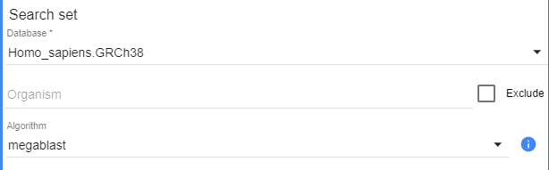
5. **Additional parameters** - collapsible section to specify additional "technical" BLAST parameters that should be used for the search. Expanded view of that section:  
    
  Here:
    - **Max target sequences** - field to set the maximum number of aligned sequences to display in results (CLI BLAST option `max_target_seqs`)
    - **Expect threshold** - field to set expect value for saving hits (CLI BLAST option `evalue`)
    - **Options** (_optionally_) - field to specify additional BLAST options in CLI style. If user will try to specify such options in incorrect format or with incorrect names - they will be ignored during the search. To view the full list of supported options use the _info_ icon next to that field  
    **_Note_**: **Max target sequences** and **Expect threshold** settings have _default_ values. I.e. if user doesn't forcibly specify values for these parameters (e.g., even doesn't expand the "**Additional parameters**" section) - their default values shall be used for the search

Once the BLAST search setup is finished - click the **Search** button to start:  
  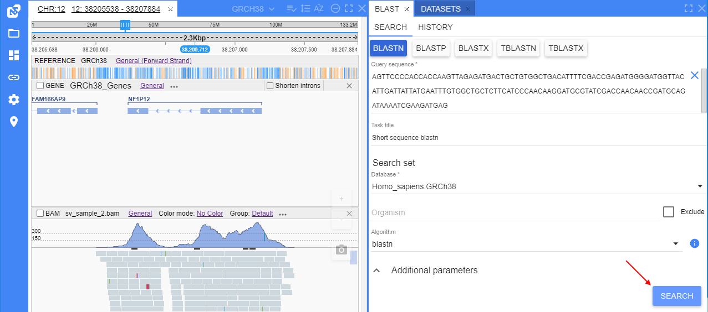

## Search history

Since the BLAST search can take a long time, the results are not displayed immediately - and for each search - a new "search task" is being created.  
The list of such tasks is displayed at the **History** sub-tab.  
This sub-tab is being opened automatically after the search starts:  
  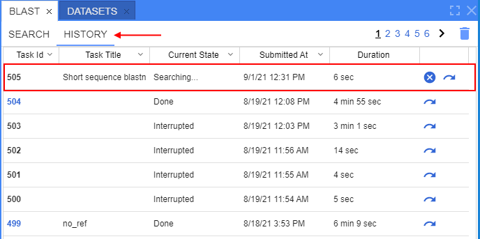  
Just-started search task is shown on the top of the tasks list.

This table contains all user's BLAST search requests.  
Here:

- **Task ID** - automatic created ID of the certain search task
- **Task title** - title of the certain search task (if it was specified before the search)
- **Current state** - status of the search task:
    - _Searching_ - for task being performed at the moment. All new tasks get this status by default
    - _Done_ - for task successfully finished
    - _Interrupted_ - for task canceled during the searching
    - _Failure_ - for failed task (task finished with errors)
- **Submitted at** - date and time when the certain search was started
- **Duration** - duration of the certain search task
- block of the controls near each request:
    - button to cancel search . This button allows to break the search and change the state of that task to "_Interrupted_". _Note_: available only for the task that is being currently performed
    - button to re-open the search setup . This button allows to open the **Search** setup sub-tab and set the search parameters in the same values as they were in the current request
- Clear history button  at the top of the tab - to clear all BLAST search history

Table supports sorting by any column (except **Duration**).  
Table has the auto-refresh every 5 sec (only if the sub-tab is opened).  
If the certain search is finished, its state changes to _Done_ and task ID becomes a hyperlink.  User can click such hyperlink (or just a row) to open the corresponding search results, e.g.:  
  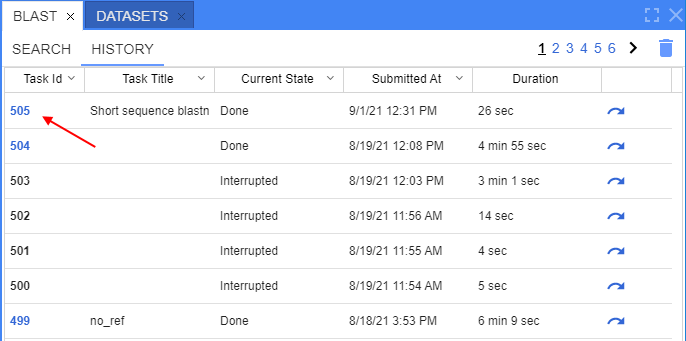  

## Search results

Search results will be opened in the same tab (**History**):  
  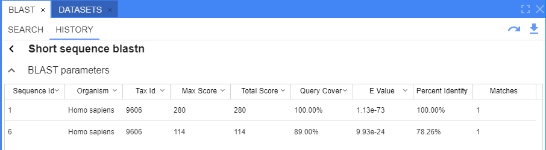

This table contains:

- **Back** button (near the search task title) - to hide current results and return to the search history view:  
  
- Header with the opened search task title (if it was specified before the search)
- BLAST parameters collapsible section (_collapsed by default_). This section contains details of the opened search:  
  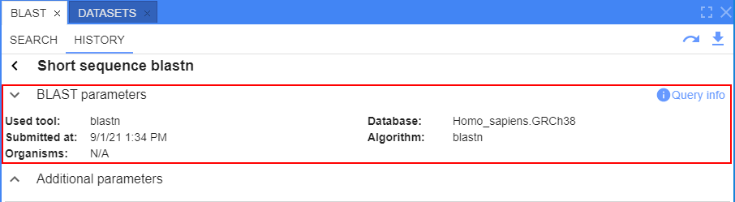  
    - **Query info** button - to open the search query details (sequence and its length), e.g.:  
    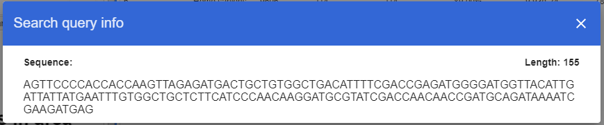  
    - **Additional parameters** section - collapsible section where user can view additional "technical" BLAST parameters that were used for the search:
    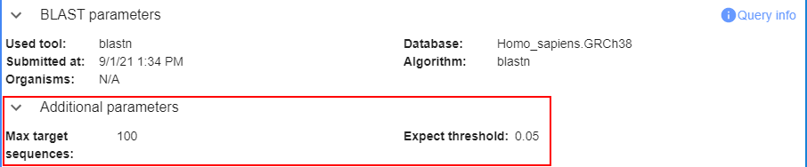
- Block of additional buttons at the right-upper corner of the form:
    - button to re-open the search setup  - to open the the **Search** setup sub-tab and set the search parameters in the same values as they were in the current request
    - button to download results  - to download full BLAST search results (raw) as CSV file to the local workstation
- **Sequences table** - to show the search results summary grouped by sequences:  
  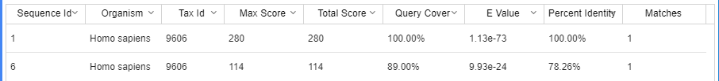

**Sequences table** contains BLAST search aggregated results grouped by their sequences.  
Table contains the following columns:

- _Sequence ID_ - IDs of the sequences in which hits were found
- _Organism_ - organism specified in the sequence
- _Tax ID_ - taxonomy ID specified in the sequence
- _Max score_ - the highest alignment score from all matches of the search query to the certain sequence
- _Total score_ - sum of alignment scores from all matches of the search query to the certain sequence
- _Query cover_ - the percent of the query length that is included in the aligned segments
- _E value_ - the number of alignments expected by chance with the calculated score or better. By this column the default sorting is set (ascending)
- _Percent identity_ - the highest percent identity for a set of aligned segments to the same subject sequence
- _Matches_ - number of matches of the search query to the certain sequence

Maximal count of rows in this table is defined by **Max target sequences** parameter that is specified before the search.  
User have the ability to sort this table by any column and manually configure the column order.

## Alignments info

User can click any row in the **Sequence table** and the form with details about all matches (alignments) of the search query to the certain sequence will be opened.  
This form is being opened in the same tab (**History**), e.g.:  
  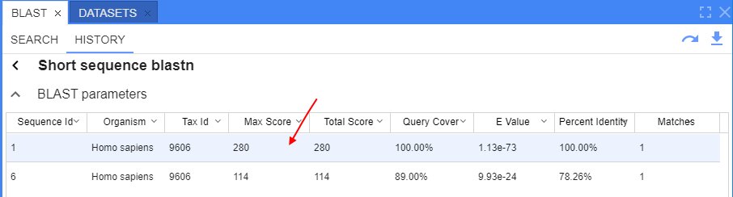  
  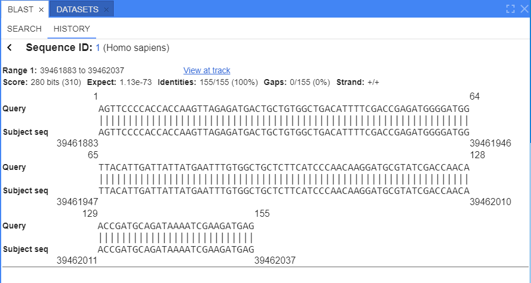

This form contains:

- **Back** button - to hide the **Alignments info** form and return to the **Sequences table** view:  
  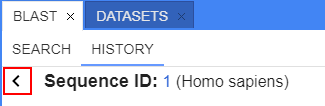
- **Sequence ID**. ID is a hyperlink:
    - if the search was performed on the NCBI database - this hyperlink opens a corresponding sequence page on NCBI
    - if the search was performed on the "custom" database - this hyperlink opens a corresponding reference and its chromosome (to which this sequence belongs) in the "**Browser**" panel
- Details about all matches of the search query to the current sequence (match blocks)

Each match block contains:

- _Range_ - positions of the current sequence where the match is defined
- "_View at track_" link - hyperlink to view the certain match (alignment) to the current sequence. This hyperlink is visible only for those sequences which references are in NGB databases
- _Score_ and _bit-score_, _Expect_ value (E-value)
- Count of _Identities_ between sequences (by symbols) and its percent value
- Count of _Gaps_ (by symbols) and its percent value
- _Strands_ of each sequence (query and subject) - only for nucleotide sequences
- block with the conventional figure of the query string alignment to the current sequence segment:  
    - start and end position of the query string segment
    - aligned query string segment
    - start and end position of the current sequence segment
    - the current sequence segment to which the query string segment was aligned
    - symbols that "link" the corresponding letters in both sequences:
        - straight line (`|`) if letters are equal
        - nothing (empty) if letters are not equal (mismatch)
        - minus symbol (`-`) in any sequence - for gaps

## View alignment at track

User can view any found match (alignment) at a track (graphic visualization) in the "**Browser**" panel. **_Note_**: it is possible only for those sequences which references are in NGB databases.  
To open the visualization track, user should click the "_View at track_" link near the match in the "**Alignments info**" form:  
  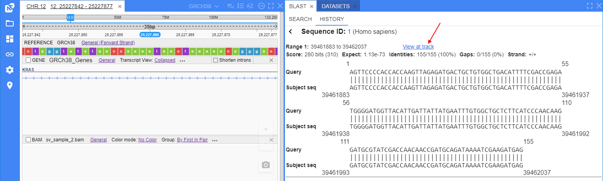  
  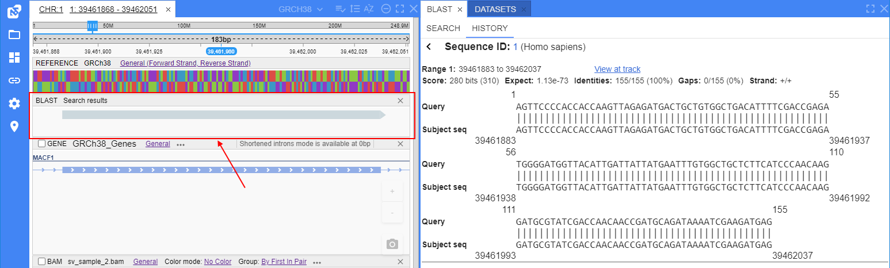

Opened alignment is shown at the separate track.  
Track is being displayed in the similar manner as a single read at the [Alignment](tracks-bam.md) track in the "Browser":  

- query matches - shown as a gray line by width of aligned matches
- query strand - shown as an arrow on the edge of the query line
- mismatches - shown as separate color rectangles with the corresponding letters
- gaps in sequence - shown as insertions (a perpendicular violet line in the gap position)
- gaps in query - shown as deletions (a black line linked two "separate" parts of the query)
- additionally, near the each end of the query line at the track, are conventionally shown counts of the query positions that were not aligned to sequence

Example:  
  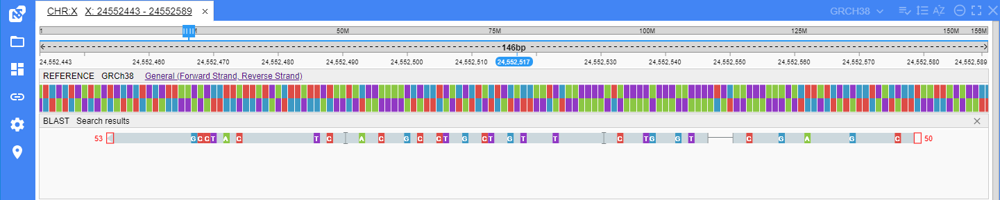

If there are several matches (alignments) were found for the same sequence - they all will be shown at that track, e.g.:  
  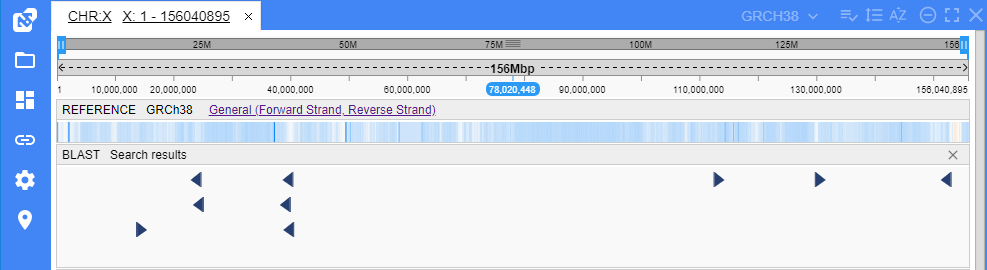

> Please note, that described behavior is valid only for searches over _nucleotide_ sequences.  
> Visualization for searches over _amino acid_ sequences does not show exact location of the alignment. In such cases, only whole gene feature is highlighted instead.  
> 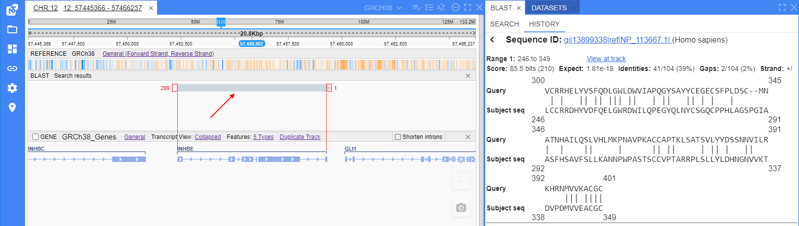

## Search from track

Users have the ability to start BLAST Search from the genomic feature via the "**Browser**" panel as well.

To prepare the search in such way, user shall just click a read (or any other feature) at a track and select any "**BLAST search**" option (`BLASTn` or `BLASTp`) from the context menu, e.g.:  
  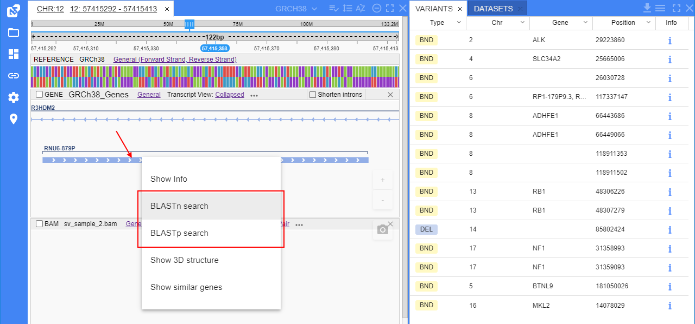

After that, the BLAST panel will be opened. Also, some default values will be set:

- if user selected "**BLASTn Search**" option, at the "**BLAST**" panel:
    - `blastn` tool type will be selected
    - the corresponding _nucleotide_ sequence (according to the selected in GUI) will appear in the **Query sequence** field
- if user selected "**BLASTp Search**" option, at the "**BLAST**" panel:
    - `blastp` tool type will be selected
    - the corresponding _amino acids_ sequence (according to the selected in GUI) will appear in the **Query sequence** field

Example for the gene at the picture above when the "**BLASTn Search**" option was selected:  
  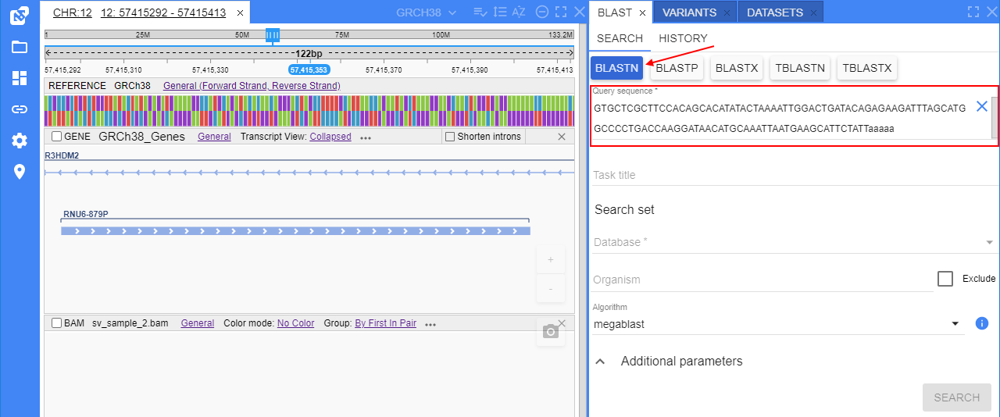

> **_Note_**: this feature has a number of limitations. If the BLAST search can not be performed from the context menu (due to some restrictions) - the corresponding item will be disabled and a short info with a reason will be shown. E.g. if the read/feature/gene selected at the GUI for the search is too large to be inserted into the **Query sequence** field:  
> 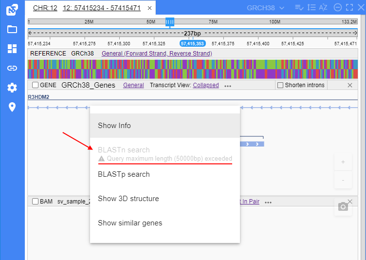
