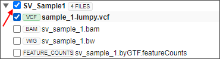
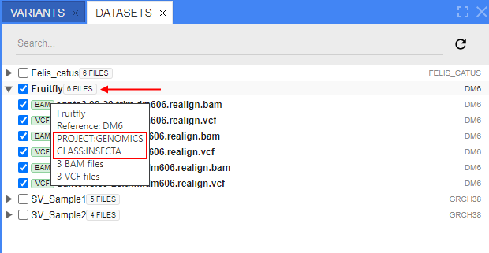
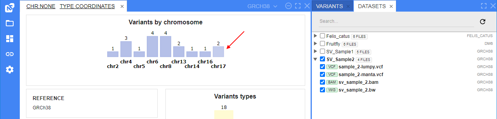
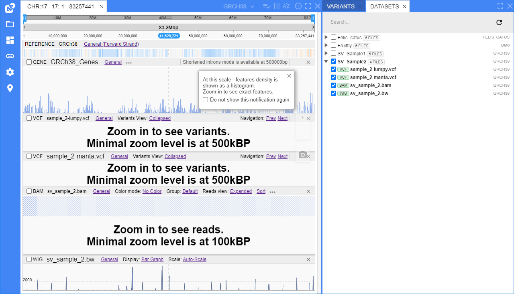

# Working with datasets

- [Viewing datasets](#viewing-datasets)
    - [Default dataset view](#default-dataset-view)
        - [Summary view](#summary-view)
        - [Description view](#description-view)
        - [Change view](#change-view)
    - [Download original files](#download-original-files)
    - [Metadata](#metadata)
- [Viewing tracks](#viewing-tracks)

## Viewing datasets

A dataset is a group of files that are linked together in one category.  
Datasets could be arranged into hierarchy.

When NGB is opened, you will see a list of datasets in the **Datasets** panel to the right:  
    

Grouped items can be expanded/collapsed, using an arrow icon next to a group name.

Each item in the datasets hierarchy shows corresponding genome name (e.g. `GRCh38`, `hg19`). It is located to the right from the items name.

Each file item in the hierarchy shows its type (e.g. BAM, VCF, WIG, BED, etc.) to left from the file's name.

Data can be opened:

- by clicking a checkbox next to a dataset name - this will open all files, contained in a dataset:  
      
    
- by clicking a checkbox next to a specific file - this will open only the selected file and the dataset object (reference with annotation):  
      
    

Data can be closed:

- by unselecting the dataset itself (unsetting the checkbox) - the dataset with its files will be closed:  
      
    
- by unselecting the file - the file only will be closed. If all files in the dataset are unselected in such way - only dataset object itself will stay opened (reference with annotation):  
      
    

> **_Note_**: the NGB has a restriction for maximum allowed count of the inner dataset files that can be opened automatically at once (default value - `10`).  
> If any dataset has more files than this count and the user tries to open such dataset (by clicking a checkbox next to a dataset name) - checkbox will stay unselected, no files will be opened.  
> When hovering such dataset object - a corresponding warning about large count of files will appear in a tooltip.  
> User should expand such dataset and select necessary files manually.  
> Described rules are applied as for simple dataset and for nested datasets (in this case, a number of all files in nested datasets is being counted).
>
> If user selects manually any file in this dataset - the dataset checkbox becomes selected too but still disabled:  
> 

### Default dataset view

When you select files from datasets - you can see the following forms in the "**Browser**" panel:

#### Summary view

This view is shown if a dataset has no additional descriptions.

If the one or more VCF files were selected (as on the picture above), the **Summary** view will show the charts depicting the variations' breakdown as follows:

- by chromosomes (_to open a chromosome, click the corresponding bar of the chart_)
- by type (_click any type to view statistics only by the specific variants type_)
- by quality

If no VCF files were selected, the **Summary** view will only show the list of loaded files:  
    

#### Description view

Dataset may have an `html` description file:

- If a dataset has a description file - this file is shown in the "**Browser**" panel _by default_ when opening dataset
- This file is being attached to a dataset during its registration or can be added to the registered dataset separately
- Such file is not displayed in the datasets tree (at the "**Datasets**" panel)
    

#### Change view

You may select the view as you wish. For that, use the selector in the "**Browser**" panel header:  
    

**_Note_**: this selector is visible only if the dataset has an own description file.

### Metadata

NGB allows to attach text key-value metadata to datasets and files.  
This can be used:

- to create specific tags/labels to datasets or files
- to find datasets and files by their metadata values
- to display tags as dataset/file details (in a tooltip or the summary page)

To manage metadata for a dataset/file - right-click the desired object in the **Datasets** panel and select the "_Edit attributes item_" in the context menu:  
    

The pop-up will appear, where user can add/edit/remove attributes for the selected dataset/file.
By default, any dataset/file has no attributes:  
    

Click the **Add** button to create a new attribute. A new pair of text fields will appear - for a key and a value of the attribute being created:  
    

Then:

- specify a key and a value for a new attribute
- you can click the **Add** button again to add another attribute
- you can click the cross-button near the _Value_ field to remove the certain attribute

After all changes, click the **Save** button, e.g.:  
    

**_Notes_**:

- there is no ability to save attributes if any of them has empty key or value
- there is no ability to save several attributes for a single dataset/file with the same key (case-insensitive)

Saved attributes can be viewed:

- in a tooltip when hovering over the object:  
    
- in the **Summary** page of the dataset:  
    

Search in the dataset panel supports the search by attributes (_only by values_) as well.  
If a file/dataset is found by its attribute - near it, the label(s) of the corresponding attribute(s) appear with the selected match, e.g.:  
    

### Download original files

You can download an original file from the files tree in the **Datasets** panel - use the context menu by the right-click on the desired file:  
  

You can download files related to a dataset and invisible in the files tree (reference and annotation files) in the **Datasets** panel - use the context menu by the right-click on the dataset itself:  
  

## Viewing tracks

Some simple ways you can view the loaded tracks as follows:

- Click a chromosome's bar in the chart at the **Summary** view to open the whole chromosome scale in the "**Browser**" panel:  
      
    
- Use **unified coordinates and search control** in the header of the "**Browser**" panel to open a specific position or a feature (it can be found by the feature name):  
    
- Click a variation in the "**Variants**" panel to open this variation (load the variation's position) at the VCF track in the "**Browser**" panel:  
    
- Click a feature in the "**Genes**" panel to open this feature (load the feature's position) at the GENE track in the "**Browser**" panel:  
    

Tick or untick a track in the **Datasets** panel to toggle its visibility in the "**Browser**" panel.

Each track has the following parts:

- the **header** that contains the track's type, name and optionally track's menu and actions
- the **content** of the track  
    
