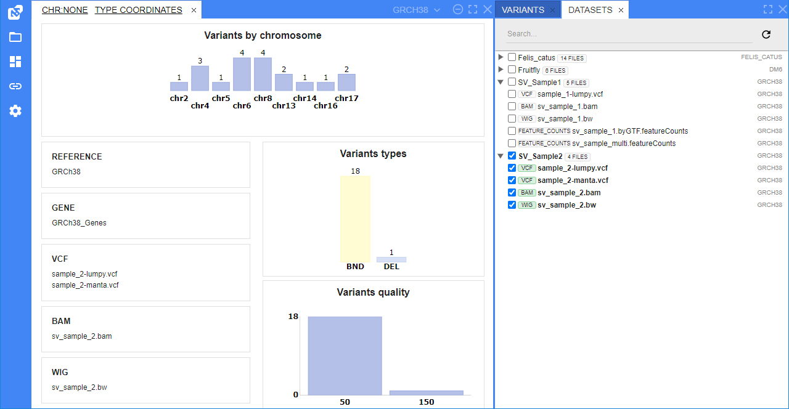
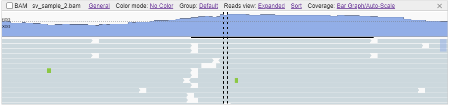

# Working with datasets
## Viewing datasets
A dataset is a group of files that are linked together in one category. Datasets could be arranged into hierarchy
When NGB is opened, you will see a list of datasets in panel to the right

Grouped items could be expanded/collapsed, using an arrow icon next to a group name

Each item in the datasets hierarchy shows corresponding genome name (e.g. GRCh38, hg19. It is located to the right from the items name)

Each file item in the hierarchy shows its type (e.g. BAM, VCF, WIG, BED, etc.) to left from the file's name

Data could opened by clicking a checkbox next to a dataset name (this will open all files, contained in a dataet) or next to a specific file

### Default dataset view
By default, you will see the following panels when you select files from datasets:

#### Summary panel
If no VCF files were selected, the **Summary** view will only show the list of loaded files.

If the one or more VCF files were selected, the **Summary** view will show the charts depicting the variations' breakdown as follows:

* by chromosomes (to open a chromosome, click on the corresponding bar of the chart)
* by type
* by quality

Charts would show statistics on variations, according to selected filter.

#### Variants panel
This panel shows a table of variations retrieved from all loaded VCF files.

#### Datasets panel
This panel shows a list of all files, loaded and visualized as tracks in the **Browser** panel.

Tick or untick a track in the **Datasets** panel to toggle its visibility.

## Viewing tracks
You can view the loaded tracks as follows:
* Click on a variation in the table (click) to open the **Browser** panel and load the variation's position (the variation's start position will open for SVs)
* Click on a chromosome's bar in the chart to open the whole chromosome scale in the **Browser** panel
* Using **unified coordinates and search control**

Depending on the selection type, you will see the visualizations as follows:
* Whole chromosome selected

* Specific variation or region selected

Each track has the following parts:
* the **header** that contains the track's type, name and optionally track's menu and actions
* the **content** of the track

