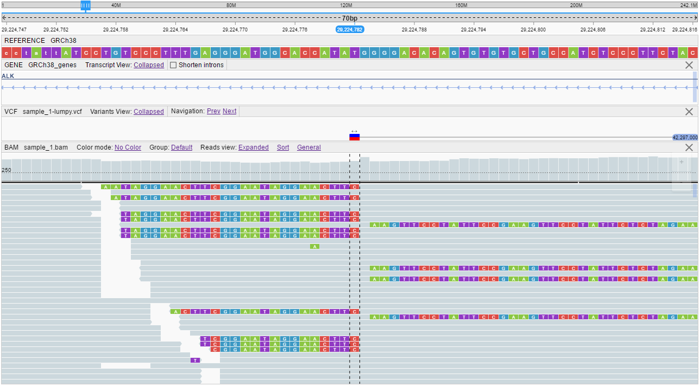
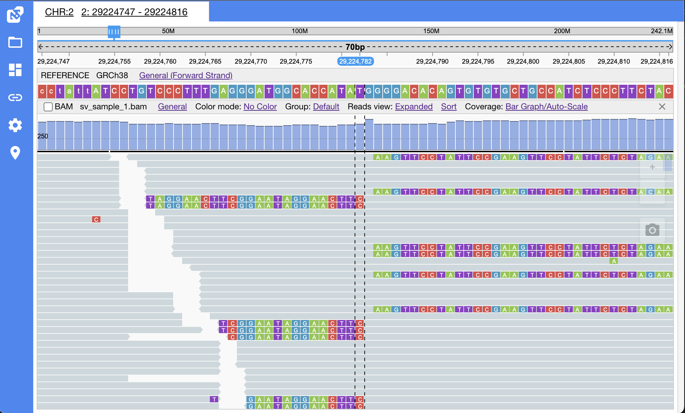
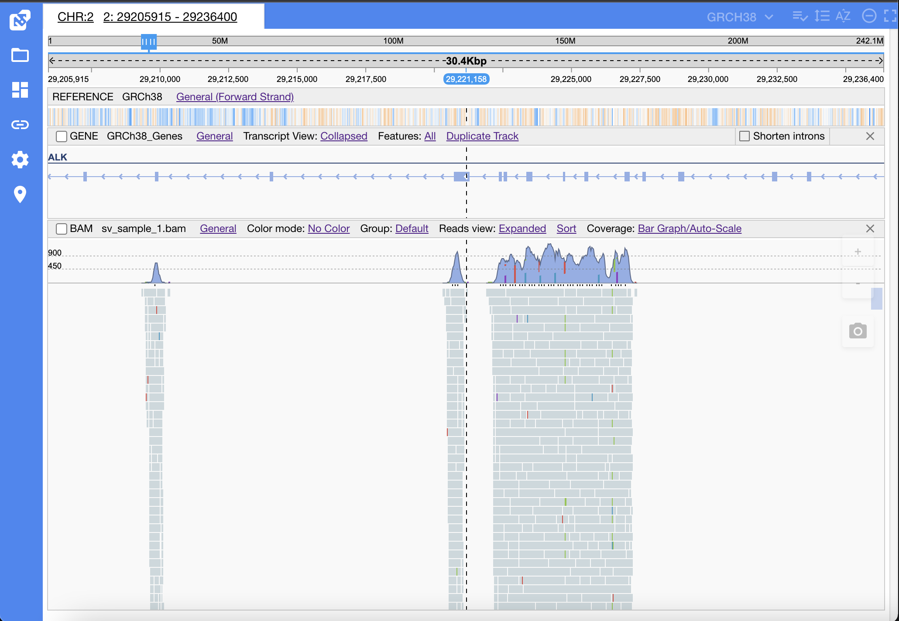

# Embedding NGB via iFrame controlled with URL

NGB could be embedded into 3rd paty web application using an iFrame approach.  
iFrame in this case should point to `http://${server}:${port}/catgenome` URL (e.g. `http://ngb.opensource.epam.com/catgenome`).

``` html
<iframe width="1024px" 
        height="768px" 
        frameborder="0"
        src="http://${server}:${port}/catgenome">
</iframe>
```

This URL would load full browser view, including all panels and toolbars.  
To manipulate apearance settings and/or specify files and genome position to be loaded by default - NGB URL supports a set of parameters

## URL format

Basic format of the NGB URL looks like the following:

```
http://${server}:${port}/catgenome/#/${genome}/${chromosome}/${start-position}/${end-position}
```

* `${server}` - NGB server name/ip-address (e.g. ngb.opensource.epam.com)
* `${port}` - NGB server port (e.g. 8080)
* `${genome}` - name of a genome to load (e.g. GRCh38)
* `${chromosome}` - name of chromosome/contig to be loaded from a specified genome (e.g. chr2). Keyword `{first-chromosome}` could be used to load first chromosome from a reference
* `${start-position}` - start of the chromosome range to show (e.g. 29224676)
* `${end-position}` - end of the chromosome range to show (e.g. 29224887)

In addition, the several optional parameters could be used to fine-tune browser view.  
They should follow basic parameters and start with a `?` symbol and delimited by `&`:

```
http://...?screenshot=${screenshotVisibility}&toolbar=${toolbarVisibility}&layout=${layout-config}&tracks=[{"b":"${file-name}","p":"${parent-dataset-name}","h":"${track-height}"]&filterByGenome=${genome}&embedded=${embedded}&controls=${controlsVisibilityConfiguration}
```

* `screenshot` - (optional) sets visibility of a *screenshot* button. Accepted values: `On`, `Off`
* `toolbar` - (optional) sets visibility of a main toolbar. Accepted values: `On`, `Off`
* `layout` - (optional) sets NGB layout: visbility of panels, their size, location, presense of headers and controls. If not specified, default settings will be used. NGB uses [Golden Layout](https://www.golden-layout.com/) for managing panels, please refer to the [Golden Layout configuration guide](https://www.golden-layout.com/docs/Config.html). Specific `layout` config also could be retrieved from **Share** menu, that will generate URL according to current layout state
* `tracks` - sets a list of tracks (files) to be loaded. This option is a JSON array of `track` objects, so its value should be arranged with square brackets and each `track` object should contain the following properties
    * `p` - name of a dataset, containing a file specified
    * `b` - (optional) name of a file. If not specified - all tracks from a specified dataset will be opened
    * `h` - (optional) height of a track to show in pixels. If not specified - default values will be used
* `filterByGenome`- (optional) filters datasets tree by a specified genome (e.g. if filterByGenome=hg19 is specified, only datasets that are mapped to hg19 will be shown in a datasets tree). Note that this option works only when `tracks` list is set
* `collapsedTrackHeaders` - (optional) sets tracks headers to be collapsed
* `embedded` - (optional) sets **embedded** mode - all panel controls (close button, maximize button etc.) will be hidden. Accepted values: `On`, `Off`
* `controls` - (optional, ignored if `embedded` mode is set) sets panel controls visibility. `controlsVisibilityConfiguration` should be a valid JSON string; possible keys:
    * `close`: panel's **Close** buttons. Accepted values: `On`, `Off`
    * `maximize`: panel's **Maximize** buttons. Accepted values: `On`, `Off`
    * `fit`: **Fit all tracks** button. Accepted values: `On`, `Off`
    * `organize`: **Organize tracks** button. Accepted values: `On`, `Off`
    * `annotations`: **Select genome annotation files** button. Accepted values: `On`, `Off`
    * `project`: **Project info** button. Accepted values: `On`, `Off`
    * `selection`: **Tracks selection** button. Accepted values: `On`, `Off`
    * `clear`: **Close all tracks** button. Accepted values: `On`, `Off`
    * `vcfcolumns` (lowercased!): **Specify VCF columns to display** button. Accepted values: `On`, `Off`
    * `vcfdownload` (lowercased!): **Download variants table** button. Accepted values: `On`, `Off`
    * `genesdownload` (lowercased!): **Download genes table** button. Accepted values: `On`, `Off`
    * `closelasttrack` or `closeLastTrack`: hide close button for the single non-reference track. Accepted values: `On`, `Off`

## Examples

### Default layout

This example URL will load NGB default layout and open `sv_sample_1.bam`, `sv_sample_1-lumpy.vcf` and `GRCH38_genes` tracks at `chr2: 29224747-29224816` position:

```
http://ngb.opensource.epam.com/catgenome/#/GRCh38/2/29224747/29224816?tracks=[{"b":"GRCh38","p":"SV_Sample1","h":20},{"b":"sv_sample_1.bam","p":"SV_Sample1","h":424}]
```


### "Browser-only" layout

This example URL will load NGB layout that is ready for embedding as a "browser-only" view and open `sv_sample_1.bam`, `sv_sample_1-lumpy.vcf` and `GRCH38_genes` tracks at `chr2: 29224747-29224816` position:

```
http://ngb.opensource.epam.com/catgenome/#/GRCh38/2/29224747/29224816?screenshot=Off&toolbar=Off&layout={"0":{"1":"0","2":"0","3":"1","t":"0","p":"1","blockedPopoutsThrowError":"0","closePopoutsOnUnload":"0","showPopoutIcon":"1","showMaximiseIcon":"0","showCloseIcon":"0","hasHeaders":"1"},"4":{"5":3,"6":50,"7":100,"8":30,"9":300,"a":200},"b":{"c":"6","d":"7","e":"8","f":"9","popin":"pop in"},"g":[{"n":"1","l":"2","k":100,"m":100,"t":"0","o":"","g":[{"l":"4","i":{"position":"center"},"k":100,"n":"0","t":"0","o":"","s":0,"g":[{"o":"Browser","l":"5","h":"angularModule","i":{"icon":"video_label","panel":"ngbBrowser","position":"center","o":"Browser","name":"layout>browser","key":"browser","htmlModule":"ngb-browser"},"n":"0","t":"0"}]}]}],"n":"0","t":"0","o":"","q":[],"maximisedItemId":{}}&tracks=[{"b":"GRCh38","p":"SV_Sample1","h":20},{"b":"GRCh38_genes","p":"SV_Sample1","h":61},{"b":"sample_1-lumpy.vcf","p":"SV_Sample1","h":41},{"b":"sv_sample_1.bam","p":"SV_Sample1","h":424}]
```



### Embedded mode

This example URL will load NGB in **embedded** mode (without panels controls):

```
http://localhost:8080/#/GRCh38/2/29224747/29224816?embedded=On&toolbar=Off&layout={"0":{"1":"0","2":"0","3":"1","t":"0","p":"1","blockedPopoutsThrowError":"0","closePopoutsOnUnload":"0","showPopoutIcon":"1","showMaximiseIcon":"0","showCloseIcon":"0","hasHeaders":"0"},"4":{"5":3,"6":50,"7":100,"8":30,"9":300,"a":200},"b":{"c":"6","d":"7","e":"8","f":"9","popin":"pop in"},"g":[{"n":"1","l":"2","k":100,"m":100,"t":"0","o":"","g":[{"l":"4","i":{"position":"center"},"k":100,"n":"0","t":"0","o":"","s":0,"g":[{"o":"Browser","l":"5","h":"angularModule","i":{"icon":"video_label","panel":"ngbBrowser","position":"center","o":"Browser","name":"layout>browser","key":"browser","htmlModule":"ngb-browser"},"n":"0","t":"0"}]}]}],"n":"0","t":"0","o":"","q":[],"maximisedItemId":{}}&tracks=[{"b":"GRCh38","p":"SV_Sample1","h":20,"projectIdNumber":1,"s":{"rt":false,"rsfs":true,"rsrs":false}},{"b":"sv_sample_1.bam","p":"SV_Sample1","h":424,"projectIdNumber":1,"s":{"a":true,"aa":true,"c":"noColor","c1":true,"d":true,"g1":"default","i":true,"m":true,"r":"1","s1":false,"s2":true,"s3":false,"v1":false,"cdm":"Bar Graph","cls":false,"csm":"default"}}]
```



You can specify panel controls visibility with `controls` option; next example loads NGB without panel's *close* button:

```
http://localhost:8080/#/GRCh38/2/29224747/29224816?controls={"close":"Off"}&toolbar=Off&layout={"0":{"1":"0","2":"0","3":"1","t":"0","p":"1","blockedPopoutsThrowError":"0","closePopoutsOnUnload":"0","showPopoutIcon":"1","showMaximiseIcon":"0","showCloseIcon":"0","hasHeaders":"0"},"4":{"5":3,"6":50,"7":100,"8":30,"9":300,"a":200},"b":{"c":"6","d":"7","e":"8","f":"9","popin":"pop in"},"g":[{"n":"1","l":"2","k":100,"m":100,"t":"0","o":"","g":[{"l":"4","i":{"position":"center"},"k":100,"n":"0","t":"0","o":"","s":0,"g":[{"o":"Browser","l":"5","h":"angularModule","i":{"icon":"video_label","panel":"ngbBrowser","position":"center","o":"Browser","name":"layout>browser","key":"browser","htmlModule":"ngb-browser"},"n":"0","t":"0"}]}]}],"n":"0","t":"0","o":"","q":[],"maximisedItemId":{}}&tracks=[{"b":"GRCh38","p":"SV_Sample1","h":20,"projectIdNumber":1,"s":{"rt":false,"rsfs":true,"rsrs":false}},{"b":"sv_sample_1.bam","p":"SV_Sample1","h":424,"projectIdNumber":1,"s":{"a":true,"aa":true,"c":"noColor","c1":true,"d":true,"g1":"default","i":true,"m":true,"r":"1","s1":false,"s2":true,"s3":false,"v1":false,"cdm":"Bar Graph","cls":false,"csm":"default"}}]
```


