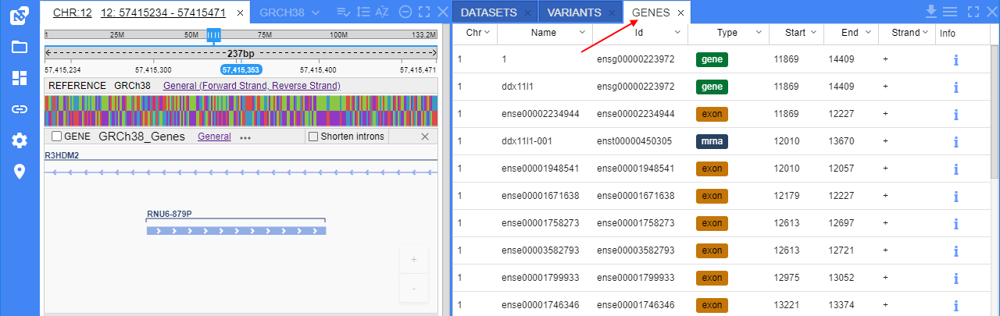

# Genes

- [Navigate to track](#navigate-to-track)
- [Display feature info](#display-feature-info)
- [Edit features attributes](#edit-features-attributes)
    - [History of changes](#history-of-changes)
- [Genes context menu](#genes-context-menu)
- [Download the gene table data](#download-the-gene-table-data)

**Genes** panel displays a list of genes/transcripts/exons and other features of the current dataset (from corresponding GFF/GTF and GenBank files) in a tabular view.  
  

## Navigate to track

To navigate to a feature, click the certain feature row in the **Genes** table. This feature will be opened in the "**Browser**" panel, at the GENE track, e.g.:  
  

The GENE track will be auto zoomed so that the selected feature appears at the full size and approximately at the center of the track's visible part.

## Display feature info

To view the info details about the certain feature, click the **Info** button in the row of that feature in the **Genes** table, e.g.:  
  

The info pop-up contains all feature info:

- mandatory fields with their values from the corresponding columns of the origin gene files (shown as is)
- additional attributes with their values from the "**Attributes**" column of the origin gene file (shown with the `ATTR` label)
- **Sequence** field with a feature nucleotide sequence

## Edit features attributes

Users can modify gene/feature attributes shown in the **Genes** panel via the GUI.  
These changes will be saved in NGB and will be available to all other users, but they don't touch the original GENE files.

Details:

- user can modify the attribute values manually for any gene/feature from the GENES panel
- all field values can be changed, no matter the type attribute has - mandatory or optional/additional (except "_Chromosome_", "_Start_", "_End_")
- user can add a new attribute and specify a value for it to the feature. Such attribute will be shown as additional and marked with the `ATTR` label
- user can remove any additional attribute from the feature (mandatory fields can not be removed)
- modified/created/deleted attributes don't affect the original GENE files. All changes are being done only in the inner NGB database

Modifying attributes is being performed via the **Info** pop-up of the gene/feature - click the **Info** button in the row of the desired feature in the **Genes** table, then click the **Edit** button, e.g.:  
  

 The modifying regimen will be enabled:  
  

All fields that values can be modified are displayed with the underline.  
To change such value - click it and specify a new one, e.g.:  
    
  

To remove the attribute with its value - click the minus button near the attribute, e.g.:  
    
This attribute will disappear from the list.

To add a new attribute - click the **Add** button under the list. Two fields will appear - left one for the attribute name and the right one for the attribute value, e.g.:  
    
Both fields should be filled in for a new attribute (empty values are not allowed), e.g.:  
    
To add another attribute - click the **Add** button again.

Once all changes are done - click the **Save** button:  
    
Changes will be saved:  
    
You can check it at the **Genes** panel as well:  
  

### History of changes

User can view all changes that were performed with the certain feature attributes - what was changed, when and by whom.  
It can be done via the **History** tab in the feature **Info** pop-up:  
    
  

Here the list of performed actions is displayed.  
Each action record in the list contains:

- username who performed changes
- date and time of changes
- details of changing (names of the changed attributes, their old and new values)

History is being sorted by date - from the newest to older events.

## Genes context menu

Users can use the context menu from the **Genes** table for the quick access to some additional functionality. To open the context menu, click the right mouse button on a feture row, e.g.:  
  

From here, user can for the current feature:

- open the [BLAST](blast-search.md) search
- open a visualized 3D protein structure in the [Molecular viewer](overview.md#molecular-viewer-panel)
- open the [Homologs](homologs-search.md) search

**_Note_**: not all context menu items are available for all features. In case of some restrictions, the corresponding warning message will be shown, e.g.:  
  

## Download the gene table data

To download the data displayed in the **Genes** table - click the _download_ icon in the panel header.  
The pop-up will appear:  
  

Here:

- select the format for the downloading table data (CSV or TSV, _CSV by default_)
- set the checkbox if the the header should be included to the downloading file (_header is not included by default_)

Once the setup is finished, click the **Download** button. Table will be downloaded automatically:  
  

The downloaded table will contain only the same data that was displayed in the **Genes** table before the download (considering all filters and sortings):  
  