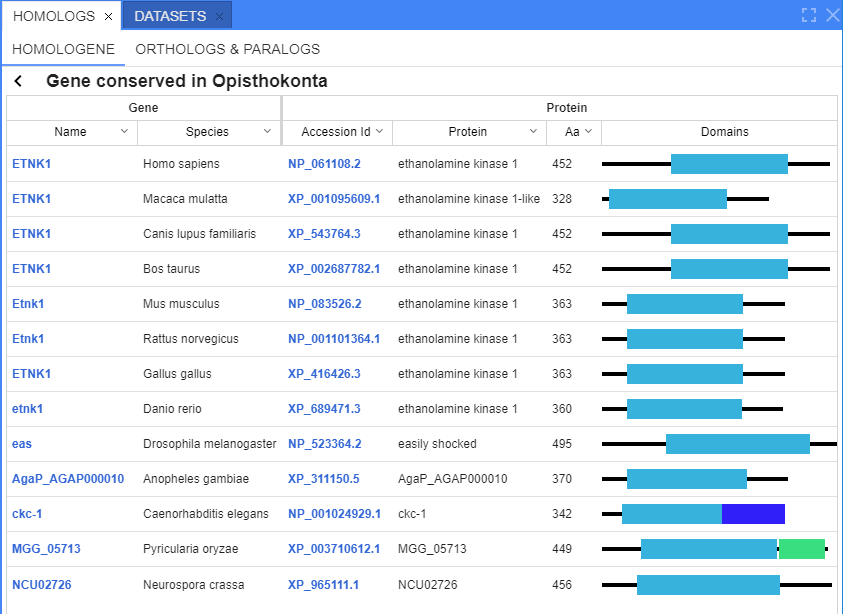

# Homologs search

- [Homologene sub-tab](#homologene-sub-tab)
- [Orthologs and paralogs sub-tab](#orthologs-and-paralogs-sub-tab)

Users can search for the homologous genes.  
The search is being performed in the inner copy of [`NCBI Homologene`](https://www.ncbi.nlm.nih.gov/homologene/) database or in uploaded custom databases.

There are two ways to start the search of homologous genes:

- from the context menu at the **Browser** panel by the left-click on any gene at the GENE track:  
  
- from the context menu at the **Genes** panel by the right-click on any gene:  
  

**_Note_**: in both cases, these items in menus are available only if the feature has `gene` feature type and non-empty gene name.

After, the search in the inner copy of NCBI Homologene database is being performed using the gene name and the current species.  
**Homologs** panel will be opened automatically (_at the picture below the search results for `ETNK1` gene is shown_):  
  

This panel contains two sub-tabs:

- "**Homologene**" (_opened by default_) - for displaying search results of gene homologs from the NCBI Homologene database
- "**Orthologs & paralogs**" - for displaying search results of gene orthologs and paralogs from the corresponding NCBI Database (`NCBI Orthologs`) and/or inner NGB databases

## Homologene sub-tab

Here, the search results over NCBI Homologene database are being shown:  
  

Each record contains:

- _Gene name_ - gene names of all homologs of the certain record (ordered alphabetically)
- _Protein name_ - the most "popular" protein name among all homologs of the certain record (the one that meet the most times)
- _Info_ - additional record info (_optionally_)

Click any row in that table to open details of the certain Homologene record:  
    
  

This form contains:

- button to return to the previous table (with the list of found Homologene records)  
  
- additional record info where homologs were found (if exists) - as the **Homologs** table header
- **Homologs** table that contains two columns:
    - _Gene_ - for a gene info with two sub-columns:
        - _Name_ - for a gene name
        - _Species_ - for a species name
    - _Protein_ - for a protein info with following sub-columns:
        - _Accession ID_ - for a protein sequence accession ID. It is a hyperlink. User can click it and navigate to the corresponding protein page in NCBI (in a new tab)
        - _Protein_ - for a protein name
        - _Aa_ - for a protein sequence length
        - _Domains_ - for an approximate image of the conserved protein domains. Each image contains:
            - a line for a full protein length
            - one or several color rectangles - each for the specific conserved domain. Different domains are drawn by different colors, the same domains are drawn in the same colors

The table supports sorting by any sub-column, except "Domains".

Gene names in this table are hyperlinks.  
User can click any gene of interest and navigate:

- to the corresponding location of the selected species at the GENE track in "**Browser**" panel (if the reference is uploaded in NGB)  
    
  
- to the corresponding gene page in NCBI (if the reference is not uploaded in NGB)

User can click any domain rectangle in the table and a tooltip will appear with a full "legend" of the corresponding gene domains:  
    
Tooltip contains:

- accession ID as a hyperlink to the corresponding protein page in NCBI
- full protein sequence length
- list of domains. For each domain are specified:
    - domain color and positions
    - domain ID as a hyperlink to the corresponding conserved domains database page in NCBI
    - domain name

## Orthologs and paralogs sub-tab

This sub-tab can be opened manually (after the search of "similar genes" is performed).  
Here, the search results over orthologs and paralogs NGB databases (NCBI Orthologs or custom) should be shown, e.g.:  
  

Each record contains:

- _Gene name_ - gene name of all homologs of the certain record (ordered alphabetically)
- _Protein name_ - the most "popular" protein name among all homologs of the certain record (the one that meet the most times)
- _Info_ - record info with database name where the results were found

Click any row in that table to open results details from the certain database:  
    
  

This form contains:

- arrow-button to return to the previous table (with the list of found records)
- additional record info where orthologs and paralogs were found (if exists)
- **Orthologs and paralogs** table that contains columns:
    - _Name_ - for a gene name
    - _Species_ - for a species name
    - _Aa_ - for a protein sequence length
    - _Domains_ - for an approximate image of the conserved protein domains (similar to **Homologs** table)
    - _Type_ - for a type of the homolog - _`Ortholog`_ or _`Paralog`_

The table supports sorting by any sub-column, except "Domains".

Gene names in this table are hyperlinks.  
User can click any gene of interest and navigate to the GENE track in the "**Browser**" panel (if the reference is uploaded in NGB) or to the corresponding gene page in NCBI (if the reference is not uploaded in NGB) - similarly to the **Homologs** table.

User can click any domain rectangle in the table and a tooltip will appear with a full "legend" of the corresponding gene domains - similarly to the **Homologs** table.

> **_Note_**: some data may often be missing in the **Orthologs and paralogs** table.  
> In this case:
>
> - if the gene name is unknown - gene ID is displayed instead
> - if the protein sequence length is unknown - zero is displayed in the corresponding column
> - if there is no info about domains - nothing is displayed in the corresponding column
