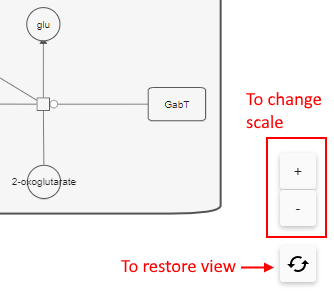

# Metabolic pathways

- [Pathways list](#pathways-list)
    - [Search for pathway](#search-over-the-list)
- [Pathway view](#pathway-view)
    - [Collage pathway](#collage-type)
    - [Image management](#image-management)
    - [Search over the map](#search-over-the-map)
    - [Pathway annotations](#pathway-annotations)
        - [Heatmap annotation](#heatmap-annotation)
        - [Variants annotation](#variants-annotation)
        - [CSV/TSV annotation](#csvtsv-annotation)
        - [Colorizing details](#colorizing-details)
        - [Manual annotation](#manual-annotation)
        - [Annotations management](#annotations-management)
- [Navigation from genes](#navigation-from-genes)

Metabolic pathways are series of chemical reactions that start with a substrate and finish with an end product.  
These pathways are being displayed as certain kind of infographics, often called "maps".  
Maps can be as public ones received from different sources like [BioCyc](https://biocyc.org/) database and as well as internal, produced by pathway modelling software.  
NGB supports visualization of both types of pathway maps.

The main way to open pathways in NGB - use the corresponding item in the **VIEWS** menu:  
  

By click this item - the **PATHWAYS** panel will appear on the right side:  
  

About alternative ways of navigation to pathways see [below](#navigation-from-genes).

## Pathways list

Here, the list of all metabolic pathways (maps) loaded to NGB is shown.  
Each record in the list includes:

- _Map_ - map name
- _Description_ - map description (_optional_)
- _Source_ - source of the map. There can be:
    - **_collage_** - for a map received as [BioCyc pathway collage](https://biocyc.org/pathway-collage-info)
    - **_custom_** - for a custom map, produced by pathway modelling software
- _Species_ - species to which the map corresponds (_optional_)

This table is sorted by _Map_ column.  
Table also supports filtering by species - for that, click the corresponding field in the _Species_ column, select the desired item(s) from the appeared list and then click any space outside, e.g.:  
    
  

### Search over the list

User can search for the pathway of interest over all loaded in NGB pathways.  
For that, the search bar above the pathways list can be used: user shall specify a search keyword and click the **Search** button after:  
  

**_Note_**: the search is being performed as over map names and descriptions as well as over objects containing in pathways (i.e. it can be a gene or feature name that is includued in the pathway map but not mentioned in map name/description)

## Pathway view

The _Map_ column in the pathways table contain hyperlinks - user can click any record in this list to open details of the specific metabolic pathway map.  
The new form with map details will be opened in the same panel instead previous list, e.g.:  
    
  

Pathway details form contains:

- button to return to the previous table (with pathways list)
- label with the current map name
- "info" button near the map name - by hover over it, a tooltip appears with the map description (_if exists_), e.g.:  
  
- search bar - for the search over the current pathway objects
- annotation panel - for adding annotation file(s) to the current pathway
- pathway interactive image

### Collage type

On the example above, the pathway of _custom_ type was shown.  
Pathways of _collage_ type is differ a little by style and look max similar to the [BioCyc pathway collage view](https://biocyc.org/cytoscape-js/ovsubset.html?graph=example1).  
Example of the pathway of _collage_ type:  
    
  

Nodes of the collage pathway can be presented as hyperlinks - user can click them and the corresponding gene/feature will be opened, e.g.:  
  

All features and options described below (that users can perform with the pathway map image) are applicable to both pathway types.

### Image management

All objects at a pathway map are draggable.  
To drag any object - click it and holding the mouse button relocate as you want. E.g. here we have relocated objects from the pathway above:  
    
The map itself can be dragged over the panel in the same way.

By default, image is autoscaled - fitted by width.  
There are possibilities to change scale:

- by mouse wheel
- by corresponding buttons "**Zoom-in**"/"**Zoom-out**" near the image  

To restore the default view and scale use the "**Restore view**" button:  
  

### Search over the map

To search over the current pathway objects - specify the desired keyword (e.g. object name of interest) to the search fieldand click the **Search** button or press _Enter_ key.  
Found results will be highlighted by green at the pathway image:  
  

**_Note_**: each new search will highlight only new found objects, previous search results will be hidden

### Pathway annotations

User has the ability to add annotation(s) to the displayed pathway map.  
This annotation allows to colorize the pathway map.

To manage annotations for the current pathway - click the **A** button in right-upper corner above the pathway image -   
The pop-up to add a new annotation will appear:  
  

The following annotations are supported:

- heatmap file, previously registered in NGB. **_Note_**: previously select any heatmap in the **Dataset** panel to enable it on this pop-up
- variation file, previously registered in NGB. **_Note_**: previously select any variants track in the **Dataset** panel to enable it on this pop-up
- data in TSV/CSV format, that can be uploaded from the local workstation
- manually specified annotation in NGB GUI

#### Heatmap annotation

To add a heatmap annotation, user should:

- set checkbox near the corresponding item
- select heatmap from the appeared dropdown list, e.g.:  
  
- annotation name field will be automatically filled by selected heatmap file name (_then, user can manually change this name, if needs_)
- the control will appear - to set where the pathway objects (IDs/names/labels) are expected in the selected heatmap file:
    - in the first column (row headers)
    - or in the first row (column headers)  
  
- the control to config the colorizing will appear.  
  Here the same settings as for [heatmaps colorizing](tracks-heatmap.md#color-scheme) are:  
    - ability to select between continuous (_default_) and discrete colorizing
    - for continuous colorizing, there is the ability to set colors for `max`, `min`, `average` values
    - for discrete colorizing, there is the ability to set a color for each specific value or configure color(s) for values range(s)
- click the **APPLY** button to confirm

When the annotation is saved, the pop-up will be closed and a new annotation will appear in the annotations panel.  
Just saved annotation will be applied to the map image:  
  

#### Variants annotation

To add a variants annotation, user should:

- set checkbox near the corresponding item
- select variants track from the appeared dropdown list, e.g.:  
  
- the control will appear - to set from which attribute field of the variants file values for the pathway objects are expected
- annotation name field will be automatically filled by selected variants file and attribute names (_then, user can manually change this name, if needs_):  
  
- the control to config the colorizing will appear.  
  Here the same settings as for [heatmaps colorizing](tracks-heatmap.md#color-scheme) are:  
    - ability to select between continuous (_default_) and discrete colorizing
    - for continuous colorizing, there is the ability to set colors for `max`, `min`, `average` values
    - for discrete colorizing, there is the ability to set a color for each specific value or configure color(s) for values range(s)
- click the **APPLY** button to confirm

When the annotation is saved, the pop-up will be closed and a new annotation will appear in the annotations panel.  
Just saved annotation will be applied to the map image:  
  

#### CSV/TSV annotation

To add an annotation from the local CSV/TSV file, user should:

- set checkbox near the corresponding item
- select CSV/TSV file from your local workstation, e.g.:  
  
- annotation name field will be automatically filled by uploaded file name (_then, user can manually change this name, if needs_)
- the control will appear - to set where the pathway objects (IDs/names/labels) are expected in the selected heatmap file:
    - in the first column (row headers)
    - or in the first row (column headers)  
  
- the control to config the colorizing will appear.  
  Here the same settings as for [heatmaps colorizing](tracks-heatmap.md#color-scheme) are:  
    - ability to select between continuous (_default_) and discrete colorizing
    - for continuous colorizing, there is the ability to set colors for `max`, `min`, `average` values
    - for discrete colorizing, there is the ability to set a color for each specific value or configure color(s) for values range(s)
- click the **APPLY** button to confirm

When the annotation is saved, the pop-up will be closed and a new annotation will appear in the annotations panel.  
Just saved annotation will be applied to the map image:  
  

#### Colorizing details

When user selects heatmap file or TSV/CSV file as an annotation, the matrix format (_in the original file_) of the annotation is expected.
In this case:

- pathway objects (their IDs, names or labels) should be placed in the first column (row headers) or the first row (column headers) of the matrix. Therefore this is being specified by the user when create/edit the corresponding annotation in GUI
- all other matrix values will be used for colorizing pathways objects:  
  - if these values are organized only in single column/row - the pathway objects will be colorized in one color
  - if these values are organized in greater than one column/row - each column/row is perceived as separate sample and the pathway objects will be colorized in several colors corresponding the count of such samples

For example, if the origin file looks like:  
    
Then, a map with applied annotation will be colorized in the way (_each object of the pathway found in the annotation is colorized in one color - according to the selected color scheme_):  
  

If the origin file looks like:  
    
Then, the same map with applied annotation will be colorized in the way (_each object of the pathway found in the annotation is colorized in 3 colors - according to the selected color scheme_):  
  

When user selects variants file as an annotation, the matrix format of the annotation is generated:

- first column contains gene/feature names from the origin variants file
- other columns contain values of the attribute field for that gene/feature (attribute is specified by the user on the GUI)

Colorizing is being performed by the same way as for the heatmap annotation or TSV/CSV annotation.

#### Manual annotation

To add a manual annotation, user should:

- set checkbox near the corresponding item
- specify the manual color scheme in the appeared field, e.g.:  
  
- annotation name is optional. If it is not specified manually by the user - it will be set automatically (_then, user can manually change this name, if needs_)
- click the **APPLY** button to confirm

When the annotation is saved, the pop-up will be closed and a new annotation will appear in the annotations panel.  
Just saved annotation will be applied to the map image:  
  

Manual colorization annotation is expected in the following format:

```
<object_identifier_1>    <background_color1>[,<foreground_color1>]
<object_identifier_2>    <background_color2>[,<foreground_color2>]
...
```

The algorithm of the colorizing is the following: for each pathway object from the specified list - if this object is presented at the map, it should be colorized in the defined color(s):

- `<background_color>` (if specified) should be used as background color
- `<foreground_color>` (if specified) should be used as border color and text color

#### Annotations management

User can add and apply several annotations for the map.
For each annotation in the panel, there are:

- annotation name (as hyperlink) - user can click it to open the annotation details and change them if needs - in the annotation pop-up (same pop-up as described above)
- **Remove** button near the annotation name - to remove the annotation from the list
- checkbox near the annotation name - to enable (apply) it or disable


Just saved annotation is being applied to the map automatically.

When the annotation is applied to the map:

- objects according to the annotation will be colorized to the specified colors. If no objects are found with the specified identifiers - nothing will be colorized
- if several annotations are selected - colorizing is being performed accordingly to the order by which annotations were selected (in time). I.e. if any object is subject to several annotations - it will be colorized according to the last (most recent) applied annotation

## Navigation from genes

There are additional ways to find the pathway of interest:

- from the context menu at the **Browser** panel by the right-click on any gene at the **GENE** track:  
  
- from the context menu at the **Genes** panel by the right-click on any gene:  
  

In both cases after, the search over the pathways list will be performed using the gene name as search keyword.  
**Pathways** panel will be opened automatically:  
  
