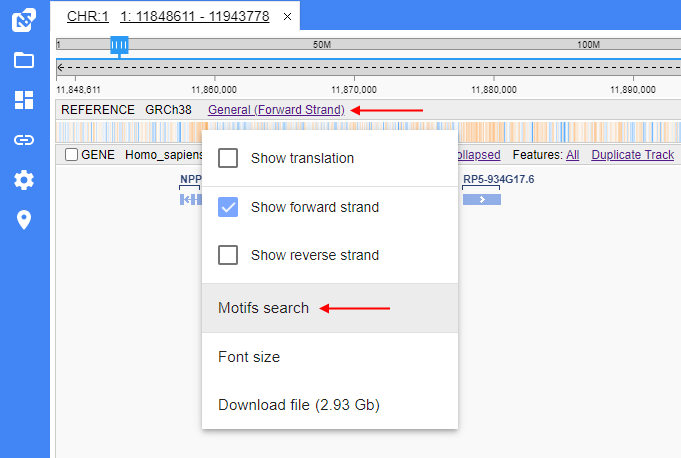
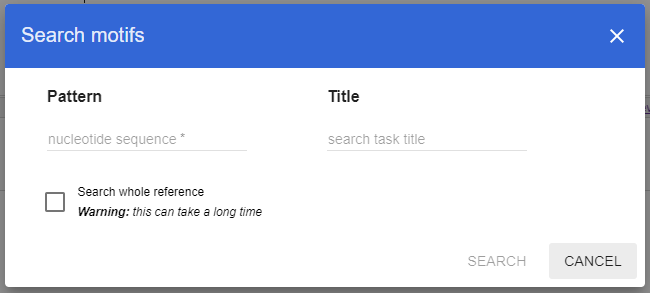
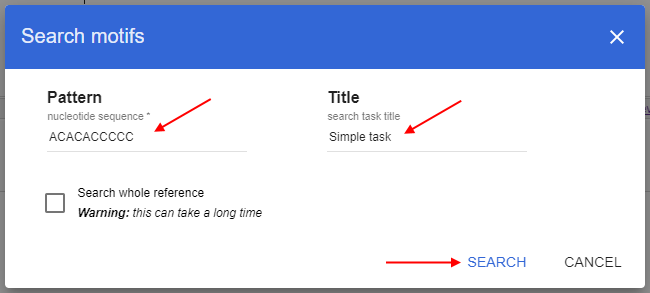
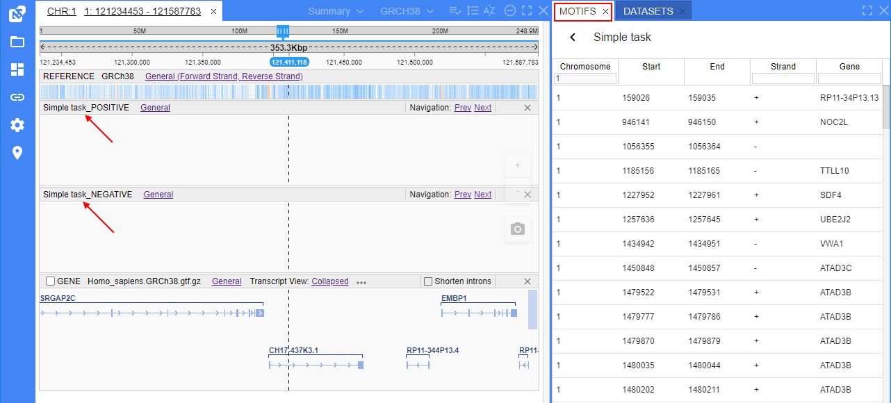
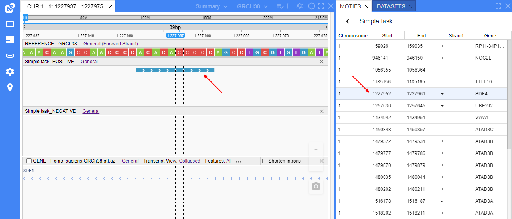

# Motifs search

- [Start search](#start-search)
- [Search results](#search-results)
- [Search history](#search-history)

Sequence motifs are short, recurring patterns in DNA that are presumed to have a biological function.  
Users can search motifs in NGB and receive results in table view and display them at specific tracks.

## Start search

To begin the motifs search, user should open the "**General**" context menu of the reference track (by which the search shall be performed) and click the corresponding item in the list:  
  

After that, the search pop-up will appear:  
  

To start the search, user should:

- specify a search pattern. It is a nucleotide sequence that can be specified in any supported format:
    - a plain sequence of nucleotides (e.g. `AAAGGGACT`)
    - a sequence of nucleotides with [IUPAC](https://droog.gs.washington.edu/mdecode/images/iupac.html) ambiguity codes (e.g. `AACWWRY`)
    - a regular expression that follows Java regex syntax (e.g. `TATA[AT]A[AT]A`)
- specify a name (title) for the forthcoming motifs search task - to easier find it later (_optionally_)
- determine where the search should be performed - only over the current (opened) chromosome (_default behavior_) or over the full reference sequence.  
  To search over the whole reference - set the corresponding checkbox.  
  **_Note_**: search over the whole reference can take a long time
- once the motifs search setup is finished, click the **Search** button:  
  

## Search results

After that, the search will be performed over the opened chromosome/reference.  
Once the search is performed:

- the additional panel "**MOTIFS**" that contains search results in a table view will appear at the panels section
- two additional tracks that show results on forward and reverse strands will appear at the **Browser** panel

Table in the "**MOTIFS**" panel contains details of the specific search result (all found motif matches).  
Table contains the following columns:

- **Chr** - for the chromosome name where the match is found
- **Start** - for the start position of the match
- **End** - for the end position of the match
- **Strand** - for the strand of the reference in which the match is found
- **Gene** - for the gene name, in which the current match hits

Also, that panel view contains:

- a button to navigate to the table with full list of motifs searches (see [below](#search-history) for details)
- a label with the search title. **_Note_**: if a title was not specified, the search will have the title equals as a motif pattern

Additional tracks in the **Browser** panel allow to view motifs search results.  
There are two tracks - for results on forward and reverse strands.  
The easiest way to view any result at the track - click the desired result in the table and the corresponding track will be "navigated" to this result, e.g.:  
  

Details of the tracks displaying:

- tracks are named in the following format:
    - `{Title}_POSITIVE`/`{Title}_NEGATIVE`, if the search task _title_ was specified
    - `{Motif pattern}_POSITIVE`/`{Motif pattern}_NEGATIVE`, if the search task _title_ was not specified
- each match sequence is shown as colorized rectangle
- the strand of the match sequence is shown by arrows on its rectangle
- for the user convenience, colors of rectangles on different strands are different
- for each different motifs search task - a new pair of tracks is opened

## Search history

>>>>>>>>>>>>>>>>>>>>>>>>>>>>>>> ....
