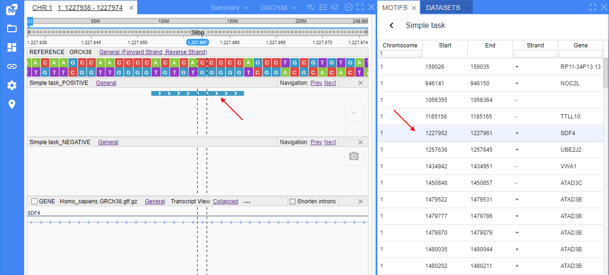
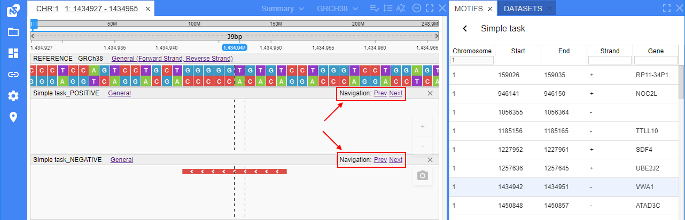
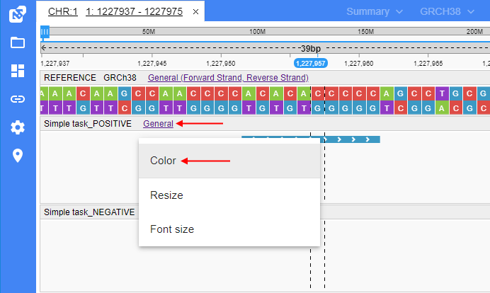
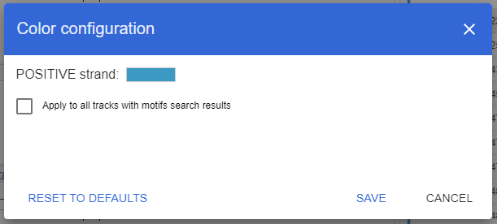
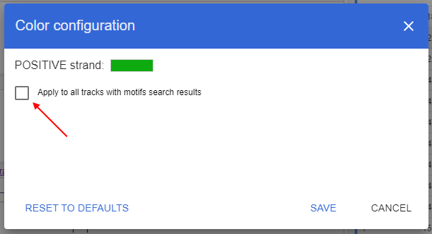
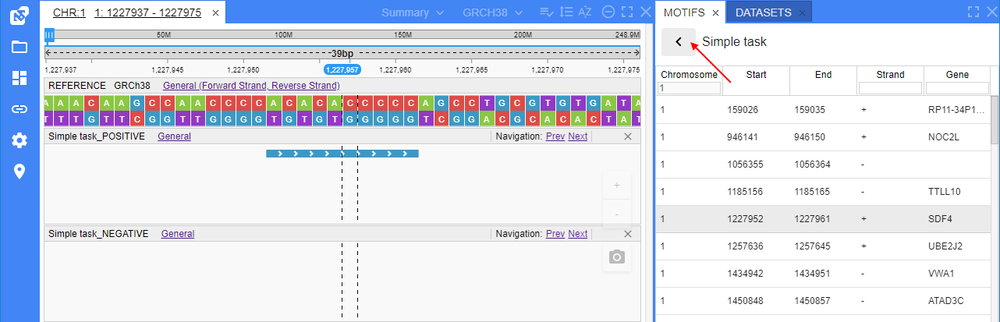
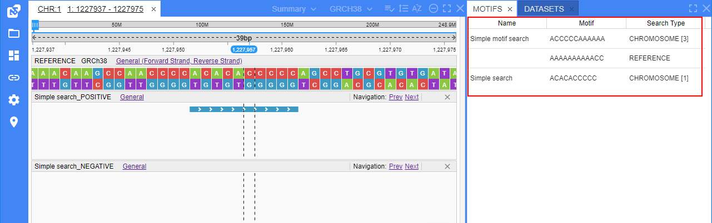
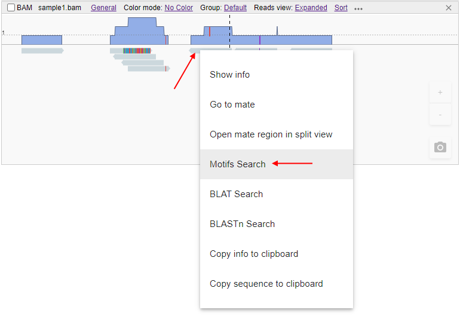
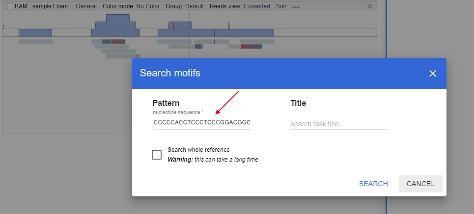

# Motifs search

- [Start search](#start-search)
- [Search results](#search-results)
    - [Quick navigation between matches](#quick-navigation-between-matches)
    - [Configure track view](#configure-track-view)
- [Search history](#search-history)
- [Opening from BAM tracks](#opening-from-bam-tracks)

Sequence motifs are short, recurring patterns in DNA that are presumed to have a biological function.  
Users can search motifs in NGB and receive results in table view and display them at specific tracks.

## Start search

To begin the motifs search, user should open the "**General**" context menu of the reference track (by which the search shall be performed) and click the corresponding item in the list:  
  

After that, the search pop-up will appear:  
  

To start the search, user should:

- specify a search pattern. It is a nucleotide sequence that can be specified in any supported format:
    - a plain sequence of nucleotides (e.g. `AAAGGGACT`)
    - a sequence of nucleotides with [IUPAC](https://droog.gs.washington.edu/mdecode/images/iupac.html) ambiguity codes (e.g. `AACWWRY`)
    - a regular expression that follows Java regex syntax (e.g. `TATA[AT]A[AT]A`)
- specify a name (title) for the forthcoming motifs search task - to easier find it later (_optionally_)
- determine where the search should be performed - only over the current (opened) chromosome (_default behavior_) or over the full reference sequence.  
  To search over the whole reference - set the corresponding checkbox.  
  **_Note_**: search over the whole reference can take a long time
- once the motifs search setup is finished, click the **Search** button:  
  

## Search results

After that, the search will be performed over the opened chromosome/reference.  
Once the search is performed:

- the additional panel "**MOTIFS**" that contains search results in a table view will appear at the panels section
- two additional tracks that show results on forward and reverse strands will appear at the **Browser** panel

Table in the "**MOTIFS**" panel contains details of the specific search result (all found motif matches).  
Table contains the following columns:

- **Chr** - for the chromosome name where the match is found
- **Start** - for the start position of the match
- **End** - for the end position of the match
- **Strand** - for the strand of the reference in which the match is found
- **Gene** - for the gene name, in which the current match hits

Also, that panel view contains:

- a button to navigate to the table with full list of motifs searches (see [below](#search-history) for details)
- a label with the search title. **_Note_**: if a title was not specified, the search will have the title equals as a motif pattern

Additional tracks in the **Browser** panel allow to view motifs search results.  
There are two tracks - for results on forward and reverse strands.  
The easiest way to view any result at the track - click the desired result in the table and the corresponding track will be "navigated" to this result, e.g.:  
  

Details of the tracks displaying:

- tracks are named in the following format:
    - `{Title}_POSITIVE`/`{Title}_NEGATIVE`, if the search task _title_ was specified
    - `{Motif pattern}_POSITIVE`/`{Motif pattern}_NEGATIVE`, if the search task _title_ was not specified
- each match sequence is shown as colorized rectangle
- the strand of the match sequence is shown by arrows on its rectangle
- for the user convenience, colors of rectangles on different strands are different
- for each different motifs search task - a new pair of tracks is opened

### Quick navigation between matches

To view any motif search result at the track, user should click the desired result in the results table.  
To quick opening of the next or previous result at the track, user can use the corresponding navigation buttons:  
  

**Prev** button will navigate to the nearest previous motif search result at this track and chromosome (with less start position).  
**Next** button will navigate to the nearest next motif search result at this track and chromosome (with greater start position).

### Configure track view

Users have the ability to change the color for sequences at the motif search results tracks.  
For that:

- click the item "**Color**" in the **General** context menu of the desired motif search results track:  
  
- the pop-up to configure background color of found motifs will appear:  
  
- to change the color, user should click the color rectangle near the strand name and select the desired color:  
  
- to apply the selected color to all tracks with motifs search results (of the current strand) - set the corresponding checkbox:  
    
  By default, this checkbox is disabled and the color will be applied only to the current track
- click the **Save** button. Configured color settings will be applied, e.g.:  
  

**_Note_**: users have the ability to restore default color for track(s) by the corresponding button in the color settings pop-up

## Search history

If user clicks the button above the table with the motifs search details - he(she) shall be navigated to the table with full list of motifs searches:  
    
  

This table contains columns:

- **Name** - for the search task title
- **Motif** - for the used search pattern
- **Search type** - for the search type that was selected - chromosome (with the chromosome name in brackets) or whole reference

Users have the ability to click any row in this table - and the table with details of the certain search results will be opened.  
Motifs search results are not supported a long storing - all searches will be cleared with the changing the dataset to dataset with different reference or with the page refreshing, e.g.

## Opening from BAM tracks

Users have the ability to open the motif search from the BAM track as well.  
For that:

- open the context menu by click any read at the BAM track and select the "**Motifs search**" item, e.g.:  
  
- the "**Search motifs**" pop-up will be opened. Selected read will be used and already specified as pattern value:  
  
