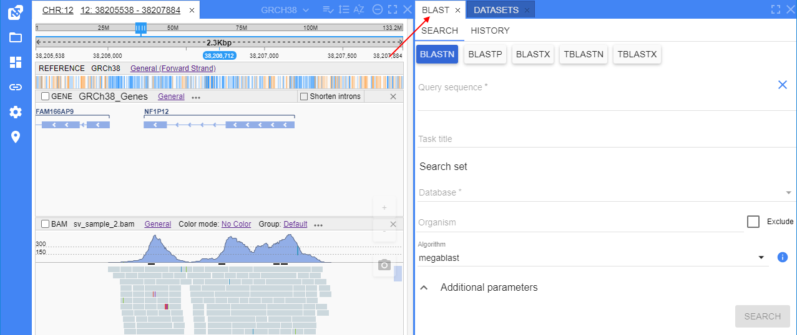

# NGB User Interface

- [Main menu](#main-menu)
- [Panels](#panels)
    - [Variants](#variants-panel)
    - [Genes](#genes-panel)
    - [Sessions](#sessions-panel)
    - [Molecular viewer](#molecular-viewer-panel)
    - [BLAST search](#blast-panel)
    - [Heatmap panel](#heatmap-panel)
    - [Lineage panel](#lineage-panel)
    - [Pathways panel](#pathways-panel)
    - [Target identification panel](#target-identification-panel)
- [Taking screenshots](#taking-screenshots)

The NGB user interface is implemented as the main menu on the left side and a set of panels that can be resized, moved, docked anywhere within the browser window, maximized or hidden.  
  

## Main menu

Main menu contains the following items:

- **INFO** - to view the current NGB version and links to the NGB GitHub project and to the documentation page:  
  
- **OPEN FILE** - to open and view separate file from the NGB server or from external URL:  
  
- **VIEWS** - to see the complete list of available [panels](#panels) and select the panels to be shown or hidden
- **SHARE LINK** - to share a link to the current view of the opened files with other NGB users:  
  
- **SETTINGS** - to open the main settings pop-up:  
  

## Panels

You can use the **VIEWS** menu to see the complete list of available panels and select the panels to be shown or hidden. The **VIEWS** menu is located on the main toolbar of the application:  
    

By default, only following panels are shown: **Browser**, [**Datasets**](datasets.md), [**Genes**](#genes-panel) and [**Variants**](#variants-panel).  
The **Browser** panel is one of the main panel where user can open, view and configure file track and also view datasets' summary details.  
Let's take a look at panels below.

You can rearrange the layout of the NGB as follows:

- **To resize a panel** - click and drag the panel's edge
- **To move and dock** a panel - click and hold the panel's title tab and start dragging the panel. As you are dragging the panel, the application will visualize places where the panel can be docked. Hover the panel over the desired place and release the mouse button to dock the panel. Panels could be also arranged as adjacent tabs: to do so, dock the hovered panel's tab next to the other panel's tab.  
    
    
- **To maximize a panel** (full screen size) - click the **[ ]** button on the panel's header. To restore the panel to the previous size, click the the **[ ]** button again.
- **To close a panel** - click the **X** button on the panel's header tab.
- **To show again a panel that was closed** - select it from the **VIEWS** menu.

### Variants panel

This panel is used to show the list of variants loaded from the project's VCF files in a tabular view. If no VCF files were loaded, the table will be empty.  
    

To navigate to a variant, click the variant's row in the table. This variant will be opened in the "**Browser**" panel, at the corressponding VCF track.

By default in the panel, only the following columns are shown: **Type**, **Chromosome**, **Gene**, **Position**.  
You can rearrange the list of variants as follows:

- **To sort the variants** by a property - click on the header of the corresponding column. To invert the sorting order, click on the header again:  
    
- **To display or hide extra columns** - select/unselect them from the panel options menu. The menu is located on the bar above the table (*hamburger* icon):  
    
- **To restore the original table view** - click the corresponding item in the panel options menu (_hamburger_ icon). This will hide all addition columns, show default columns and restore their order, cancel all configured sortings and filters:  
  

For more details, options and capabilities see [here](variants.md).

### Genes panel

This panel displays a list of genes/transcripts/exons and other features of the current dataset (from corresponding GFF/GTF and GenBank files) in a tabular view.  
  

By default in the panel, only the following columns are shown:

- _Chr_ - chromosome/sequence name
- _Name_ - feature name
- _Id_ - feature ID
- _Type_ - feature type
- _Start_ - start position of the feature on the chromosome/sequence
- _End_ - end position of the feature on the chromosome/sequence
- _Strand_ - feature strand
- _Info_ - button to open the certain feature full info

You can rearrange the list of features as follows:

- **To sort the genes table by a property** - click the header of the corresponding column. To invert the sorting order, click the header again:  
  
- **To sort the genes table by several properties** - click the header of the column by which you wish to sort firstly, then holding Shift key click the column header by which to sort secondly, etc.  
  All columns, by which the sorting was performed, will be numerated:  
  
- **To display or hide extra columns** - select/unselect them from the panel options menu. The menu is located on the bar above the table (_hamburger_ icon):  
    
  There are two types of additional columns in this list:
    - mandatory feature fields from origin gene files (_Feature_, _Frame_, _Gene_, _Score_, _Source_) are shown as is
    - optional feature attributes from the "**Attributes**" column of the origin gene files are shown in format `<Attribute_name> (attr)`  
    Example:  
    
- **Another way to hide an extra column** - use the corresponding item in the menu appeared by click the arrow icon near the column name, e.g.:  
  
- **To filter displayed features** - use one or more parameters to filter features in the **Genes** panel. The approach is fully the same as described for the [Variants panel](variants.md#filters-for-variants-panel):  
    
    
  
- **To restore the original table view** - click the corresponding item in the panel options menu (_hamburger_ icon). This will hide all addition columns, show default columns and restore their order, cancel all configured sortings and filters:  
  

For more details, options and capabilities see [here](genes.md).

### Sessions panel

You can bookmark a specific location in the browser.  
This action saves the state of the browser and opened tracks as well - so, it is called "saving the session".  
It can be performed as follows:

- Click the **Location** icon located in the main menu on the left page side.  
  **_Note_**: the **Location** icon is being displayed only when any position/chromosome/reference is opened.
- The pop-up will appear where session name (_mandatory_) and description (_optionally_) should be specified:  
  
- Once all desired data is specified - click the **Save** button to confirm:  
  

**_Note_**: session bookmarks are stored globally. Panel will show all saved **Sessions** - from all NGB users.

The **Sessions** panel has the following columns:

- _Name_ - session name
- _Description_ - session description
- _Reference_ - reference name that was opened when the session was saved
- _Chr_ - chromosome name that was opened when the session was saved
- _Start position_ - start position at the reference
- _End position_ - end position at the reference
- _Owner_ - user name who saved the session

**To sort the sessions** according to a specific property - click the header of the corresponding column, e.g.:  
  

**To filter displayed sessions** - use one or more parameters to filter sessions in the **Sessions** panel. The approach is similar to described for the [Variants panel](variants.md#filters-for-variants-panel):  
  

**To navigate to a location** bookmarked in the certain session - click the corresponding row of the table:  
    
  

**To delete a session** bookmark - click the **Trash** icon of the corresponding row.

> **_Note_**:
> Additionally, if any model was opened in the [Molecular viewer](#molecular-viewer-panel) at the saving session moment - full state of the opened model will be stored in such session.
> The following options will be saved:
>
> - model, selected structure and chain
> - view of the model - display mode and color scheme
> - the set angle
> - the set zoom level
>
> So, if user will open such session - the **Molecular viewer** panel will be opened with the full same model image as it was saved.

### Molecular viewer panel

The **Molecular Viewer** panel shows the 3D structure of a protein.  
This panel is hidden by default. Select **Molecular Viewer** from the **VIEWS** menu to show the panel.

To view a protein's 3D structure, navigate to a specific location in a browser and click a gene or a transcript on the gene's track.  
This will load the 3D structure of the protein from the RCSB database. To enable this, external databases are used:

- A call to `Ensembl` is performed to retrieve a list of transcripts of a gene and the link to uniprot entry for each transcript
- A list of corresponding PDB IDs with the current chain in a PDB is retrieved from the uniprot entry
- Finally, a PDB file is retrieved from RCSB and visualized.

If several PDB files are available for a gene/protein, they will be shown as a dropdown list on the top of the panel:  
    

If a PDB file contains multiple protein chains, they will be listed in a dropdown list above the viewer.  
By default, the chain that contains a protein corresponding to the gene will be selected.

The selected chain or multiple changes are opaque, non-selected chains are semi-transparent:  
    

You can:

- rotate the protein's 3D structure
- zoom in/out on the protein's 3D structure
- change the color scheme - click the  icon:  
    
  
- change the display mode - click the  icon:  
    
  

### BLAST panel

Via this panel users can perform [BLAST](https://blast.ncbi.nlm.nih.gov/Blast.cgi) search nucleotide/amino acid sequences over BLAST databases and view the corresponding results.  
BLAST databases should be previously uploaded into NGB (this could be as downloaded NCBI [databases](https://github.com/ncbi/blast_plus_docs#blast-databases) or custom ones).

The BLAST panel contains two sub-tabs:

- **Search** (_opened by default_) - to display and specify search settings, and also start a new search
- **History** - to display the history of searches

Once the BLAST search setup is finished - click the **Search** button to start:  
  

Since the BLAST search can take a long time, the results are not displayed immediately - and for each search - a new "search task" is being created.  
The list of such tasks is displayed at the **History** sub-tab.  
This sub-tab is being opened automatically after the search starts:  
    
Just-started search task is shown on the top of the tasks list.

User can click such hyperlink (or just a row) to open the corresponding search results. Search results will be opened in the same tab (**History**):  
  

User can click any row in the **Sequence table** and the form with details about all matches (alignments) of the search query to the certain sequence will be opened.  
This form is being opened in the same tab (**History**), e.g.:  
  

For more details, options and capabilities see [here](blast-search.md).

### Heatmap panel

**Heatmap** is a data visualization technique that shows magnitude of a phenomenon as color in two dimensions.  
NGB supports heatmaps displaying.

In NGB, heatmaps can be shown in the **Heatmap** panel, as separate track or even at the _Summary_ dataset view in the **Browser** panel.

Besides their main function to visualize data, heatmaps can also be used to navigate over NGB objects, e.g.:  
  

For more details see [here](tracks-heatmap.md).

### Lineage panel

Lineage is a one-directional graph where each node represent a strain (genome) and each edge between nodes represent an impact used to create a progeny from a parent strain.  
NGB supports visualization of a lineage for a family of strains or reference genomes.

Any lineage node (strain) can be associated with a NGB reference ID - in this case, node's name is displayed as a hyperlink.  
User can click such link to navigate to the corresponding reference track (at the same time, the lineage panel remains opened), e.g.:  
  

For more details see [here](strain-lineage.md).

### Pathways panel

Metabolic pathways are series of chemical reactions that start with a substrate and finish with an end product.  
These pathways are being displayed as certain kind of infographics, often called "maps".  
NGB supports visualisation maps that can be as public ones received from different sources like [BioCyc](https://biocyc.org/) database and as well as internal, produced by pathway modelling software:  
  

For more details see [here](metabolic-pathways.md).

### Target identification panel

Via the **Target Identification** panel users can collect identification information about targets of interest (genes), store this information and use it for their own research purposes.

**Target identification** panel includes sub-tabs:

- **Targets** (_opened by default_) - sub-panel where user can manage targets
- **Identifications** - sub-panel where user can view and manage target identification reports

To launch a new identifying process, find the target in the **Targets** table and click the button to launch identification process, e.g.:  
    
In the appeared pop-up, specify:

- _species of interest_ - list of species of interest. Corresponds to species for which gene (target) the identification will be performed
- _translational species_ - list of species to which the gene comparison shall be performed during the identification  
  

Once the identifying process is finished, the **Identifications** sub-tab will be automatically opened with the identification results (report):  
  

For more details about identification process and report see [here](target-identification.md).

## Taking screenshots

To take a screenshot of a browser, click the **Camera** icon located in the right side of the "**Browser**" panel. The **Camera** icon is transparent by default and becomes opaque when you hover over it:  
    

The screenshot will be saved to the **Downloads** folder of your Web browser.
