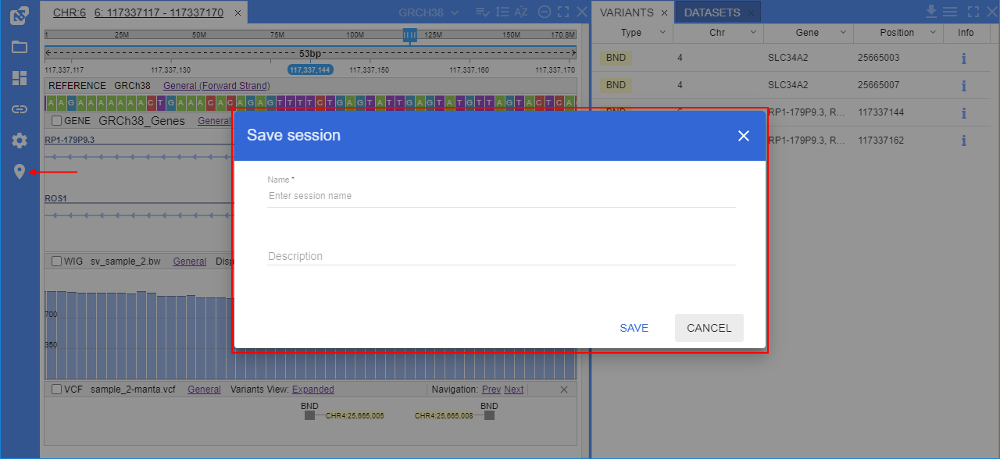
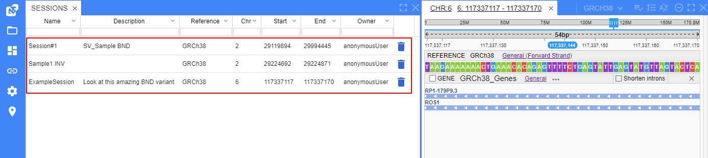

# NGB User Interface

- [Panels](#panels)
    - [Variants panel](#variants-panel)
        - [Filters](#filters-for-variants-panel)
        - [Highlight variants of interest](#highlight-variants-of-interest)
    - [Sessions panel](#sessions-panel)
    - [Molecular viewer panel](#molecular-viewer-panel)
- [Taking screenshots](#taking-screenshots)

## Panels

The NGB user interface is implemented as a set of panels that can be resized, moved, docked anywhere within the browser window, maximized or hidden.

You can use the **VIEWS** menu to see the complete list of available panels and select the panels to be shown or hidden. The **VIEWS** menu is located on the main toolbar of the application:  
    

By default, only following panels are shown: **Browser**, **Datasets**, **Genes** and **Variants**.

You can rearrange the layout of the NGB as follows:

- **To resize a panel** - click and drag the panel's edge
- **To move and dock** a panel - click and hold the panel's title tab and start dragging the panel. As you are dragging the panel, the application will visualize places where the panel can be docked. Hover the panel over the desired place and release the mouse button to dock the panel. Panels could be also arranged as adjacent tabs: to do so, dock the hovered panel's tab next to the other panel's tab.  
    
    
- **To maximize a panel** (full screen size) - click the **[ ]** button on the panel's header. To restore the panel to the previous size, click the the **[ ]** button again.
- **To close a panel** - click the **X** button on the panel's header tab.
- **To show again a panel that was closed** - select it from the **VIEWS** menu.

### Variants panel

This panel is used to show the list of variants loaded from the project's VCF files in a tabular view. If no VCF files were loaded, the table will be empty.  
    

To navigate to a variant, click the variant's row in the table. This variant will be opened in the "**Browser**" panel, at the corressponding VCF track.

By default in the panel, only the following columns are shown: **Type**, **Chromosome**, **Gene**, **Position**.  
You can rearrange the list of variants as follows:

- **To sort the variants** by a property - click on the header of the corresponding column. To invert the sorting order, click on the header again:  
    
- **To display or hide extra columns** - select them from the panel options menu. The menu is located on the bar above the table (*hamburger* icon):  
    

#### Filters for variants panel

**Filters** are used to filter variants displayed in the **Variants** panel. You can use one or more parameters to filter variants.  
To open them - click the _hamburger_ icon and select the "**Show filters**" item in the list:  
    

Filter fields will appear under the column headers:  
    

Changing one or more filtering parameters triggers the refreshing of the **Variants** panel:  
      
    

To reset the filter(s):

- for the certain column, click the arrow icon at the column header and select the "**Clear column filter**" item (see **1** at the picture below)
- for all columns simultaneously, click the _trash bin_ icon in the **Variants** panel header (see **2** at the picture below)  
    

To hide the filters row - click the _hamburger_ icon in the **Variants** panel header and unset the "**Show filters**" item.

#### Highlight variants of interest

VCF files may include a large number of variants and it could be helpful to highlight variants of interest based on values of the panel fields (variant attributes).

System admin can create/edit the special JSON-file (`interest_profiles.json` in the NGB config directory) where a list of condition profiles is described.  
Each profile in that file contains an own set of conditions based on the variant attributes. For a condition, the color is being specified.  
At the GUI, user can select any profile from the described file and:

- in the variants table, if the variant is satisfy to the certain condition of the profile - variant row is being highlighted in that condition color
- at the VCF track, if the variant is satisfy to the certain condition of the profile - this variant is being highlighted in that condition color

The format of the JSON-file with condition profiles is the following:

``` json
{
  "<profile_name1>" : {
    "is_default" : "<is_default_value>",
    "conditions" : [
      {
        "condition" : "<condition_set1>",
        "highlight_color" : "<highlight_color1>"
      },
      {
        "condition" : "<condition_set2>",
        "highlight_color" : "<highlight_color2>"
      },
      ...
    ]
  },
  "<profile_name2>" : {
    "conditions" : [ ... ]
  },
  ...
}
```

> Where:
>
> - `<profile_name>` - a profile name
> - "**is_default**" (_boolean_, _not-required_) - key for specifying whether the current profile is default one. If several profiles are marked as "default" profile (have `"is_default" : "true"`) - only first of them becomes "default" profile, other are ignored
> - "**conditions**" - an array of condition sets. For each set, conditions are being specified for variants' matching check and the color in which these variants will be highlighted:  
>     - "**condition**" - a condition set. May include one or several conditions for VCF info fields which values may be of interest (for which the conditions are being specified and comparisons will be performed). If the condition set is not specified - no variants will be highlighted in the corresponding color
>     - "**highlight_color**" - key for specifying a color. The variants matched the conditions of the current set will be highlighted in the GUI in this color (color should be specified in HEX)
>
> Each `<condition_set>` should have a structure: `(<id1> <comparison_operator1> <value1>) <logic_operator1> (<id2> <comparison_operator2> <value2>) ...`  
> Where:
>
> - `<id>` (_string_) - VCF info field ID. Should be specified in quotes (examples: `'ac'`, `"mp"`, `'excess het'`)
> - `<comparison_operator>` - operator that will be used for the comparison of the VCF info field value with the specified in the current condition. Possible values:
>     - `==` - **equals** - for string, numeric and boolean values
>     - `!=` - **not equals** - for string, numeric and boolean values
>     - `>` - **greater than** - for numeric values
>     - `>=` - **greater than or equal to** - for numeric values
>     - `<` - **less than** - for numeric values
>     - `<=` - **less than or equal to** - for numeric values
>     - `in` - **in** - for arrays
>     - `notin` - **not in** - for arrays
> - `<value>` (_string_) - value with which the comparison is being performed. Should be specified in quotes, arrays should be specified in square brackets (examples: `'2'`, `"true"`, `'[1, 10, 22]'`)
> - `<logic_operator>` - defines how specified comparisons will combinate:
>     - variants of interest should match both comparisons. In this case, `<logic_operator>` should be `and`
>     - variants of interest should match any comparison (at least one). In this case, `<logic_operator>` should be `or`
>
> More complex sets from several comparisons can be specified by rules of Boolean algebra, using additional brackets, e.g.: `((<comparison1>) or (<comparison2>)) and ((<comparison3>) or (<comparison4>))`.

Example of the JSON-file with a single profile:

``` json
{
  "Example conditions" : {
    "is_default" : true,
    "conditions" : [
      {
        "highlight_color" : "ffff00",
        "condition" : "('ac' == '2') and ('mq' >= '80')"
      }
    ]
  }
}
```

By the example above, the default profile was described that has the following properties - variants of interest will be highlighted in color `#FFFF00` (yellow) if they match both conditions: allele count equals `2` and mapping quality greater than or equals to `80`.

By default, the variants highlighting is disabled.  
To enable it and select the certain conditions profile:

1. Click the _gear_ icon in the main menu to open the **Settings**:  
  
2. The settings pop-up will be opened. Select the **VCF** tab:  
  
3. At the **VCF** tab, enable the variants highlighting feature. For that - set the corresponding checkbox:  
  
4. If the checkbox is enabled - the list with condition profiles will appear:  
  
5. Select the desired profile from the list. _In our example, we will use the profile described above - "Example conditions"_:  
    
  Click the **SAVE** button to confirm changes.
6. Once the profile is selected, the variants satisfied to the profile conditions will be highlighted in the condition colors:  
    
  **_Note_**: rows not satisfied the conditions will remain the same (without additional highlighting)
7. If open any of the highlighted variants - it will be highlighted at the VCF-track as well:  
  
8. For the collapsed VCF-tracks, when several variants are merged into a "bubble" and among them there are some variants of interest from different condition sets - such "bubble" is being highlighted in all corresponding colors (like pie chart diagram), e.g.:  
  

> **_Notes_**:
>
> - Conditions profile doesn't consider the dataset (will be automatically applied to any dataset with VCF files).
> - If the same variant matches different condition sets from the profile, it should be highlighted only in a color of the first condition set in the list

To disable the highlighting feature - disable the checkbox in the settings.

### Sessions panel

You can bookmark a specific location in the browser.  
This action saves the state of the browser and opened tracks as well - so, it is called "saving the session".  
It can be performed as follows:

- Click the **Location** icon located in the main menu on the left page side. **_Note_**: the **Location** icon is being displayed only when any position/chromosome/reference is opened.
- When clicked, the **Location** button will expand into a textbox.
- Enter the desired session's name in a textbox.
- Press **Enter** key to save the session.  
    

**_Note_**: session bookmarks are stored globally. Panel will show all saved **Sessions**



The **Sessions** panel has the following columns:

- _Name_
- _Chromosome_
- _Start position_
- _End position_

**To sort the sessions** according to a specific property - click the header of the corresponding column, e.g.:  
      
**To navigate to a location** bookmarked in the certain session - click the corresponding row of the table.  
**To delete a session** bookmark - click the **Trash** icon of the corresponding row.

### Molecular viewer panel

The **Molecular Viewer** panel shows the 3D structure of a protein.  
This panel is hidden by default. Select **Molecular Viewer** from the **VIEWS** menu to show the panel.

To view a protein's 3D structure, navigate to a specific location in a browser and click a gene or a transcript on the gene's track.  
This will load the 3D structure of the protein from the RCSB database. Refer to [**Working with Annotations**](annotations.md#retrieving-protein-3d-structures) for details.


If several PDB files are available for a gene/protein, they will be shown as a dropdown list on the top of the panel:  
    

If a PDB file contains multiple protein chains, they will be listed in a dropdown list above the viewer.  
By default, the chain that contains a protein corresponding to the gene will be selected.

The selected chain or multiple changes are opaque, non-selected chains are semi-transparent:  
    

You can rotate the protein's 3D structure and zoom in/out on it.

## Taking screenshots

To take a screenshot of a browser, click the **Camera** icon located in the right side of the "**Browser**" panel. The **Camera** icon is transparent by default and becomes opaque when you hover over it:  
    

The screenshot will be saved to the **Downloads** folder of your Web browser.
