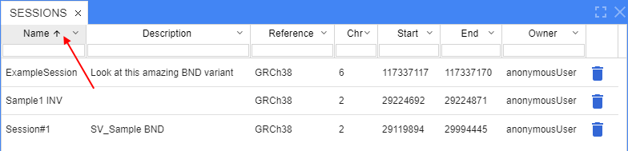

# NGB User Interface
## Panels
The NGB user interface is implemented as a set of panels that can be resized, moved, docked anywhere within the browser window, maximized or hidden.

You can use the **VIEWS** menu to see the complete list of available panels and select the panels to be shown or hidden. The **VIEWS** menu is located on the main toolbar of the application:

By default, only three panels are shown: **Browser**, **Variants**, and **Datasets**.

You can rearrange the layout of the NGB as follows:
* **To resize a panel**, click and drag the panel's edge
* **To move and dock** a panel, click and hold the panel's title tab and start dragging the panel. As you are dragging the panel, the application will visualize places where the panel can be docked. Hover the panel over the desired place and release the mouse button to dock the panel. Panels could be also arranged as adjacent tabs: to do so, dock the hovered panel's tab next to the other panel's tab.

* **To maximize a panel** (full screen size), - click the **[ ]** button on the panel's header. To restore the panel to the previous size, click the the **[ ]** button again.
* **To close a panel**, click the X button on the panel's header tab. If you want to close multiple panels that are grouped as adjacent tabs, click the **[X]** button on the panel group's header.
* **To show again a panel that was closed**, select it from the **VIEWS** menu.

## Variants panel
This panel is used to show the list of variations loaded from the project's VCF files in a tabular view. If no VCF files were loaded, the table will be empty.

To navigate to a variation, click on the variation's row in the table.

By default, only the following columns are shown: **Type, Chromosome, Gene, Position**. To show additional columns, select them from the COLUMNS dropdown menu that is located on the bar above the table.

You can rearrange the list of variants as follows:
* **To sort the variants** by a property, click on the header of the corresponding column. To invert the sorting order, click on the header again.

* **To group the variants by a property**, click arrow icon next to column name and select **Group** option in the dropdown menu

* **To display or hide extra columns**, select them from the panel options menu. The menu is located on the bar above the table (*hamburger* icon).  

## Filter panel
The **Filter** panel is used to filter variations displayed in the **Variants** panel. You can use one or more parameters to filter variations.

By default, the following filtering parameters are shown:
* **ACTIVE VCF FILES**: tick one or more VCF files out of the VCF files loaded for the project
* **GENE**: type in one or more gene names
* **TYPE OF VARIANT**: tick one or more variant types
* **AFFECTS**: tick to show variations with breakpoints in exons
* **QUALITY**: type in quality boundary value(s)

The **VCF ADVANCED FILTER** section is hidden by default. Click on the header to open it. The filtering parameters shown under **VCF ADVANCED FILTER** are retrieved automatically from the loaded VCF files.

Changing one or more filtering parameters triggers the refreshing of the **Variants** panel.

To reset the filter, click the **SET TO DEFAULTS** button.

## Bookmarks panel
You can bookmark a specific location in the browser as follows:
* Click on the **Bookmark** icon located in the upper right corner of the track view. The **Bookmark** icon is transparent by default and becomes opaque when you hover over it.
* When clicked, the **Bookmark** button will expand into a text box.
* Enter the desired bookmark's name in a textbox. By default, the chromosome's name and coordinates will be used as the bookmark's name.
* Press **Enter** to save the bookmark.

*Note: Bookmarks are stored globally. Panel will show all existing **BOOKMARKS***

The **BOOKMARKS** panel has the following columns:
* Name
* Chromosome
* Start position
* End position

**To sort the bookmarks** according to a specific property, click on the header of the corresponding column.

**To group the bookmarks** by a parameter, click arrow icon next to column name and select **Group** option in the dropdown menu

**To navigate to a bookmarked location**, click on the corresponding row of the table.

**To delete a bookmark**, click on the **Trash** icon of the corresponding row.

## Molecular viewer panel
The **Molecular Viewer** panel shows the 3D structure of a protein. This panel is hidden by default. Select **Molecular Viewer** from the **VIEWS** menu to show the panel.

To view a protein's 3D structure, navigate to a specific location in a browser and click on a gene or a transcript on the gene's track. This will load the 3D structure of the protein from the RCSB database. Refer to **Working with Annotations** for details.

 

If several PDB files are available for a gene -> protein, they will be shown as a dropdown list on the top of the panel.

If a PDB file contains multiple protein chains, they will be listed in a dropdown list above the viewer. By default, the chain that contains a protein corresponding to the gene will be selected.

The selected chain or multiple changes are opaque, non-selected chains are semi-transparent.

You can rotate the protein's 3D structure and zoom in/out on it.

## Taking screenshots
To take a screenshot of a browser, click on the **Camera** icon located in the upper right corner of the track view. located on a tracks surface. The **Camera** icon is transparent by default and becomes opaque when you hover over it. The screenshot will be saved to the **Downloads** folder of your Web browser.
