# NGB User Interface

- [Panels](#panels)
    - [Variants panel](#variants-panel)
        - [Filters](#filters-for-variants-panel)
        - [Highlight variants of interest](#highlight-variants-of-interest)
    - [Sessions panel](#sessions-panel)
    - [Molecular viewer panel](#molecular-viewer-panel)
    - [BLAST panel](#blast-panel)
        - [Search history](#search-history)
        - [Search results](#search-results)
        - [Alignments info](#alignments-info)
        - [View alignment at track](#view-alignment-at-track)
        - [Search from track](#search-from-track)
- [Taking screenshots](#taking-screenshots)

## Panels

The NGB user interface is implemented as a set of panels that can be resized, moved, docked anywhere within the browser window, maximized or hidden.

You can use the **VIEWS** menu to see the complete list of available panels and select the panels to be shown or hidden. The **VIEWS** menu is located on the main toolbar of the application:  
    

By default, only following panels are shown: **Browser**, **Datasets**, **Genes** and **Variants**.

You can rearrange the layout of the NGB as follows:

- **To resize a panel** - click and drag the panel's edge
- **To move and dock** a panel - click and hold the panel's title tab and start dragging the panel. As you are dragging the panel, the application will visualize places where the panel can be docked. Hover the panel over the desired place and release the mouse button to dock the panel. Panels could be also arranged as adjacent tabs: to do so, dock the hovered panel's tab next to the other panel's tab.  
    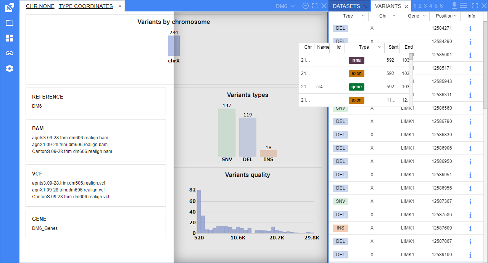
    
- **To maximize a panel** (full screen size) - click the **[ ]** button on the panel's header. To restore the panel to the previous size, click the the **[ ]** button again.
- **To close a panel** - click the **X** button on the panel's header tab.
- **To show again a panel that was closed** - select it from the **VIEWS** menu.

### Variants panel

This panel is used to show the list of variants loaded from the project's VCF files in a tabular view. If no VCF files were loaded, the table will be empty.  
    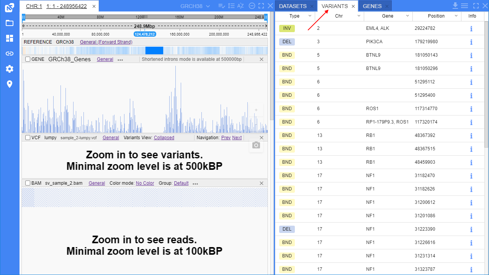

To navigate to a variant, click the variant's row in the table. This variant will be opened in the "**Browser**" panel, at the corressponding VCF track.

By default in the panel, only the following columns are shown: **Type**, **Chromosome**, **Gene**, **Position**.  
You can rearrange the list of variants as follows:

- **To sort the variants** by a property - click on the header of the corresponding column. To invert the sorting order, click on the header again:  
    
- **To display or hide extra columns** - select them from the panel options menu. The menu is located on the bar above the table (*hamburger* icon):  
    

#### Filters for variants panel

**Filters** are used to filter variants displayed in the **Variants** panel. You can use one or more parameters to filter variants.  
To open them - click the _hamburger_ icon and select the "**Show filters**" item in the list:  
    

Filter fields will appear under the column headers:  
    

Changing one or more filtering parameters triggers the refreshing of the **Variants** panel:  
      
    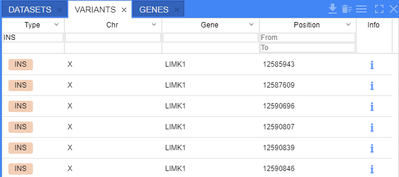

To reset the filter(s):

- for the certain column, click the arrow icon at the column header and select the "**Clear column filter**" item (see **1** at the picture below)
- for all columns simultaneously, click the _trash bin_ icon in the **Variants** panel header (see **2** at the picture below)  
    

To hide the filters row - click the _hamburger_ icon in the **Variants** panel header and unset the "**Show filters**" item.

#### Highlight variants of interest

VCF files may include a large number of variants and it could be helpful to highlight variants of interest based on values of the panel fields (variant attributes).

System admin can create/edit the special JSON-file (`interest_profiles.json` in the NGB config directory) where a list of condition profiles is described.  
Each profile in that file contains an own set of conditions based on the variant attributes. For a condition, the color is being specified.  
At the GUI, user can select any profile from the described file and:

- in the variants table, if the variant is satisfy to the certain condition of the profile - variant row is being highlighted in that condition color
- at the VCF track, if the variant is satisfy to the certain condition of the profile - this variant is being highlighted in that condition color

The format of the JSON-file with condition profiles is the following:

``` json
{
  "<profile_name1>" : {
    "is_default" : "<is_default_value>",
    "conditions" : [
      {
        "condition" : "<condition_set1>",
        "highlight_color" : "<highlight_color1>"
      },
      {
        "condition" : "<condition_set2>",
        "highlight_color" : "<highlight_color2>"
      },
      ...
    ]
  },
  "<profile_name2>" : {
    "conditions" : [ ... ]
  },
  ...
}
```

> Where:
>
> - `<profile_name>` - a profile name
> - "**is_default**" (_boolean_, _not-required_) - key for specifying whether the current profile is default one. If several profiles are marked as "default" profile (have `"is_default" : "true"`) - only first of them becomes "default" profile, other are ignored
> - "**conditions**" - an array of condition sets. For each set, conditions are being specified for variants' matching check and the color in which these variants will be highlighted:  
>     - "**condition**" - a condition set. May include one or several conditions for VCF info fields which values may be of interest (for which the conditions are being specified and comparisons will be performed). If the condition set is not specified - no variants will be highlighted in the corresponding color
>     - "**highlight_color**" - key for specifying a color. The variants matched the conditions of the current set will be highlighted in the GUI in this color (color should be specified in HEX)
>
> Each `<condition_set>` should have a structure: `(<id1> <comparison_operator1> <value1>) <logic_operator1> (<id2> <comparison_operator2> <value2>) ...`  
> Where:
>
> - `<id>` (_string_) - VCF info field ID. Should be specified in quotes (examples: `'ac'`, `"mp"`, `'excess het'`)
> - `<comparison_operator>` - operator that will be used for the comparison of the VCF info field value with the specified in the current condition. Possible values:
>     - `==` - **equals** - for string, numeric and boolean values
>     - `!=` - **not equals** - for string, numeric and boolean values
>     - `>` - **greater than** - for numeric values
>     - `>=` - **greater than or equal to** - for numeric values
>     - `<` - **less than** - for numeric values
>     - `<=` - **less than or equal to** - for numeric values
>     - `in` - **in** - for arrays
>     - `notin` - **not in** - for arrays
> - `<value>` (_string_) - value with which the comparison is being performed. Should be specified in quotes, arrays should be specified in square brackets (examples: `'2'`, `"true"`, `'[1, 10, 22]'`)
> - `<logic_operator>` - defines how specified comparisons will combinate:
>     - variants of interest should match both comparisons. In this case, `<logic_operator>` should be `and`
>     - variants of interest should match any comparison (at least one). In this case, `<logic_operator>` should be `or`
>
> More complex sets from several comparisons can be specified by rules of Boolean algebra, using additional brackets, e.g.: `((<comparison1>) or (<comparison2>)) and ((<comparison3>) or (<comparison4>))`.

Example of the JSON-file with a single profile:

``` json
{
  "Example conditions" : {
    "is_default" : true,
    "conditions" : [
      {
        "highlight_color" : "ffff00",
        "condition" : "('ac' == '2') and ('mq' >= '80')"
      }
    ]
  }
}
```

By the example above, the default profile was described that has the following properties - variants of interest will be highlighted in color `#FFFF00` (yellow) if they match both conditions: allele count equals `2` and mapping quality greater than or equals to `80`.

By default, the variants highlighting is disabled.  
To enable it and select the certain conditions profile:

1. Click the _gear_ icon in the main menu to open the **Settings**:  
  
2. The settings pop-up will be opened. Select the **VCF** tab:  
  
3. At the **VCF** tab, enable the variants highlighting feature. For that - set the corresponding checkbox:  
  
4. If the checkbox is enabled - the list with condition profiles will appear:  
  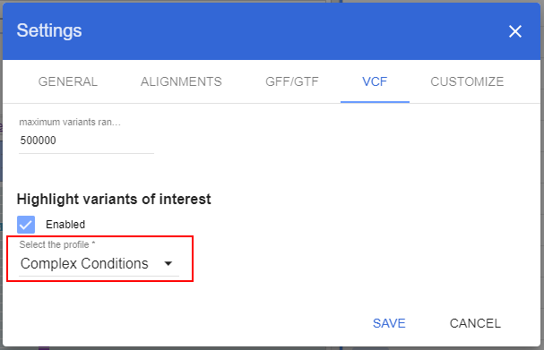
5. Select the desired profile from the list. _In our example, we will use the profile described above - "Example conditions"_:  
    
  Click the **SAVE** button to confirm changes.
6. Once the profile is selected, the variants satisfied to the profile conditions will be highlighted in the condition colors:  
    
  **_Note_**: rows not satisfied the conditions will remain the same (without additional highlighting)
7. If open any of the highlighted variants - it will be highlighted at the VCF-track as well:  
  
8. For the collapsed VCF-tracks, when several variants are merged into a "bubble" and among them there are some variants of interest from different condition sets - such "bubble" is being highlighted in all corresponding colors (like pie chart diagram), e.g.:  
  

> **_Notes_**:
>
> - Conditions profile doesn't consider the dataset (will be automatically applied to any dataset with VCF files).
> - If the same variant matches different condition sets from the profile, it should be highlighted only in a color of the first condition set in the list

To disable the highlighting feature - disable the checkbox in the settings.

### Sessions panel

You can bookmark a specific location in the browser.  
This action saves the state of the browser and opened tracks as well - so, it is called "saving the session".  
It can be performed as follows:

- Click the **Location** icon located in the main menu on the left page side. **_Note_**: the **Location** icon is being displayed only when any position/chromosome/reference is opened.
- When clicked, the **Location** button will expand into a textbox.
- Enter the desired session's name in a textbox.
- Press **Enter** key to save the session.  
    

**_Note_**: session bookmarks are stored globally. Panel will show all saved **Sessions**


The **Sessions** panel has the following columns:

- _Name_
- _Chromosome_
- _Start position_
- _End position_

**To sort the sessions** according to a specific property - click the header of the corresponding column, e.g.:  
      
**To navigate to a location** bookmarked in the certain session - click the corresponding row of the table.  
**To delete a session** bookmark - click the **Trash** icon of the corresponding row.

### Molecular viewer panel

The **Molecular Viewer** panel shows the 3D structure of a protein.  
This panel is hidden by default. Select **Molecular Viewer** from the **VIEWS** menu to show the panel.

To view a protein's 3D structure, navigate to a specific location in a browser and click a gene or a transcript on the gene's track.  
This will load the 3D structure of the protein from the RCSB database. Refer to [**Working with Annotations**](annotations.md#retrieving-protein-3d-structures) for details.


If several PDB files are available for a gene/protein, they will be shown as a dropdown list on the top of the panel:  
    

If a PDB file contains multiple protein chains, they will be listed in a dropdown list above the viewer.  
By default, the chain that contains a protein corresponding to the gene will be selected.

The selected chain or multiple changes are opaque, non-selected chains are semi-transparent:  
    

You can rotate the protein's 3D structure and zoom in/out on it.

### BLAST panel

Via this panel users can perform [BLAST](https://blast.ncbi.nlm.nih.gov/Blast.cgi) search nucleotide/amino acid sequences over BLAST databases and view the corresponding results.  
BLAST databases should be previously uploaded into NGB (this could be as downloaded NCBI [databases](https://github.com/ncbi/blast_plus_docs#blast-databases) or custom ones).


The BLAST panel contains two sub-tabs:

- **Search** (_opened by default_) - to display and specify search settings, and also start a new search
- **History** - to display the history of searches

To start the search, user should specify:

1. The BLAST **Tool** that will be used for the search. Only one tool can be selected:  
  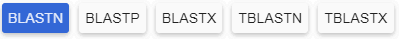
    - `blastn` (_default_) - for the search over nucleotide databases using a nucleotide query
    - `blastp` - for the search over protein databases using an amino acid query
    - `blastx` - for the search over protein databases using a translated nucleotide query
    - `tblastn` - for the search over translated nucleotide databases using an amino acid query
    - `tblastx` - for the search over translated nucleotide databases using a translated nucleotide query
2. **Query sequence**, e.g.:  
  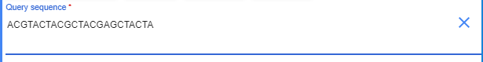
3. The search **Task title** (_optionally_). In this field, user may specify the title for the current search operation - to easier find it later, e.g.:  
  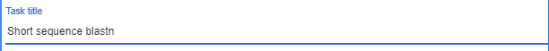
4. Search "set". Here user should specify where the search should be performed:
    - **Database** - dropdown list to select the BLAST database (one from the list of all uploaded databases). The list of databases corresponds one of the types - protein or nucleotide. This type is defined by the selected tool type at the tool selector: for `blastn`, `tblastn`, `tblastx` - nucleotide databases are being displayed, for `blastp`, `blastx` - protein databases are being displayed
    - **Organism** (_optionally_) - dropdown list to select/specify the species for which the search should be performed. Multi-select is supported.
        - Separately, user can set the certain checkbox next to the **Organism** field to exclude specified organism(s) from the list for which the search will be performed
    - **Algorithm** - dropdown list to select algorithms available for the current BLAST tool. Use the _info_ icon next to that dropdown list to view a short help  
    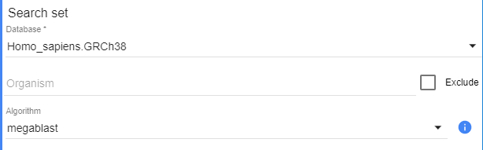
5. **Additional parameters** - collapsible section to specify additional "technical" BLAST parameters that should be used for the search. Expanded view of that section:  
  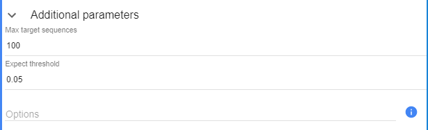  
  Here:
    - **Max target sequences** - field to set the maximum number of aligned sequences to display in results (CLI BLAST option `max_target_seqs`)
    - **Expect threshold** - field to set expect value for saving hits (CLI BLAST option `evalue`)
    - **Options** (_optionally_) - field to specify additional BLAST options in CLI style. If user will try to specify such options in incorrect format or with incorrect names - they will be ignored during the search. To view the full list of supported options use the _info_ icon next to that field  
    **_Note_**: **Max target sequences** and **Expect threshold** settings have _default_ values. I.e. if user doesn't forcibly specify values for these parameters (e.g., even doesn't expand the "**Additional parameters**" section) - their default values shall be used for the search

Once the BLAST search setup is finished - click the **Search** button to start:  
  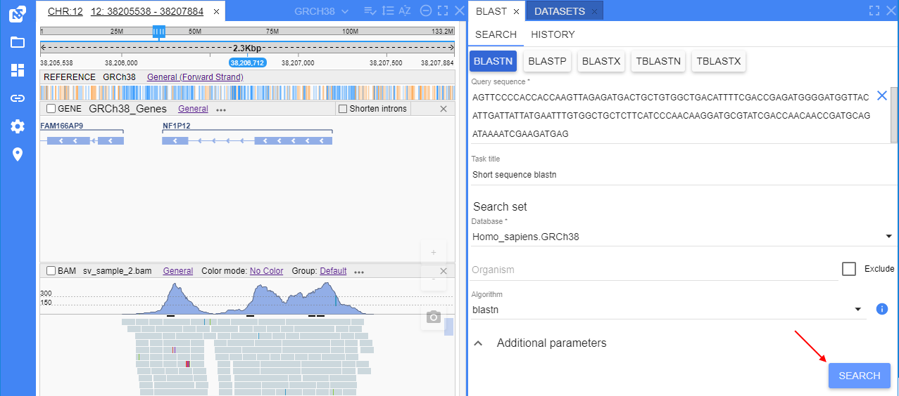

#### Search history

Since the BLAST search can take a long time, the results are not displayed immediately - and for each search - a new "search task" is being created.  
The list of such tasks is displayed at the **History** sub-tab.  
This sub-tab is being opened automatically after the search starts:  
    
Just-started search task is shown on the top of the tasks list.

This table contains all user's BLAST search requests.  
Here:

- **Task ID** - automatic created ID of the certain search task
- **Task title** - title of the certain search task (if it was specified before the search)
- **Current state** - status of the search task:
    - _Searching_ - for task being performed at the moment. All new tasks get this status by default
    - _Done_ - for task successfully finished
    - _Interrupted_ - for task canceled during the searching
    - _Failure_ - for failed task (task finished with errors)
- **Submitted at** - date and time when the certain search was started
- **Duration** - duration of the certain search task
- block of the controls near each request:
    - button to cancel search . This button allows to break the search and change the state of that task to "_Interrupted_". _Note_: available only for the task that is being currently performed
    - button to re-open the search setup . This button allows to open the **Search** setup sub-tab and set the search parameters in the same values as they were in the current request
- Clear history button  at the top of the tab - to clear all BLAST search history

Table supports sorting by any column (except **Duration**).  
Table has the auto-refresh every 5 sec (only if the sub-tab is opened).  
If the certain search is finished, its state changes to _Done_ and task ID becomes a hyperlink.  User can click such hyperlink (or just a row) to open the corresponding search results, e.g.:  
  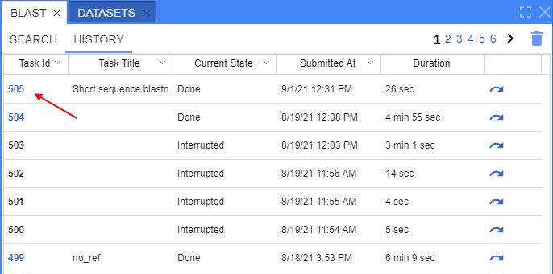  

#### Search results

Search results will be opened in the same tab (**History**):  
  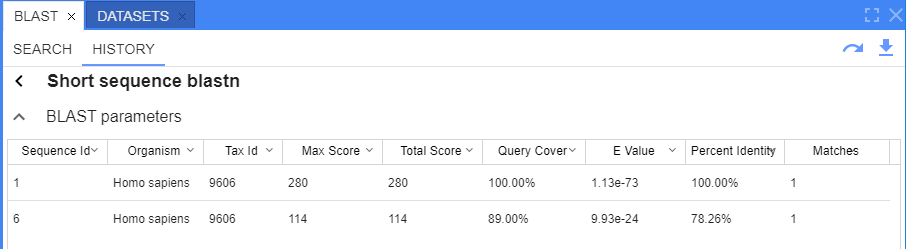

This table contains:

- **Back** button (near the search task title) - to hide current results and return to the search history view:  
  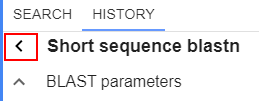
- Header with the opened search task title (if it was specified before the search)
- BLAST parameters collapsible section (_collapsed by default_). This section contains details of the opened search:  
  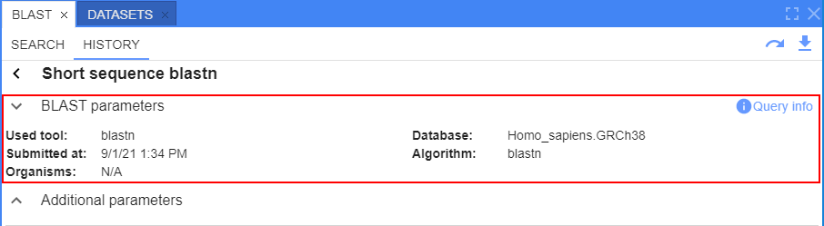  
    - **Query info** button - to open the search query details (sequence and its length), e.g.:  
    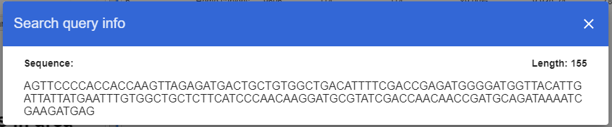  
    - **Additional parameters** section - collapsible section where user can view additional "technical" BLAST parameters that were used for the search:
    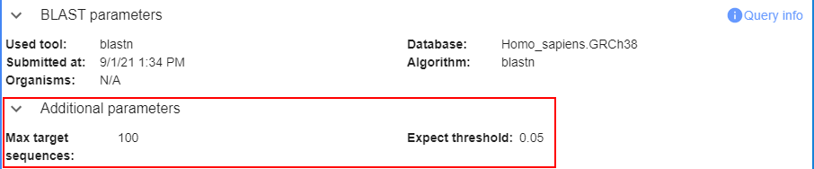
- Block of additional buttons at the right-upper corner of the form:
    - button to re-open the search setup  - to open the the **Search** setup sub-tab and set the search parameters in the same values as they were in the current request
    - button to download results  - to download full BLAST search results (raw) as CSV file to the local workstation
- **Sequences table** - to show the search results summary grouped by sequences:  
  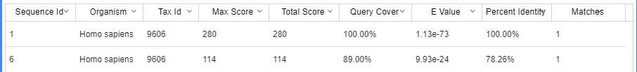

**Sequences table** contains BLAST search aggregated results grouped by their sequences.  
Table contains the following columns:

- _Sequence ID_ - IDs of the sequences in which hits were found
- _Organism_ - organism specified in the sequence
- _Tax ID_ - taxonomy ID specified in the sequence
- _Max score_ - the highest alignment score from all matches of the search query to the certain sequence
- _Total score_ - sum of alignment scores from all matches of the search query to the certain sequence
- _Query cover_ - the percent of the query length that is included in the aligned segments
- _E value_ - the number of alignments expected by chance with the calculated score or better. By this column the default sorting is set (ascending)
- _Percent identity_ - the highest percent identity for a set of aligned segments to the same subject sequence
- _Matches_ - number of matches of the search query to the certain sequence

Maximal count of rows in this table is defined by **Max target sequences** parameter that is specified before the search.  
User have the ability to sort this table by any column and manually configure the column order.

#### Alignments info

User can click any row in the **Sequence table** and the form with details about all matches (alignments) of the search query to the certain sequence will be opened.  
This form is being opened in the same tab (**History**), e.g.:  
    
  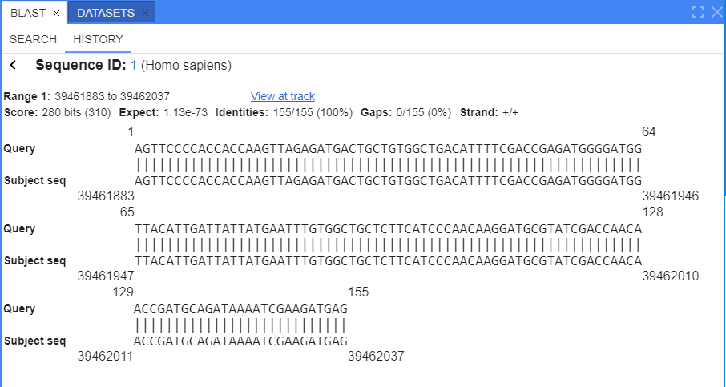

This form contains:

- **Back** button - to hide the **Alignments info** form and return to the **Sequences table** view:  
  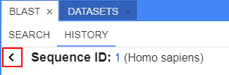
- **Sequence ID**. ID is a hyperlink:
    - if the search was performed on the NCBI database - this hyperlink opens a corresponding sequence page on NCBI
    - if the search was performed on the "custom" database - this hyperlink opens a corresponding reference and its chromosome (to which this sequence belongs) in the "**Browser**" panel
- Details about all matches of the search query to the current sequence (match blocks)

Each match block contains:

- _Range_ - positions of the current sequence where the match is defined
- "_View at track_" link - hyperlink to view the certain match (alignment) to the current sequence. This hyperlink is visible only for those sequences which references are in NGB databases
- _Score_ and _bit-score_, _Expect_ value (E-value)
- Count of _Identities_ between sequences (by symbols) and its percent value
- Count of _Gaps_ (by symbols) and its percent value
- _Strands_ of each sequence (query and subject) - only for nucleotide sequences
- block with the conventional figure of the query string alignment to the current sequence segment:  
    - start and end position of the query string segment
    - aligned query string segment
    - start and end position of the current sequence segment
    - the current sequence segment to which the query string segment was aligned
    - symbols that "link" the corresponding letters in both sequences:
        - straight line (`|`) if letters are equal
        - nothing (empty) if letters are not equal (mismatch)
        - minus symbol (`-`) in any sequence - for gaps

#### View alignment at track

User can view any found match (alignment) at a track (graphic visualization) in the "**Browser**" panel. **_Note_**: it is possible only for those sequences which references are in NGB databases.  
To open the visualization track, user should click the "_View at track_" link near the match in the "**Alignments info**" form:  
    
  

Opened alignment is shown at the separate track.  
Track is being displayed in the similar manner as a single read at the [Alignment](tracks-bam.md) track in the "Browser":  

- query matches - shown as a gray line by width of aligned matches
- query strand - shown as an arrow on the edge of the query line
- mismatches - shown as separate color rectangles with the corresponding letters
- gaps in sequence - shown as insertions (a perpendicular violet line in the gap position)
- gaps in query - shown as deletions (a black line linked two "separate" parts of the query)
- additionally, near the each end of the query line at the track, are conventionally shown counts of the query positions that were not aligned to sequence

Example:  
  

If there are several matches (alignments) were found for the same sequence - they all will be shown at that track, e.g.:  
  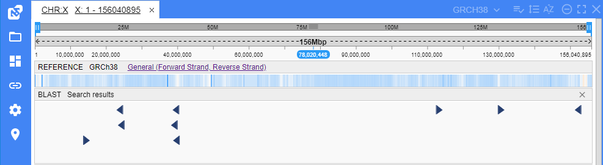

> Please note, that described behavior is valid only for searches over _nucleotide_ sequences.  
> Visualization for searches over _amino acid_ sequences does not show exact location of the alignment. In such cases, only whole gene feature is highlighted instead.  
> 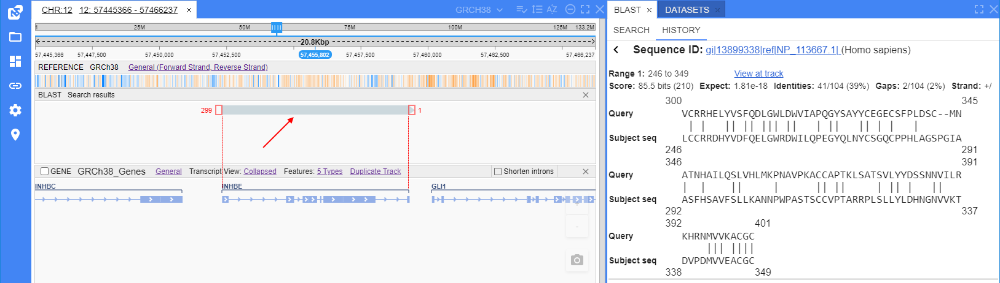

#### Search from track

Users have the ability to start BLAST Search from the genomic feature via the "**Browser**" panel as well.

To prepare the search in such way, user shall just click a read (or any other feature) at a track and select any "**BLAST search**" option (`BLASTn` or `BLASTp`) from the context menu, e.g.:  
  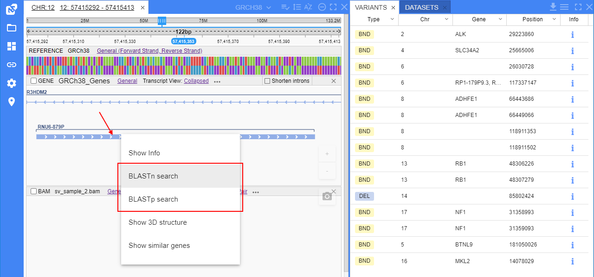

After that, the BLAST panel will be opened. Also, some default values will be set:

- if user selected "**BLASTn Search**" option, at the "**BLAST**" panel:
    - `blastn` tool type will be selected
    - the corresponding _nucleotide_ sequence (according to the selected in GUI) will appear in the **Query sequence** field
- if user selected "**BLASTp Search**" option, at the "**BLAST**" panel:
    - `blastp` tool type will be selected
    - the corresponding _amino acids_ sequence (according to the selected in GUI) will appear in the **Query sequence** field

Example for the gene at the picture above when the "**BLASTn Search**" option was selected:  
  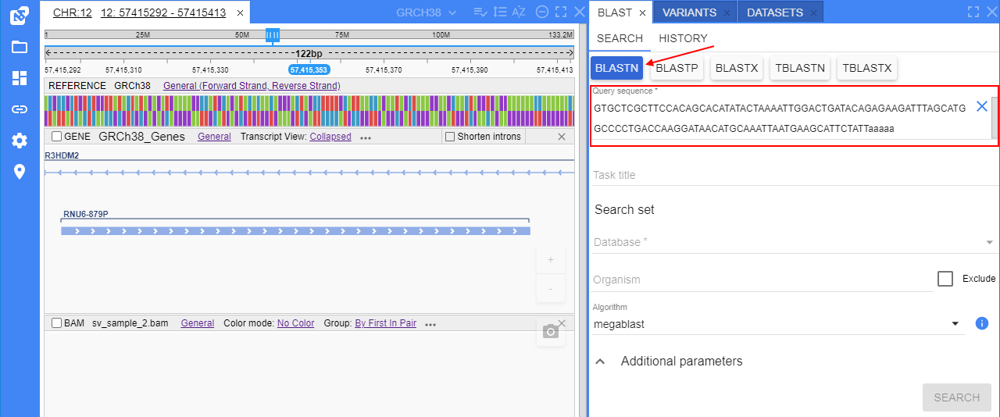

> **_Note_**: this feature has a number of limitations. If the BLAST search can not be performed from the context menu (due to some restrictions) - the corresponding item will be disabled and a short info with a reason will be shown. E.g. if the read/feature/gene selected at the GUI for the search is too large to be inserted into the **Query sequence** field:  
> 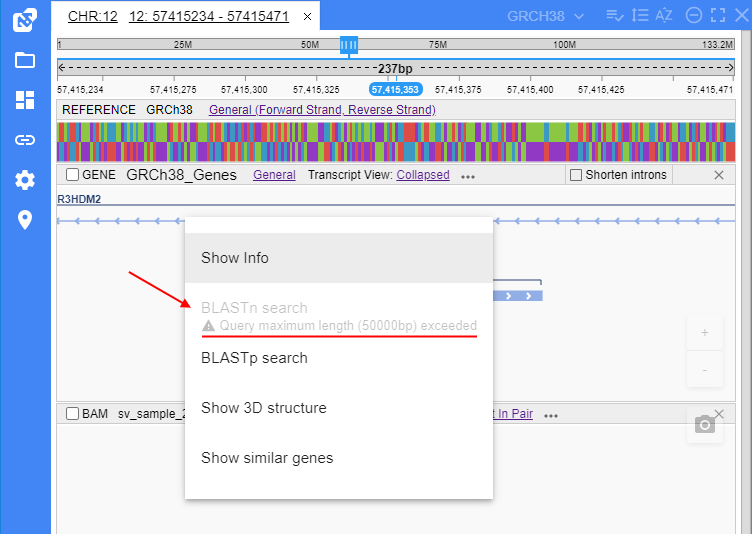

## Taking screenshots

To take a screenshot of a browser, click the **Camera** icon located in the right side of the "**Browser**" panel. The **Camera** icon is transparent by default and becomes opaque when you hover over it:  
    

The screenshot will be saved to the **Downloads** folder of your Web browser.
