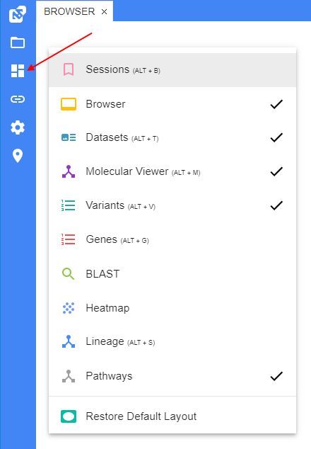
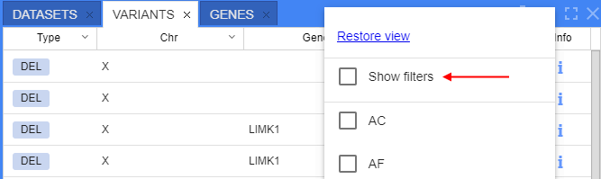
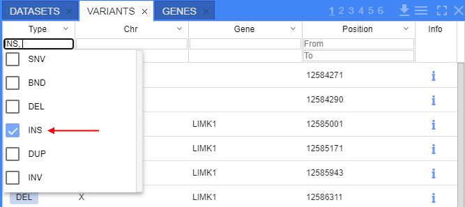
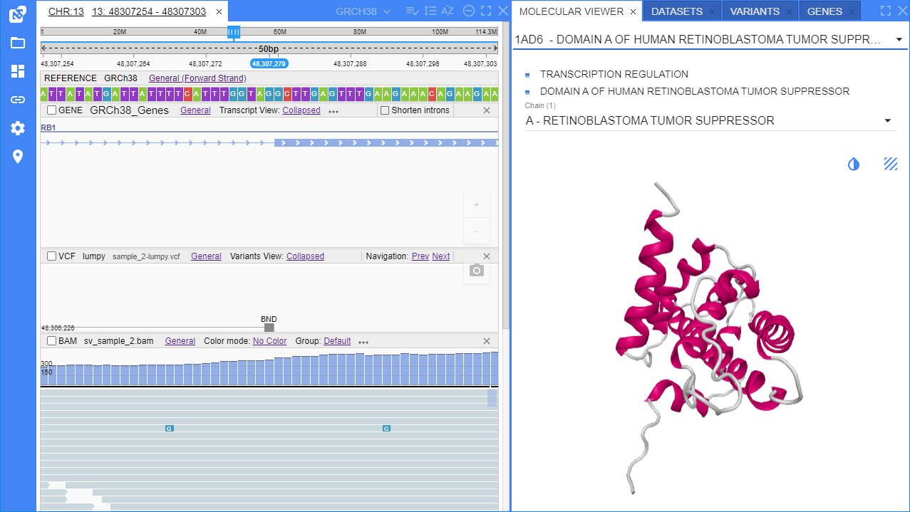
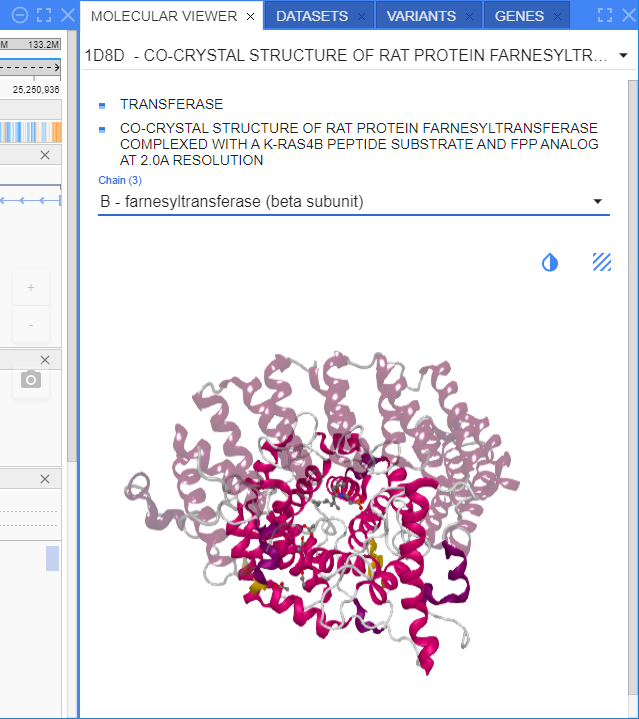

# NGB User Interface

- [Panels](#panels)
    - [Variants panel](#variants-panel)
        - [Filters](#filters-for-variants-panel)
    - [Sessions panel](#sessions-panel)
    - [Molecular viewer panel](#molecular-viewer-panel)
- [Taking screenshots](#taking-screenshots)

## Panels

The NGB user interface is implemented as a set of panels that can be resized, moved, docked anywhere within the browser window, maximized or hidden.

You can use the **VIEWS** menu to see the complete list of available panels and select the panels to be shown or hidden. The **VIEWS** menu is located on the main toolbar of the application:  
    

By default, only following panels are shown: **Browser**, **Datasets**, **Genes** and **Variants**.

You can rearrange the layout of the NGB as follows:

- **To resize a panel** - click and drag the panel's edge
- **To move and dock** a panel - click and hold the panel's title tab and start dragging the panel. As you are dragging the panel, the application will visualize places where the panel can be docked. Hover the panel over the desired place and release the mouse button to dock the panel. Panels could be also arranged as adjacent tabs: to do so, dock the hovered panel's tab next to the other panel's tab.  
    
    
- **To maximize a panel** (full screen size) - click the **[ ]** button on the panel's header. To restore the panel to the previous size, click the the **[ ]** button again.
- **To close a panel** - click the **X** button on the panel's header tab.
- **To show again a panel that was closed** - select it from the **VIEWS** menu.

### Variants panel

This panel is used to show the list of variations loaded from the project's VCF files in a tabular view. If no VCF files were loaded, the table will be empty.

To navigate to a variation, click the variation's row in the table.

By default, only the following columns are shown: **Type**, **Chromosome**, **Gene**, **Position**.  
You can rearrange the list of variants as follows:

- **To sort the variants** by a property - click on the header of the corresponding column. To invert the sorting order, click on the header again:  
    
- **To display or hide extra columns** - select them from the panel options menu. The menu is located on the bar above the table (*hamburger* icon):  
    

#### Filters for variants panel

**Filters** are used to filter variations displayed in the **Variants** panel. You can use one or more parameters to filter variations.  
To open them - click the _hamburger_ icon and select the "**Show filters**" item in the list:  
    

Filter fields will appear under the column headers:  
    

Changing one or more filtering parameters triggers the refreshing of the **Variants** panel:  
      
    

To reset the filter(s):

- for the certain column, click the arrow icon at the column header and select the "**Clear column filter**" item (see **1** at the picture below)
- for all columns simultaneously, click the _trash bin_ icon in the **Variants** panel header (see **2** at the picture below)  
    

To hide the filters row - click the _hamburger_ icon in the **Variants** panel header and unset the "**Show filters**" item.

### Sessions panel

You can bookmark a specific location in the browser.  
This action saves the state of the browser and opened tracks as well - so, it is called "saving the session".  
It can be performed as follows:

- Click the **Location** icon located in the main menu on the left page side. **_Note_**: the **Location** icon is being displayed only when any position/chromosome/reference is opened.
- When clicked, the **Location** button will expand into a textbox.
- Enter the desired session's name in a textbox.
- Press **Enter** key to save the session.  
    

**_Note_**: session bookmarks are stored globally. Panel will show all saved **Sessions**

The **Sessions** panel has the following columns:

- _Name_
- _Chromosome_
- _Start position_
- _End position_

**To sort the sessions** according to a specific property - click the header of the corresponding column, e.g.:  
      
**To navigate to a location** bookmarked in the certain session - click the corresponding row of the table.  
**To delete a session** bookmark - click the **Trash** icon of the corresponding row.

### Molecular viewer panel

The **Molecular Viewer** panel shows the 3D structure of a protein.  
This panel is hidden by default. Select **Molecular Viewer** from the **VIEWS** menu to show the panel.

To view a protein's 3D structure, navigate to a specific location in a browser and click a gene or a transcript on the gene's track.  
This will load the 3D structure of the protein from the RCSB database. Refer to [**Working with Annotations**](annotations.md#retrieving-protein-3d-structures) for details.

If several PDB files are available for a gene/protein, they will be shown as a dropdown list on the top of the panel:  
    

If a PDB file contains multiple protein chains, they will be listed in a dropdown list above the viewer.  
By default, the chain that contains a protein corresponding to the gene will be selected.

The selected chain or multiple changes are opaque, non-selected chains are semi-transparent:  
    

You can rotate the protein's 3D structure and zoom in/out on it.

## Taking screenshots

To take a screenshot of a browser, click the **Camera** icon located in the right side of the "**Browser**" panel. The **Camera** icon is transparent by default and becomes opaque when you hover over it:  
    

The screenshot will be saved to the **Downloads** folder of your Web browser.
