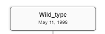
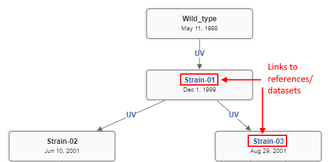

# Strain Lineage

- [Displaying details](#displaying-details)
    - [Node](#node)
    - [Edge](#edge)
    - [Manage the view](#manage-the-view)
- [Format details](#format-details)

NGB supports visualization of a lineage for a family of strains or reference genomes.  
Lineage is represented as a one-directional graph where each node represent a strain (genome) and each edge between nodes represent an impact used to create a progeny from a parent strain.

There are two ways to open lineage-tree in which the current reference (strain) is included:

- from the **General** menu for the reference track at the **Browser** panel:  
  
- from the corresponding item in the **VIEWS** menu:  
  

In both cases, the **Lineage** panel will be opened.  
This panel contains all lineages in which the current opened reference is included.


As the current reference can be included in several lineages - lineage to display is being chosen from the _source_ dropdown list in the top of the panel (only one lineage can be shown at once), e.g.:  
  

## Displaying details

At the top of the lineage, its description is displayed (if exists).  
Strains (tree nodes) are displayed as rectangles with some info inside.  
Links between strains (edges) are displayed as corresponding arrows.

### Node

Each node of the lineage tree has the following attributes:

- **_name_** - strain name that will be displayed on the lineage
- **_description_** - text description of the strain
- **_reference_** (_optional_) - NGB ID/name of the reference that corresponds to the strain
- **_dataset_** (_optional_) - NGB ID/name of the dataset that corresponds to the strain
- **_sequencing date_** - date of the strain creation
- **_metadata_** (_optional_) - a set of key-value metadata attached to the strain

Inside the node, its **_name_** and **_sequencing date_** are displayed:  
  

To view full node's info, including **_description_** and **_metadata_**, you should click the node:  
    
  Node's info block will appear in the right upper corner of the panel.

If a node is not associated with any reference or dataset, its name is displayed as plain text:  
  

If a node is associated with a **_reference_** or a **_dataset_**, node's name is displayed as a hyperlink.  
You can click it to navigate to the reference track or to open the dataset correspondingly (at the same time, the lineage panel remains opened):  
  

If a node is associated simultaneously with a **_reference_** and a **_dataset_**, two hyperlinks will be displayed in the node:

- top hyperlink with _node's name_ that will navigate to the reference track
- bottom hyperlink with _dataset's name_ that will open the corresponding dataset  
  

### Edge

Each edge of the lineage tree has the following attributes:

- **_type of interaction_** (_optional_) - type of the interaction by which the strain was sequenced
- **_metadata_** (_optional_) - a set of key-value metadata attached to the edge

At the edge, its **_type of interaction_** is displayed (if specified), e.g.:  
  

To view full edge's info, including **_metadata_**, you should click the edge:  
    
  Edge's info block will appear in the right upper corner of the panel.

### Manage the view

By default, the lineage-tree is being built according to the size of the panel, with optimal scale and with simple "umbrella" structure.  

But if needs, you can:

- place lineage nodes as you wish - for that, click any node and holding the mouse button move the node where you want.  
E.g., the same lineage from the example above can be restructed in the following way:  
  
- re-locate the whole tree inside the panel - for that, click any empty space near the tree and holding the mouse button move the tree where you want
- zoom-in/out the tree by the mouse scroll when hovering it
- also use additional controls at the right side of the panel to:
    - zoom-in
    - zoom-out
    - revert the view - restore the lineage-tree default view  
    

## Format details

To create a strain lineage tree, two files should be created - one for nodes and one for edges.

Details:

- file format: tab-delimited text file (`TSV` or `TXT`)
- `.` or `-` should be used to display an empty value
- metadata should be a list of `key=value` pairs separated by comma
- dates should be specified in format `yyyy-MM-dd`

The nodes file contains the following columns:

- _name_ - unique name of the node
- _description_ - node description
- _reference\_id_ - NGB reference ID/name (_optional_)
- _dataset_ - NGB dataset ID/name (_optional_)
- _creation\_date_ - creation date
- _attributes_ - list of the node metadata (_optional_)

The edges file contains the following columns:

- _from_ - parent node name. The corresponding name shall exist in the nodes file
- _to_ - child node name. The corresponding name shall exist in the nodes file
- _attributes_ - list of the edge metadata (_optional_)
- _type\_of\_interaction_ - type of interaction (_optional_)

So, the following lineage:  
  
can be described by:

- the following node file, e.g.:

```
name        description       reference_id  dataset  creation_date   attributes
Wild_type   description_wild  -             -        1998-05-11      key1=value1,key2=value2
Strain-01   description_1     -             12       1999-12-01      key1=value1
Strain-02   description_2     -             -        2001-06-10      key2=value2
Strain-03   description_3     22            -        2001-08-29      -
```

- the following edge file, e.g.:

```
from        to          attributes    type_of_interaction
Wild_type   Strain-01   -             UV
Strain-01   Strain-02   key1=value1   UV
Strain-01   Strain-03   -             UV
```
