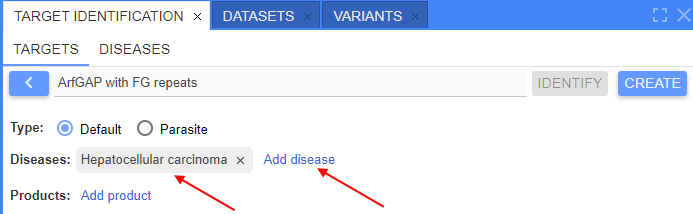
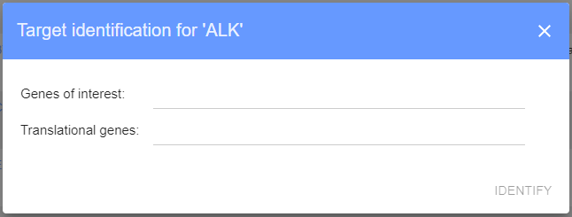
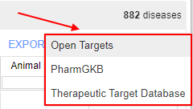
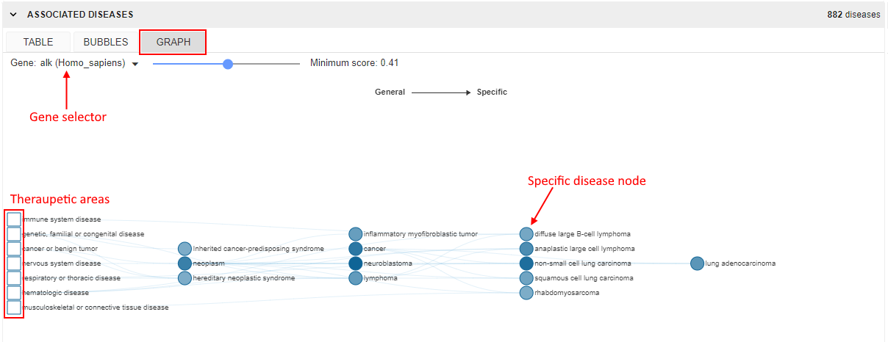
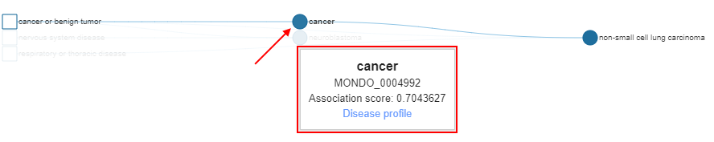

# Target Identification

- [Manage targets](#manage-targets)
    - [Target creation](#target-creation)
        - [Creation from "Targets" panel](#creation-from-targets-sub-panel)
        - [Creation from "Homologs" panel](#creation-from-homologs-panel)
    - [Edit/remove target](#editremove-target)
- [Launch identification](#launch-identification)
- [Identification results](#identification-results)
    - [Description block](#description-block)
    - [Known drugs block](#known-drugs-block)
        - [Associated diseases sub-block](#associated-diseases-sub-block)
        - [Known drugs sub-block](#known-drugs-sub-block)
    - [Sequences block](#sequences-block)
    - [Comparative genomics block](#comparative-genomics-block)
    - [Structure block](#structure-block)
    - [Bibliography block](#bibliography-block)

Via the **Target Identification** panel users can collect identification information about targets of interest (genes), store this information and use it for their own research purposes.

**Target identification** panel can be opened via the **VIEWS** menu and includes sub-tabs:

- **Targets** (_opened by default_) - sub-panel where user can manage targets
- **Identifications** - sub-panel where user can view and manage target identification reports

## Manage targets

**Targets** management sub-tab contains the following objects:

- Table of previously created (added) targets. For each target in that table, there are columns:
    - **Name** - target name. Name is displayed as a hyperlink. By click it, the target details form will be opened
    - **Genes** - genes/transcripts that are included in this target
    - **Species** - species that are included in this target
    - **Disease** - diseases that are associated with the target
    - **Product** - products that are associated with the target
    - Column that contains buttons to launch identification process for the selected target
- Button to add a new target

**_Note_**: if there are more than 2 items in any column of the targets table, additional items will be hidden and only their summary number is shown. Click that number to view details, e.g.:  
    
  

To sort the **Targets** table by the **Name** column - click the corresponding header. To invert the sorting order, click the header again, e.g.:  
  

**Targets** table supports filtering. To filter displayed targets - use one or more parameters to filter items in the table.  
To enable filters - use the menu  in the right upper corner of the panel. The approach is fully the same as described for the [Variants panel](variants.md#filters-for-variants-panel):  
  

  

  

To clear all filters - use the menu  in the right upper corner of the panel.

### Target creation

To create a new target, there are following ways:

- Via GUI:
    - Add a new target manually from the **Targets** sub-tab
    - Create a target from any found orthogroup (using the **Homologs** panel)
- Via CLI

#### Creation from "Targets" sub-panel

To create a new target:

1. Click the "**Add +**" button at the **Targets** sub-panel:  
  
2. The following form will appear:  
    
  This form contains:  
    - button to return to the targets table form
    - field to specify the name of the creating target
    - button to add a gene/transcript to the target
    - button to add an associated disease to the target
    - button to add an associated product to the target
    - button to save the creating target
3. Specify the new target name.
4. Click the button "**+ Gene**" to add a gene/transcript to the target.  
    A new row with empty fields will appear - for the specifying info for a gene - **Gene ID**, **Gene Name**, **Tax ID** (taxonomy ID of species), **Species Name** and **Priority** (priority of the adding gene in the current target's genes list):  
    
5. Specify all fields for a gene/transcript (**Priority** field is non-required, others - mandatory).  
  There are abilities for specifying genes:  
    - fully manual way when you shall specify the value in each field as a plain text
    - "autofilling" with automatically suggested values of genes using appearing ones during the input **Gene ID**/**Gene Name** - these values are being suggested from the existing genes database, e.g.:  
        
      When the gene/gene ID is selected from the suggested list - all other fields (except **Priority**) will be autofilled in:  
      
    - mix of the manual and "autofilling" ways
6. **Priority** can be left empty or manually selected from the list:  
  
7. By the described way (steps 4-6), add desired number of genes/transcripts. Near each gene/transcript, there is a button to remove gene from the list, e.g.:  
  
8. Add disease(s) associated with the target (_optionally_).  
  To add a disease, click the corresponding field and specify the disease manually. After the input, press _Enter_ key, e.g.:  
    
  You may add any count of associated diseases by the described way. To remove a disease from the list - use the cross button near the disease name.
9. Add product(s) associated with the target (_optionally_).  
  To add a product, click the corresponding field and specify the product manually. After the input, press _Enter_ key, e.g.:  
    
  You may add any count of associated products by the described way. To remove a product from the list - use the cross button near the product name.
10. Once all desired values are added - click the **Save** button.  
  Target will be saved, the **Remove** button will appear, the **Save** button will become disabled:  
    
  Click the button  to return to the **Targets** table. Just created target will appear in the list:  
  

#### Creation from "Homologs" panel

To create a new target from the "Homologs" panel:

1. Open the [Homologs](homologs-search.md) panel and any sub-tab with the found list of homologous orthogroups ("**Homologene**" or "**Orthologs & Paralogs**")
2. Right-click any orthogroup from the search results list to view the context menu, e.g.:  
    
  Select the item "_Create target_" from the context menu.
3. The pre-filled form of the target creation will appear:  
    
  Here, the following fields will be autofilled in:  
    - target field with a name for the creating target - by default, it will be the name of the first gene from the selected orthogroup
    - list of all genes from the selected orthogroup (in the **Gene Name** column)
4. Specify necessary missing info into empty fields.
5. Otherwise, the procedure is the same as in the section [above](#creation-from-targets-sub-panel).

### Edit/remove target

To edit previously created target:

1. Click the target row/name in the **Targets** table, e.g.:  
    
2. The form similar to the target's creation form will be opened:  
    

Here, you can edit the target (edit target name, add/edit/remove genes from the list, add/remove diseases and products) and then save changes or remove the target - by the corresponding buttons.

## Launch identification

To launch a new identifying process:

1. Find the target in the **Targets** table and click the button to launch identification process, e.g.:  
  
2. The pop-up will appear according to the selected target - to define parameters (species of interest and translational species):  
  
3. Here, the following items shall be specified:
    - _species of interest_ - list of species of interest. Corresponds to species for which gene (target) the identification will be performed. Species can be selected only from ones that were added to the current target. Multiselect is supported
    - _translational species_ - list of species to which the gene comparison shall be performed during the identification. Species can be selected only from ones that were added to the current target. Multiselect is supported
4. Once all fields are specified, click the **Identify** button to launch the identification, e.g.:  
    
  

## Identification results

**Identifications** sub-tab contains identification results. Here, users can:

- view summary results of the current/selected identification process
- view the current/selected identification details
- go up a level to view a list of previously identifications with the ability to open any of them

Once the new identifying process is finished, the **Identifications** sub-tab will be automatically opened with the identification results (report):  
  

Identification report form contains:

- Button to go up a level to view identification reports' list form
- Label with the target name
- List of _species of interest_ and list of _translational species_ used for the identification
- Button to store the report. **_Note_**: if this button is not clicked for a report - it will be removed once closed
- Summary of the report presented target identification info as a set of tiles
- For each summary block, there is an expandable corresponding section under the tiles section. Such sections contain detailed info of the target identification.

Summary tiles:

- _Description block_ - contains short overview of the main target gene with link(s) to the source(s) from which the description is:  
  
- _Known drugs block_ - tile with the information about:
    - count of associated diseases to the target gene(s)
    - count of known drugs - drugs with investigational or approved indications targeting the current target gene(s)  
    
- _Sequences block_ - tile with the number of found sequence(s) corresponding to the target and its _species of interest_. Separately, it shows:
    - count of found DNA sequences
    - count of found RNA sequences
    - count of found protein sequences  
    
- _Comparative genomics block_ - tile with the short information about homologous genes:
    - count of paralogs of the current target gene(s) /transcrition(s) in the _species of interest_
    - count of orthologs of the current target gene(s) in the translational species  
    
- _Structure block_ - tile with the short information about the structure of the target gene(s)/transcription(s) - number of found models:  
    
- _Bibliography block_ - tile with the information about number of references corresponding to publications, literature, articles that mentioned the target gene(s) in the _species of interest_:  
    

Below, there are details by each expandable block.

### Description block

This block contains summary description of the target gene(s) with the link(s) to the source(s) from which the description is constructed.  
Description is being obtained for all _species of interest_ and merged.

Example of view:  
  

### Known drugs block

This block contains:

- sub-block with diseases (opened by default) - list of _diseases associated_ with the current target gene(s) - as a table of associated scores of each disease to the current target
- sub-block with known drugs - list of drugs with investigational or approved indications targeting the current target gene(s) according to their curated mechanism of action

Information for this block is obtained from different sources (different databases). Therefore information from each database is shown in separate tables - switching between sources is being performed by the corresponding dropdown list in the right upper corner of the block:  
  

#### Associated diseases sub-block

The view described below is for [**Open Targets**](https://platform.opentargets.org/) source only.

Block contains info about diseases associated with the target gene.  
There are several views of data representation. Specific view can be selected by the special control inside the block, on the left side.

Available views:

**Table view** (_default_)

In this view, diseases associated with the target are presented as a table.  
The table includes columns:

- _Target_ - gene/transcript name. Allows to filter the table by the specific gene from the target
- _Disease_ - disease name associated with the target. Each disease is the hyperlink to the corresponding page in [**Open Targets**](https://platform.opentargets.org/). Allows to filter the table by the specific disease associated with the target
- _Overall score_ - summary score of all target-disease association scores
- other columns - specific target-disease association scores. For more details see [Associations info page](https://platform-docs.opentargets.org/associations).

Table itself is colorized as a heatmap - according to the score value in each cell.

By default, table is sorted by the _Overall score_ column.  
Table supports sorting by any column. Click the column header to sort by this column. To invert the sorting order, click the header again.

**Bubbles view**

This view provides a hierarchical representation of the associated diseases using encapsulated bubbles:

- Each associated disease is presented as a bubble colored by its overall association score.
- Big circles represent all the therapeutic areas (from the **Open Targets** platform). Such circles contain associated diseases bubbles inside.
- As the same disease can belong to more than one therapeutic area, diseases bubbles can be duplicated.  
  

There is the ability to adjust the view of bubbles using a minimum score filter in the upper side of the view (slider control).  
By setting this score, only bubbles with overall score above it will be displayed at the diagram, e.g.:  
  

Hovering over any disease bubble, a tooltip appears with details:

- associated disease name and ID
- overall association score of this disease
- hyperlink to the corresponding disease page in **Open Targets** platform

  

**Graph view**

This view shows the subset of the directed acyclic graph containing the therapeutic areas (from the **Open Targets** platform) on the left side and associated diseases for the current target on the right.  
Disease nodes are colored by their overall association scores.

There is the ability to adjust the view of nodes using a minimum score filter in the upper side of the view (slider control).  
By setting this score, only nodes with overall score above it will be displayed at the diagram, e.g.:  
  

Hovering over any disease node, a tooltip appears with details:

- associated disease name and ID
- overall association score of this disease
- hyperlink to the corresponding disease page in _Open Targets_ platform

  

#### Known drugs sub-block

The view described below is for [Open Targets](https://platform.opentargets.org/) source only.

Block contains a table with known drugs that treat diseases associated with the current target:  
  

Table includes columns:

- _Target_ - gene/transcript name. Allows to filter the table by the specific gene from the target
- _Drug_ - drug name. Each drug is presented as a hyperlink to the corresponding page in **Open Targets** platform
- drug details columns:
    - _Type_ - drug type (antibody, cell, enzyme, molecule, protein, etc.)
    - _Mechanism of action_ - drug action to the target (includes action type and target name)
    - _Action type_ - drug action type
- _Disease_ - disease name treated by the drug. Each disease is a hyperlink to the corresponding page in **Open Targets** platform
- clinical trials info columns:
    - _Phase_ - current stage of a clinical trial studying a drug
    - _Status_ - state of the current clinical trial phase
    - _Source_ - hyperlink to the corresponding page of the clinical trial

By default, table is sorted by the _Drug_ column.  
Table supports sorting by any column. Click the column header to sort by this column. To invert the sorting order, click the header again.

Table supports filtering. To filter displayed drugs - specify the desired value(s) to the filter field(s) under headers row.  

### Sequences block

### Comparative genomics block

### Structure block

### Bibliography block
