# Target Identification

- [Manage targets](#manage-targets)
    - [Target creation](#target-creation)
        - [Creation from "Targets" panel](#creation-from-targets-sub-panel)
        - [Creation from "Homologs" panel](#creation-from-homologs-panel)
    - [Edit/remove target](#editremove-target)
- [Launch identification](#launch-identification)
- [Identification results](#identification-results)
    - [Description block](#description-block)
    - [Known drugs block](#known-drugs-block)
    - [Associated diseases block](#associated-diseases-block)
    - [Sequences block](#sequences-block)
    - [Comparative genomics block](#comparative-genomics-block)
        - [Alignment panel](#alignment-panel)
    - [Structure block](#structure-block)
    - [Bibliography block](#bibliography-block)
    - [Chat with AI](#chat-with-ai)
        - [AI model settings](#ai-model-settings)
- [Diseases search](#diseases-search)
    - [Associated drugs](#associated-drugs)
    - [Associated targets](#associated-targets)

Via the **Target Identification** panel users can collect identification information about targets of interest (genes), store this information and use it for their own research purposes.

**Target identification** panel can be opened via the **VIEWS** menu and includes sub-tabs:

- [**Targets**](#manage-targets) (_opened by default_) - sub-panel where user can manage targets
- [**Identifications**](#identification-results) - sub-panel where user can view and manage target identification reports
- [**Diseases**](#diseases-search) - sub-panel where user can search for drugs and targets associated with a specific disease

## Manage targets

**Targets** management sub-tab contains the following objects:

- Table of previously created (added) targets. For each target in that table, there are columns:
    - **Name** - target name. Name is displayed as a hyperlink. By click it, the target details form will be opened
    - **Genes** - genes/transcripts that are included in this target
    - **Species** - species that are included in this target
    - **Diseases** - diseases that are associated with the target
    - **Products** - products that are associated with the target
    - **Owner** - name of the user who created the target
    - Column that contains buttons to launch identification process for the selected target
- Button to add a new target

**_Note_**: if there are more than 2 items in any column of the targets table, additional items will be hidden and only their summary number is shown. Click that number to view details, e.g.:  
  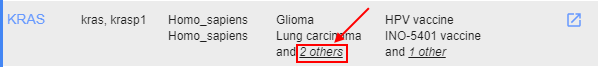  
  

To sort the **Targets** table by the **Name** column - click the corresponding header. To invert the sorting order, click the header again, e.g.:  
  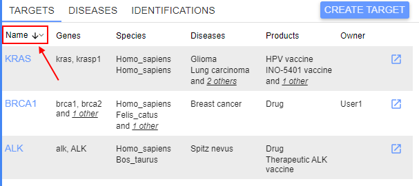

**Targets** table supports filtering. To filter displayed targets - use one or more parameters to filter items in the table.  
To enable filters - use the menu  in the right upper corner of the panel. The approach is fully the same as described for the [Variants panel](variants.md#filters-for-variants-panel):  
  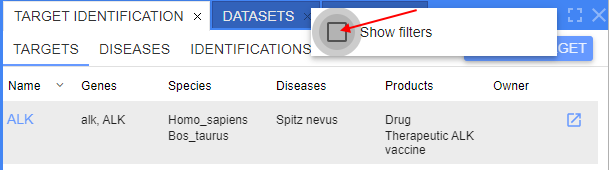

  

  

To clear all filters - use the menu  in the right upper corner of the panel.

### Target creation

To create a new target, there are following ways:

- Via GUI:
    - Add a new target manually from the **Targets** sub-tab
    - Create a target from any found orthogroup (using the **Homologs** panel)
- Via CLI

#### Creation from "Targets" sub-panel

To create a new target:

1. Click the "**Create target**" button at the **Targets** sub-panel:  
  
2. The following form will appear:  
    
  This form contains:  
    - button to return to the targets table form
    - field to specify the name of the creating target
    - button to add a gene/transcript to the target
    - button to add an associated disease to the target
    - button to add an associated product to the target
    - button to save the creating target
3. Specify the new target name.
4. Click the button "**Add gene**" to add a gene/transcript to the target.  
    A new row with empty fields will appear - for the specifying info for a gene - **Gene ID**, **Gene Name**, **Tax ID** (taxonomy ID of species), **Species Name** and **Priority** (priority of the adding gene in the current target's genes list):  
    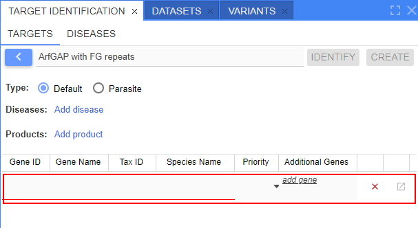
5. Specify all fields for a gene/transcript (**Priority** field is non-required, others - mandatory).  
  There are abilities for specifying genes:  
    - fully manual way when you shall specify the value in each field as a plain text
    - "autofilling" with automatically suggested values of genes using appearing ones during the input **Gene ID**/**Gene Name** - these values are being suggested from the existing genes database, e.g.:  
        
      When the gene/gene ID is selected from the suggested list - all other fields (except **Priority**) will be autofilled in:  
      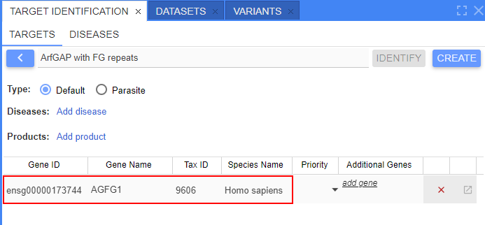
    - mix of the manual and "autofilling" ways
6. **Priority** can be left empty or manually selected from the list:  
  
7. By the described way (steps 4-6), add desired number of genes/transcripts. Near each gene/transcript, there is a button to remove gene from the list, e.g.:  
  
8. Add disease(s) associated with the target (_optionally_).  
  To add a disease, click the corresponding field and specify the disease manually. After the input, press _Enter_ key, e.g.:  
    
  You may add any count of associated diseases by the described way. To remove a disease from the list - use the cross button near the disease name.
9. Add product(s) associated with the target (_optionally_).  
  To add a product, click the corresponding field and specify the product manually. After the input, press _Enter_ key, e.g.:  
    
  You may add any count of associated products by the described way. To remove a product from the list - use the cross button near the product name.
10. Once all desired values are added - click the **Create** button.  
  Target will be saved, the **Remove** button will appear, the **Save** button will become disabled:  
  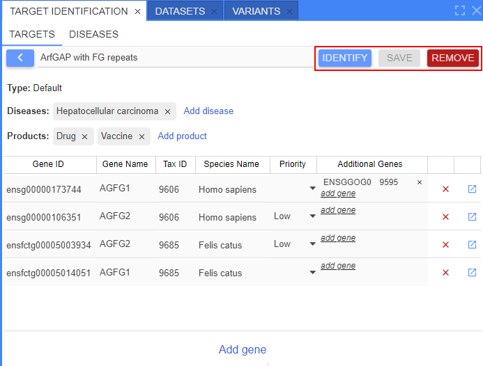  
  Click the button  to return to the **Targets** table. Just created target will appear in the list:  
  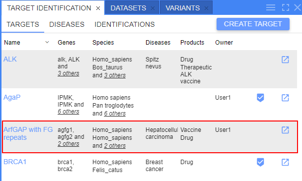

#### Creation from "Homologs" panel

To create a new target from the "Homologs" panel:

1. Open the [Homologs](homologs-search.md) panel and any sub-tab with the found list of homologous orthogroups ("**Homologene**" or "**Orthologs & Paralogs**")
2. Right-click any orthogroup from the search results list to view the context menu, e.g.:  
    
  Select the item "_Create target_" from the context menu.
3. The pre-filled form of the target creation will appear:  
  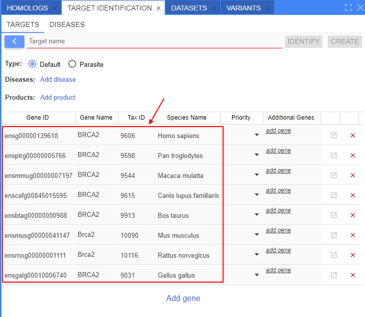  
  Here, list of all genes from the selected orthogroup will be autofilled in.
4. Specify the name for the creating target.
5. Specify another missing info, if necessary.
6. Otherwise, the procedure is the same as in the section [above](#creation-from-targets-sub-panel).

### Edit/remove target

To edit previously created target:

1. Click the target row/name in the **Targets** table, e.g.:  
  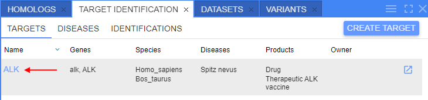  
2. The form similar to the target's creation form will be opened:  
  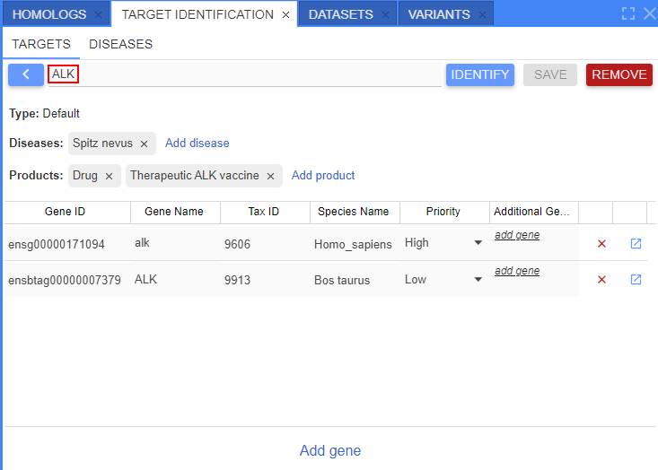  

Here, you can edit the target (edit target name, add/edit/remove genes from the list, add/remove diseases and products) and then save changes or remove the target - by the corresponding buttons.

## Launch identification

To launch a new identifying process:

1. Find the target in the **Targets** table and click the button to launch identification process, e.g.:  
  
2. The pop-up will appear according to the selected target - to define parameters (species of interest and translational species):  
  
3. Here, the following items shall be specified:
    - _Genes of interest_ - list of species of interest. Corresponds to species for which gene (target) the identification will be performed. Species can be selected only from ones that were added to the current target. Multiselect is supported
    - _Translational genes_ - list of species to which the gene comparison shall be performed during the identification. Species can be selected only from ones that were added to the current target. Multiselect is supported
4. Once all fields are specified, click the **Identify** button to launch the identification, e.g.:  
    
  

## Identification results

**Identifications** sub-tab contains identification results. Here, users can:

- view summary results of the current/selected identification process
- view the current/selected identification details
- go up a level to view a list of previously identifications with the ability to open any of them

Once the new identifying process is finished, the **Identifications** sub-tab will be automatically opened with the identification results (report):  
  

Identification report form contains:

- Button to go up a level to view identification reports' list form
- Label with the target name
- List of _species of interest_ and list of _translational species_ used for the identification
- Button to store the report. **_Note_**: if this button is not clicked for a report - it will be removed once closed
- Description section with short overview of the main target gene with link(s) to the source(s) from which the description is
- Set of expandable sections - these sections contain detailed info of the target identification

Below, there are details by each expandable block.

### Description block

This block contains summary description of the target gene(s) with the link(s) to the source(s) from which the description is constructed.  
Description is being obtained for all _species of interest_ and merged.

Example of view:  
  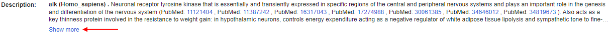  
  

### Known drugs block

This block contains info about _drugs_ with investigational or approved indications targeting the current target gene(s) according to their curated mechanism of action.

When the block is collapsed - its header contains short info about the count of unique drugs associated to the target gene(s) and the total count of records with these drugs in databases:  
  

When the block is expanded - it contains a table with known drugs that treat diseases associated with the current target:  
  

Information for this block is obtained from different sources (different databases).  
Therefore information from each database can vary - switching between sources is being performed by the corresponding dropdown list in the right upper corner of the block:  
  

For [**Open Targets**](https://platform.opentargets.org/) source (see the image above), table includes columns:

- _Target_ - gene/transcript name. Allows to filter the table by the specific gene from the target
- _Drug_ - drug name. Each drug is presented as a hyperlink to the corresponding page in **Open Targets** platform
- drug details columns:
    - _Type_ - drug type (antibody, cell, enzyme, molecule, protein, etc.)
    - _Mechanism of action_ - drug action to the target (includes action type and target name)
    - _Action type_ - drug action type
- _Disease_ - disease name treated by the drug. Each disease is a hyperlink to the corresponding page in **Open Targets** platform
- clinical trials info columns:
    - _Phase_ - current stage of a clinical trial studying a drug
    - _Status_ - state of the current clinical trial phase
    - _Source_ - hyperlink to the corresponding page of the clinical trial

***

For [**DGIdb**](https://www.dgidb.org/) source, table includes columns:

- _Target_ - gene/transcript name. Allows to filter the table by the specific gene from the target
- _Drug_ - drug name. Each drug is presented as a hyperlink to the corresponding page in **DGIdb** platform
- _Interaction claim source_ - source (knowledge base) from which the info about drug is received
- _Interaction types_ - type(s) of the drug interaction

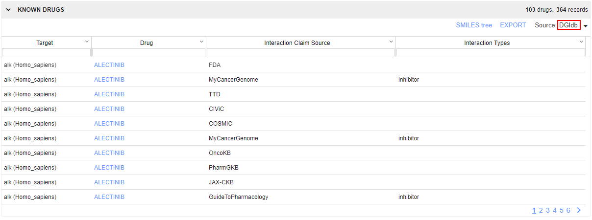

***

For [**PharmGKB**](https://www.pharmgkb.org/) source, table includes columns:

- _Target_ - gene/transcript name. Allows to filter the table by the specific gene from the target
- _Drug_ - drug name. Each drug is presented as a hyperlink to the corresponding page in **PharmGKB** platform
- _Source_ - source (knowledge base) from which the info about drug is received

By default (no matter which source is selected), table is sorted by the _Drug_ column.  
Table supports sorting by any column. Click the column header to sort by this column. To invert the sorting order, click the header again.

Table supports filtering. To filter displayed drugs - specify the desired value(s) to the filter field(s) under headers row.

To export table content in CSV format - click the corresponding **Export** button above the table. Export to the local workstation will be started automatically.

### Associated diseases block

This block contains info about _diseases associated_ with the current target gene(s).

When the block is collapsed - its header contains short info about the count of associated diseases to the target gene(s):  
  

When the block is expanded - it contains info about diseases associated with the target gene:  
  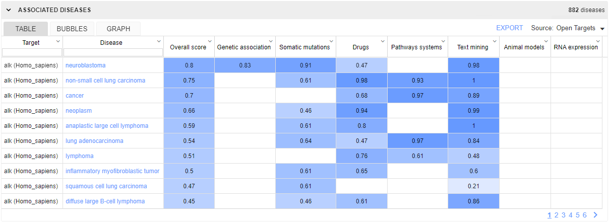

Information for this block is obtained from different sources (different databases).  
Therefore information from each database can vary - switching between sources is being performed by the corresponding dropdown list in the right upper corner of the block:  
  

For different source databases, there could be several views of data representation - each view can be selected by the special control (tab selector) inside the block, on the upper side.

Available views for [**Open Targets**](https://platform.opentargets.org/) source:

**Table view** (_default_)

In this view, diseases associated with the target are presented as a table.  
The table includes columns:

- _Target_ - gene/transcript name. Allows to filter the table by the specific gene from the target
- _Disease_ - disease name associated with the target. Each disease is the hyperlink to the corresponding page in **Open Targets** platform. Allows to filter the table by the specific disease associated with the target
- _Overall score_ - summary score of all target-disease association scores
- other columns - specific target-disease association scores. For more details see [Associations info page](https://platform-docs.opentargets.org/associations).

Table itself is colorized as a heatmap - according to the score value in each cell.

By default, table is sorted descending by the _Overall score_ column.  
Table supports sorting by any column. Click the column header to sort by this column. To invert the sorting order, click the header again.

Table supports filtering by columns _Target_ and _Disease_. To filter displayed targets - specify the desired value(s) to the filter field(s) under headers row.

To export table content in CSV format - click the corresponding **Export** button above the table. Export to the local workstation will be started automatically.

**Bubbles view**

This view provides a hierarchical representation of the associated diseases using encapsulated bubbles:

- Each associated disease is presented as a bubble colored by its overall association score.
- Big circles represent all the therapeutic areas (from the **Open Targets** platform). Such circles contain associated diseases bubbles inside.
- As the same disease can belong to more than one therapeutic area, diseases bubbles can be duplicated.  
- There is the ability to select a gene from target genes for which the representation of the associated diseases will be displayed.

There is the ability to adjust the view of bubbles using a minimum score filter in the upper side of the view (slider control).  
By setting this score, only bubbles with overall score above it will be displayed at the diagram, e.g.:  
  

Hovering over any disease bubble, a tooltip appears with details:

- associated disease name and ID
- overall association score of this disease
- hyperlink to the corresponding disease page in **Open Targets** platform

  

**Graph view**

This view shows the subset of the directed acyclic graph containing the therapeutic areas (from the **Open Targets** platform) on the left side and associated diseases for the current target on the right.  
Disease nodes are colored by their overall association scores.  
There is the ability to select a gene from target genes for which the representation of the associated diseases will be displayed.

There is the ability to adjust the view of nodes using a minimum score filter in the upper side of the view (slider control).  
By setting this score, only nodes with overall score above it will be displayed at the diagram, e.g.:  
  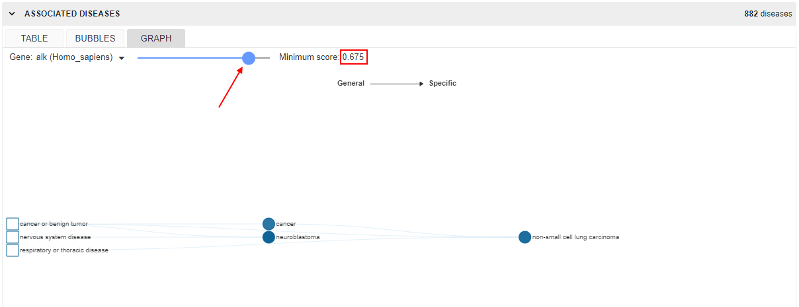

Hovering over any disease node, a tooltip appears with details:

- associated disease name and ID
- overall association score of this disease
- hyperlink to the corresponding disease page in **Open Targets** platform

  

***

For [**PharmGKB**](https://www.pharmgkb.org/) source, only **Table view** is available.  
In this view, diseases associated with the target are presented as a table.  
The table includes columns:

- _Target_ - gene/transcript name. Allows to filter the table by the specific gene from the target
- _Disease_ - disease name associated with the target. Each disease is the hyperlink to the corresponding page in **PharmGKB** platform. Allows to filter the table by the specific disease associated with the target

By default, table is sorted descending by the _Target_ column.  
Table supports sorting by any column. Click the column header to sort by this column. To invert the sorting order, click the header again.

Table supports filtering. To filter displayed targets - specify the desired value(s) to the filter field(s) under headers row.

To export table content in CSV format - click the corresponding **Export** button above the table. Export to the local workstation will be started automatically.

### Sequences block

This block contains list of sequence(s) corresponding to the target - DNA, RNA, proteins.

When the block is collapsed - its header contains short summary info about the number of found related sequences to the target gene(s):  
  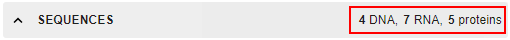

When the block is expanded - it contains list of sequences related to the specific target gene, e.g.:  
  

Switching between target genes is being performed by the corresponding dropdown list in the right upper corner of the block:  
  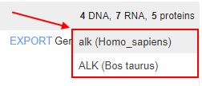

In the top of the block, there is an info about DNA sequence of the gene (if it is found), e.g.:  
  

Such block includes:

- gene DNA accession. If this gene is presented in any dataset of the current NGB deployment - accession is shown as a hyperlink, user may click such link - the gene track will be opened for that gene, e.g.:  
  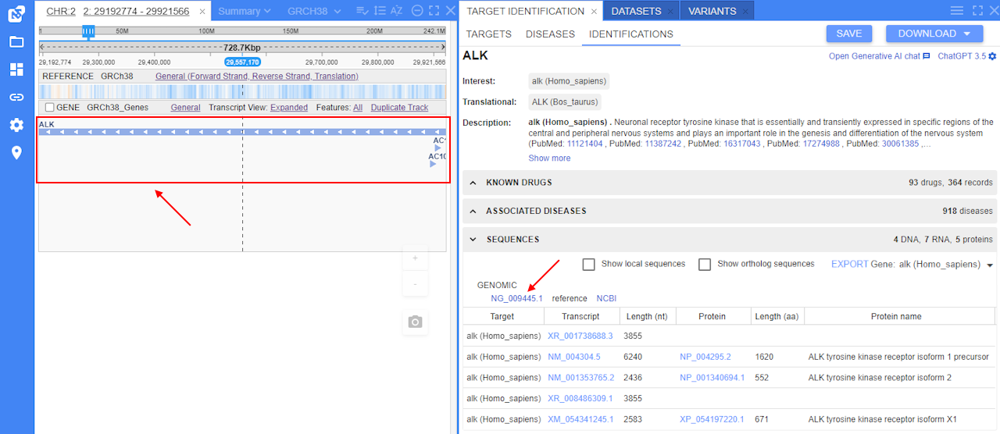
- reference to the corresponding NCBI page

List of transcripts related to the specific target gene is presented as a table:  
  

Such table includes columns:

- _Target_ - gene/transcript name
- _Transcript_ - transcript accession. Each transcript is the hyperlink to the corresponding page in NCBI platform
- _Length (nt)_ - transcript length (number of nucleotides in the sequence)
- _Protein_ - protein accession. Each protein is the hyperlink to the corresponding page in NCBI platform
- _Length (aa)_ - protein length (number of amino acid items in the sequence)
- _Protein name_ - name of the protein

### Comparative genomics block

This block contains:

- list of homologous genes for the target genes:
    - in the _species of interest_
    - in the _translational species_
- alignment panel that allows to align genes in species of interest to genes in translational species

Table with homologous genes includes columns:

- _Target_ - target gene name
- _Species_ - species name of homologous gene (by default, it is selected from species of interest or translational species of the current identification)
- _Homology type_ - type of homology (ortholog/paralog/homolog)
- _Homologue_ - homologous gene name. It is a hyperlink to the corresponding gene page in NCBI
- _Homology group_ - feature of gene homology
- coding protein info:
    - _Protein_ - protein name
    - _Aa_ - protein sequence length
    - _Domains_ - for an approximate image of the conserved protein domains. Each image contains:
        - a line for a full protein length
        - one or several color rectangles - each for the specific conserved domain. Different domains are drawn by different colors, the same domains are drawn in the same colors

Table supports filtering by columns _Target_, _Species_ and _Homology Type_. To filter the displayed list - specify the desired value(s) to the filter field(s) under headers row.

#### Alignment panel

Under homologs table, there is the **Alignment panel** that allows to align protein sequences of genes in species of interest to homologous genes in translational species and vice versa.

To perform an alignment:

1. Select the target gene from the dropdown list - to which the alignment will be performed, e.g.:  
  
2. Select the specific protein of the target gene for the alignment, e.g.:  
  
3. In a similar way, select the query gene (which will be aligned) from the dropdown list - and its specific protein for the alignment.
4. Click the **Align** button:  
  
5. Alignment of the selected protein sequences will appear below:  
    
  Above the alignment, displayed:  
    - the count of identities between sequences (by symbols) and its percent value
    - the count of gaps (by symbols) and its percent value  
  **_Note_**: how to "read" alignments you can see in the corresponding section of the BLAST search manual - [here](blast-search.md#alignments-info).

Additionally, users can view the comparison of aligned protein sequences on the track in the **Browser** panel.

> **_Note_**: it is possible only if the reference of the selected target gene is registered in the current deployment of NGB.  

To view such comparison - click the button **View on track** after performed alignment:  
  

Opened comparison is shown at a separate track.  
Please note that comparison visualization does not show exact location of the alignment, it highlights the whole gene feature instead.

### Structure block

This block contains structures related to the target gene(s)/transcription(s) and allows to view found structure models.

When the block is collapsed - its header contains short summary info about the number of found structures related to the target gene(s):  
  

When the block is expanded - it contains list of structures related to the target:  
  

Information for this block is obtained from different sources (databases), local sources are also supported.  
Switching between sources is being performed by the corresponding dropdown list in the right upper corner of the block:  
  

List of structures related to the target is presented as a table:  
  

Such table includes columns (set of columns may vary due to selected source):

- _ID_ - structure ID in a database. It is presented as a hyperlink to the corresponding page of the structure in the selected database (e.g., [PDB](https://www.rcsb.org/))
- _Name_ - structure name
- _Method_ - method by which the structure is obtained
- _Source_ - source database of the structure
- _Resolution_ - a measure of the quality of the data (level of details presented in the diffraction pattern)
- _Chains_ - name of macromolecule's polymeric chain of the current gene/protein
- _Owner_ - owner user name of the structure file (_only for local sources_)

Table supports filtering by _ID_ and _Name_ columns. To filter by any of these columns - specify the filter text to the field under the header of the column, e.g.:  
  

To open the structure model in a viewer - click its row in the table, e.g.:  
    
Structure model is being opened in the 3D viewer.  
This viewer is identical to the one using as NGB [Molecular Viewer](overview.md#molecular-viewer-panel).

### Bibliography block

This block contains references corresponding to publications, literature, articles that mentioned the target gene(s) in the _species of interest_.  
Main source of these publications - [**PubMed**](https://pubmed.ncbi.nlm.nih.gov/).

When the block is collapsed - its header contains short info about the summary count of all publications mentioned the target gene(s):  
  

When the block is expanded - it contains list of references to publications mentioned the target gene(s).  
Each reference contains:

- publication title - as the hyperlink to the corresponding publication on **PubMed**
- list of publication authors
- publication source title and date

There is the ability to generate a summary of the found bibliography using AI capabilities.

> **_Note_**: this summary is generated using pretrained AI language model and its text generation functionality.  
> For the summary, only abstracts of the several "top" (most relevant) publications are used.  
> As the summary is generated by AI and this process is poorly controlled, the summary block can vary for each request for the same list of publications.

To generate a summary of the found bibliography - click the corresponding button in the upper side of the block:  
  

It takes some time to generate the summary. Once the summary is prepared - it will appear in the upper side of the block:  
  

You can (re)generate the summary in the described way as many times as you need.  

> **_Note_**: you can change the AI model that will be used for the Bibliography summary generation - select the model from the dropdown list of AI settings - see details in the section [below](#ai-model-settings).  
> Once the model is changed - the summary will be regenerated with that AI model, e.g.:  
>   

### Chat with AI

Additional ability, available for users at the identification results' form - AI chat.  
There is a simple build-in chat like [ChatGPT](https://chat.openai.com/) where user can try to find answer for medical or bioinformatics questions .

To open chat:

1. Click the corresponding hyperlink in the right upper corner of the **Identifications** tab:  
  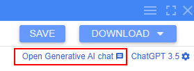
2. Chat will be opened in the left bottom corner of the page:  
  
3. To start chat - just specify your question in the field and press Enter key, e.g.:  
  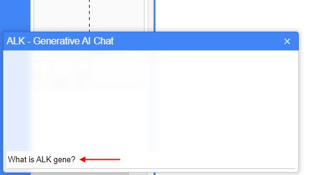
4. The answer will appear in a few seconds:  
  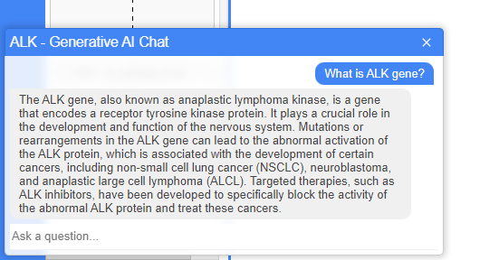
5. You may ask any count of questions here by the described way.

#### AI model settings

You can change the language model that will be used in chat - select the desired model from the dropdown list of AI settings in the right upper corner of the **Identifications** tab:  
    
  

> **_Notes_**:
>
> - not all models are supported for the chat
> - changing of the model here affects the process of the summary generation of the [Bibliography](#bibliography-block)

Also, you can configure each AI model used here:

1. Open the dropdown list of AI models in the right upper corner of the **Identifications** tab.
2. Click the **Configure model** item in the list:  
  
3. The pop-up with model's configuration will appear:  
    
  Here, the following options are available:  
    - **Model** - select the AI model for which settings will be configured.
    - **Temperature** - defines the degree of randomness in model responses. A higher temperature makes the model's answers more varied and creative. A lower temperature makes the answers more focused and consistent.
    - **Max size** - defines the maximum size of tokens that can be used for model responses. Refers to the limit on the number of words, characters, or chunks of text that the language model can handle at once.
4. Once options are configured - click the **OK** button to save them and apply new config.

***

## Diseases search

**Diseases** sub-tab allows users:

- to search for a disease
- to view the following information for the found disease:
    - name, synonyms, description
    - known drugs associated with this disease
    - targets associated with this disease

By default, **Diseases** sub-tab is empty and contains:

- Search input field - to specify the desired disease name
- **Search** button - to perform the search

To start the search, user shall specify disease name or its part to the input field.  
Search results will be suggested in the Google-like manner - with appearing of suitable values during the disease name input, e.g.:  
  

User can select one of the suggested values by click it or continue to specify the own value.  
To perform the search, user shall click the corresponding button.  

> **_Note_**: additionally, users have the ability to search for disease's associated drugs and targets from the **Target Identification** results - namely from the [**Associated diseases**](#associated-diseases-block) section.  
> To search for a disease from that section, user shall open the context menu (mouse right-click) for the desired disease in the **Associated diseases** table and select the corresponding item, e.g.:  
>   

Once the desired disease is found, the following form with results will appear, e.g.:  
  

Report form of the found disease contains:

- search input field and the **Search** button - to perform another disease search
- current disease info block:
    - name
    - list of synonyms of the found disease
    - description
- set of expandable sections. There are:
    - **Known drugs** - section with the information about drugs with investigational or approved indications for the current disease
    - **Associated targets** - section with the information about targets associated with the current disease

Below, there are details by each expandable section.

### Associated drugs

This section contains:

- table for investigational or approved drugs indicated for the current disease
- button to export table content to the local workstation in CSV format

Information for this section is obtained from [**Open Targets**](https://platform.opentargets.org/) platform.  
Table includes columns:

- _Target_ - symbol of the associated target
- drug details columns:
    - _Drug_ - drug name. It is a hyperlink to the corresponding page in **Open Targets** platform
    - _Type_ - drug type (antibody, cell, enzyme, molecule, protein, etc.)
    - _Mechanism of action_ - drug action to the target (includes action type and target name)
    - _Action type_ - drug action type
- _Target name_ - name of the associated target
- clinical trials info columns:
    - _Phase_ - current stage of a clinical trial studying the drug
    - _Status_ - state of the current clinical trial phase
    - _Source_ - hyperlink to the corresponding page of the clinical trial

By default, table is sorted by the _Target_ column.  
Table supports sorting by any column. Click the column header to sort by this column. To invert the sorting order, click the header again.

Table supports filtering. To filter displayed drugs - specify the desired value(s) to the filter field(s) under headers row.

To export table content in CSV format - click the corresponding **Export** button above the table. Export to the local workstation will be started automatically.

### Associated targets

This section contains:

- table for targets associated with the current disease
- button to export the table content to the local workstation in CSV format

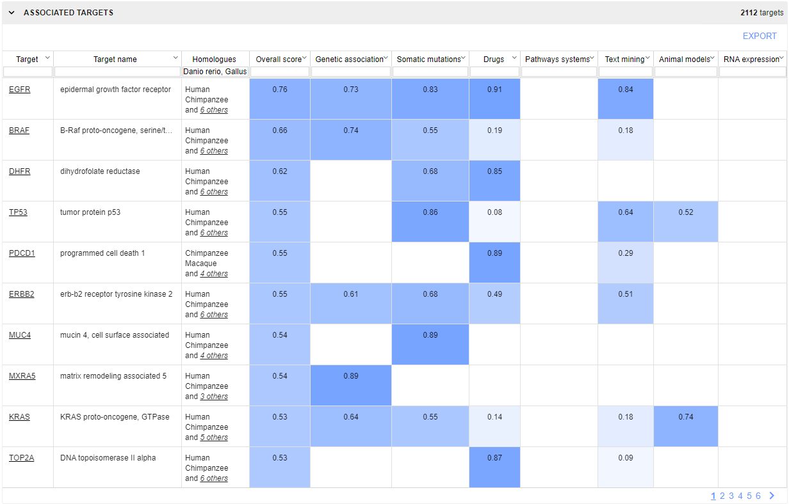

Information for this section is obtained from [**Open Targets**](https://platform.opentargets.org/) platform.  
Table includes columns:

- _Target_ - symbol of the associated target
- _Target name_ - name of the associated target
- _Overall score_ - summary score of all disease-target association scores
- other columns - specific disease-target association scores. For more details see [Associations info page](https://platform-docs.opentargets.org/associations).

Table itself is colorized as a heatmap - according to the score value in each cell.

By default, table is sorted by the _Overall score_ column.  
Table supports sorting by any column. Click the column header to sort by this column. To invert the sorting order, click the header again.

Table supports filtering by columns _Target_ and _Target name_. To filter displayed targets - specify the desired value(s) to the filter field(s) under headers row.

To export table content in CSV format - click the corresponding **Export** button above the table. Export to the local workstation will be started automatically.
