# Target Identification

- [Manage targets](#manage-targets)
    - [Target creation](#target-creation)
        - [Creation from "Targets" panel](#creation-from-targets-sub-panel)
        - [Creation from "Homologs" panel](#creation-from-homologs-panel)
    - [Parasite targets](#parasite-targets)
        - [Upload genes](#upload-genes)
        - [Genes table view management](#genes-table-view-management)
    - [Edit/remove target](#editremove-target)
- [Launch identification](#launch-identification)
- [Identification results](#identification-results)
    - [Description block](#description-block)
    - [Known drugs block](#known-drugs-block)
        - [Drugs TMAP](#drugs-tmap)
    - [Associated diseases block](#associated-diseases-block)
    - [Sequences block](#sequences-block)
    - [Comparative genomics block](#comparative-genomics-block)
        - [Alignment panel](#alignment-panel)
    - [Structure block](#structure-block)
    - [Bibliography block](#bibliography-block)
    - [Patents block](#patents-block)
        - [Patented aminoacid sequences](#patented-aminoacid-sequences)
        - [Patented chemicals](#patented-chemicals)
    - [Chat with AI](#chat-with-ai)
        - [AI model settings](#ai-model-settings)
    - [Store and share report](#store-and-share-report)
        - [Saving](#saving)
        - [Sharing](#sharing)
    - [Export](#export)
        - [Export section](#export-section)
        - [Export report](#export-report)
- [Diseases search](#diseases-search)
    - [Associated drugs](#associated-drugs)
    - [Associated targets](#associated-targets)
        - ["Ad hoc" target identification](#ad-hoc-target-identification)

***

Via the **Target Identification** panel users can collect identification information about targets of interest (genes), store this information and use it for their own research purposes.

**Target identification** panel can be opened via the **VIEWS** menu and includes sub-tabs:

- [**Targets**](#manage-targets) (_opened by default_) - sub-panel where user can manage targets
- [**Identifications**](#identification-results) - sub-panel where user can view and manage target identification reports
- [**Diseases**](#diseases-search) - sub-panel where user can search for drugs and targets associated with a specific disease

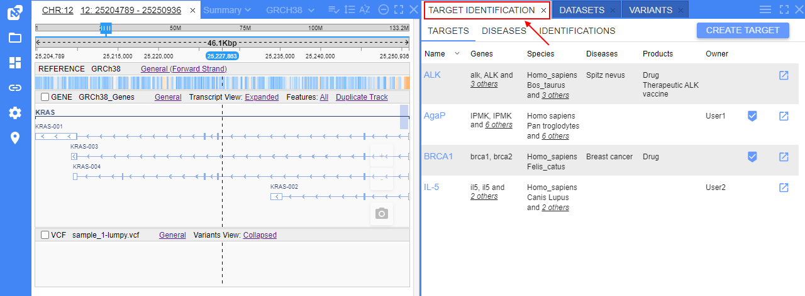

## Manage targets

**Targets** management sub-tab contains the following objects:

- Table of previously created (added) targets. For each target in that table, there are columns:
    - **Name** - target name. Name is displayed as a hyperlink. By click it, the target details form will be opened
    - **Genes** - genes/transcripts that are included in this target
    - **Species** - species that are included in this target
    - **Diseases** - diseases that are associated with the target
    - **Products** - products that are associated with the target
    - **Owner** - name of the user who created the target
    - Column that contains buttons to launch identification process for the selected target
- Button to add a new target

**_Note_**: if there are more than 2 items in any column of the targets table, additional items will be hidden and only their summary number is shown. Click that number to view details, e.g.:  
    
  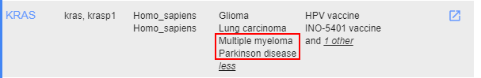

To sort the **Targets** table by the **Name** column - click the corresponding header. To invert the sorting order, click the header again, e.g.:  
  

**Targets** table supports filtering. To filter displayed targets - use one or more parameters to filter items in the table.  
To enable filters - use the menu  in the right upper corner of the panel. The approach is fully the same as described for the [Variants panel](variants.md#filters-for-variants-panel):  
  

  

  

To clear all filters - use the menu  in the right upper corner of the panel.

### Target creation

To create a new target, there are following ways:

- Via GUI:
    - Add a new target manually [from the **Targets** sub-tab](#creation-from-targets-sub-panel)
    - Create a target [from any found orthogroup](#creation-from-homologs-panel) (using the **Homologs** panel)
- Via CLI

#### Creation from "Targets" sub-panel

To create a new target:

1. Click the "**Create target**" button at the **Targets** sub-panel:  
  
2. The following form will appear:  
    
  This form contains:  
    - button to return to the targets table form
    - field to specify the name of the creating target
    - selector to specify the target type:
        - _Default_ - for regular targets. See details below
        - _Parasite_ - for parasite targets. See details in the separate [section](#parasite-targets)
    - button to add a gene/transcript to the target - **Add gene**
    - button to add an associated disease to the target
    - button to add an associated product to the target
    - button to launch identification - **Identify**
    - button to save the creating target - **Create**
3. Specify the new target name.
4. Click the button "**Add gene**" to add a gene/transcript to the target.  
    A new row with empty fields will appear - for the specifying info for a gene - **Gene ID**, **Gene Name**, **Tax ID** (taxonomy ID of species), **Species Name** and **Priority** (priority of the adding gene in the current target's genes list):  
    
5. Specify all fields for a gene/transcript (**Priority** and **Additional Genes** fields are non-required, others - mandatory).  
  There are abilities for specifying genes:  
    - fully manual way when you shall specify the value in each field as a plain text
    - "autofilling" with automatically suggested values of genes using appearing ones during the input **Gene ID**/**Gene Name** - these values are being suggested from the existing genes database, e.g.:  
      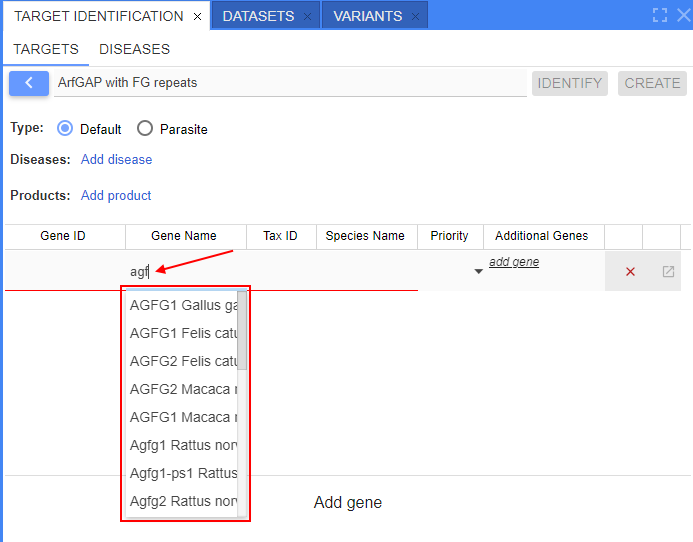  
      When the gene/gene ID is selected from the suggested list - all other fields (except **Priority**) will be autofilled in:  
      
    - mix of the manual and "autofilling" ways
6. **Priority** can be left empty or manually selected from the list:  
  
7. You may add additional genes for a specific added gene - they all will present a group of genes being analysed together:  
    - click **_add gene_** in the **Additional Genes** column
    - manually specify gene ID and tax ID of the additional gene to appeared fields
    - similarly, add any number of additional genes  
      
    
8. By the described way (steps 4-7), add desired number of genes/transcripts. Near each gene/transcript, there is a button to remove gene from the list, e.g.:  
  
9. Add disease(s) associated with the target (_optionally_).  
  To add a disease, click the corresponding field and specify the disease manually. After the input, press _Enter_ key, e.g.:  
    
  You may add any count of associated diseases by the described way. To remove a disease from the list - use the cross button near the disease name.
9. Add product(s) associated with the target (_optionally_).  
  To add a product, click the corresponding field and specify the product manually. After the input, press _Enter_ key, e.g.:  
    
  You may add any count of associated products by the described way. To remove a product from the list - use the cross button near the product name.
10. Once all desired values are added - click the **Create** button. Target will be saved:  
    - The **Identify** button will become enabled
    - The **Create** button will disappear, instead the disabled **Save** button will appear
    - The **Remove** button will appear - to delete the target  
      
11. Click the button  to return to the **Targets** table. Just created target will appear in the list:  
  

#### Creation from "Homologs" panel

To create a new target from the "Homologs" panel:

1. Open the [Homologs](homologs-search.md) panel and any sub-tab with the found list of homologous orthogroups ("**Homologene**" or "**Orthologs & Paralogs**")
2. Right-click any orthogroup from the search results list to view the context menu, e.g.:  
    
  Select the item "_Create target_" from the context menu.
3. The pre-filled form of the target creation will appear:  
    
  Here, list of all genes from the selected orthogroup will be autofilled in.
4. Specify the name for the creating target.
5. Specify another missing info, if necessary.
6. Otherwise, the procedure is the same as in the section [above](#creation-from-targets-sub-panel).

### Parasite targets

Creation of parasite targets are slightly differ from corresponding procedures for "regular" targets described [above](#creation-from-targets-sub-panel).

To create a new parasite target:

1. Click the "**Create target**" button at the **Targets** sub-panel:  
  
2. Select the _Parasite_ type for a new target:  
    
3. Specify the new target name.
4. Click the button "**Add gene**" to add a gene/transcript to the target. A new row with empty fields will appear:  
  
5. Specify all fields for a gene/transcript (_Gene ID_, _Gene Name_, _Tax ID_ and _Species Name_ are mandatory, others - non-required), e.g.:  
  
6. You may add additional genes for a specific added gene - they all will present a group of genes being analysed together:  
    - click **_add gene_** in the **Additional Genes** column
    - manually specify gene ID and tax ID of the additional gene into appeared fields
    - similarly, add any number of additional genes  
      
    
7. **Status** of the gene can be left empty or manually selected from the list:  
  
8. You may add associated target(s) from [Therapeutic Target Database](https://db.idrblab.net/ttd/):  
    - click **_add target_** in the **TTD Targets** column
    - manually specify TTD target of the additional gene into appeared field
    - similarly, add any number of targets  
    
9. By the described way (steps 4-8), add desired number of genes/transcripts. Near each gene/transcript, there is a button to remove gene from the list, e.g.:  
  
10. Add disease(s) and product(s) associated with the target (_optionally_) - for details see the creation of a [default](#creation-from-targets-sub-panel) target.
11. Once all desired values are added - click the **Create** button. Target will be saved:  
  
12. Click the button  to return to the **Targets** table. Just created target will appear in the list:  
  

Please note, as parasite genes and species were specified manually, they are not shown in the corresponding columns _Genes_ and _Species_ of the **Targets** table.

#### Upload genes

As often it isn't possible to automatically find data for parasite genes by name or gene id, therefore have to specify target genes fields only in the fully manual way (without autofilling by gene ID/name).  
If you want to add lots of genes or additional genes to your parasite target, it is more convenient to upload them from separate file.  
In addition, by this way you may add custom data columns to parasite genes.

Currently, the following file formats are supported for files with genes to upload: _XLSX_, _CSV_, _TSV_.

There are following requirements to data formats and content in such genes file:

| Data type | Column name format | Data format | Mandatory |
| --- | --- | --- | --- |
| _Gene ID_ | Any of: `id` / `gene` / `gene_id` / `gene id`, case insensitive | **String** Example: _UPAG\_ECOL6_ | **Yes** |
| _Gene Name_ | Any of: `name` / `gene_name` / `gene name`, case insensitive | **String** Example: _upaG_ | **Yes** |
| _Tax ID_ | Any of: `tax_id` / `organism_id` / `tax id`, case insensitive | **Integer** Example: _562_ | **Yes** |
| _Species Name_ | Any of: `species` / `organism` / `species_name` / `species name`, case insensitive | **String** Example: _Escherichia coli_ | **Yes** |
| _Priority_ | `priority`, case insensitive | `HIGH` / `LOW` or blank | No |
| _Additional Genes_ | `AG <Tax ID> <Text>`, case insensitive Where: `<Tax ID>` - required integer tax ID of the additional gene. `<Text>` - any string, will be skipped. Example: _AG 9606 Homo\_Sapiens_ | **Comma separated strings** Example: _ENSG00000143314, ENSG00000086619_ | No |
| _Optional_ | Any custom text name. Shall be unique within one file | Any | No |

Example of the prepared genes file's content:  
  

To upload genes from a file to the parasite target:

1. Start to create a new parasite target or open the existing one.
2. Click the **Upload genes** button, e.g.:  
  
3. Select the prepared gene files from your local workstation. Once selected, the file name will appear in the bottom of the form, e.g.:  
  
4. Click the **Create** button for a new target or the **Save** button for an opened existing target.
5. Genes from your file will be uploaded to the target and shown in the table, e.g.:  
  

If you have uploaded custom data columns, they can be shown/hidden via the _filter_ menu in the right upper corner of the **Targets** panel.  
To show custom columns:

1. Click the _filter_ menu button  in the right upper corner of the panel.
2. In the appeared list, select custom columns you wish to show:  
    
  
3. Selected columns will appear in the table:  
  
4. Please note, you may also specify values in custom columns for genes that were added manually (not uploaded from file), e.g.:
  

> **_Note_**: to hide custom columns, unselect them in the _filter_ menu.

#### Genes table view management

Genes table of the parasite target supports:

- **_sorting_** by any column (except _Additional Genes_ and _TTD Targets_) - click the column header to sort by this column. To invert the sorting order, click the header again.
- **_filtering_** - to filter displayed genes:  
    - click the _filter_ menu button  in the right upper corner of the panel
    - select the **Show filters** item in the list:  
    
    - specify the desired value(s) or their parts to the filter field(s) under headers row:  
    
- **_column transfer_** - you may easily set the own order of table columns - just click any column header and holding the left mouse button drag and drop the column header to the desired place.

> **_Note_**: to revert all table view changes, click the **Restore view** button in the _filter_ menu.

***

### Edit/remove target

To edit previously created target:

1. Click the target row/name in the **Targets** table, e.g.:  
    
2. The form similar to the target's creation form will be opened:  
    

Here, you can edit the target (edit target name, add/edit/remove genes from the list, add/remove diseases and products) and then save changes or remove the target - by the corresponding buttons.

## Launch identification

To launch a new identifying process:

1. Find the target in the **Targets** table and click the button to launch identification process, e.g.:  
    
> Or you can open the target and click the **Identify** button from the target's details block:  
> 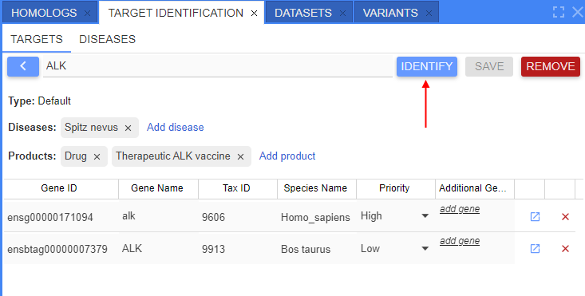  
2. The pop-up will appear according to the selected target - to define parameters (species of interest and translational species):  
  
3. Here, the following items shall be specified:
    - _Genes of interest_ - list of species of interest. Corresponds to species for which gene (target) the identification will be performed. Species can be selected only from ones that were added to the current target. Multiselect is supported
    - _Translational genes_ - list of species to which the gene comparison shall be performed during the identification. Species can be selected only from ones that were added to the current target. Multiselect is supported. For parasite targets identification, there is no need to necessarily indicate _Translational genes_, you may left this field empty.  
> Please note, same gene can not be simultaneously in both lists.
4. Once all fields are specified, click the **Identify** button to launch the identification, e.g.:  
  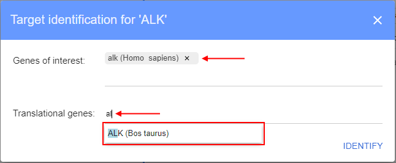  
  

> In addition, you can launch the identification process in the following way - open the target and click the **Identify** button for the specific gene from the list, e.g.:  
>     
> In this case, selected gene will be automatically set as _Gene of interest_:  
>     
> Then continue as described above.

## Identification results

**Identifications** sub-tab contains identification results. Here, users can:

- view summary results of the current/selected identification process
- view the current/selected identification details
- store target identification to have a quick access to it later
- download identifications results to the local workstation

Once the new identifying process is finished, the **Identifications** sub-tab will be automatically opened with the identification results (report):  
  

Identification report form contains:

- Button to save the report. **_Note_**: if this button is not clicked for a report, and any new identification was launched - current report will be removed
- Button to download identifications results - to load results as separate file(s) to the local workstation
- Label with the target name
- List of _species of interest_ and list of _translational species_ used for the identification
- Description section with short overview of the main target gene with link(s) to the source(s) from which the description is
- Set of expandable sections - these sections contain detailed info of the target identification

Below, there are details by each expandable block.

### Description block

This block contains summary description of the target gene(s) with the link(s) to the source(s) from which the description is constructed.  
Description is being obtained for all _species of interest_ and merged.

Example of view:  
    
  

### Known drugs block

This block contains info about _drugs_ with investigational or approved indications targeting the current target gene(s) according to their curated mechanism of action.

When the block is collapsed - its header contains short info about the count of unique drugs associated to the target gene(s) and the total count of records with these drugs in databases:  
  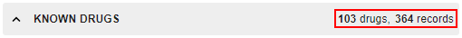

When the block is expanded - it contains a table with known drugs that treat diseases associated with the current target:  
  

Information for this block is obtained from different sources (different databases).  
Therefore information from each database can vary - switching between sources is being performed by the corresponding dropdown list in the right upper corner of the block:  
  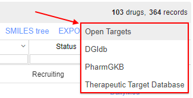

For [**Open Targets**](https://platform.opentargets.org/) source (see the image above), table includes columns:

- _Target_ - gene/transcript name. Allows to filter the table by the specific gene from the target
- _Drug_ - drug name. Each drug is presented as a hyperlink to the corresponding page in **Open Targets** platform
- drug details columns:
    - _Type_ - drug type (antibody, cell, enzyme, molecule, protein, etc.)
    - _Mechanism of action_ - drug action to the target (includes action type and target name)
    - _Action type_ - drug action type
- _Disease_ - disease name treated by the drug. Each disease is a hyperlink to the corresponding page in **Open Targets** platform
- clinical trials info columns:
    - _Phase_ - current stage of a clinical trial studying a drug
    - _Status_ - state of the current clinical trial phase
    - _Source_ - hyperlink to the corresponding page of the clinical trial

***

For [**DGIdb**](https://www.dgidb.org/) source, table includes columns:

- _Target_ - gene/transcript name. Allows to filter the table by the specific gene from the target
- _Drug_ - drug name. Each drug is presented as a hyperlink to the corresponding page in **DGIdb** platform
- _Interaction claim source_ - source (knowledge base) from which the info about drug is received
- _Interaction types_ - type(s) of the drug interaction

***

For [**PharmGKB**](https://www.pharmgkb.org/) source, table includes columns:

- _Target_ - gene/transcript name. Allows to filter the table by the specific gene from the target
- _Drug_ - drug name. Each drug is presented as a hyperlink to the corresponding page in **PharmGKB** platform
- _Source_ - source (knowledge base) from which the info about drug is received

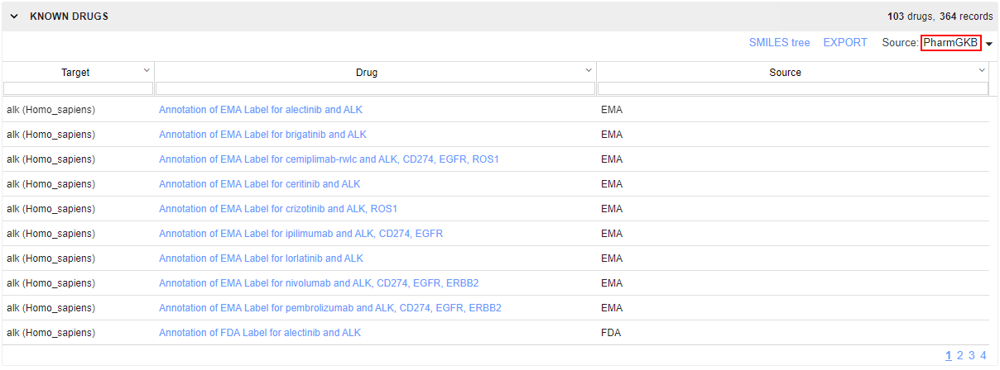

***

For [**Therapeutic Target Database**](https://db.idrblab.net/ttd/) source, table includes columns:

- _Target_ - gene/transcript name. Allows to filter the table by the specific gene from the target
- _Drug_ - drug name. Each drug is presented as a hyperlink to the corresponding page in **Therapeutic Target Database** platform
- _TTD target_ - corresponding target gene name as it is specified in the **Therapeutic Target Database** platform
- _Company_ - name of the drug company 
- _Type_ - drug type (antibody, cell, enzyme, molecule, protein, etc.)
- _Therapeutic class_ - drug's therapeutic class
- _inChl_ - International Chemical Identifier
- _inChlKey_ - International Chemical Identifier hash
- _Canonical smiles_ - [SMILES](https://en.wikipedia.org/wiki/Simplified_molecular-input_line-entry_system) notation of the drug structure
- _Status_ - state of the current clinical trial phase
- _Compound class_ - drug's compound class

***

No matter which database is selected as the source, the drug table supports:

- **_sorting_** by any column - click the column header to sort by this column. To invert the sorting order, click the header again.
- **_filtering_** - to filter displayed drugs, specify the desired value(s) to the filter field(s) under headers row.
- **_column transfer_** - you may easily set the own order of table columns - just click any column header and holding the left mouse button drag and drop the column header to the desired place.

To export table content in CSV format - click the corresponding [**Export**](#export-section) button above the table. Export to the local workstation will be started automatically.  
> **_Note_**: only table content from the currently selected source (database) will be exported.

#### Drugs TMAP

In addition, you may view the tree MAP (TMAP) of all found drugs associated with the current target:

- click the **SMILES tree** button in the upper side of the section:  
  
- drugs TMAP will be opened in a new tab:  
  

For more details, see [here](https://xinhaoli74.github.io/posts/2020/05/TMAP/).

### Associated diseases block

This block contains info about _diseases associated_ with the current target gene(s).

When the block is collapsed - its header contains short info about the count of associated diseases to the target gene(s):  
  

When the block is expanded - it contains info about diseases associated with the target gene:  
  

Information for this block is obtained from different sources (different databases).  
Therefore information from each database can vary - switching between sources is being performed by the corresponding dropdown list in the right upper corner of the block:  
  

For different source databases, there could be several views of data representation - each view can be selected by the special control (tab selector) inside the block, on the upper side.

Available views for [**Open Targets**](https://platform.opentargets.org/) source:

**Table view** (_default_)

In this view, diseases associated with the target are presented as a table.  
The table includes columns:

- _Target_ - gene/transcript name. Allows to filter the table by the specific gene from the target
- _Disease_ - disease name associated with the target. Each disease is the hyperlink to the corresponding page in **Open Targets** platform. Allows to filter the table by the specific disease associated with the target
- _Overall score_ - summary score of all target-disease association scores
- other columns - specific target-disease association scores. For more details see [Associations info page](https://platform-docs.opentargets.org/associations).

Table itself is colorized as a heatmap - according to the score value in each cell.

By default, table is sorted descending by the _Overall score_ column.  
Table supports sorting by any column. Click the column header to sort by this column. To invert the sorting order, click the header again.

Table supports filtering by columns _Target_ and _Disease_. To filter displayed targets - specify the desired value(s) to the filter field(s) under headers row.

To export table content in CSV format - click the corresponding [**Export**](#export-section) button above the table. Export to the local workstation will be started automatically.

**Bubbles view**

This view provides a hierarchical representation of the associated diseases using encapsulated bubbles:

- Each associated disease is presented as a bubble colored by its overall association score.
- Big circles represent all the therapeutic areas (from the **Open Targets** platform). Such circles contain associated diseases bubbles inside.
- As the same disease can belong to more than one therapeutic area, diseases bubbles can be duplicated.  
- There is the ability to select a gene from target genes for which the representation of the associated diseases will be displayed.

There is the ability to adjust the view of bubbles using a minimum score filter in the upper side of the view (slider control).  
By setting this score, only bubbles with overall score above it will be displayed at the diagram, e.g.:  
  

Hovering over any disease bubble, a tooltip appears with details:

- associated disease name and ID
- overall association score of this disease
- hyperlink to the corresponding disease page in **Open Targets** platform

  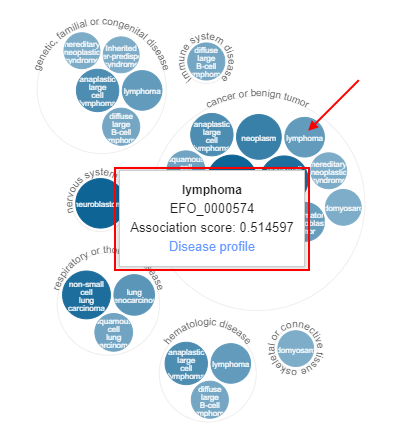

**Graph view**

This view shows the subset of the directed acyclic graph containing the therapeutic areas (from the **Open Targets** platform) on the left side and associated diseases for the current target on the right.  
Disease nodes are colored by their overall association scores.  
There is the ability to select a gene from target genes for which the representation of the associated diseases will be displayed.

There is the ability to adjust the view of nodes using a minimum score filter in the upper side of the view (slider control).  
By setting this score, only nodes with overall score above it will be displayed at the diagram, e.g.:  
  

Hovering over any disease node, a tooltip appears with details:

- associated disease name and ID
- overall association score of this disease
- hyperlink to the corresponding disease page in **Open Targets** platform

  

***

For [**PharmGKB**](https://www.pharmgkb.org/) source, only **Table view** is available.  
In this view, diseases associated with the target are presented as a table.  
The table includes columns:

- _Target_ - gene/transcript name. Allows to filter the table by the specific gene from the target
- _Disease_ - disease name associated with the target. Each disease is the hyperlink to the corresponding page in **PharmGKB** platform. Allows to filter the table by the specific disease associated with the target

***

For [**Therapeutic Target Database**](https://db.idrblab.net/ttd/) source, only **Table view** is available.  
In this view, diseases associated with the target are presented as a table.  
The table includes columns:

- _Target_ - gene/transcript name
- _TTD target_ - corresponding target gene name as it is specified in the **Therapeutic Target Database** platform
- _Disease_ - disease name associated with the target. Each disease is the hyperlink to the corresponding page in the **Therapeutic Target Database** platform
- _Clinical status_ - state of the current clinical trial phase

***

No matter which database is selected as the source, the diseases table supports:

- **_sorting_** by any column - by default, table is sorted descending by the _Target_ column. Click the column header to sort by this column. To invert the sorting order, click the header again.
- **_filtering_** - to filter the displayed list, specify the desired value(s) to the filter field(s) under headers row.
- **_column transfer_** - you may easily set the own order of table columns - just click any column header and holding the left mouse button drag and drop the column header to the desired place.

To export table content in CSV format - click the corresponding [**Export**](#export-section) button above the table. Export to the local workstation will be started automatically.

### Sequences block

This block contains list of sequence(s) corresponding to the target - DNA, RNA, proteins.

When the block is collapsed - its header contains short summary info about the number of found related sequences to the target gene(s):  
  

When the block is expanded - it contains list of sequences related to the specific target gene, e.g.:  
  

Switching between target genes is being performed by the corresponding dropdown list in the right upper corner of the block:  
  

In the top of the block, there is an info about DNA sequence of the gene (if it is found), e.g.:  
  

Such block includes:

- gene DNA accession. If this gene is presented in any dataset of the current NGB deployment - accession is shown as a hyperlink, user may click such link - the gene track will be opened for that gene, e.g.:  
  
- reference to the corresponding NCBI page

List of transcripts related to the specific target gene is presented as a table:  
  

Such table includes columns:

- _Target_ - gene/transcript name
- _Transcript_ - transcript accession. Each transcript is the hyperlink to the corresponding page in NCBI platform
- _Length (nt)_ - transcript length (number of nucleotides in the sequence)
- _Protein_ - protein accession. Each protein is the hyperlink to the corresponding page in NCBI platform
- _Length (aa)_ - protein length (number of amino acid items in the sequence)
- _Protein name_ - name of the protein

Sequences table supports **_column transfer_** - you may easily set the own order of table columns: just click any column header and holding the left mouse button drag and drop the column header to the desired place.

To export table content in CSV format - click the corresponding [**Export**](#export-section) button above the table. Export to the local workstation will be started automatically.

### Comparative genomics block

This block contains info about homologous genes of the target genes.

When the block is collapsed - its header contains short summary info about the number of found homologs:  
  

When the block is expanded - it contains:

- list of homologous genes for the target genes:
    - in the _species of interest_
    - in the _translational species_
- alignment panel that allows to align genes in species of interest to genes in translational species

Table with homologous genes includes columns:

- _Target_ - target gene name
- _Species_ - species name of homologous gene (by default, it is selected from species of interest or translational species of the current identification)
- _Homology type_ - type of homology (ortholog/paralog/homolog)
- _Homologue_ - homologous gene name. It is a hyperlink to the corresponding gene page in NCBI
- _Homology group_ - feature of gene homology
- coding protein info:
    - _Protein_ - protein name
    - _Aa_ - protein sequence length
    - _Domains_ - for an approximate image of the conserved protein domains. Each image contains:
        - a line for a full protein length
        - one or several color rectangles - each for the specific conserved domain. Different domains are drawn by different colors, the same domains are drawn in the same colors

Homologous genes table supports:

- **_filtering_** by columns _Target_, _Species_ and _Homology Type_ - to filter the displayed list, specify the desired value(s) to the filter field(s) under headers row.
- **_column transfer_** - you may easily set the own order of table columns - just click any column header and holding the left mouse button drag and drop the column header to the desired place.

To export table content in CSV format - click the corresponding [**Export**](#export-section) button above the table. Export to the local workstation will be started automatically.

#### Alignment panel

Under homologs table, there is the **Alignment panel** that allows to align protein sequences of genes in species of interest to homologous genes in translational species and vice versa.

To perform an alignment:

1. Select the target gene from the dropdown list - to which the alignment will be performed, e.g.:  
  
2. Select the specific protein of the target gene for the alignment, e.g.:  
  
3. In a similar way, select the query gene (which will be aligned) from the dropdown list - and its specific protein for the alignment.
4. Click the **Align** button:  
  
5. Alignment of the selected protein sequences will appear below:  
    
  Above the alignment, displayed:  
    - the count of identities between sequences (by symbols) and its percent value
    - the count of gaps (by symbols) and its percent value  
  **_Note_**: how to "read" alignments you can see in the corresponding section of the BLAST search manual - [here](blast-search.md#alignments-info).

Additionally, users can view the comparison of aligned protein sequences on the track in the **Browser** panel.

> **_Note_**: it is possible only if the reference of the selected target gene is registered in the current deployment of NGB.  

To view such comparison - click the button **View on track** after performed alignment:  
  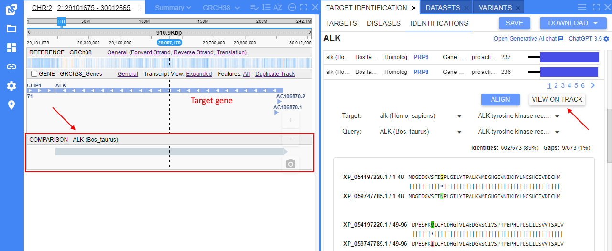

Opened comparison is shown at a separate track.  
Please note that comparison visualization does not show exact location of the alignment, it highlights the whole gene feature instead.

### Structure block

This block contains structures related to the target gene(s)/transcription(s) and allows to view found structure models.

When the block is collapsed - its header contains short summary info about the number of found structures related to the target gene(s):  
  

When the block is expanded - it contains list of structures related to the target:  
  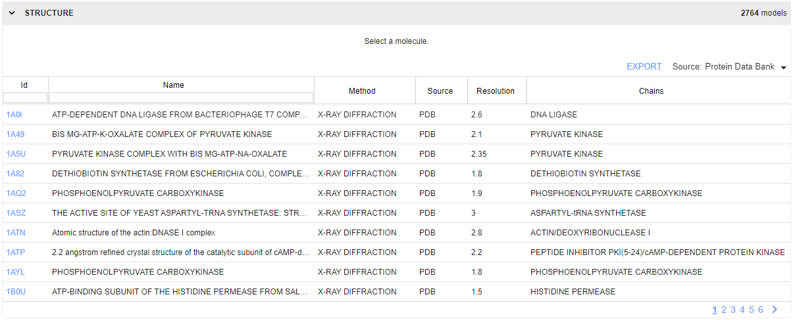

Information for this block is obtained from different sources (databases), local sources are also supported.  
Switching between sources is being performed by the corresponding dropdown list in the right upper corner of the block:  
  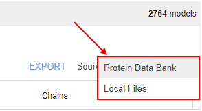

List of structures related to the target is presented as a table:  
  

Such table includes columns (set of columns may vary due to selected source):

- _ID_ - structure ID in a database. It is presented as a hyperlink to the corresponding page of the structure in the selected database (e.g., [PDB](https://www.rcsb.org/))
- _Name_ - structure name
- _Method_ - method by which the structure is obtained
- _Source_ - source database of the structure
- _Resolution_ - a measure of the quality of the data (level of details presented in the diffraction pattern)
- _Chains_ - name of macromolecule's polymeric chain of the current gene/protein
- _Owner_ - owner user name of the structure file (_only for local sources_)

Table supports:

- **_column transfer_** - you may easily set the own order of table columns - just click any column header and holding the left mouse button drag and drop the column header to the desired place.
- **_filtering_** by _ID_ and _Name_ columns - to filter by any of these columns, specify the filter text to the field under the header of the column, e.g.:  
  

To export table content in CSV format - click the corresponding [**Export**](#export-section) button above the table. Export to the local workstation will be started automatically.

To open the structure model in a viewer - click its row in the table, e.g.:  
    
Structure model is being opened in the 3D viewer.  
This viewer is identical to the one using as NGB [Molecular Viewer](overview.md#molecular-viewer-panel).

### Bibliography block

This block contains references corresponding to publications, literature, articles that mentioned the target gene(s) in the _species of interest_.  
Main source of these publications - [**PubMed**](https://pubmed.ncbi.nlm.nih.gov/).

When the block is collapsed - its header contains short info about the summary count of all publications mentioned the target gene(s):  
  

When the block is expanded - it contains list of references to publications mentioned the target gene(s).  
Each reference contains:

- publication title - as the hyperlink to the corresponding publication on **PubMed**
- list of publication authors
- publication source title and date

There is the ability to generate a summary of the found bibliography using AI capabilities.

> **_Note_**: this summary is generated using pretrained AI language model and its text generation functionality.  
> For the summary, only abstracts of the several "top" (most relevant) publications are used.  
> As the summary is generated by AI and this process is poorly controlled, the summary block can vary for each request for the same list of publications.

To generate a summary of the found bibliography - click the corresponding button in the upper side of the block:  
  

It takes some time to generate the summary. Once the summary is prepared - it will appear in the upper side of the block:  
  

You can (re)generate the summary in the described way as many times as you need.  

> **_Note_**: you can change the AI model that will be used for the Bibliography summary generation - select the model from the dropdown list of AI settings - see details in the section [below](#ai-model-settings).  
> Once the model is changed - the summary will be regenerated with that AI model, e.g.:  
>   

You can filter displayed bibliography by selecting only specific target gene(s) for which publications shall be shown. To filter the list, click the dropdown list at the right side and select desired gene(s):  
    
In the bibliography list, only publications corresponding to selected genes will be shown.

Additionally, you can search over the publications - using the search bar above the bibliography list. Specify the clarifying request to the search bar and press Enter key. In the bibliography list, only publications corresponding to your request will be shown:  
  

### Patents block

This block section allows users:

- to search and view patents on the protein sequences - of that are included in the current identification report (in the [Sequences](#sequences-block) section)
- to search and view patents on the drugs/chemical structures - of that are included in the current identification report (in the [Known drugs](#known-drugs-block) section)

Block contains 2 sub-blocks:

- for search and view patented [aminoacid sequences](#patented-aminoacid-sequences)
- for search and view patented [chemicals](#patented-chemicals)

Each sub-block can be selected by the special control (tab selector) inside the block, on the upper side.  
Information for this block can be obtained from different sources (different databases).  
Therefore information from each database can vary - switching between sources is being performed by the corresponding dropdown list in the right upper corner of the block:  
  

#### Patented aminoacid sequences

This sub-block is being opened by default, when the **Patents** block is expanded:  
  

For [**NCBI**](https://www.ncbi.nlm.nih.gov/protein/?term=Patent%5BProperties%5D) source, this sub-block contains:

- dropdown list with all protein accessions assigned to the target (same as in the **Sequences** section of the current identification report)
- checkboxes with search options:  
    - _Search patents by protein name_ - when selected, search will be performed in [Protein DB](https://www.ncbi.nlm.nih.gov/protein/) of NCBI over patented proteins
    - _Search patents by amino acid sequence_ - when selected, search will be performed via [blastp](https://blast.ncbi.nlm.nih.gov/Blast.cgi?PROGRAM=blastp) over patented protein sequences DB
- button to start the search

To start, select the protein sequence from the list, then select the search option and click the **Search** button.

**Search by protein name**

Example of results of the search by protein name:  
  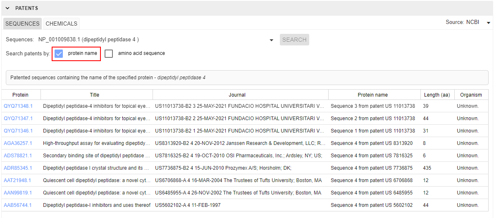

Results contain:

- header for results with the name of the protein used for the search
- table with columns for found patented sequences:  
    - _Protein_ - protein sequence accession. Each protein is a hyperlink to the corresponding page on NCBI
    - _Title_ - title inside the reference mentioned that patent
    - _Journal_ - patent name and name of the reference mentioned that patent
    - _Protein name_ - protein sequence name
    - _Length (aa)_ - protein sequence length
    - _Organism_ - species name (if available)

**Search by amino acid sequence**

When the option of the search by amino acid sequence is selected, an additional text field appears - **Query** field:  
  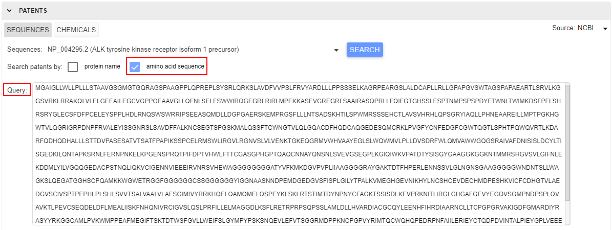

By default, this field contains amino acid sequence of the selected protein. But you may specify custom sequence instead default value.  
When the button **Search** is clicked - _blastp_ search will be performed by the sequence specified in the **Query** field.

> **_Note_**: as _blastp_ search can take some meaning time - during the search performing the stub will be shown and the search form becomes disabled.  
> You may collapse/expand the **Patents** section or switch between sub-blocks - these actions will not interrupt the search.

Example of results of the search by custom amino acid sequence:  
  

Results contain:

- header for results with the protein accession (if available) and length of the amino acid sequence used for the search
- table with columns for found patented sequences:  
    - _Protein_ - protein sequence accession. Each protein is a hyperlink to the corresponding page on NCBI
    - _Length (aa)_ - protein sequence length
    - _Organism_ - species name (if available)
    - _Protein name_ - protein sequence name
    - _Query cover_ - the percent of the query length (requested protein sequence in the **Query** field) that is included in the found patented sequence
    - _Percent identity_ - the highest percent identity for a set of aligned segments of the found patented sequence to the query (requested protein sequence in the **Query** field)

***

For [**Google Patents**](https://patents.google.com/) source, instead the **Sequences** there is the **General** sub-block in the **Patents** block:  
  

It contains:

- field to specify a gene/protein name for the future search (by default, contains the name of the current _gene of interest_)
- button to generate a summary over the found records  

To start the patent search, specify the gene/protein name or accession and click the **Search** button.  
Example of results of the search by the gene name:  
  

Results contain a table with columns for found patents records:

- _Title_ - title of the patent mentioned specified gene/protein
- _Patent number_ - patent identifier
- _PDF_ - link to PDF version of the patent document
- _Description_ - part of the document where the specified gene/protein is mentioned
- _Assignee_ - company assignee name
- _Filing date_ - patent filing date
- _Inventor_ - patent inventor name
- _Publication date_ and _Publication number_ - corresponding info about the patent publication document

To generate a summary over the found patents list - click the corresponding button.  
It takes some time to generate the summary. Once the summary is prepared - it will appear in the upper side of the block:  
  

#### Patented chemicals

The sub-block contains:

- dropdown list with all drugs associated with the target (same as in the **Known drugs** section of the current identification report)
- checkboxes with options to search:  
    - _Search patents by drug name_ - when selected, search of patented chemicals will be performed in [PubChem DB](https://www.ncbi.nlm.nih.gov/pccompound/) of NCBI
    - _Search patents by structure identifier_ - when selected, search will be performed via advanced [PubChem search](https://pubchem.ncbi.nlm.nih.gov/search/search.cgi)
- button to start the search

To start, select the protein sequence from the list, then select the search option and click the **Search** button.

**Search by drug name**

Example of results of the search by drug name:  
  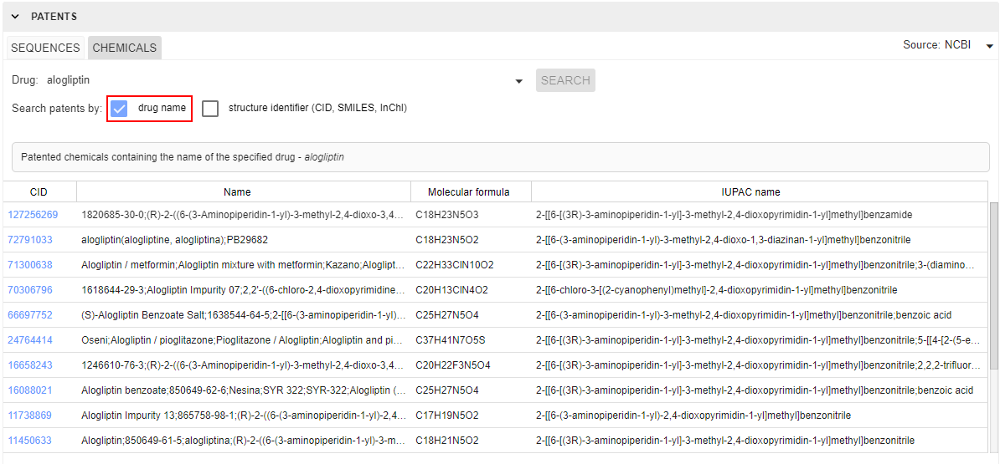

Results contain:

- header for results with the drug name used for the search
- table with columns for found chemicals:  
    - _CID_ - chemical identifier. Each CID is a hyperlink to the corresponding page on NCBI ([PubChem](https://www.ncbi.nlm.nih.gov/pccompound/))
    - _Name_ - set of chemical names/synonyms
    - _Molecular formula_ - chemical molecular formula
    - _IUPAC name_ - [IUPAC](https://en.wikipedia.org/wiki/IUPAC_nomenclature_of_organic_chemistry) name of the chemical

**Search by structure ID**

When the option of the search by structure identifier is selected, an additional text field appears - **Identifier** field:  
  

By default, this field contains [SMILES](https://en.wikipedia.org/wiki/Simplified_molecular-input_line-entry_system) identifier of the selected drug.  
But you may specify custom identifier instead the default value.  
The following formats of the identifier query are supported:

- ID (numerical [PubChem](https://www.ncbi.nlm.nih.gov/pccompound/) ID)
- [SMILES](https://en.wikipedia.org/wiki/Simplified_molecular-input_line-entry_system) identifier
- [InChI](https://en.wikipedia.org/wiki/International_Chemical_Identifier) identifier

When the button **Search** is clicked - search will be performed by the identifier specified in the **Identifier** field.

Example of results of the search by the structure identifier:  
  

Results contain:

- header for results with the structure identifier name (if available)
- table with columns for found chemicals:  
    - _CID_ - chemical identifier. Each CID is a hyperlink to the corresponding page on NCBI ([PubChem](https://www.ncbi.nlm.nih.gov/pccompound/))
    - _Name_ - set of chemical names/synonyms
    - _Molecular formula_ - chemical molecular formula
    - _IUPAC name_ - [IUPAC](https://en.wikipedia.org/wiki/IUPAC_nomenclature_of_organic_chemistry) name of the chemical
    - _Patent_ - the patent existence state (found chemical is patented or not)

***

For [**Google Patents**](https://patents.google.com/) source, search over patented chemicals is being performed by the similar way as described above for **NCBI** source.  
The only difference - after the search over **Google Patents**, you may generate a summary over the found list using Generative AI.

Example of results of the search by the drug name:  
  

In both cases (search by drug name and search by structure identifier), results contain a table with columns for found patents records:

- _Title_ - title of the patent mentioned specified gene/protein
- _Patent number_ - patent identifier
- _PDF_ - link to PDF version of the patent document
- _Description_ - part of the document where the specified gene/protein is mentioned
- _Assignee_ - company assignee name
- _Filing date_ - patent filing date
- _Inventor_ - patent inventor name
- _Publication date_ and _Publication number_ - corresponding info about the patent publication document

### Chat with AI

Additional ability, available for users at the identification results' form - AI chat.  
There is a simple build-in chat like [ChatGPT](https://chat.openai.com/) where user can try to find answer for medical or bioinformatics questions .

To open chat:

1. Click the corresponding hyperlink in the right upper corner of the **Identifications** tab:  
  
2. Chat will be opened in the left bottom corner of the page:  
  
3. To start chat - just specify your question in the field and press Enter key, e.g.:  
  
4. The answer will appear in a few seconds:  
  
5. You may ask any count of questions here by the described way.

#### AI model settings

You can change the language model that will be used in chat - select the desired model from the dropdown list of AI settings in the right upper corner of the **Identifications** tab:  
    
  

> **_Notes_**:
>
> - not all models are supported for the chat
> - changing of the model here affects the process of the summary generation of the [Bibliography](#bibliography-block)

Also, you can configure each AI model used here:

1. Open the dropdown list of AI models in the right upper corner of the **Identifications** tab.
2. Click the **Configure model** item in the list:  
  
3. The pop-up with model's configuration will appear:  
    
  Here, the following options are available:  
    - **Model** - select the AI model for which settings will be configured.
    - **Temperature** - defines the degree of randomness in model responses. A higher temperature makes the model's answers more varied and creative. A lower temperature makes the answers more focused and consistent.
    - **Max size** - defines the maximum size of tokens that can be used for model responses. Refers to the limit on the number of words, characters, or chunks of text that the language model can handle at once.
4. Once options are configured - click the **OK** button to save them and apply new config.

### Store and share report

#### Saving

There is the ability to save any target identification - for a quick access to it in the future.

To save target identification, you shall:

1. Click the **Save** button in the top of the **Identifications** sub-tab:  
  
2. In the appeared pop-up, specify the name for the saving identification:  
  
3. Click the **Save** button to confirm:  
  
4. Once the target identification is saved, the **Save** button becomes disabled:  
  
5. By the described way, any count of identifications can be saved for the target.

If a target has at least one saved identification - for such target, specific button is shown near the **Launch** button in the **Targets** sub-tab:  
  

Click this button to browse saved identifications for the target - their list will be opened in the pop-up, e.g.:  
  

For each record in the list, there are details and controls:

- _Name_ - name of the saved identification
- _Genes of interest_ - list of genes that were selected as "Genes of interest" before the identification launch
- _Translational genes_ - list of genes that were selected as "Translational genes" before the identification launch
- **Launch** button  - by click this button, saved identification will be opened in the **Identifications** sub-tab
- **Delete** button  - by click this button, an identification will be removed from the list

#### Sharing

Target identification feature is also included into common link sharing functionality - i.e. users can share the state of the performed target identification using the [URL link](../user-guide/embedding-url.md#url-format) of the NGB page.

The following details are included into link:

- state of the **Target Identification** panel (opened/closed)
- selected disease in the [**Disease**](#diseases-search) sub-tab
- launched identification for the selected target and genes ([**Identifications**](#identification-results) sub-tab)

### Export

User has various options to export identification results - as separate section(s) of the report and the whole report can be downloaded.

#### Export section

To export table content of the report's specific section:

- expand the section
- click the corresponding **Export** button above the table (in the right upper corner of the section)

Export of the table in CSV format to the local workstation will be started automatically.

For example, for the **Known Drugs** block:  
  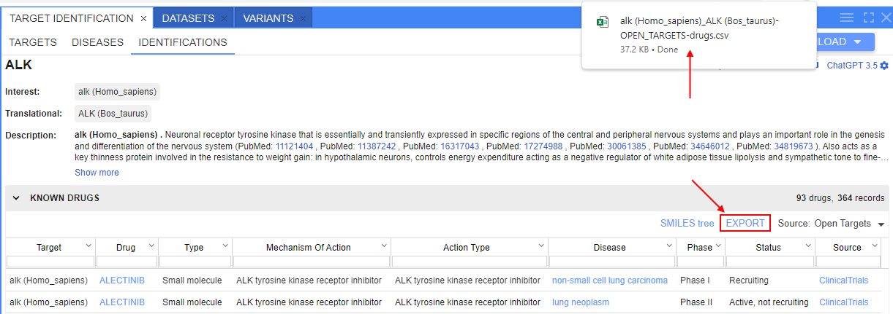  

Exported table:  
  

> **_Note_**: this option is available for table data from blocks **Known Drugs**, **Associated diseases**, **Sequences**, **Comparative genomics**, **Structure**.

#### Export report

To export the whole identification report:

- click the **Download** button 
- in the appeared dropdown list, select the format of the report to download:  
    - _EXCEL_ - overall target identification report will be exported as a multi-sheet Excel file
    - _HTML_ - overall target identification report will be exported as a static Html page  
    
- report in the selected format will be downloaded automatically

Example of the Excel report:  
  

Example of the Html report:  
  

***

## Diseases search

**Diseases** sub-tab allows users:

- to search for a disease
- to view the following information for the found disease:
    - name, synonyms, description
    - known drugs associated with this disease
    - targets associated with this disease

By default, **Diseases** sub-tab is empty and contains only search input field:  
  

To start the search, user shall specify disease name or its part to the input field.  
Search results will be suggested in the Google-like manner - with appearing of suitable values during the disease name input, e.g.:  
  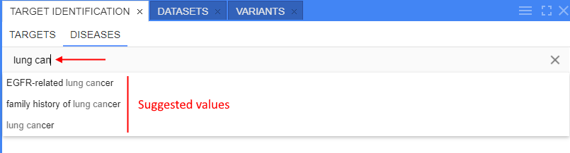

User can select one of the suggested values by click it or continue to specify the own value.  
To perform the search, user shall press Enter key.

> **_Note_**: additionally, users have the ability to search for disease's associated drugs and targets from the **Target Identification** results - namely from the [**Associated diseases**](#associated-diseases-block) section.  
> To search for a disease from that section, user shall open the context menu (mouse right-click) for the desired disease in the **Associated diseases** table and select the corresponding item, e.g.:  
>   

Once the desired disease is found, the following form with results will appear, e.g.:  
  

Report form of the found disease contains:

- search input field - to perform another disease search
- current disease info block:
    - name
    - list of synonyms of the found disease
    - description
- set of expandable sections. There are:
    - **Known drugs** - section with the information about drugs with investigational or approved indications for the current disease
    - **Associated targets** - section with the information about targets associated with the current disease

Below, there are details by each expandable section.

### Associated drugs

This section contains info about investigational or approved drugs indicated for the current disease.

When the section is collapsed - its header contains short info about the count of unique drugs and total count of records:  
  

When the section is expanded - it contains:

- table for investigational or approved drugs indicated for the current disease
- button to export table content to the local workstation in CSV format

Information for this section is obtained from [**Open Targets**](https://platform.opentargets.org/) platform.  
Table includes columns:

- _Target_ - symbol of the associated target
- drug details columns:
    - _Drug_ - drug name. It is a hyperlink to the corresponding page in **Open Targets** platform
    - _Type_ - drug type (antibody, cell, enzyme, molecule, protein, etc.)
    - _Mechanism of action_ - drug action to the target (includes action type and target name)
    - _Action type_ - drug action type
- _Target name_ - name of the associated target
- clinical trials info columns:
    - _Phase_ - current stage of a clinical trial studying the drug
    - _Status_ - state of the current clinical trial phase
    - _Source_ - hyperlink to the corresponding page of the clinical trial

The drug table supports:

- **_sorting_** - by default, table is sorted by the _Target_ column. To sort by any other column, click the column header to sort by it. To invert the sorting order, click the header again.
- **_filtering_** - to filter displayed drugs, specify the desired value(s) to the filter field(s) under headers row.
- **_column transfer_** - you may easily set the own order of table columns - just click any column header and holding the left mouse button drag and drop the column header to the desired place.

To export table content in CSV format - click the corresponding [**Export**](#export-section) button above the table. Export to the local workstation will be started automatically.

In addition, you may view the tree MAP (TMAP) of all associated drugs - click the [**SMILES tree**](#drugs-tmap) button in the upper side of the section.

### Associated targets

This section contains info about targets associated with the current disease.

When the section is collapsed - its header contains short info about the total count of associated target records:  
  

When the section is expanded - it contains:

- table for targets associated with the current disease
- button to export the table content to the local workstation in CSV format

Information for this section is obtained from [**Open Targets**](https://platform.opentargets.org/) platform.  
Table includes columns:

- _Target_ - symbol of the associated target
- _Target name_ - name of the associated target
- _Homologues_ - list of homologues associated with the target
- _Overall score_ - summary score of all disease-target association scores
- other columns - specific disease-target association scores. For more details see [Associations info page](https://platform-docs.opentargets.org/associations).

Table itself is colorized as a heatmap - according to the score value in each cell.

Targets table supports:

- **_sorting_** - by default, table is sorted by the _Overall score_ column. To sort by any other column, click the column header to sort by it. To invert the sorting order, click the header again.
- **_filtering_** - to filter displayed list, specify the desired value(s) to the filter field(s) under headers row.
- **_column transfer_** - you may easily set the own order of table columns - just click any column header and holding the left mouse button drag and drop the column header to the desired place.

To export table content in CSV format - click the corresponding [**Export**](#export-section) button above the table. Export to the local workstation will be started automatically.

#### "Ad hoc" target identification

For some cases, it is helpful to launch identification for a target without its registration.
It can be performed from the **Associated targets** section of the **Diseases** panel:

Find the desired target gene in the associated targets list and click its symbol, e.g.:  
    
In the appeared menu, click the **Launch identification** item.

The new identifying process will be performed and, once finished, the **Identifications** sub-tab will be automatically opened with the results (identification report) for the selected target gene:  
  

Such report is similar to the one described above - in the [Identification results](#identification-results) section.  
The only differences are the following:

- the identification is being performed only for the selected _gene of interest_, therefore there are no _translational genes_
- as it is identification without gene registration - there is no ability to store the report, but you may export results if it is necessary
