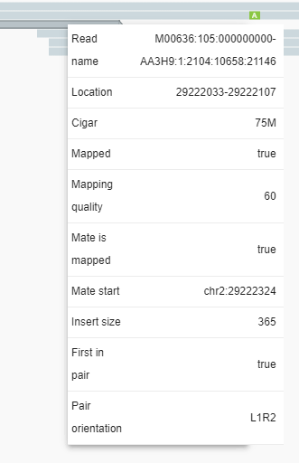
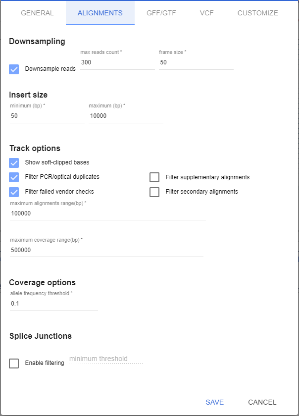
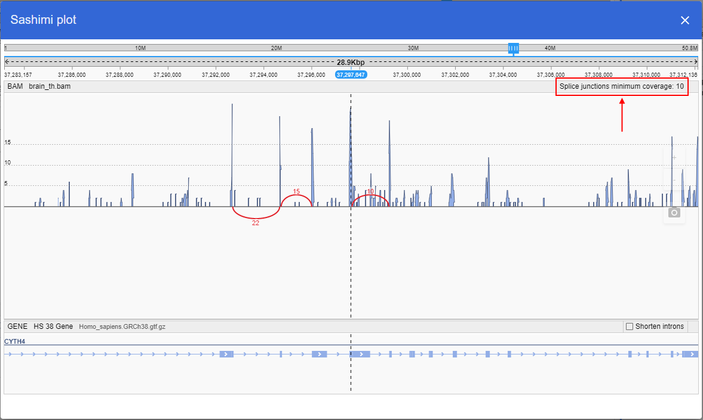

# BAM track

- [Viewing BAM alignments](#viewing-bam-alignments)
- [Working with the BAM menu](#working-with-the-bam-menu)
    - [Color mode](#color-mode)
    - [Sort](#sort)
    - [Group](#group)
    - [Reads view](#reads-view)
    - [General](#general)
- [Working with BAM settings](#working-with-bam-settings)
    - [Alignments](#alignments-data-oriented-options)
    - [Customize](#customize-visualization-and-behavior-options)

## Viewing BAM alignments

By default, BAM alignments are shown at 7Kbp scale (you can increase the scale up to 50Kbp via Settings).

Because it is necessary to process large amounts of data to view alignments, a data transfer indicator (a blue circle) appears in the track's header when the client retrieves the data from a BAM file. When data is being transferred from a server, the circle is rotating.  

Alignment visualization shows the following features:

- **Read strand** - an arrow on the edge of an alignment
- **Mismatches** - different colors on alignments
- **Insertions** - a blue icon on alignments
- **Deletions** - black dashes on alignments

When you hover over an alignment, an information tooltip appears.

When you click on an alignment, a menu with the following options appears:

- **Go to mate** - navigate to the start of a pair alignment (available only for paired reads)
- **Open mate region in split view** - open a second browser pane and set the position to the region where a paired read is aligned

- **Copy read details to clipboard**.

By default, alignments are downsampled (you can change this via **Settings**). The black line above the alignments indicates regions where reads were removed.

When you hover over the black line, a tooltip appears. The tooltip shows the range at which reads were removed and the count of removed reads.

## Working with the BAM menu

BAM track's header contains menu for managing display properties of alignments.

The following track settings are available

### Color mode

- **No color** (default) - all alignments are colored grey
- **By pair orientation** - the color of an alignment depends on its orientation:
    - **Grey**: properly oriented alignments **---> <---**
    - **Blue**: left-oriented alignments **<--- <---**
    - **Green**: right-oriented alignments **---> --->**  
  
- **By insert size**: the color of an alignment depends on the alignment's insert size. By default, an expected insert size can vary from 50 to 10000 bp, you can change this range via Settings.
    - **Grey**: the insert size is as expected
    - **Red**: the insert size is more than expected
    - **Blue**: the insert size is less than expected
    - **Orange**: pair on another chromosome  
  
- **By insert size and pair orientation**: if pairs are located on different chromosomes, the insert size visualization scheme is used. In other cases, the pair orientation visualization scheme is used.
- **By read strand**: the color of an alignment depends on its read strand:
    - **Light red**: forward strand
    - **Light blue**: negative strand  
  
- **By first in pair strand**: the color of an alignment depends on the read strand of the first read in pair. If one of the reads in pair is not mapped - it would not be colored.
    - **Light red**: first read in pair is on forward strand
    - **Light blue**: first read in pair is on negative strand
- **Shade by quality** - if an alignment's quality does not exceed 15, only its border is shown. This option is disabled by default.  
  

### Sort

- **Default**: alignments are arranged to optimally fill the track space
- **By start location**: all alignments on the center line (dashed black line) are arranged by the start of an alignment, other reads are packed as possible
- **By base**: all alignments on the center line (dashed black line) are sorted by the base that lies on a center line (deletions first, mismatches next, all others afterwards)
- **By strand**: all alignments on the center line (dashed black line) are sorted by their read strand (Forward first, Negative afterwards)
- **By mapping quality**:  all alignments on the center line (dashed black line) are sorted by quality (higher quality first)
- **By insert size**:  all alignments located on the center line (dashed black line) are sorted by paired reads insert size

### Group

- **Default**: alignments are arranged to optimally fill the track space
- **By first in pair strand**: alignments are arranges into two groups:
    - Paired alignments with first read on forward strand
    - Paired alignments with first read on reverse strand
    
- **By pair orientation**: alignments are arranged into several groups (if current region does not contain alignments for one of groups - this group does not show):
    - **LL** - Both reads in pair are on forward strand **-->   -->**
    - **RR** - Both reads in pair are on reverse strand **<--   <--**
    - **RL** - Reads in pair are aligned outwards **<--   -->**
    - **LR** - Reads in pair are aligned correctly **-->   <--**  
    
- **By chromosome of mate**: alignments are grouped into several groups according to the chromosome to which a mate is aligned.  
  At minimum - there is only one group, containing reads with the same mate chromosome. If one of the reads in pair is aligned to other chromosome - appropriate group is shown.  
  
- **By read strand**: alignments are arranges into two groups:
    - Paired alignments on forward strand
    - Paired alignments on reverse strand

### Reads view

- **View as pairs**: paired reads are shown in front of each other and connected with gray line (disabled by default).  
  
- **Collapsed**: alignments are shown as lines of 1px height  
  
- **Expanded** (the default view)  
  
- **Automatic** - the height of alignments decreases depending on the zoom level (the lower the zoom level, the thinner the alignments show).

### General

- **Show alignments**: toggles the visualization of alignments (enabled by default)
- **Show mismatched bases**: toggles the visualization of alignments' mismatches (enabled by default)
- **Show coverage**: toggles coverage track visualization (enabled by default)  
  
- **Show splice junctions**: toggles splice junctions track (disabled by default)  
  
- **Sashimi plot**: open the separate popup that contains:
    - GENE reference
    - BAM track itself with the visualization of coverage and splice junctions. At this plot, splice junctions are visualized only by curved lines (not by filled arches). The placement of these curved lines relatively the axis is not linked with the junction strands. Near each junction, its depth value is displayed  
    

## Working with BAM settings

You can modify global BAM settings using the Settings button on the main toolbar of the application.

Options for BAM settings are located at two tabs in the Settings menu:

### Alignments (data-oriented options)

- **Downsample reads** determines how many reads to remove. The less reads you remove, the more the performance decreases. The default value is 300 reads per 50 base pairs.
- **Insert size**  is used to color unhappy paired reads (see Working with BAM menu for details).
- **Track options** block contains settings of alignment track visualization
    - **Show soft-clipped bases** toggles the visualization of softclipped bases on alignments as mismatches. This setting is enabled by default.
    - **Maximum alignments range (bp)** - the scale at which BAM starts showing alignments. The default value is 100000 bp.
- **Maximum coverage range (bp)** - the scale at which BAM starts showing coverage. The default value is 500000 bp.
- **Coverage options** block contains settings of coverage visualization
- **Splice Junctions** block contains settings of splice junctions visualization:
    - **Enable filtering** - if disabled, all splice junctions will be displayed at tracks. If enabled, only splice junctions with depth (regardless the strand value) more than specified threshold will be displayed, e.g.:  
      
    Configured threshold will be displayed at BAM track, splice junctions with depth less than threshold will not be shown:  
    
    Also configured threshold will be displayed at **Sashimi plot**, splice junctions with depth less than threshold will not be shown:  
    

### Customize (visualization and behavior options)

**Hotkeys** for all BAM track modes.

To set a hotkey for a specific BAM mode:

- Tick the box by the mode's name in the first column
- Press a key combination on a keyboard
- If you set a key combination that is already used, it will be reassigned to your current choice. The previously used mode hotkey will be reset.
- You can set the following combinations: **Shift**+{Anykey}, **Ctrl**+{Anykey}, **Alt**+{Anykey}, and any combination of **Ctrl+Alt+Shift** (**Shift+Alt+N** - is ok).

> _Note that using hotkeys with Ctrl or Alt as one of the keys might lead to conflict with web-browser hotkey presets since they have a higher priority. In such cases, the NGB operation associated with the hotkey combination will be performed first, followed by the web browser action associated with the same hotkey combination (e.g. if you set Ctrl+1 for coloring, pressing this hotkey combination will perform color operation first, and then open the leftmost opened tab in Google Chrome web browser)_

To use a hot key, open a BAM track and press the hotkey combination.

You can also set a Redo hotkey to repeat the last action on BAM (i.e. set the same mode). This could be useful for Sorting, because when new data arrives from a server, the previous sorting will be disrupted.

**Colors** tuning for BAM track coloring modes.

This option could be used to fine-tune the colors used to color alignments on BAM track.
Only three coloring modes support this option, others will reuse these settings because of the same semantics:

- By pair orientation (will be reused in **By insert size and pair orientation mode*)
- By insert size
- By read strand (will be reused in **By first in pair strand mode**)  

To change a color, click a colored box next to the coloring parameter and select the desired color using a color picker popup:  
  

**Default** checkbox for all BAM track modes.  
Modes marked as default will be applied to BAM tracks at load time.

To revert all customized settings (hotkeys, colors, default modes) to default values, click the **Set to defaults button**, that is located above the table:  
  
