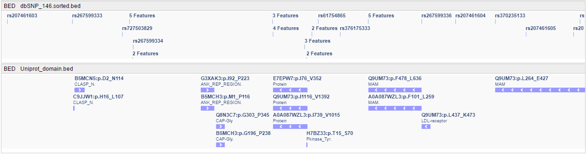

# BED track

- [Track colors](#track-colors)

BED tracks operate like the [GENE track](tracks-genes.md), showing a histogram at a low zoom level:  
      
... and separate features at higher zoom levels:  
    

All fields specified for the BED format are supported (including description).  
When you hover over a BED feature, a tooltip with the feature's details appears.

## Track colors

NGB supports the ability to change the `BED` track colors (depending on the "feature" type).

To customize colors of the `BED` track:

1. Click the **General** item in the track header.
2. Click the **Color** item in the list:  
    
3. Click the color panel to change:  
    
4. Pick a color within the special control:  
    
5. Confirm changes:  
    
6. Color changes will be applied:  
    
7. If you wish to apply changed color scheme for all `BED` tracks in the browser - return at step 3 and set the "**Apply to all BED tracks**" checkbox.  

Also, you can manage the colors for a group of selected `BED` tracks. For that, use the **General** -> **Color** items in the [floating menu](tracks.md#tracks-selection) of selected tracks:  
      
In such case, the set color scheme will be applied to all selected `BED` tracks:  
      
    
