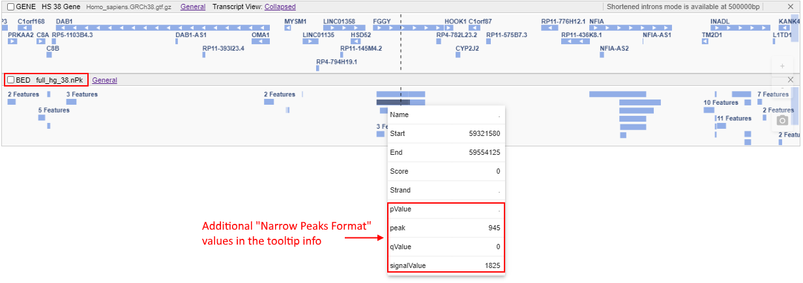

# ENCODE-specific tracks

**NGB** supports the uploading and reading of the `ENCODE-specific` formats.

As the `ENCODE-specific` formats are "`BED`-compatible" with some additional columns - so the exposing of the `ENCODE-specific` files to the client is being performed in the same manner as for the [`BED`](tracks-bed.md) format.  
The only distinct - data values from additional columns that are not present in the original `BED` format can be viewed only via [the features info](tracks.md#viewing-features-info), these values aren't affected the track displaying.

Supported `ENCODE-specific` formats in **NGB**:

| Format | Features | File extension to register |
|---|---|---|
| [ENCODE broadPeak format](http://genome.ucsc.edu/FAQ/FAQformat.html#format13) | "Broad Peaks Format". It is a **BED6+3** format | `broadPeak`, `bPk`, `broadPeak.gz`, `bPk.gz` |
| [ENCODE gappedPeak format](http://genome.ucsc.edu/FAQ/FAQformat.html#format14) | "Gapped Peaks Format". It is a **BED12+3** format | `gappedPeak`, `gPk`, `gappedPeak.gz`, `gPk.gz` |
| [ENCODE narrowPeak format](http://genome.ucsc.edu/FAQ/FAQformat.html#format12) | "Narrow Peaks Format" (or "Point-Source"). It is a **BED6+4** format | `narrowPeak`, `nPk`, `narrowPeak.gz`, `nPk.gz` |
| [ENCODE pairedTagAlign format](http://genome.ucsc.edu/FAQ/FAQformat.html#format16) | "Tag Alignment Format for Paired Reads". It is a **BED6+2** format | `pairedTagAlign`, `pta`, `pairedTagAlign.gz`, `pta.gz` |
| [ENCODE peptideMapping format](http://genome.ucsc.edu/FAQ/FAQformat.html#format17) | "The Peptide Mapping Format". It is a **BED6+4** format | `peptideMapping`, `pMap`, `peptideMapping.gz`, `pMap.gz` |
| [ENCODE RNA elements format](http://genome.ucsc.edu/FAQ/FAQformat.html#format11) | It is a **BED6+3** format | `RNAelements`, `RNAe`, `RNAelements.gz`, `RNAe.gz` |
| [ENCODE tagAlign format](http://genome.ucsc.edu/FAQ/FAQformat.html#format15) | "Tag Alignment Format". It is a **BED3+3** format | `tagAlign`, `ta`, `tagAlign.gz`, `ta.gz` |

Example of the `narrowPeak` track displaying:  
  

For the `ENCODE-specific` files, are supported:

- common tracks' features: [selection](tracks.md#tracks-selection), [renaming](tracks.md#tracks-renaming), [height resizing](tracks.md#resize-tracks-height), [label font resizing](tracks.md#customize-the-font-size-of-track-label)
- specific features: changing of the [track color](tracks-bed.md#track-colors)
