# FeatureCounts track

- [General visualization](#general-visualization)
- [Bar graph visualization](#bar-graph-visualization)
- [Several inputs](#several-inputs)

**FeatureCounts** format is a genomic [format](http://bioinf.wehi.edu.au/featureCounts/) that describes summarized counts of mapped reads for genomic features such as genes, exons, promoter, gene bodies, genomic bins and chromosomal locations.  
FeatureCounts file is being received based on one or more files of aligned reads in either SAM or BAM format and a list of genomic features in either GTF or GFF or Simplified Annotation Format (SAF) formats.

FeatureCounts file is being parsed into GFF format during the registration in NGB.  
NGB supports this file format displaying as well.

## General visualization

FeatureCounts tracks are being displayed in the way similar to [GENE](tracks-genes.md#general-genes-visualization) tracks, but here only genes and exons are displayed.

Depending on the zoom level, FeatureCounts tracks can be visualized as follows:

- At a low zoom level, a histogram indicating the count of features across a chromosome is shown on the whole chromosome scale (_the same as GENE track_):  
  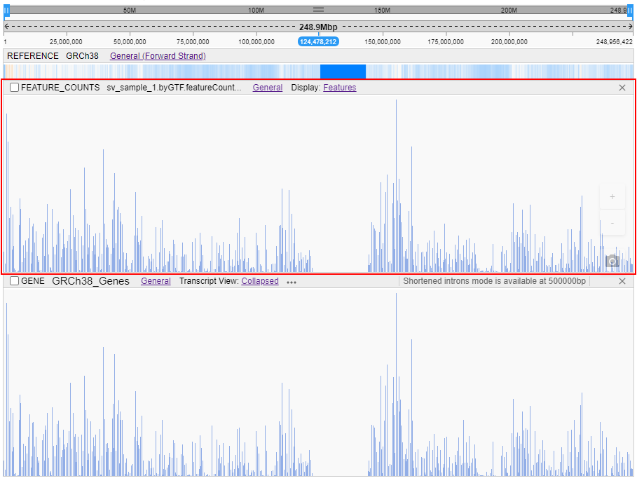
- At a medium zoom level, genes with their names and strands are shown(_the same as GENE track_):  
  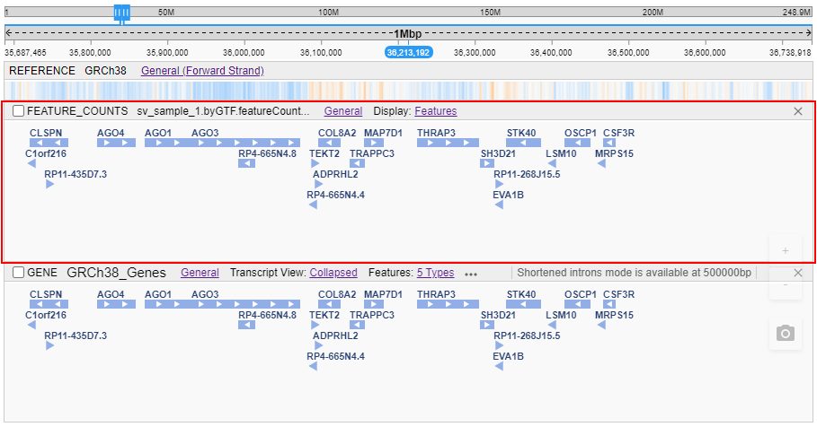
- At a high zoom level, only genes with their names and their exons are shown. Exons are shown separately without any structure:  
  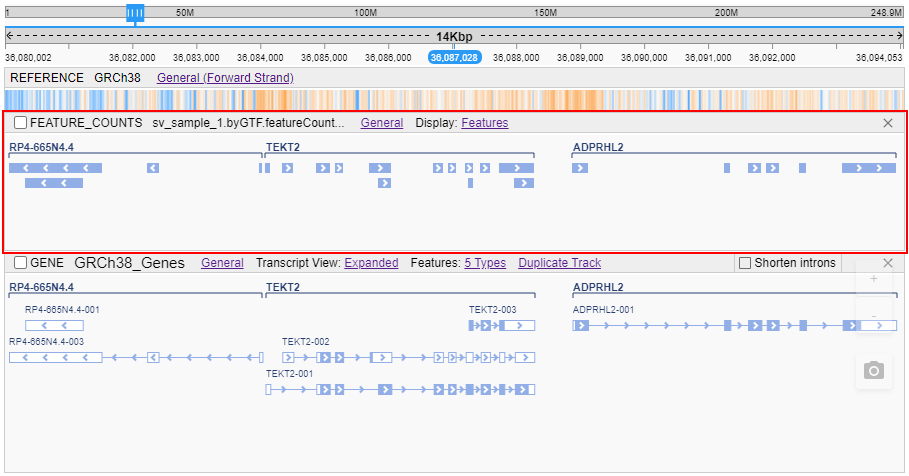

When hovering any feature (gene/exon) - the corresponding tooltip with the feature info will appear:  
  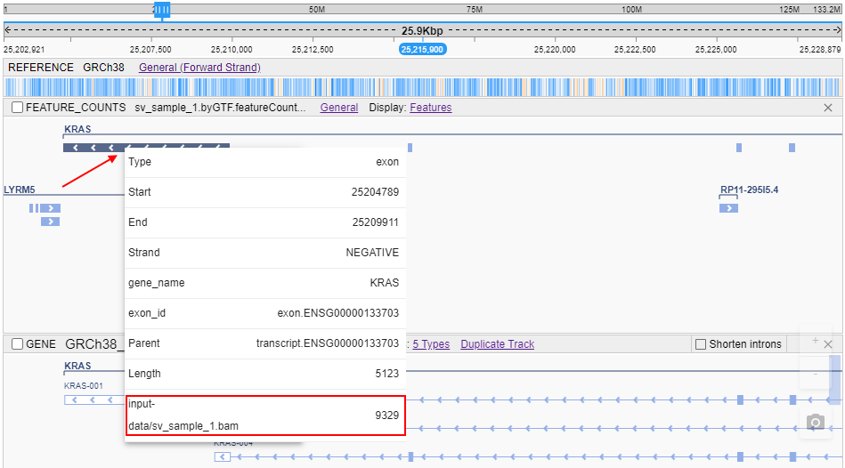  
Features count for the certain feature is shown at the row with an input alignment file name (selected by red on the example above).

## Bar graph visualization

For FeatureCounts tracks, the display mode can be selected via the **Display** sub-menu:

- **Features** mode (_default_) - to display track with genes-exons structure as described [above](#general-visualization)
- **Bar Graph** mode - to display a track as a histogram:  
  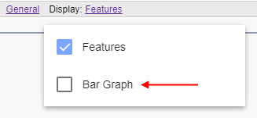

If **Bar Graph** mode is selected - FeatureCounts track is displayed as a histogram:

- For each interval from the original FeatureCounts file - the own bar is being drawn
- Bar height in each position is proportional to the value of read counts in this position
- Name of the source SAM/BAM file, used as the input for the featureCounts file, is being displayed in the left-upper corner of the track  
  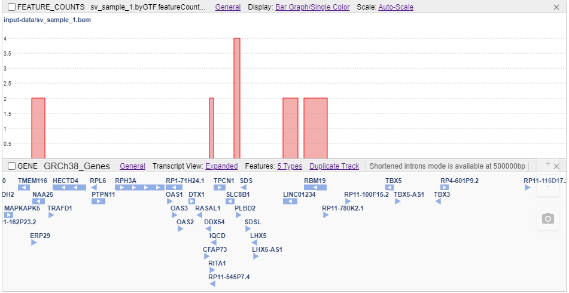

When hovering any bar at this histogram, the tooltip appears that contains feature info:  
  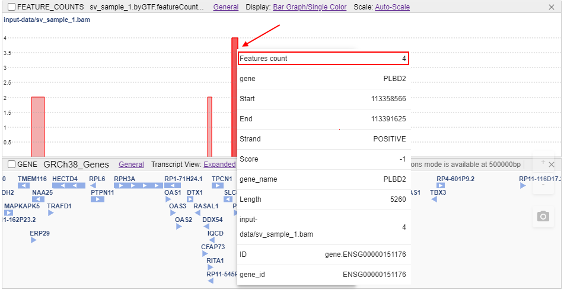

You can change the color scheme for bars to gray - by the "_Grayscale_" item in the **Display** sub-menu:  
  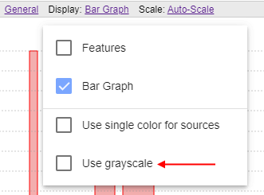  
  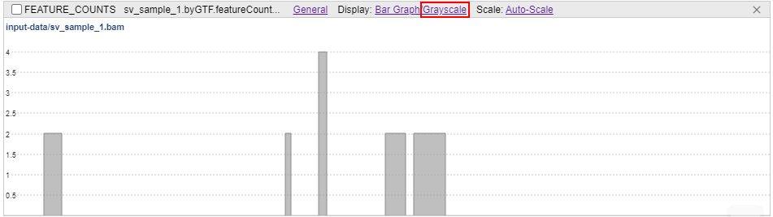  
**_Note_**: this item is available only when the **Bar Graph** mode is enabled

Also in the **Bar Graph** mode, the **Scale** sub-menu becomes enabled.  
Via this menu the scale mode can be applied to the FeatureCounts track:

- **Auto-scale** (_default_) option calculates the displayed data range automatically and apply this range to the track
- **Manual scale** option allows to set the absolute scale range for the track
- **Log scale** option allows to set logarithmic scale for the track. It can be additionally applied for any of the scale mode above  
  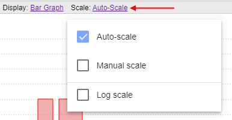

About track scale settings see examples with the same options for WIG files [here](tracks-wig.md#scale-mode).

## Several inputs

In case of several source inputs (several alignment files) for the FeatureCounts file:

- at the FeatureCounts track, several sub-tracks are shown - a single sub-track for each source SAM/BAM file
- each sub-track contains name of the source SAM/BAM file in the left-upper corner
- sub-tracks support drag-and-drop moving (in limits of the parent FeatureCounts track) - for that, user should move the sub-track holding its name label  
  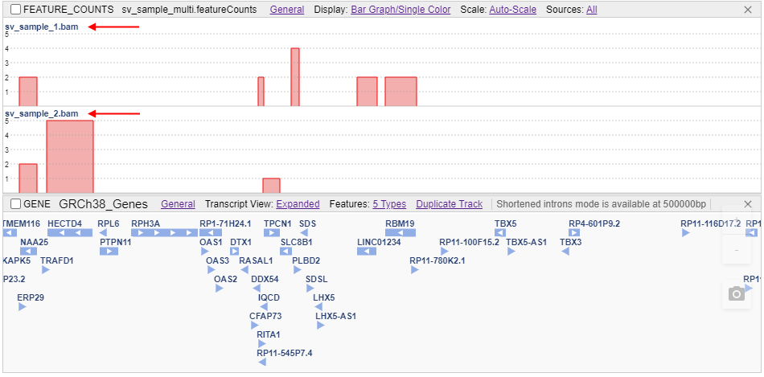  

User can hide/show any sub-track by the **Sources** sub-menu. By default, all sub-tracks are shown.  
For example, will hide the sub-track:  
  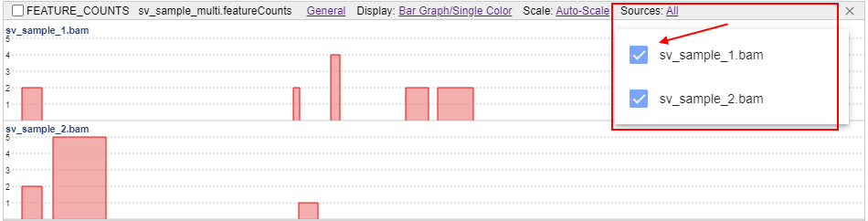  
  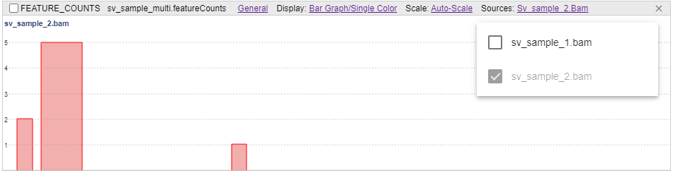

**_Note_**: **Sources** sub-menu is displayed only in case when the origin FeatureCounts file has several source inputs

By default, all sub-tracks have the same single color.  
User can disable this mode via the **Display** sub-menu ("_Use single color for sources_" item) - for each FeatureCounts sub-track a different color will be set:  
  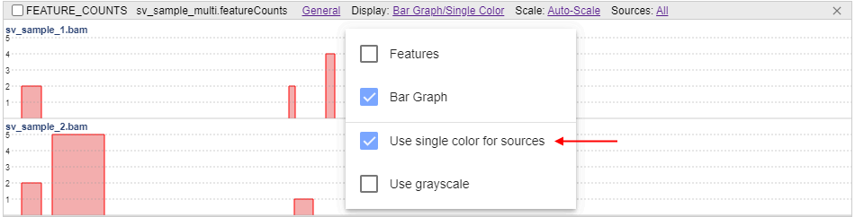  
  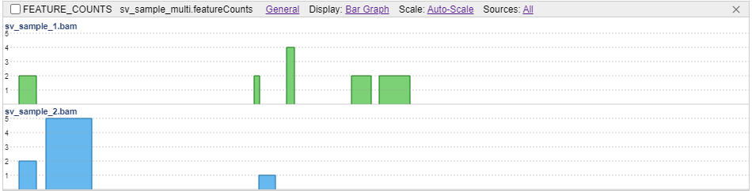

If in regimen with different colors user additionally sets the "_Grayscale_" option - different sub-tracks will be colorized in different shades of grey color:  
  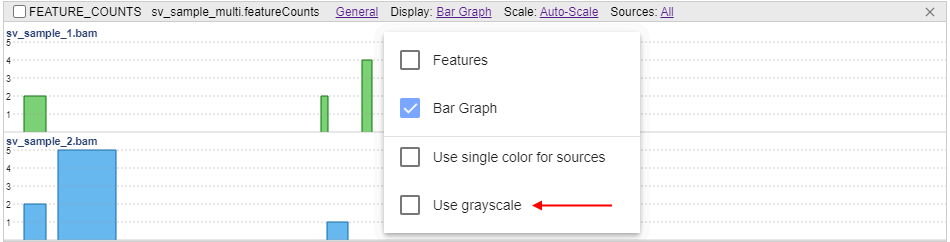  
  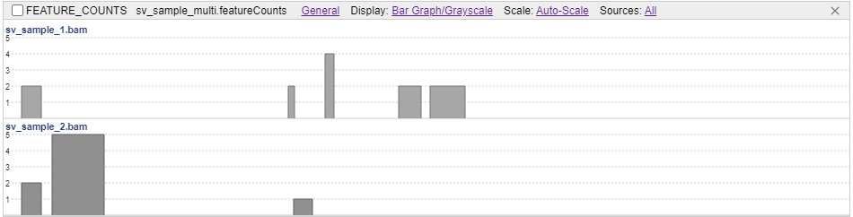

All scale modes can be applied to FeatureCounts tracks with several source inputs as well.
