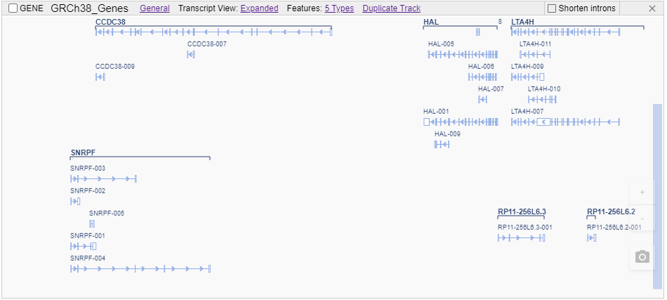
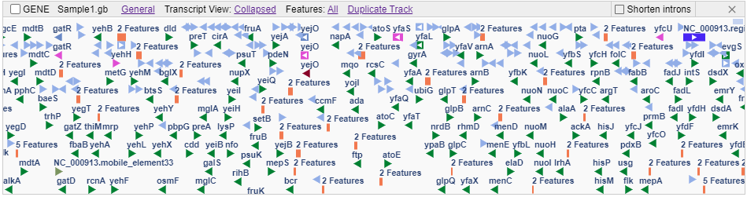
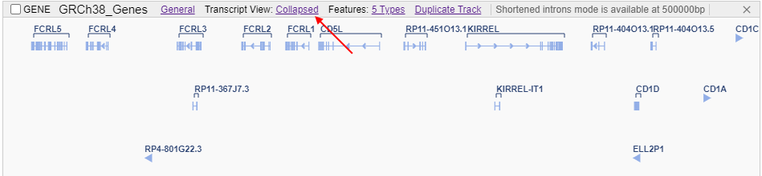

# Genes track

- [General genes visualization](#general-genes-visualization)
- [GenBank genes visualization](#genbank-genes-visualization)
- [Gene tracks options](#gene-tracks-options)
    - [Features selector](#features-selector)
    - [Duplicate track](#duplicate-track)
    - [Shortened introns mode](#shortened-introns-mode)

## General genes visualization

Genes are visualized from GFF/GTF/GTF3 files.

Depending on the zoom level, genes can be visualized as follows:

- At a low zoom level, a histogram indicating the count of features across a chromosome is shown on the whole chromosome scale:  
    
  First time as user opens the GENE track - the corresponding tooltip appears about the histogram (in the right-upper corner of the GENE track). User can close it by the cross-button or just zoom-in till the medium level appears and this tooltip will disappear. To not show such notification again - user should set the corresponding checkbox.
- At a medium zoom level, genes with their names and strands are shown:  
  
- At a high zoom level, genes with their names and their transcripts with exon-intron structure are shown:  
  

## GenBank genes visualization

NGB also supports the uploading of [**GenBank**](https://www.ncbi.nlm.nih.gov/Sitemap/samplerecord.html) files.  
GeneBank file can be loaded to NGB in 2 ways:

- as reference file with annotations. In this case NGB reads GeneBank file, convert it to FASTA and GTF files and register these files as reference and gene files
- as gene annotation file to an existing reference. In this case NGB converts features data into GTF file and register this file as gene annotation file

Visualization of GenBank genes files differs from the general one:

- At a low zoom level, a histogram indicating the count of features across a chromosome is shown on the whole chromosome scale (similar to GFF/GTF/GTF3 visualization):  
  
- At any other zoom level, features are shown as separate rectangles (or triangles at insufficient zoom). Each feature has name and strand. Each feature type has its own color:  
    
  

User can hover any feature at the track and view the tooltip with feature details info:  
  

### Gene tracks options

Genes track's header contains menu of the following items:

- **General** - sub-menu with general actions. For details see [here](tracks.md#general-control)
- **Transcript view** - to select a transcripts display view:
    - _Collapsed_ mode - only one canonical transcript is displayed for a gene  
    
    - _Expanded_ mode - all gene's transcripts are displayed  
    
- **Features** - to select features displayed at the track
- **Duplicate track** - to create a duplicate of the current gene track
- Checkbox to enable/disable **Shortened introns** mode

#### Features selector

This sub-menu allows to customize the visibility of the separate features in the opened GENE track:

- sub-menu contains the list of all feature types accessible on the current track
- if the checkbox near the feature type is enabled - the corresponding type is displayed at the track. _By default, all features are enabled_
- if the checkbox near the feature type is disabled - the corresponding type is displayed hidden at the track

  
  

**_Note_**: this sub-menu is available only if the GENE file has more than one feature type

#### Duplicate track

This sub-menu allows to "duplicate" the GENE track, but with only certain feature type enabled:

- sub-menu contains the list of all feature types accessible on the current track
- if user clicks the feature type from this list:
    - an additional GENE track will be opened (the duplicate of the current opened GENE track)
    - on this duplicate track, only selected feature type will be enabled and shown
    - other features at the duplicate track will be disabled (hidden) by default. But user can enable them in the same way as described in point [above](#features-selector)

  

**_Note_**: this sub-menu is available only if the GENE file has more than one feature type

#### Shortened introns mode

Shortened introns mode is designed for cropping regions with introns (taking gene's introns from particular track) for all tracks.  
At this mode:

- Zooming in / out is disabled
- Moving to a position is disabled
- Ruler's local track displays shortened regions (as orange bars), as well as total and actual (in brackets) regions sizes
  

Shortened introns mode has 2 configurable parameters:

- **Introns length** - the size in base pairs that is not cropped from intron's borders. Such offsets are displayed as semi transparent bars at local ruler track:  
  
- **Maximum range (bp)** - the maximum range at which shortened introns mode is available. If current selected range is larger then that value a message is displayed at genes track's header

These parameters are managed at GFF/GTF section of global settings window:  
  
