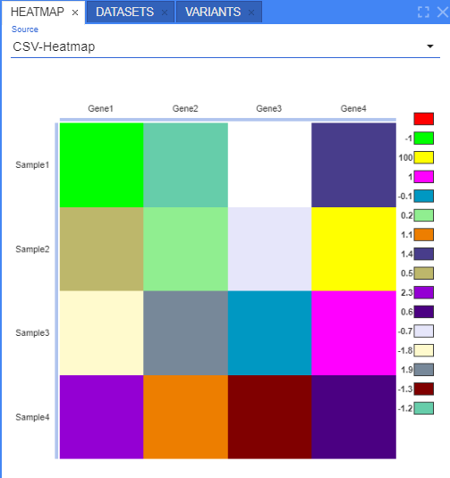
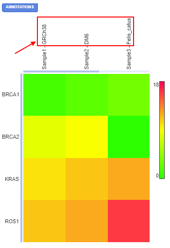
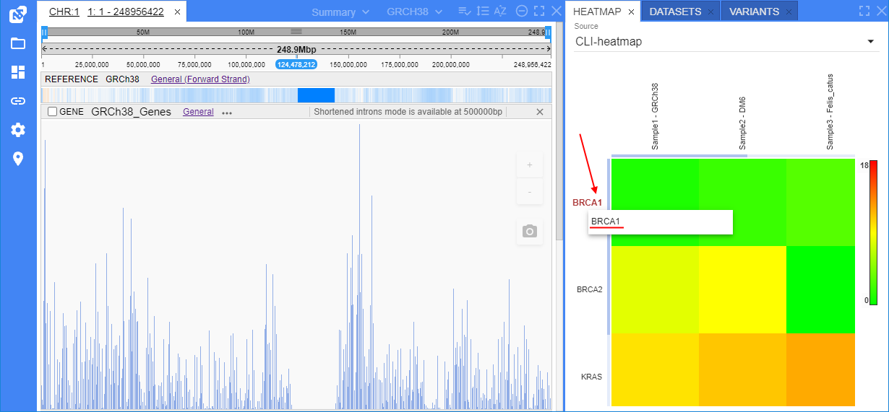
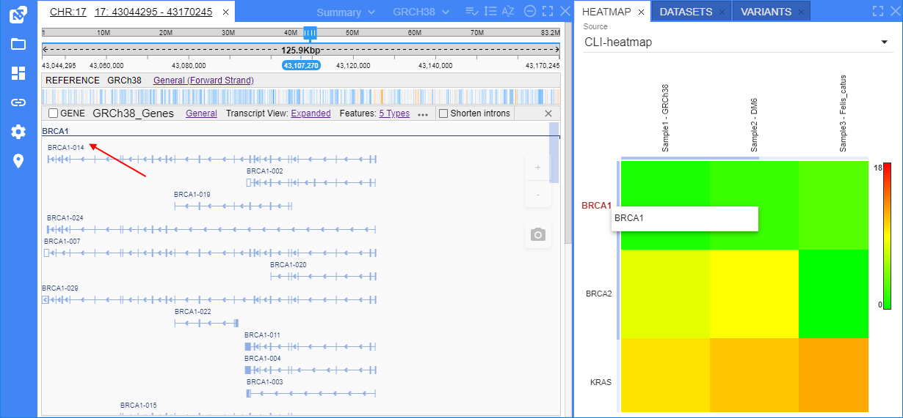

# Heatmap track

- [General visualization](#general-visualization)
    - [Heatmap panel](#heatmap-panel)
    - [Manage view](#manage-view)
    - [Color scheme](#color-scheme)
        - [Continuous](#continuous)
        - [Discrete](#discrete)
    - [Displaying additional details](#displaying-additional-details)
        - [Cell annotations](#cell-annotations)
        - [Row/column annotations](#rowcolumn-annotations)
        - [Dendrograms](#dendrograms)
- [Displaying at the Summary page](#displaying-at-the-summary-page)
- [Heatmap as a reference annotation](#heatmap-as-a-reference-annotation)
- [Navigation from annotations](#navigation-from-annotations)

**Heatmap** is a data visualization technique that shows magnitude of a phenomenon as color in two dimensions.  
Under the hood, it is one of the way to display a plain matrix.  
In genetic researches, this may be convenient to present gene expression data for different samples.  
NGB supports heatmaps displaying.

Currently, the following files are supported as heatmaps:

- two dimensions matrix (organized as a table in the origin file).  
  Wherein, first row of the table should be perceived as the headers set for columns, first column of the table should be perceived as the headers set for rows
- origin file has format `tsv` (content - tab-delimited data) or `csv` (content - comma-delimited data)

Example:

```
          Gene1   Gene2   Gene3
Sample1   0.03    0.04    -0.01
Sample2   -0.3    0.2     0
Sample3   -0.12   0       0.2
```

## General visualization

A heatmap is a graphical representation of data that uses a system of color-coding to represent different values.  
So, any **Heatmap** table (corresponding to above described conditions) will be presented as a rectangular grid, where each cell is highlighted with some color according to the value of the cell, e.g.:  
  

User can hover over any cell of the heatmap - its value will appear in the tooltip:  
  

Displaying features:

- heatmap at the track is not linked to any genome coordinates, it is being displayed static (i.e. it is not changed or moved when user changes the scale, moves the ruler or changes the coordinates, e.g.)
- each column in the heatmap is subscribed at the margin according to the corresponding column "header" of the origin heatmap file
- each row in the heatmap is subscribed at the margin according to the corresponding row "header" of the origin heatmap file
- near the heatmap, the color legend is placed

### Heatmap panel

As was shown above - the heatmap file is shown by default as separate track in the **Browser**.  
But there are some another ways to view heatmaps.  
One of the most convenient way - displaying in the **Heatmap** panel.

**Heatmap** panel can be opened from the **Views** item of the main menu.  
In this panel, heatmaps of the current selected dataset are shown:

- heatmaps registered as separate files in the current dataset and selected in the **Datasets** panel
- all heatmaps registered as the current reference [annotations](#heatmap-as-a-reference-annotation)


Heatmap to display is being selected from the dropdown list in the top of the panel (only one heatmap can be shown at once):  
    
The selected heatmap will be shown:  
  

### Manage view

You can manage the view of the heatmap by the following combination:

- **double-click** any cell -> single zoom-in
- **hover mouse pointer** over any cell + hold **Shift** + **scroll mouse wheel** -> zoom-in/zoom-out
- hold **Shift** + select any cells area by **left mouse button**, then release -> zoom-in to selected area
- **hold mouse click** at any cell + **move mouse** -> moving the whole heatmap

### Color scheme

There are two types of heatmap colorizing is supported:

- _continuous_ (default) - in this case, each cell is being colorized according to a gradient color "ruler"
- _discrete_ - in this case, each cell should be colorized according to a set of discrete values. There, all colors should be configured manually

Each scheme can be selected by the "_Color scheme_" control in the heatmap track header:  
  

Also, the color scheme can be configured manually via the special pop-up.  
It can be opened by the _Configure_ item in the "_Color scheme_" control or by the click the heatmap legend, e.g.:  
  

The pop-up to configure the color scheme for a heatmap:  
  

Here, the following controls:

- dropdown list for the color scheme selecting - _continuous_ (by default) or _discrete_
- block of the colors settings according to the selected type
- control to set color for empty cells (cells without any values)

After all colors are configured, user should click the **Save** button. The pop-up will be closed and performed changes will be automatically applied to the heatmap (it will be redrawn).

#### Continuous

Color settings of the _continuous_ scheme:

- "_Low color_" - for color of the minimum value (from all matrix)
- "_High color_" - for color of the maximum value (from all matrix)
- "_Middle color_" - for color of the middle value (average between minimum and maximum)

Other cell colors at the heatmap will be automatically defined based on these 3 colors, gradient between them and a cell value.

For example:

- colors were changed and a new scheme was saved:  
  
- the heatmap will be redrawn:  
  

#### Discrete

Color settings of _discrete_ scheme:  
  

By default, there is a control for a single color setting - "_Data color_" (as on the image above).  
In such case, if user selects this scheme - all non-empty cells of the heatmap will be colorized in this single color.

But user can manually configure the _discrete_ color scheme adding new colors by the **Add color** button:

- for each added color (if colors count equals or larger than 2), should be specified value or range of values for which the specific color should be applied:
    - the value can be selected from the dropdown list containing all possible values from the origin heatmap file - _it is convenient when the origin heatmap file contains set of string values or small set of integer numeric values_
    - values can be specified as range - for that, set **Range** checkbox and fill in fields "_From_" and "_To_" - _it is convenient when the origin heatmap file contains big amount of different numeric values_
- for removing a color from the scheme (if colors count equals or larger than 2) - click the cross-button near the color


> **_Notes_**:
>
> - there is no ability to save the scheme where values are intersected (to set different colors for the same values)
> - if for the cell value no color is set - it will be colorized in the color for empty cells

If the scheme above was saved, our heatmap will be redrawn:  
  

### Displaying additional details

Any heatmap can have additional details - row/column annotations, cell annotations, dendrograms.  
These details are defined by additional files that can be registered simultaneously with heatmap or added after.

#### Cell annotations

For each cell in a histogram, may be set an additional info - it can be some notes or additional label/mark.

File with cell annotations should contain the matrix of the same size as the original heatmap matrix:

- first row and first column shall contain the same labels as the original heatmap matrix
- cells contain any text values (annotations) – for each cell this data corresponds to a cell from the main heatmap file
- file should have format `tsv` (content - tab-delimited data) or `csv` (content - comma-delimited data)

Example:

```
          Gene1               Gene2               Gene3
Sample1   Annotation_S1_G1    Annotation_S1_G2     
Sample2                       Annotation_S2_G2    Annotation_S2_G3
Sample3                       Annotation_S3_G2      
```

**_Note_**: registered cell annotation files are not displayed in the datasets tree

If the current heatmap has a linked cell annotations file - the corresponding annotation labels appear in tooltips when hovering any cell of the heatmap, e.g.:  
  

#### Row/column annotations

For each row/column in a histogram, may be set an additional info - it can be some notes or additional label/mark.

File with row/column annotations should contain only two columns:

- first column contains labels. These labels shall match ones from row and column headers of main heatmap file
- second column contains annotation value – it can be any text
- also, file should have format `tsv` (content - tab-delimited data) or `csv` (content - comma-delimited data)

Example:

```
Sample1    Gorilla_male
Gene1      ACKR1
Gene2      MICB
Sample3    Gorilla_female
```

**_Note_**: registered row/column annotation files are not displayed in the datasets tree

If the current heatmap has a linked row/column annotations file - the corresponding annotation labels will appear on the corresponding axis of the heatmap (near the axis headers), e.g. annotations for columns:  
  

You can manually hide/show annotations by click the **ANNOTATIONS** control in the left upper corner of the panel:  
    
**_Note_**: this control is displayed on the panel only if a heatmap has a linked row/column annotations file.

#### Dendrograms

For each side of the histogram (rows/columns), may be set a dendrogram (phylogenetic tree).  
File with a dendogram should be presented as plain `txt` file that content tree-date in [`Newick`](http://wiki.christophchamp.com/index.php?title=Newick_phylogenetic_tree_format) format.

Example:

```
((Human:0.1,Gorilla:0.1):0.4,(Mouse:0.2,Rat:0.2):0.3);
```

**_Note_**: registered dendrogram files are not displayed in the datasets tree

If the current heatmap has linked row/column phylogenetic tree file(s) - the corresponding dendrogram(s) will appear on the corresponding side of the heatmap, e.g. dendrogram for rows:  
  

You can manually hide/show dendrogram(s) by click the **DENDROGRAM** control in the left upper corner of the panel:  
    
**_Note_**: this control is displayed on the panel only if a heatmap has a linked dendrogram file(s).

## Displaying at the Summary page

If for the dataset containing a heatmap file the "_Summary_" view is selected and the heatmap file is selected in the **Datasets** panel as well - the heatmap will be shown at the "_Summary_" view as a separate sub-panel:  
  

In this case, color scheme for a heatmap will be _continuous_ by default. User can configure it by click the heatmap legend.

If there are several selected heatmaps in a dataset - at the "_Summary_" view the corresponding selector will be shown. Only one heatmap can be displayed at the "_Summary_" view at once:  
  

## Heatmap as a reference annotation

**Heatmap** can be registered in NGB as an annotation for a reference.  
If the reference has the heatmap annotation file - such heatmap will not be displayed as a separate file in the **Datasets** panel, but user will have the ability to open it via the "_Annotations_" selector in the **Browser** header, e.g.:  
  

If no position at a reference is specified and the "_Summary_" view is selected - the heatmap will be shown in the way as described [above](#displaying-at-the-summary-page).  
If any position at a reference is specified - the heatmap will be shown as the separate track - as described [above](#general-visualization).  
Also, the heatmap registered as the reference annotation is always included to the heatmaps dropdown list at the [**Heatmap panel**](#heatmap-panel) if any dataset with this reference is selected.

## Navigation from annotations

All heatmaps' labels (row/column headers and annotations, cell annotations) support "link" format for their content - that users can have the ability for the fast navigation through other NGB objects from a heatmap.  
Whether the set of the corresponding heatmap labels are links should be defined during the heatmap file or heatmap annotation file CLI registration - via the additional options.

These options define:

- which entity(es) of the heatmat shall be perceived as links
- for each specified entity - the type of the NGB objects to which the link should provide

There are 3 entity types for a heatmap that can be perceived as links:

- _column headers and annotations_ - in this case, in first order, the column annotation will be used as link, if it is absent - the column header will be used as link
- _row headers and annotations_ - in this case, in first order, the row annotation will be used as link, if it is absent - the row header will be used as link.
- _cell annotations_

The following link types are supported (for each specified entity only single link type can be set at once):

- **COORDINATE** - heatmap label is perceived as coordinates at the reference. When user clicks such label - the corresponding part of reference will be opened
- **GENE** - heatmap label is perceived as gene name. When user clicks such label - the search over genes will be performed by the label name and then, the result at the GENES track will be opened
- **REFERENCE** - heatmap label is perceived as reference name. When user clicks such label - the search over loaded references will be performed by the label name and then, the first found dataset with the such reference will be selected and opened
- **DATASET** - heatmap label is perceived as dataset name. When user clicks such label - the search over datasets will be performed by the label name and then, the found dataset will be selected and opened

> **_Notes_**: the following format of the label text are expected:
>
> for the **COORDINATE** link type:
>
> - `<reference_name>:<chromosome_name>:<start_position>-<end_position>` - to navigate to the specified reference and the chromosome and the range on it
> - `<reference_name>:<chromosome_name>:<position>` - to navigate to the specified reference and the chromosome and the position on it
> - `<chromosome_name>:<start_position>-<end_position>` - to navigate to the specified chromosome and the range on it of the current opened reference
> - `<chromosome_name>:<position>` - to navigate to the specified chromosome and the position on it of the current opened reference
>
> for the **GENE** link type:
>
> - `<reference_name>:<gene_name>` - to navigate to the specified reference and the gene on it
> - `<gene_name>` - to navigate to the specified gene on the current opened reference
>
> for the **REFERENCE** link type:
>
> - `<reference_name>` - to navigate to the specified reference
>
> for the **DATASET** link type:
>
> - `<dataset_name>` - to navigate to the specified dataset

_Example 1_ - row headers are perceived as links to **GENE**:

- click the desired row header, e.g.:  
  
- the corresponding gene will be opened in the **Browser**:  
  

_Example 2_ - cell annotations are perceived as links to **COORDINATE**:

- click the desired cell, e.g.:  
  
- the corresponding coordinates range will be opened in the **Browser**:  
  
