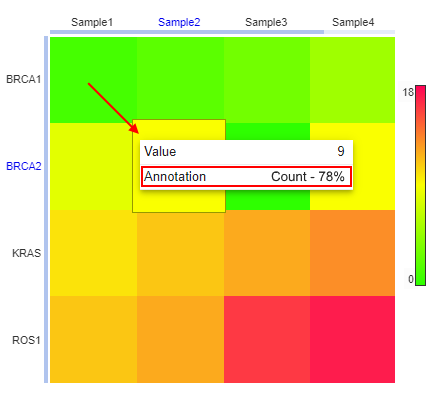

# Heatmap track

- [General visualization](#general-visualization)
    - [Color scheme](#color-scheme)
        - [Continuous](#continuous)
        - [Discrete](#discrete)
    - [Displaying additional details](#displaying-additional-details)
        - [Cell annotations](#cell-annotations)
        - [Row/column annotations](#rowcolumn-annotations)
        - [Phylogenetic tree](#phylogenetic-tree)
- [Displaying at the Summary page](#displaying-at-the-summary-page)
- [Heatmap as a reference annotation](#heatmap-as-a-reference-annotation)

**Heatmap** is a data visualization technique that shows magnitude of a phenomenon as color in two dimensions.  
Under the hood, it is one of the way to display a plain matrix.  
In genetic researches, this may be convenient to present gene expression data for different samples.  
NGB supports heatmaps displaying.

Currently, the following files are supported as heatmaps:

- two dimensions matrix (organized as a table in the origin file).  
  Wherein, first row of the table should be perceived as the headers set for columns, first column of the table should be perceived as the headers set for rows
- origin file has format `tsv` (content - tab-delimited data) or `csv` (content - comma-delimited data)

Example:

```
          Gene1   Gene2   Gene3
Sample1   0.03    0.04    -0.01
Sample2   -0.3    0.2     0
Sample3   -0.12   0       0.2
```

## General visualization

A heatmap is a graphical representation of data that uses a system of color-coding to represent different values.  
So, any **Heatmap** table (corresponding to above described conditions) will be presented as a rectangular grid, where each cell is highlighted with some color according to the value of the cell, e.g.:  
  

User can hover over any cell of the heatmap - its value will appear in the tooltip:  
  

Displaying features:

- heatmap at the track is not linked to any genome coordinates, it is being displayed static (i.e. it is not changed or moved when user changes the scale, moves the ruler or changes the coordinates, e.g.)
- each column in the heatmap is subscribed at the margin according to the corresponding column "header" of the origin heatmap file
- each row in the heatmap is subscribed at the margin according to the corresponding row "header" of the origin heatmap file
- near the heatmap, the color legend is placed

### Color scheme

There are two types of heatmap colorizing is supported:

- _continuous_ (default) - in this case, each cell is being colorized according to a gradient color "ruler"
- _discrete_ - in this case, each cell should be colorized according to a set of discrete values. There, all colors should be configured manually

Each scheme can be selected by the "_Color scheme_" control in the heatmap track header:  
  

Also, the color scheme can be configured manually via the special pop-up.  
It can be opened by the _Configure_ item in the "_Color scheme_" control or by the click the heatmap legend.


Here, the following controls:

- dropdown list for the color scheme selecting - _continuous_ (by default) or _discrete_
- block of the colors settings according to the selected type
- control to set color for empty cells (cells without any values)

After all colors are configured, user should click the **Save** button. The pop-up will be closed and performed changes will be automatically applied to the heatmap (it will be redrawn).

#### Continuous

Color settings of the _continuous_ scheme:

- "_Low color_" - for color of the minimum value (from all matrix)
- "_High color_" - for color of the maximum value (from all matrix)
- "_Middle color_" - for color of the middle value (average between minimum and maximum)

Other cell colors at the heatmap will be automatically defined based on these 3 colors, gradient between them and a cell value.

For example:

- colors were changed and a new scheme was saved:  
  
- the heatmap will be redrawn:  
  

#### Discrete

Color settings of _discrete_ scheme:  
  

By default, there is a control for a single color setting - "_Data color_" (as on the image above).  
In such case, if user selects this scheme - all non-empty cells of the heatmap will be colorized in this single color.

But user can manually configure the _discrete_ color scheme adding new colors by the **Add color** button:

- for each added color (if colors count equals or larger than 2), should be specified value or range of values for which the specific color should be applied:
    - the value can be selected from the dropdown list containing all possible values from the origin heatmap file - _it is convenient when the origin heatmap file contains set of string values or small set of integer numeric values_
    - values can be specified as range - for that, set **Range** checkbox and fill in fields "_From_" and "_To_" - _it is convenient when the origin heatmap file contains big amount of different numeric values_
- for removing a color from the scheme (if colors count equals or larger than 2) - click the cross-button near the color


> **_Notes_**:
>
> - there is no ability to save the scheme where values are intersected (to set different colors for the same values)
> - if for the cell value no color is set - it will be colorized in the color for empty cells

If the scheme above was saved, our heatmap will be redrawn:  
  

### Displaying additional details

Any heatmap can have additional details - phylogenetic tree(s), row/column annotations, cell annotations.  
These details are defined by additional files that can be registered simultaneously with heatmap or added after.

#### Cell annotations

For each cell in a histogram, may be set an additional info - it can be some notes or additional label/mark.

File with cell annotations should contain the matrix of the same size as the original heatmap matrix:

- first row and first column shall contain the same labels as the original heatmap matrix
- cells contain any text values (annotations) – for each cell this data corresponds to a cell from the main heatmap file
- file should have format `tsv` (content - tab-delimited data) or `csv` (content - comma-delimited data)

Example:

```
          Gene1               Gene2               Gene3
Sample1   Annotation_S1_G1    Annotation_S1_G2     
Sample2                       Annotation_S2_G2    Annotation_S2_G3
Sample3                       Annotation_S3_G2      
```

**_Note_**: registered cell annotation files are not displayed in the datasets tree

If the current heatmap has a linked cell annotations file - the corresponding annotation labels appear in tooltips when hovering any cell of the heatmap:  
  

#### Row/column annotations

For each row/column in a histogram, may be set an additional info - it can be some notes or additional label/mark.

File with row/column annotations should contain only two columns:

- first column contains labels. These labels shall match ones from row and column headers of main heatmap file
- second column contains annotation value – it can be any text
- also, file should have format `tsv` (content - tab-delimited data) or `csv` (content - comma-delimited data)

Example:

```
Sample1    Gorilla_male
Gene1      ACKR1
Gene2      MICB
Sample3    Gorilla_female
```

**_Note_**: registered row/column annotation files are not displayed in the datasets tree

If the current heatmap has a linked row/column annotations file - the corresponding annotation labels will appear on the corresponding axis of the heatmap:  
  

User can show/hide these annotations by the "_Display_" control in the heatmap track header:  
  

#### Phylogenetic tree

NGB supports the displaying of phylogenetic tree(s) (dendrograms) for heatmaps.  
This diagrammatic representation is frequently used to:

- show the clustering of genes or samples
- display the evolutionary relationships among various biological taxa

Dendrograms are placed in the margins of heatmaps (it could be margin of one dimension only or both dimensions at once).

Phylogenetic tree file (dendrogram file) is a plain `txt` file that contains tree-date in [Newick](http://wiki.christophchamp.com/index.php?title=Newick_phylogenetic_tree_format) format, e.g.:

`((Human:0.1,Gorilla:0.1):0.4,(Mouse:0.2,Rat:0.2):0.3);`

If the current heatmap has a linked phylogenetic tree file(s) - the phylogenetic tree(s) will be shown for the heatmap:  
  

**_Note_**: when the phylogenetic tree(s) is displayed for the heatmap, rows and/or columns of the heatmap can be reordered according to the tree info (from the original tree-file)

User can show/hide the phylogenetic tree(s) by the "_Display_" control in the heatmap track header:  
  

## Displaying at the Summary page

If for the dataset containing a heatmap file the "_Summary_" view is selected and the heatmap file is selected in the **Datasets** panel as well - the heatmap will be shown at the "_Summary_" view as a separate sub-panel:  
  

In this case, color scheme will be _continuous_ by default. User can configure it by click the heatmap legend.

## Heatmap as a reference annotation

**Heatmap** can be registered in NGB as an annotation for a reference.  
If the reference has the heatmap annotation file - such heatmap will not be displayed as a separate file in the **Datasets** panel, but user will have the ability to open it via the "_Annotations_" selector in the **Browser** header, e.g.:  
  

If no position at a reference is specified and the "_Summary_" view is selected - the heatmap will be shown in the way as described [above](#displaying-at-the-summary-page).  
If any position at a reference is specified - the heatmap will be shown as the separate track - as described [above](#general-visualization).
