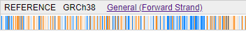
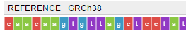

# Reference track
Depending on the zoom level, the data is visualized on the Reference track as follows:
* At a low zoom level, GC content is shown (the more saturated is the blue color, the more GC)

* At a high zoom level, sequence letters are shown (depending on the available space, as colored rectangles with or without letters)

