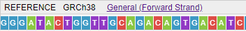

# Reference track

Depending on the zoom level, the data is visualized on the Reference track as follows:

- At a low zoom level, GC content is shown (the more saturated is the blue color, the more GC):  
    
- At a high zoom level, sequence letters are shown (depending on the available space, as colored rectangles with or without letters):  
    

You can change the options of the reference displaying by the **General** menu in the track header:  
      

- **Show translation** item enables the translation displaying (forward translation is shown above the reference content, reverse translation - under the reference).  
Translation (forward/reverse or both) is shown according to enabled reference strand(s):  
    
- **Show forward strand** item enables the reference forward strand displaying (_enabled by default_)
- **Show reverse strand** item enables the reference reverse strand displaying. It shows under the forward reference strand:  
      
    **_Note_**: any strand may be enabled separately or both simultaneously.
