# VCF track

- [Regular VCF](#regular-vcf)
- [Multi-strains VCF](#multi-strains-vcf)
    - [Collapsed](#collapsed)
    - [Expanded](#expanded)
    - [Merge samples](#merge-samples)
    - [Show density](#show-density)
    - [Additional details](#additional-details)
        - [Sample aliases](#sample-aliases)

## Regular VCF

VCF track can show variations in two possible ways:

- If at a specific zoom level the variations are located at the same pixel, they are shown as bubbles. The number on a bubble depicts the number of variations grouped under it:  
    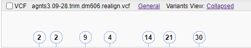
- If a variation doesn't have any close neighbors, it is shown as such at any zoom level:  
    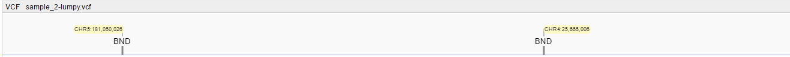

The label above each variation indicates its type.  
For SNVs and short indels, `alt` and `ref` letters or sequences are shown:  
    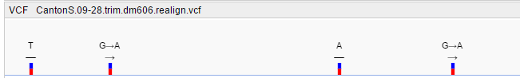

You can see the details of a variation as follows:

- When you hover over a variation, a tooltip with the basic information appears:  
    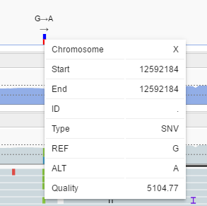
- When you click on a variation, menu appears that contains, among other things, the following options:  
    - **Show Info** - click here to display a pop-up with detailed information and a visualization of the variation's results (refer to [**Working with Annotations**](variants.md#viewing-variation-annotation) for the details):  
    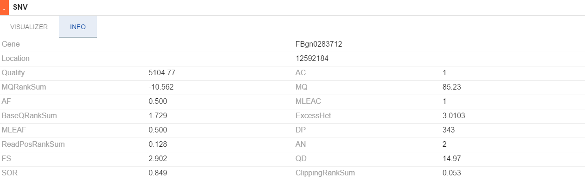
    - **Show pair in split screen** - click here to show the second breakpoint in split view. _This option is only available if you clicked on a structural variation and its second breakpoint is not on the screen (e.g. long inversions or BNDs on other chromosome)._  
    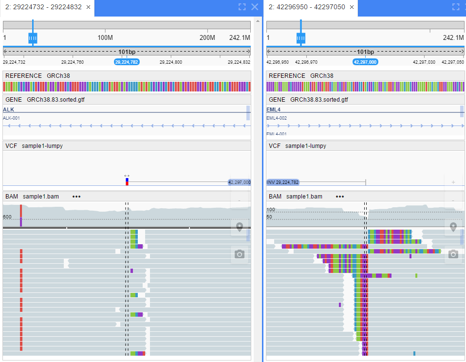

## Multi-strains VCF

NGB supports multi-strain (multi-sample) VCF files.  
Multi-sample VCF file is a regular VCF file with variants info in several samples.

The main difference from a single-sample VCF file: genotype data for samples is presented as separate columns after a `FORMAT` column - one column per sample (strain).  
Format defined in the `FORMAT` column is applied to the information in each sample column.

Multi-sample VCF file is displayed in the **Datasets** panel like regular VCF file.  
But the displaying in the **Browser** panel differs a little.

Displaying details can be configured via the **Variants view** menu.  
Possible views:

### Collapsed

In this regimen, samples are being displaying similar to the reads at [alignment tracks](tracks-bam.md#viewing-bam-alignments). Each sample line includes variants that are related to the corresponding sample:

- each sample is shown as a gray line for a whole reference width - 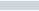
- `SNV` variant is shown as a separate color rectangle(s) with the corresponding alternative nucleotide letter(s) - 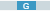
- `INS` variant is shown as a perpendicular violet line in the insertion position - 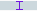
- `DEL` variant is shown as a black line linked two "separate" parts of the "sample" - for the width of the deletion - 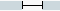
- `BND` or other complex variant is shown as a perpendicular black line in the variant position with the corresponding variant info - 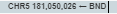

Each sample line is marked by the name of the corresponding sample.  
Example of the _collapsed_ view:  
    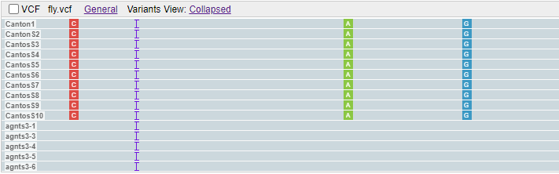

On the large scale, if the variations are located at the same pixel, they are also shown as bubbles:  
    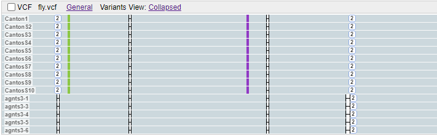

### Expanded

In this regimen, each sample is being displayed similar to the regular single sample VCF-track, but
all variants are being located in one line (without vertical distribution).  
Each sample line is marked by the name of the corresponding sample as well.  
Example of the _expanded_ view:  
    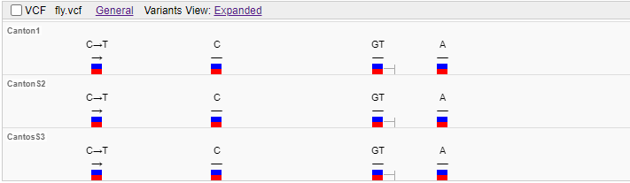

On the large scale, if the variations are located at the same pixel, they are also shown as bubbles:  
    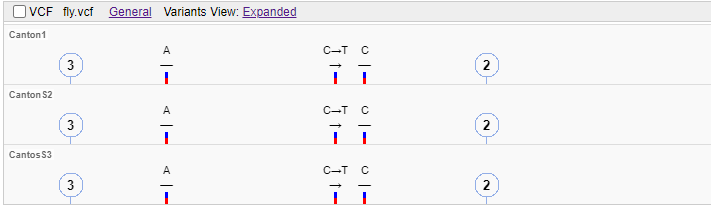

### Merge samples

This regimen can be enabled only with the _collapsed_ view simultaneously and on the large scales.  
In this regimen, all samples (strains) are being "merged" in one line:

- only summary count of samples is being displayed
- each variation displayed at the track represents the "merged" variations in that position
- details by the separate variations are available in the notes above the variation

Example of the _merge samples_ view:  
    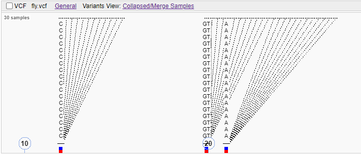

Details of the separate variation:  
    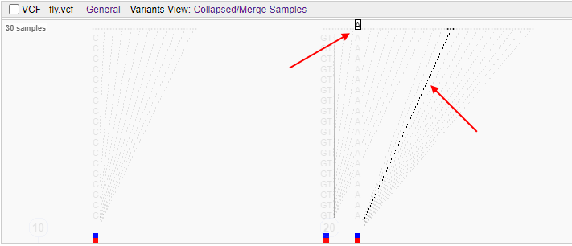

### Show density

In this regimen, the histogram above the variants block is shown.  
That histogram displays summary count of variants in each position over all samples of the track.  
The histogram has the auto-scale according to shown values.

Example of the enabled _Show density_ view:  
    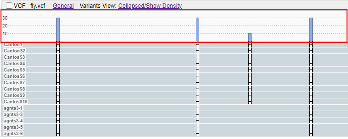

When hovering any bar at the histogram - the corresponding tooltip appears, that includes:

- summary count of variants in that position
- count of each variant type in this position  
    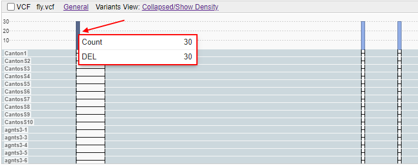

In case of `SNV` variants, histogram bar is being highlighted in different colors - proportionally to sums of different nucleotides matches in this position among all variations count, e.g.:  
    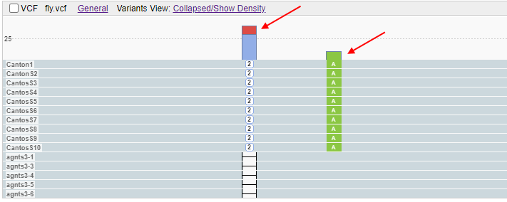  
    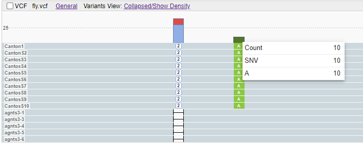

### Additional details

You can see the details of a specific sample variation similar to single-sample VCF track:

- when you hover over a variation, a tooltip with the basic information appears:  
    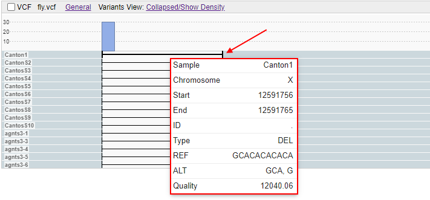
- When you click a variation, menu appears that contains the **Show Info** option - click it to display a pop-up with detailed information and a visualization of the variation's results (refer to [**Working with Annotations**](variants.md#viewing-variation-annotation) for the details):  
    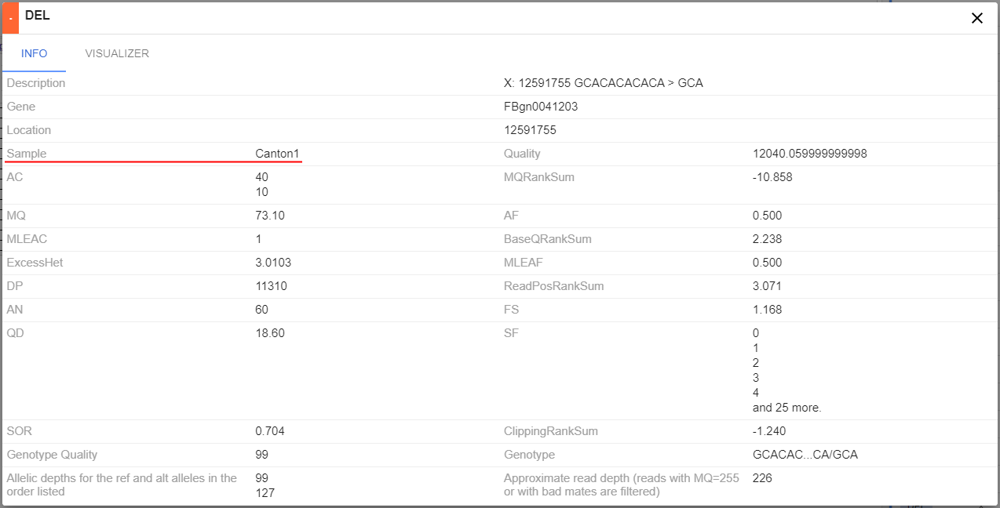

#### Sample aliases

By default, sample names for multi-strain VCFs are being read from the original file during registration and being displayed on the GUI as-is.  
Users have the ability to set own aliases for sample names (e.g. they could be more "user-friendly" or more understandable).

To rename samples, click the corresponding item in the **General** menu of the multi-samples VCF-track:  
    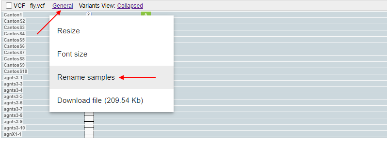

The pop-up will appear:  
    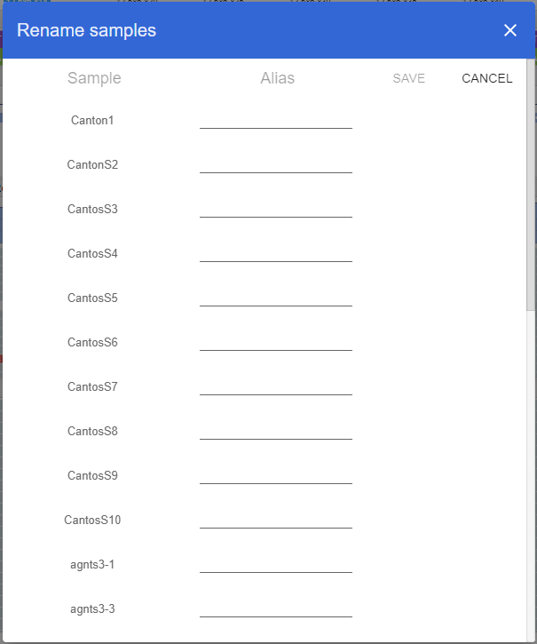

This pop-up contains table with all sample names from the current multi-sample VCF:

- column **Sample** contains origin sample names (as they were obtained during the file registration)
- column **Alias** contains fields for samples' aliases - a single alias for each sample. By default, an alias field is empty (if the alias was not specified previously)

User can specify alias(es) for any sample(s) and click the **Save** button to confirm changes, e.g.:  
    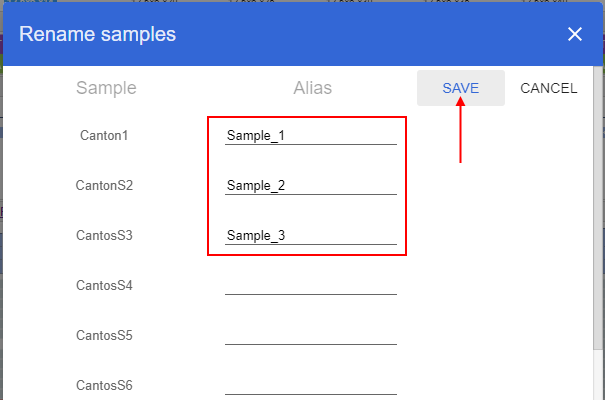

After, changes will be displayed at the track by rules:

- if a sample has an alias - this alias is displayed
- if a sample doesn't have an alias - for that sample, its origin sample name is displayed  
    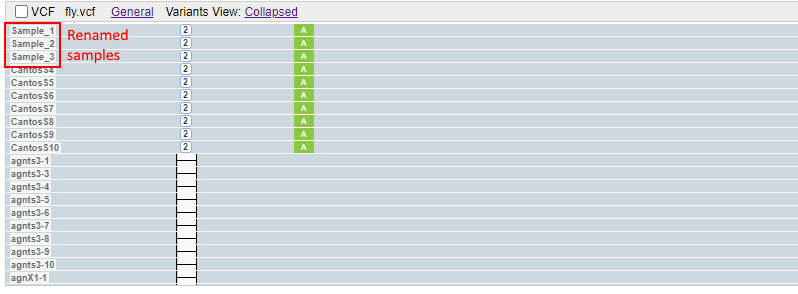  
    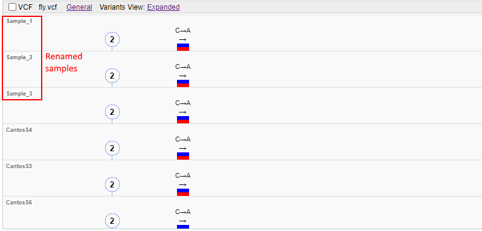

> Additionally, these rules are being applied to sample names/aliases that are shown in the "Samples" column of the **Variants** panel:  
> 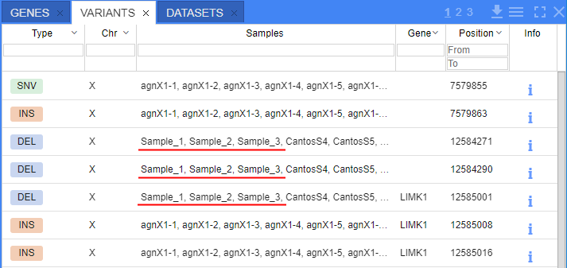

**_Note_**: the changing of samples' aliases is being applied globally, i.e. if the user has set the aliases for some multi-sample VCF track - any other user, that has access to this VCF, will see these new sample aliases at the track and **Variants** panel.
