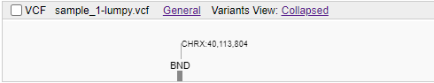

# VCF track

VCF track can show variations in two possible ways:

- If at a specific zoom level the variations are located at the same pixel, they are shown as bubbles. The number on a bubble depicts the number of variations grouped under it:  
    
- If a variation doesn't have any close neighbors, it is shown as such at any zoom level:  
    

The label above each variation indicates its type.  
For SNVs and short indels, `alt` and `ref` letters or sequences are shown:  
    

You can see the details of a variation as follows:

- When you hover over a variation, a tooltip with the basic information appears:  
    
- When you click on a variation, menu appears that contains, among other things, the following options:  
    - **Show Info** - click here to display a pop-up with detailed information and a visualization of the variation's results (refer to [**Working with Annotations**](variants.md#viewing-variation-annotation) for the details):  
    
    - **Show pair in split screen** - click here to show the second breakpoint in split view. _This option is only available if you clicked on a structural variation and its second breakpoint is not on the screen (e.g. long inversions or BNDs on other chromosome)._  
    
