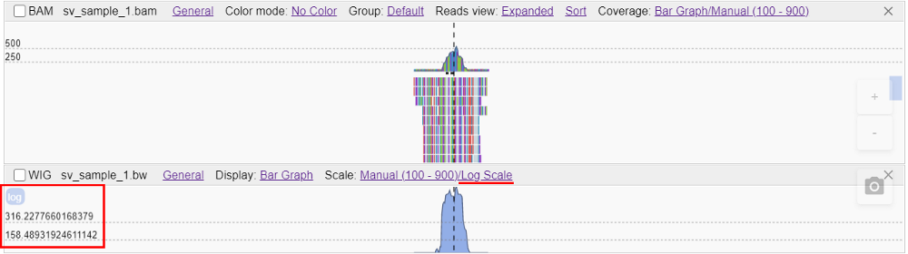

# WIG track

- [Display mode](#display-mode)
- [Scale mode](#scale-mode)
    - [Manual scale](#manual-scale)
    - [Auto-scale](#auto-scale)
    - [Group scaling](#group-scaling)
- [Track colors](#track-colors)
- [BedGraph tracks](#bedgraph-tracks)

WIG tracks can visualize information from wig of bigWig files.

At the demo site, bigWig files are used to show the coverage of BAM files.

When you hover over a location on a WIG track, the value for that location appears.

## Display mode

NGB supports "_Bar Graph_" (default) and "_Heat map_" display modes for `BigWig` tracks.

If a "Bar Graph" display option is chosen – each `BigWig`’s coordinate is being shown as the bar, depending on the locus "value".  
If a "Heat Map" display option is chosen – each `BigWig`’s coordinate is being shown with different color intensities, depending on the locus "value".

To change the display mode:

1. Click the hyperlink near the **Display** label in the `BigWig` track header:  
  
2. In the list, select the display mode you wish, e.g.:  
  
3. The display mode will be changed according to the selected one:  
  

Also, the display mode can be changed for a group of selected `BigWig` tracks. For that:

1. Select several `BigWig` tracks.
2. Use the **Display** control in the [floating menu](tracks.md#tracks-selection) of selected tracks:  
  
3. Select the display mode.
4. In such case, the set display mode will be applied to all selected `BigWig` tracks:  
  

## Scale mode

NGB supports several scale modes for the `BigWig` tracks: **Auto-Scale** / **Manual Scale**, and also for both types the **Log Scale** can be applied additionally.

**Manual** scale option allows to set the absolute scale range for the track.  
**Auto** scale option calculates the displayed data range automatically and apply this range to the track.  
**Log** scale option allows to set logarithmic scale for the track.

### Manual scale

To set the **Manual** scale:

1. Click the hyperlink near the **Scale** label in the `BigWig` track header:  
  
2. In the list, select the **Manual** item:  
  
3. In the popup, specify min and max values for the scale and confirm, e.g.:  
  
4. The set scale will be applied:  
  
5. If you wish to apply one the same manual scale to all alignments tracks in the browser - return at step 3 and set the "**Apply to all alignments tracks**" checkbox:  
    
  In that case, all alignments tracks will have the same specified manual scale:  
  
6. If you wish to apply one the same manual scale to all `BigWig` tracks in the browser - return at step 3 and set the "**Apply to all WIG tracks**" checkbox:  
    
  In that case, all `BigWig` tracks will have the same specified manual scale.
7. If you wish to apply manual logarithmic scale to the track - return at step 3 and set the "**Log scale**" checkbox:  
    
  In that case, for the current track the logarithmic scale will be applied (see the additional label appears near the vertical axis):  
  

### Auto-scale

To set the **Auto** scale:

1. Click the hyperlink near the **Scale** label in the `BigWig` track header:  
  
2. In the list, select the **Auto-scale** item:  
  
3. Necessary data range will be calculated automatically and applied to the track:  
  
4. If you wish to apply logarithmic scale to the track - click the hyperlink **Auto-Scale** in the `BigWig` track header and set the "**Log scale**" checkbox:  
    
  In that case, for the current track the logarithmic scale will be applied (see the additional label appears near the vertical axis):  
  

### Group scaling

To set the scale for a group, select several `BigWig` tracks and click the **Scale** item in the [floating menu](tracks.md#tracks-selection) of selected tracks:  
  

There are several scale modes for a group of `BigWig` tracks that can be set:

**Auto** scale option - for each selected track separately - calculates the displayed data range automatically and apply it for the track.  
**Manual** scale option allows to set the absolute scale range that will be applied for all selected tracks simultaneously.  
**Group Auto** scale option - for all selected tracks simultaneously - calculates the common displayed data range automatically and apply it for all tracks.  
**Log** scale option allows to set logarithmic scale for all selected tracks.

Example of the **Auto-scale** for several tracks:  
  

Example of the **Manual scale** for several tracks (configuration is the same as described [above](#manual-scale)):  
  

Example of the **Group Auto-scale** for several tracks:  
    
**_Note_**: `BigWig` tracks with  the **Group Auto-scale** are being colored with special indicator (near the scale axis) to let the user know which tracks have the same range applied.

## Track colors

NGB supports the ability to change the `BigWig` track colors (depending on the value - positive/negative).

To customize colors of the `BigWig` track:

1. Click the **General** item in the track header.
2. Click the **Color** item in the list:  
    
3. Click the color panel you wish to change, e.g.:  
    
4. Pick a color within the special control:  
    
5. Confirm changes:  
    
6. Color changes will be applied:  
    
7. If you wish to apply changed color scheme for all possible tracks in the browser - return at step 3 and set the "**Apply to all tracks**" checkbox.  
    If you wish to apply changed color scheme for all alignment tracks in the browser - return at step 3 and set the "**Apply to all alignment tracks**" checkbox.  
    If you wish to apply changed color scheme for all `BigWig` tracks in the browser - return at step 3 and set the "**Apply to all WIG tracks**" checkbox.  

Also, you can manage the colors for a group of selected `BigWig` tracks. For that, use the **General** -> **Color** items in the [floating menu](tracks.md#tracks-selection) of selected tracks:  
    
In such case, the set color scheme will be applied only to selected tracks:  
      
    

## BedGraph tracks

NGB supports the uploading and reading of the `BedGraph` format.

Exposing the `BedGraph` files to the client is in the same manner as for the `BigWig` format.

For the `BedGraph` files, are supported:

- common tracks' features: [selection](tracks.md#tracks-selection), [renaming](tracks.md#tracks-renaming), [height resizing](tracks.md#resize-tracks-height), [label font resizing](tracks.md#customize-the-font-size-of-track-label)
- specific features: changing of the [display mode](#display-mode), changing of the [scale mode](#scale-mode), changing of the [track color](#track-colors)
