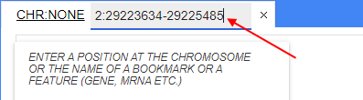
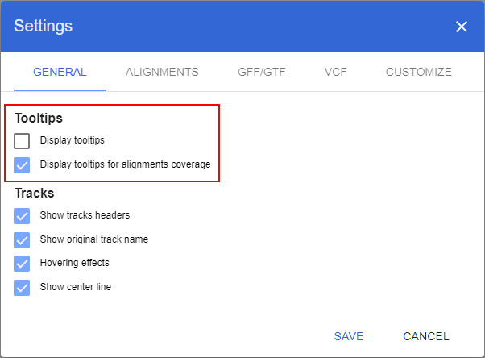

# Working with tracks
## Navigating to a spicific genome location
### Using the ruler
You can use the ruler to navigate inside a chromosome.

The ruler has two components:
* The **global ruler** always depicts the whole chromosome scale. The indicator shows the current position. To move a position, click and drag the icon in the middle of the range. To change the range's size, click and drag the indicator's edge(s).

* The **local ruler** depicts the range selected on the global ruler. Click and drag on the range to zoom in on it. A coordinate inside a blue bubble shows current position (that is in the center of the screen)

### Using zoom in/out buttons
To zoom in or out on tracks, you can use **+/-** buttons located in the upper right corner of the track view. The **+/-** buttons are transparent by default and become opaque when you hover over them.

### Using click-to-zoom
To zoom in on a specific location, double click (with a left mouse button) any place on a track.
This will zoom browser by one level (like clicking **+** button in the Zoom menu) and will place clicked coordinate to the center of the screen.

### Using scrolling on a track
When viewing a track, you can also use **Shift + mouse wheel scroll** to zoom in or out on that track.

### Using unified coordinates and search control
**Browser** panel tab's header contains **unified coordinates and search control** which consists of 2 user inputs:
* Chromosome selector dropdown at left of tab's header
* Coordinates and search input control at right of tab's header

To navigate to a region of interest, the following steps should be performed:
* Select a chromosome from the chromosome selector dropdown to open the whole chromosome scale in the Browser panel

* Type a chromosome's name and position of interest on a coordinates and search input control and press Enter on your keyboard to open a particular position. Supported formats of inputs are:
  * "Chromosome name" : "start" - "end", e.g 2: 29223634 - 29225485
  * "Chromosome name" : "position", e.g. X: 48054699

* Type a gene, transcript, feature or bookmarks name on a coordinates and search input control. Search results will be displayed at the list. To navigate to the region of a particular feature, click on a corresponding search result item:

### Viewing features info
There are two ways to view features for any track that contains them:
* **Hovering tooltip** By default, when hovering over a feature on the track, a tooltip with the feature info appears:

To disable this feature, click the **Settings** button in the top right corner of the window, open **General** menu, and untick the option **Display tooltips**. When **Display tooltips** is disabled, **Display tooltips for alignments coverage** could be managed optionally.

* **Modal popup window** To show feature info in a popup window (e.g. when tooltips are turned off), click the feature on the track and select **Show info** in the context menu.

The popup window will contain the same information as the tooltip plus the nucleotide sequence of the feature.

